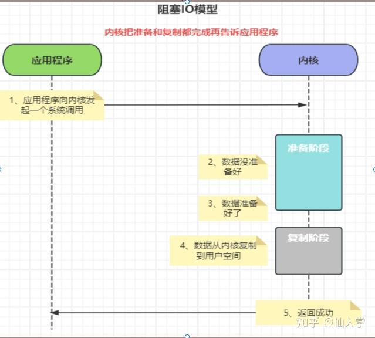
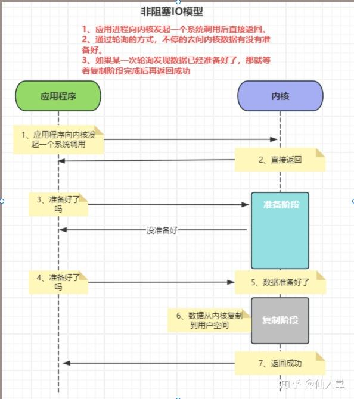
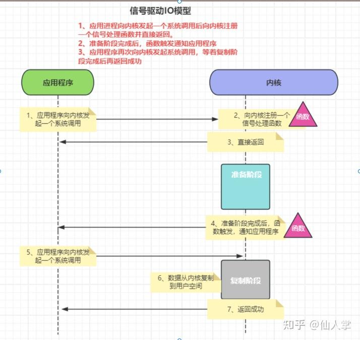
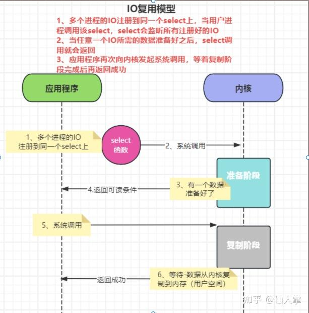
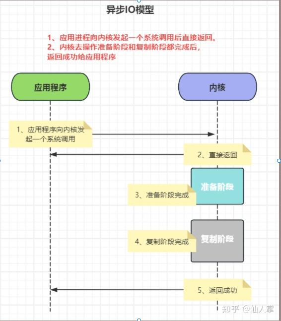
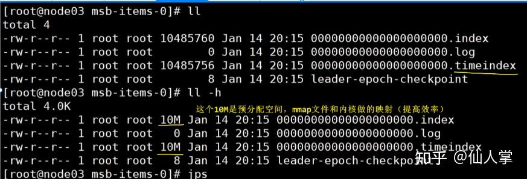
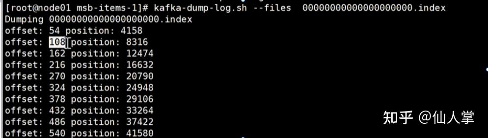
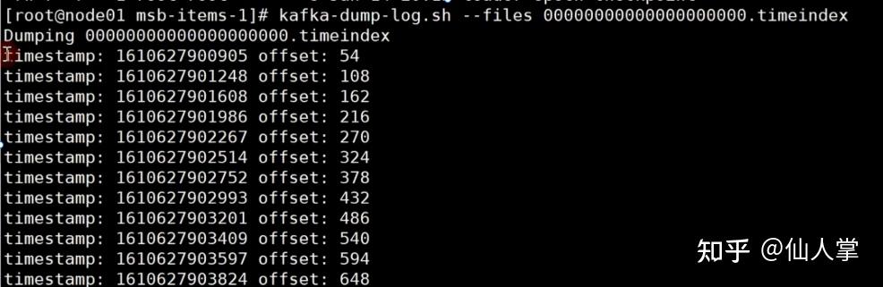
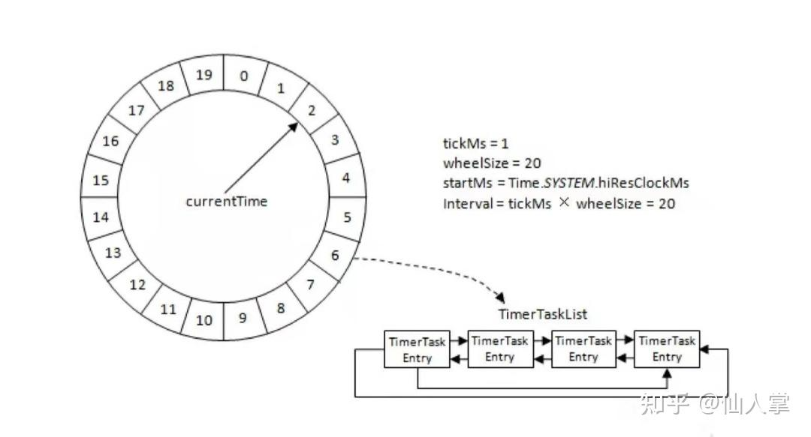
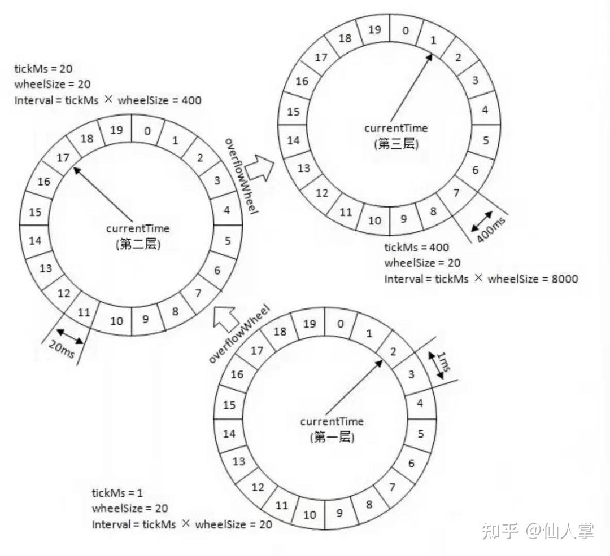

### 问题1、 kafka 是什么,有什么作用 ？
消息中间件，解耦，削峰；
### 问题2、Kafka为什么这么快 ？
1、log文件采用append追加消息，顺序io，寻址快；“** ****.index** ”和 “**.timeindex**”文件都是开辟10M空间，用MMAP内存映射速度快；
2、sendFile 零拷贝，直接从内核缓冲区到网卡，减少内核缓冲区到用户空间的拷贝和内核态用户态切换；
3、Reactor I/O 网络模型 ：
**先说下Linux操作系统中的五种IO模型 ：**
阻塞IO 模型：同步的；
应用程序向内核发起一个系统调用后阻塞等带，内核准备好数据，把数据从内核空间复制到用户空间后才返回结果；

非阻塞IO 模型：
应用程序向内核发起一个系统调用后直接返回，应用程序通过轮训的方式问内核数据有没有准备好，某次问发现数据准备好了，等数据从内核空间复制到用户空间返回结果；

信号驱动IO模型：
应用程序向内核发起一个系统调用后向内核注册一个**信号处理函数**并直接返回，内核准备阶段完成后，触发信号处理函数通知应用程序，应用程序再调用内核，等数据从内核空间复制到用户空间返回结果；

IO复用模型：
多个进程的io注册accept事件到同一个select上，当用户进程调用select，select会监听所有注册好的io,如果任意一个IO准备好数据后，select会返回这个io连接，应用程序再调用内核拿这个io连接的数据，等数据从内核空间复制到用户空间返回结果；

异步io模型：
应用程序向内核发起一个系统调用后直接返回，内核去操作准备阶段和复制阶段，都完成后返回给应用程序；

**什么是BIO,NIO和AIO呢：**
BIO：是阻塞IO，它的系统调用有：
1、socket系统调用，创建socket，返回socket的文件描述符fd3；2、bind(fd3,8090)系统调用，绑定端口；3、listen(fd3)系统调用，监听socket；然后while循环：{accept系统调用， **阻塞等待**客户端连接；线程一直卡着等待；每当有客户端连接到达，创建新的socket fd4，用系统调用clone来创建线程，处理客户端连接（clone系统调用内部调用fork系统调用）；线程内部通过while循环进行**阻塞的recv系统调用**来接受客户端发送的数据；}}因为accept系统调用和**recv**系统调用都是阻塞的，所以是BIO，阻塞IO；
NIO 是非阻塞IO,它和BIO 的区别是：
**accept**系统调用和**recv**系统调用都是不阻塞的；accept系统调用如果没有客户端连接直接返回-1，（java代码返回null），如果有客户端连接返回客户端socket的文件描述符（java代码返回socket）；
**单线程的NIO**就是每一个客户端连接到了，要用一个线程处理，用户想知道哪个io连接上有数据，需要用while循环遍历所有客户端连接，看**recv系统调用**有没有返回值， 单线程的NIO有C10K问题，
C10K问题是啥呢，就是假如有10000个客户端连接，用户想知道哪个io连接上有数据，需要while循环全量遍历，每次要调用10000次 recv ，看客户端有没有数据返回，但其实可能只有1个客户端发送了数据，其他的 recv 都是浪费，每一次调用recv 都是一次系统调用，涉及到一次用户态和内核态的切换；
**多路复用NIO**就是，
用户想知道哪个io连接上有数据只需要一次**系统调用**（一次用户态和内核态的切换）就能获得有数据的io连接，然后用户去有数据的连接上进行读写操作；
多路复用是用多路复用器实现的，那多路复用器都有啥呢 ？
**select**、**poll**** **和 **epoll ，****select**和**poll**多路复用器是把遍历所有连接的事拿到内核操作；**epoll** 多路复用器是不用遍历所有连接，每当客户端连接过来时，把有数据的连接FD放到链表中保存起来，只需要把链表返回给应用程序就行了，不需要去遍历所有连接了；
kafka中就是用的多路复用NIO，即一个或多个 I/O 多路复用器监听多个通道的事件，当某个通道准备好进行 I/O 操作时，触发相应的事件处理器进行处理。
4、利用 Partition 实现并行处理 ：
分区的 leader和follow不在一个节点上，分区的 leader分散在不同的节点上，最大并行；
5、数据压缩；
### 问题3、Kafka架构及名词解释 ？
producer，consumer，broker，topic，partition，offset；
### 问题4、Kafka中的AR、ISR、OSR代表什么
ISR ，partition分区的leader和保持通信的follower集合；
OSR ，partition分区的leader和不保持通信的follower集合；
### 问题5、HW、LEO代表什么 ？
HW 高水位，consumer能消费的最大位置，broker集群对consumer暴露的消息位置；
LEO ，partition接收最后一个消息的位置；
### 问题6、ISR收缩性 ？
启动 Kafka时候自动开启的两个定时任务，“isr-expiration"和”isr-change-propagation"，
会周期性的检测每个分区是否需要缩减其ISR集合；
### 问题7、kafka follower如何与leader同步数据
周期地从Leader节点拉取数据，将这些数据写入到本地对应分区的日志文件中。
### 问题8、Zookeeper 在 Kafka 中的作用（早期）：
存储元数据，broker信息topic信息，consumer信息，生产者负载均衡信息，offset；
### 问题9、Kafka如何快速读取指定offset的消息 ？
kafka的日志分段保存，每个分区下segement分段存储对应三个文件，“**.Log**” ，“** ****.index** ”和“**.timeinde**x” ：

“**.Log**”文件最大存**1G**，是append方式追加的，顺序写；“** ****.index** ”和 “**.timeindex**”大小都是10M，利用了MMAP内存映射，是创建分区的时候就分配好的，kafka每当写入了4k大小的日志（.log），就往“** ****.index** ”里写入一个记录索引，
“** ****.index** ”文件里面有 offset 和 物理偏移量；

“**.timeindex**”文件里面有 timestamp时间戳 和 offset；

consumer消费消息的时候：通过offset根据二分法定位到index索引文件，
然后根据索引文件中的[offset,和物理偏移地址]直接用seek系统调用去log中获取指定offset的message消息数据。
### 问题10、生产者发送消息有哪些模式 ？
异步发送（回调函数），同步发送；
### 问题11、发送消息的分区策略有哪些 ？
依赖分区器：随机，轮训，根据key的hash(保证一个分区中顺序性)，粘性分区；
### 问题12、Kafka如何保证消息可靠性（不丢消息）？
> **Broker的可靠性 :**
1、pagecache和 刷盘（刷脏页），可配置刷盘间隔和刷盘内存阈值， kafka 不能同步刷盘，2、ack配置（通过集群保证可靠性，而不是依赖刷盘）；
**Producer的可靠性：**
producer在发送数据，先利用分区器根据key分区，存到累加器中，开启守护线程合并一批消息异步发送，buffer.memory是配置累加器的大小，当累加器满了，线程发送不过来，会丢数据需要控制消息产生速度；
**Consumer的可靠性：**
自动提交offset，会丢数据或重复消费；要改成手动提交offset ；

### 问题13、Kafka 是怎么去实现负载均衡的 ？
Producer的负载均衡 靠 分区器实现，Consumer的负载均衡 靠 Rebalance，在Rebalance期间所有消费者不可用；
### 问题14、简述Kafka的Rebalance机制 ？
某 Group分组 下有 20 个 consumer 实例，它订阅了一个有 100 个 partition 的 Topic。kafka 会为每个 Consumer 平均的分配 5 个分区。这个分配过程就是 Rebalance。Group下的consumer变化 、topic 变化，分区变化都属于Rebalance；
在 Rebalance 的过程中 ，consumer group 下的所有消费者实例都会停止工作；
### 问题15、Kafka 负载均衡会导致什么问题 ？
Rebalance期间，consumer group 下的所有消费者不可用；
### 问题16、如何增强消费者的消费能力 ？
1、增加topic中分区个数和consumer个数，保证 消费者数==分区数；
2、提高每批次拉取消息的数量 （默认500）；
3、优化消费者的处理逻辑；
### 问题17、消费者与Topic的分区策略 ？
Partitions分区的个数 / consumer线程数；
分区的分配尽量的均衡，修改尽量少变动；
### 问题18、如何保证消息不被重复消费（消费者幂等性）？
重复消费产生逻辑是：业务处理完了，offset没提交；
实际情况时：业务处理慢，超时或自动提交offset；
解决方案是：1、一次拉取数减少；
2、超时时间设置长点；
3、处理逻辑精简；
4、手动提交offset；
5、producer推数据幂等；
### 问题19、为什么Kafka不支持读写分离 ？
读写都是leader完成，要是用follower一致性和延迟性问题麻烦；
### 问题20、Kafka选举机制 ？
controller选举：是在zookeeper上创建临时节点/controller ，创建成功的broker就是controller；
分区leader选举：controller调用选择算法从ISR集合中选择leader；
消费组（Consumer Group）选主：消费组的leader负责Rebalance过程中消费分配方案的制定；
### 问题21、脑裂问题 ？
从broker中选出一个controller，controller由于GC而被认为已经挂掉，它的ZooKeeper会话过期了，之前注册的/controller节点被删除了，重新选举并选择了一个新的controller， 原来的controller自己不知道，出现两个controller来发号时令， 这种情况就是脑裂；
**解决办法**： 是每次选出controller，纪元编号都+1，最后以最大纪元为准；
### 问题22、如何为Kafka集群选择合适的 Topics/Partitions数量 ？
根据consumer数量，根据consumer端的最大吞吐量确定；
### 问题23、Kafka 分区数可以增加或减少吗,为什么 ？
可以增加，不能减少；
### 问题24、谈谈你对Kafka生产者幂等性的了解 ？

避免生产者数据重复提交，幂等性可以保证单个Producer会话、单个TopicPartition、单个会话session的不重不漏；使用的时候直接把Producer的配置项enable.idempotence设置为true就可以；
**原理**是用producerId和消息序列号 ，PID 是 Producer 内部自动生成的（并且故障恢复后这个 PID 会变化）
### 问题25、谈谈你对 Kafka事务的了解 ？
Producer重启，或者是写入跨Topic、跨Partition的消息，幂等性无法保证
这个时候就需要事务；
### 问题26、Kafka消息是采用Pull模式，还是Push模式 ？
Pull模式 ，拉取消息；
Pull有个缺点是，如果broker没有可供消费的消息，
将导致consumer不断轮询。但是可以在消费者设置轮询时间间隔；
### 问题27、Kafka的缺点 ？
先到累加器再守护线程异步批量发送，实时性没那么强，不能做延迟消息；
### 问题28、Kafka什么时候会丢数据 ？
**broker端丢数据**：
1、如果选leader的时候从OSR集合选的；2、如果同步副本数量小于N时broker就会停止接收所有生产者的消息；3、不能同步刷盘，数据存pagecache，依赖刷脏页
**producer端丢数据** :
1、依赖 ack设置，ack=0的时候，有可能丢失；2、累加器满了，再发数据也会丢 ；
**consumer端丢数据** : 自动提交offset ；
### 问题29、Kafka分区数越多越好吗 ？
不是分区数越多越好，
分区多，leader选举耗时，保存的.log .index文件过多，每个 Producer, Consumer 进程都会为分区缓存消息，如果分区过多，缓存的消息越多，占用的内存就越大
### 问题30、Kafka如何保证消息的有序性 ？
单分区能保证有序性，设置相同key，就能存到一个分区；
### 问题31、Kafka精确一次性（Exactly-once）如何保证 ？
Kafka不丢消息+生产者幂等性+消费者幂等性；
12+18+24问题加一起；
### 问题32、生产者发送消息原理 ？
生产者发消息，经过拦截器（Interceptor）执行拦截方法，序列化器进行序列化，分区器使用（随即，轮训，hash等分区方式）进行分区，然后把数据放入累加中，当累加器中的数据大小达到batch.size时，或当消息在累加器中的等待时间超过linger.ms时，sender线程会从累加器拿到一批消息发给kafka；（sender线程是专门发消息给kafka的线程，batch.size是批量发送大小（默认：16K）每次发送16K到broke）；
### 问题33、如何在 Producer 端调优，以提升吞吐量 ？
在 Producer 端调优可以从**累加器大小**，**批量发送消息大小**，**消息在累加器的时间**和**压缩类型**这几个角度进行：
参数一： buffer.memory ：是累加器大小，默认是32MB ；
参数二： compression.type ：是压缩类型，默认是none，不压缩，但是也可以使用lz4压缩，效率还是不错的，压缩之后可以减小数据量，提升吞吐量，但是会加大producer端的cpu开销 ；
参数三： batch.size ：是批量发送消息大小，就是每次发给broker的大小，默认是16kb，如果batch太小，会导致频繁网络请求，吞吐量下降；如果batch太大，会导致一条消息需要等待很久才能被发送出去，而且会让内存缓冲区有很大压力；
参数四：linger.ms，是消息存在累加器的时间；
sender线程发消息的条件：（满足一个就发），
1、累加器中消息达到batch.size的值；
2、消息存在累加器的时间达到linger.ms的值，默认是0，也就是有消息到累加器，就立刻发，
这是不对的，一般设置linger.ms是100毫秒，消息先被放入累加器，如果100毫秒内，这个累加器中消息达到batch.size的值16kb，拿一批16k发出去；
batch的值可以增大一些来提升吞吐量，如果一个批次设置大了，会有延迟。一般根据一条消息大小来设置。如果我们消息比较少。配合使用的参数linger.ms；
### 问题34、kafka里面哪些地方需要有任务要进行延迟调度 ？
producer的acks=-1时，必须等待leader和follower都写完才能返回响应，有一个超时时间，默认是30秒；
在写入一条数据到leader之后，就必须有一个**延时任务**，到期时间是30秒，放到（延时管理器）中。如果在30秒之内，如果所有IRS中的副本写完了，这个任务就会被自动触发苏醒直接返回响应结果给客户端了，如果如果到了超时时间都没等到，就直接超时返回异常；
follower从leader拉取消息的时候，如果发现是空的，会创建一个延时拉取任务（500毫秒）：
如果延时的过程中(还没到500ms)，leader写入了消息，这个任务就会自动苏醒，自动执行拉取任务 ；如果延时时间到了之后（比如到了500ms），就给follower返回一个空的数据，然后follower再次发送请求读取消息；
kafka中的延迟任务是使用的**时间轮**概念，
Kafka中的时间轮是一个存储定时任务的环形队列，底层采用数组实现，数组中的每个元素可以存放一个定时任务列表（TimerTaskList）。TimerTaskList是一个环形的双向链表，链表中的每一个元素都封装了真正的定时任务TimerTask，

- **tickMs：**表示每个时间格，例如1ms。
- **wheelSize：**代表每一层时间轮的格数,例如图中20个格；
- **interval：**当前时间轮的总体时间跨度，interval=tickMs × wheelSize=20ms;
- **startMs：**构造当前时间轮时候的当前时间，TimeUnit.NANOSECONDS.toMillis(nanoseconds())；
- **currentTime：**表示时间轮当前所处的时间，像时钟的指针一样会顺时针移动。

初始情况下表盘指针currentTime指向时间格0，此时有一个定时为2ms的任务插入进来，会存放到时间格为2的双向链表中。随着时间的不断推移，指针currentTime不断向前推进，过了2ms之后，当到达时间格2时，就需要将时间格2所对应的双向链表中的任务做相应的到期操作；此时若又有一个定时为8ms的任务插入进来，则会存放到时间格10中，currentTime再过8ms后会指向时间格10；
**如果此时有个定时为350ms的任务该如何处理呢 ？**
显然上面的20毫秒时间轮不够用了，Kafka为此引入了**层级时间轮**的概念，当任务的到期时间超过了当前时间轮所表示的时间范围时，就会尝试添加到上层时间轮中；

350ms的任务用第二层就够了，350/20，任务放到第二层17号格子里，当指针currentTime到达17号格子后，拿到任务发现还剩10ms,进行时间轮降级的操作，把任务放到第一层指针currentTime所在位置的后10个格子里；
### 问题35、一次实际场景kafka资源评估 ？
**场景：**
电商平台，需要每天10亿请求都要发送到Kafka集群上面。10亿请求 -> 24小时，一般情况下，每天的12:00 到早上8:00 这段时间其实是没有多大的数据量的。80%的请求是用的另外16小时的处理的。16个小时处理 -> 8亿的请求。集中在3个小时 处理了8亿请求的80%的数据也就是说6亿的数据是靠3个小时处理完的。我们简单的算一下高峰期时候的qps ，6亿/3小时 =5.5万/s ，qps=5.5万；
**注意：一个请求正常是没有50kb这么大的，需要根据实际情况计算；**
每天每个请求要发送的消息占用内存假设=50kb,10亿请求 * 50kb = 46T 每天需要存储46T的数据, 两个副本（leader+follower）需要46T*2=**92T；**
Kafka里面的数据保留的时间周期是3天，**92T * 3天 = 276T；**
**物理机数量评估 ：**
高峰期QPS是5.5万，一般情况下，我们评估机器的时候，是按照高峰期的4倍的去评估。如果是4倍的话，大概我们集群的能力要准备到 20万qps ，大概就需要**5台物理机**。每台承受4万请求。
**磁盘选择 ：**
用SSD固态硬盘，还是用普通的机械硬盘呢 ？
SSD硬盘性能好，指的是它随机读写的性能比较好，但是SSD硬盘成本高，既然kafka是顺序io，所以选择**机械硬盘**就可以；
每台服务器需要多少磁盘空间呢 ？
一共需要276T ，大约每台服务器 ，需要存储60T的数据，不管你用多大磁盘，反正最终保证有大于60T的空间就行；**每台服务器需要大于60T的磁盘空间；**
**内存评估 ：**
Kafka的核心的代码用的是scala写的，客户端的代码java写的。都是基于**jvm**。所以我们分一部分的内存给jvm。Kafka的设计，没有把很多数据结构都放在jvm里面。所以我们的这个jvm不需要太大的内存。**根据经验，给个10G就可以了**；jvm内存搞定了，还有用户内存，假设一共会有100个topic，每个topic有5个分区，100 topic * 5 partition * 2 = 1000 partition ，一个partition其实就是物理机上面的一个目录，这个目录下面会有很多个.log的文件。.log就是存储数据文件，默认情况下一个.log文件的大小是1G。要保证 1000个partition 的最新的.log 文件的数据 ，都在内存里面，这个时候性能就是最好。一般情况下，只需要把当前最新的这个log 的25%存在内存里面就可以满足。250M * 1000 = 0.25 G* 1000 =250G的内存。250内存 / 5 = 50G内存 50G+10G = 60G内存；所以**一台物理机内存64G就够，128G更好**；
**CPU压力评估：**
评估需要多少个cpu ，要看我们的服务里面有多少线程去跑，Acceptor线程 ， processor线程，处理请求线程，定时清理的线程，拉取数据的线程，定时检查ISR列表的线程，大概一个Kafka的服务启动起来以后，会有一百多个线程。所以CPU至少是16颗（双核），如果能给到32颗就更好；
**网络需求评估 ：**
高峰期的时候 每秒会有5.5万的请求涌入，5.5/5 = 大约是每台服务器会有1万个请求。10000 * 50kb = 488M 也就是每条服务器，每秒要接受488M的数据。数据还要有副本，副本之间的同步 也是走的网络的请求。488 * 2 = 976M/s；千兆网卡实际使用一般就是700M左右，万兆网卡最佳；注意：一个请求正常是没有50kb这么大的，需要根据实际情况计算；
**总结：**
搞定10亿请求，需要5台物理机，大于60T的磁盘空间，需要64G的内存（128G更好），需要16颗cpu （32颗更好）；千兆网卡（万兆更好），
zookeeper集群三个节点，正常不应该和kafka放在一起；
