## [线程池](https://javabetter.cn/sidebar/sanfene/javathread.html#%E7%BA%BF%E7%A8%8B%E6%B1%A0)
### [53.什么是线程池？](https://javabetter.cn/sidebar/sanfene/javathread.html#_53-%E4%BB%80%E4%B9%88%E6%98%AF%E7%BA%BF%E7%A8%8B%E6%B1%A0)
线程池，简单来说，就是一个管理线程的池子。
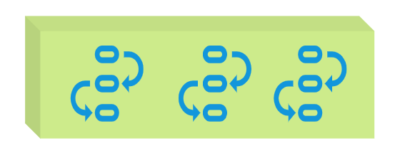

三分恶面渣逆袭：管理线程的池子
①、频繁地创建和销毁线程会消耗系统资源，线程池能够复用已创建的线程。
②、提高响应速度，当任务到达时，任务可以不需要等待线程创建就立即执行。
③、线程池支持定时执行、周期性执行、单线程执行和并发数控制等功能。
### [54.能说说工作中线程池的应用吗？](https://javabetter.cn/sidebar/sanfene/javathread.html#_54-%E8%83%BD%E8%AF%B4%E8%AF%B4%E5%B7%A5%E4%BD%9C%E4%B8%AD%E7%BA%BF%E7%A8%8B%E6%B1%A0%E7%9A%84%E5%BA%94%E7%94%A8%E5%90%97)
为了最大程度利用 CPU 的多核性能，并行运算的能力是不可获取的，通过线程池来管理线程是一个非常基础的操作。
**①、快速响应用户请求**
当用户发起一个实时请求，服务器需要快速响应，此时如果每次请求都直接创建一个线程，那么线程的创建和销毁会消耗大量的系统资源。
使用线程池，可以预先创建一定数量的线程，当用户请求到来时，直接从线程池中获取一个空闲线程，执行用户请求，执行完毕后，线程不销毁，而是继续保留在线程池中，等待下一个请求。
注意：这种场景下需要调高 corePoolSize 和 maxPoolSize，尽可能多创建线程，避免使用队列去缓存任务。
比如说，在[技术派实战项目](https://javabetter.cn/zhishixingqiu/paicoding.html)中，当用户请求首页时，就使用了线程池去加载首页的热门文章、置顶文章、侧边栏、用户登录信息等。
我们封装了一个异步类 AsyncUtil，内部的静态类 CompletableFutureBridge 是通过 [CompletableFuture](https://tech.meituan.com/2022/05/12/principles-and-practices-of-completablefuture.html) 实现的，其中的 `runAsyncWithTimeRecord()` 方法就是使用线程池去执行任务的。

```java
public CompletableFutureBridge runAsyncWithTimeRecord(Runnable run, String name) {
    return runAsyncWithTimeRecord(run, name, executorService);
}
```
其中线程池的初始化中，corePoolSize 为 CPU 核心数的两倍，因为技术派中的大多数任务都是 IO 密集型的，maxPoolSize 设置为 50，是一个比较理想的值，尤其是在本地环境中；阻塞队列为 SynchronousQueue，这意味着任务被创建后直接提交给等待的线程处理，而不是放入队列中。
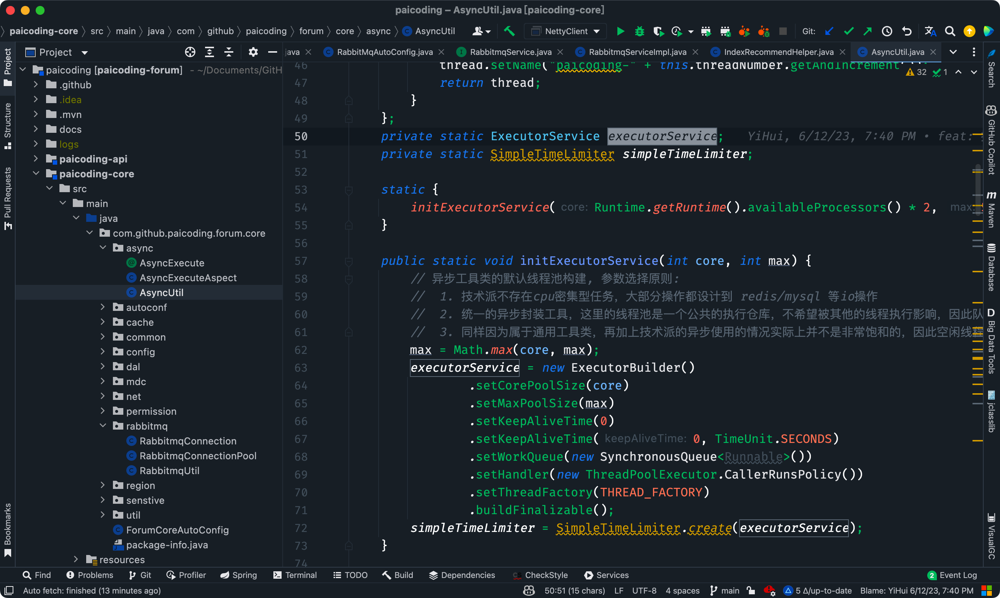

技术派源码：AsyncUtil
**②、快速处理批量任务**
这种场景也需要处理大量的任务，但可能不需要立即响应，这时候就应该设置队列去缓冲任务，corePoolSize 不需要设置得太高，避免线程上下文切换引起的频繁切换问题。
> 
1. [Java 面试指南（付费）](https://javabetter.cn/zhishixingqiu/mianshi.html)收录的携程面经同学 10 Java 暑期实习一面面试原题：讲一讲你对线程池的理解，并讲一讲使用的场景
2. [Java 面试指南（付费）](https://javabetter.cn/zhishixingqiu/mianshi.html)收录的美团面经同学 4 一面面试原题：平时怎么使用多线程
### [55.说一下线程池的工作流程？](https://javabetter.cn/sidebar/sanfene/javathread.html#_55-%E8%AF%B4%E4%B8%80%E4%B8%8B%E7%BA%BF%E7%A8%8B%E6%B1%A0%E7%9A%84%E5%B7%A5%E4%BD%9C%E6%B5%81%E7%A8%8B)
当应用程序提交一个任务时，线程池会根据当前线程的状态和参数决定如何处理这个任务。

- 如果线程池中的核心线程都在忙，并且线程池未达到最大线程数，新提交的任务会被放入队列中进行等待。
- 如果任务队列已满，且当前线程数量小于最大线程数，线程池会创建新的线程来处理任务。空闲的线程会从任务队列中取出任务来执行，当任务执行完毕后，线程并不会立即销毁，而是继续保持在池中等待下一个任务。
当线程空闲时间超出指定时间，且当前线程数量大于核心线程数时，线程会被回收。
#### [能用一个生活中的例子说明下吗？](https://javabetter.cn/sidebar/sanfene/javathread.html#%E8%83%BD%E7%94%A8%E4%B8%80%E4%B8%AA%E7%94%9F%E6%B4%BB%E4%B8%AD%E7%9A%84%E4%BE%8B%E5%AD%90%E8%AF%B4%E6%98%8E%E4%B8%8B%E5%90%97)
可以。有个名叫“你一定暴富”的银行，该银行有 6 个窗口，现在开放了 3 个窗口，坐着 3 个小姐姐在办理业务。
靓仔小二去办理业务，会遇到什么情况呢？
第一情况，小二发现有个空闲的小姐姐，正在翘首以盼，于是小二就快马加鞭跑过去办理了。
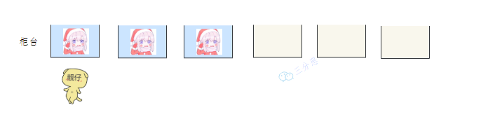

三分恶面渣逆袭：直接办理
第二种情况，小姐姐们都在忙，接待员小美招呼小二去排队区区取号排队，让小二稍安勿躁。
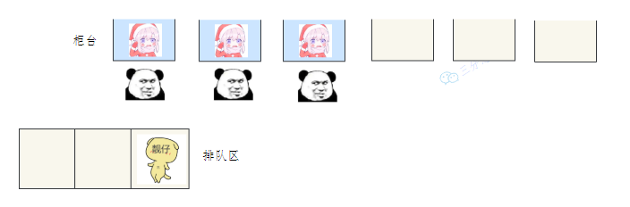

三分恶面渣逆袭：排队等待
第三种情况，不仅小姐姐们都在忙，排队区也满了，小二着急用钱，于是脾气就上来了，和接待员小美对线了起来，要求开放另外 3 个空闲的窗口。
小美迫于小二的压力，开放了另外 3 个窗口，排队区的人立马就冲了过去。
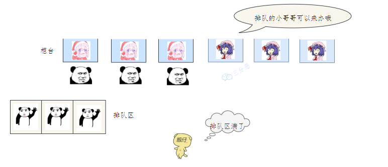

三分恶面渣逆袭：排队区满
第四种情况，6 个窗口的小姐姐都在忙，排队区也满了。。。
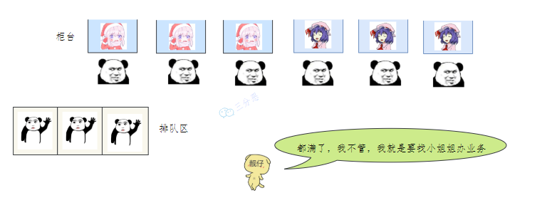

三分恶面渣逆袭：等待区，排队区都满
接待员小美给了小二 4 个选项：

1. 对不起，我们暴富银行系统瘫痪了。
2. 没看忙着呢，谁叫你来办的你找谁去！
3. 靓仔，看你比较急，去队里偷偷加个塞。
4. 不好意思，今天没办法，你改天再来吧。这个流程和线程池不能说一模一样，简直就是一模一样：

1. corePoolSize 对应营业窗口数 3
2. maximumPoolSize 对应最大窗口数 6
3. workQueue 对应排队区
4. handler 对应接待员小美
```java
public class ThreadPoolDemo {
    public static void main(String[] args) {
        // 创建一个线程池
        ExecutorService threadPool = new ThreadPoolExecutor(
                3, // 核心线程数
                6, // 最大线程数
                0, // 线程空闲时间
                TimeUnit.SECONDS, // 时间单位
                new LinkedBlockingQueue<>(10), // 等待队列
                Executors.defaultThreadFactory(), // 线程工厂
                new ThreadPoolExecutor.AbortPolicy() // 拒绝策略
        );
        // 模拟 10 个顾客来银行办理业务
        try {
            for (int i = 1; i <= 10; i++) {
                final int tempInt = i;
                threadPool.execute(() -> {
                    System.out.println(Thread.currentThread().getName() + "\t" + "办理业务" + tempInt);
                });
            }
        } catch (Exception e) {
            e.printStackTrace();
        } finally {
            threadPool.shutdown();
        }
    }
}
```
好，我再来梳理一下线程池的整个工作流程。
第一步，创建线程池。
第二步，调用线程池的 `execute()`方法，提交任务。

- 如果正在运行的线程数量小于 corePoolSize，那么线程池会创建一个新的线程来执行这个任务；
- 如果正在运行的线程数量大于或等于 corePoolSize，那么线程池会将这个任务放入等待队列；
- 如果等待队列满了，而且正在运行的线程数量小于 maximumPoolSize，那么线程池会创建新的线程来执行这个任务；
- 如果等待队列满了，而且正在运行的线程数量大于或等于 maximumPoolSize，那么线程池会执行拒绝策略。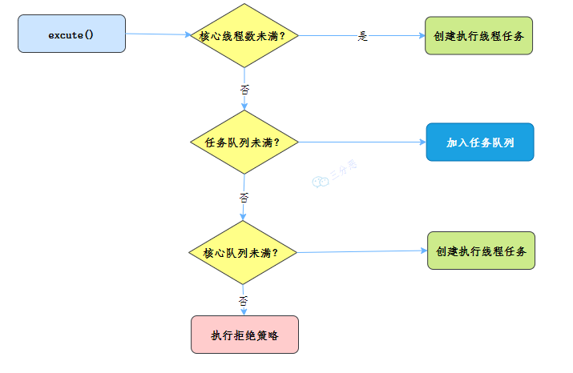

三分恶面渣逆袭：线程池执行流程
第三步，线程执行完毕后，线程并不会立即销毁，而是继续保持在池中等待下一个任务。
第四步，当线程空闲时间超出指定时间，且当前线程数量大于核心线程数时，线程会被回收。
### [56.线程池主要参数有哪些？](https://javabetter.cn/sidebar/sanfene/javathread.html#_56-%E7%BA%BF%E7%A8%8B%E6%B1%A0%E4%B8%BB%E8%A6%81%E5%8F%82%E6%95%B0%E6%9C%89%E5%93%AA%E4%BA%9B)
线程池有 7 个参数，需要重点关注`corePoolSize`、`maximumPoolSize`、`workQueue`、`handler` 这四个。


三分恶面渣逆袭：线程池参数
**①、corePoolSize** 定义了线程池中的核心线程数量。即使这些线程处于空闲状态，它们也不会被回收。这是线程池保持在等待状态下的线程数。
**②、maximumPoolSize** 是线程池允许的最大线程数量。当工作队列满了之后，线程池会创建新线程来处理任务，直到线程数达到这个最大值。
**③、workQueue**用于存放待处理任务的阻塞队列。当所有核心线程都忙时，新任务会被放在这个队列里等待执行。
**④、handler**，拒绝策略 RejectedExecutionHandler，定义了当线程池和工作队列都满了之后对新提交的任务的处理策略。常见的拒绝策略包括抛出异常、直接丢弃、丢弃队列中最老的任务、由提交任务的线程来直接执行任务等。
**⑤、threadFactory**指创建新线程的工厂。它用于创建线程池中的线程。可以通过自定义 ThreadFactory 来给线程池中的线程设置有意义的名字，或设置优先级等。
**⑥、keepAliveTime**指非核心线程的空闲存活时间。如果线程池中的线程数量超过了 corePoolSize，那么这些多余的线程在空闲时间超过 keepAliveTime 时会被终止。
**⑦、unit**，keepAliveTime 参数的时间单位：

- TimeUnit.DAYS; 天
- TimeUnit.HOURS; 小时
- TimeUnit.MINUTES; 分钟
- TimeUnit.SECONDS; 秒
- TimeUnit.MILLISECONDS; 毫秒
- TimeUnit.MICROSECONDS; 微秒
- TimeUnit.NANOSECONDS; 纳秒#### [能简单说一下参数之间的关系吗？](https://javabetter.cn/sidebar/sanfene/javathread.html#%E8%83%BD%E7%AE%80%E5%8D%95%E8%AF%B4%E4%B8%80%E4%B8%8B%E5%8F%82%E6%95%B0%E4%B9%8B%E9%97%B4%E7%9A%84%E5%85%B3%E7%B3%BB%E5%90%97)
①、corePoolSize 和 maximumPoolSize 共同定义了线程池的规模。

- 当提交的任务数不足以填满核心线程时，线程池只会创建足够的线程来处理任务。
- 当任务数增多，超过核心线程的处理能力时，任务会被加入 workQueue。
- 如果 workQueue 已满，而当前线程数又小于 maximumPoolSize，线程池会尝试创建新的线程来处理任务。②、keepAliveTime 和 unit 决定了非核心线程可以空闲存活多久。这会影响了线程池的资源回收策略。
③、workQueue 的选择对线程池的行为有重大影响。不同类型的队列（如无界队列、有界队列）会导致线程池在任务增多时的反应不同。
④、handler 定义了线程池的饱和策略，即当线程池无法接受新任务时的行为。决定了系统在极限情况下的表现。
#### [核心线程数不够会怎么进行处理？](https://javabetter.cn/sidebar/sanfene/javathread.html#%E6%A0%B8%E5%BF%83%E7%BA%BF%E7%A8%8B%E6%95%B0%E4%B8%8D%E5%A4%9F%E4%BC%9A%E6%80%8E%E4%B9%88%E8%BF%9B%E8%A1%8C%E5%A4%84%E7%90%86)
当提交的任务数超过了 corePoolSize，但是小于 maximumPoolSize 时，线程池会创建新的线程来处理任务。
当提交的任务数超过了 maximumPoolSize 时，线程池会根据拒绝策略来处理任务。
#### [举个例子说一下这些参数的变化](https://javabetter.cn/sidebar/sanfene/javathread.html#%E4%B8%BE%E4%B8%AA%E4%BE%8B%E5%AD%90%E8%AF%B4%E4%B8%80%E4%B8%8B%E8%BF%99%E4%BA%9B%E5%8F%82%E6%95%B0%E7%9A%84%E5%8F%98%E5%8C%96)
假设一个场景，线程池的配置如下：

```java
corePoolSize = 5
maximumPoolSize = 10
keepAliveTime = 60秒
workQueue = LinkedBlockingQueue（容量为100）
默认的threadFactory
handler = ThreadPoolExecutor.AbortPolicy()
```
**场景一**：当系统启动后，逐渐有 10 个任务提交到线程池。

- 前 5 个任务会立即执行，因为它们会占用所有的核心线程。
- 随后的 5 个任务会被放入工作队列中等待执行。**场景二**：如果此时再有 100 个任务提交到线程池。

- 工作队列已满，线程池会创建额外的线程来执行这些任务，直到线程总数达到 maximumPoolSize（10 个线程）。
- 如果任务继续增加，超过了工作队列和最大线程数的限制，新来的任务将会根据拒绝策略（AbortPolicy）被拒绝，抛出 RejectedExecutionException 异常。**场景三**：如果任务突然减少，只有少量的任务需要执行：
核心线程会一直运行，而超出核心线程数的线程，如果空闲时间超过 keepAliveTime，将会被终止，直到线程池的线程数减少到 corePoolSize。
### [57.线程池的拒绝策略有哪些？](https://javabetter.cn/sidebar/sanfene/javathread.html#_57-%E7%BA%BF%E7%A8%8B%E6%B1%A0%E7%9A%84%E6%8B%92%E7%BB%9D%E7%AD%96%E7%95%A5%E6%9C%89%E5%93%AA%E4%BA%9B)
拒绝策略有四种：

- AbortPolicy：这是默认的拒绝策略。该策略会抛出一个 RejectedExecutionException 异常。
- CallerRunsPolicy：该策略不会抛出异常，而是会让提交任务的线程（即调用 execute 方法的线程）自己来执行这个任务。
- DiscardOldestPolicy：策略会丢弃队列中最老的一个任务（即队列中等待最久的任务），然后尝试重新提交被拒绝的任务。
- DiscardPolicy：策略会默默地丢弃被拒绝的任务，不做任何处理也不抛出异常。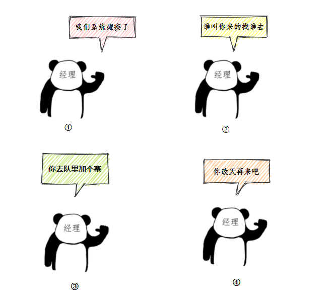

三分恶面渣逆袭：四种策略
分别对应着小二去银行办理业务，被经理“薄纱”了：“我们系统瘫痪了”、“谁叫你来办的你找谁去”、“看你比较急，去队里加个塞”、“今天没办法，不行你看改一天”。
如果默认策略不能满足需求，可以通过自定义实现 RejectedExecutionHandler 接口来定义自己的淘汰策略。例如：记录被拒绝任务的日志

```java
class CustomRejectedHandler {
    public static void main(String[] args) {
        // 自定义拒绝策略
        RejectedExecutionHandler rejectedHandler = (r, executor) -> {
            System.out.println("Task " + r.toString() + " rejected. Queue size: " 
                               + executor.getQueue().size());
        };

        // 自定义线程池
        ThreadPoolExecutor executor = new ThreadPoolExecutor(
            2,                      // 核心线程数
            4,                      // 最大线程数
            10,                     // 空闲线程存活时间
            TimeUnit.SECONDS,
            new ArrayBlockingQueue<>(2),  // 阻塞队列容量
            Executors.defaultThreadFactory(),
            rejectedHandler          // 自定义拒绝策略
        );

        for (int i = 0; i < 10; i++) {
            final int taskNumber = i;
            executor.execute(() -> {
                System.out.println("Executing task " + taskNumber);
                try {
                    Thread.sleep(1000); // 模拟任务耗时
                } catch (InterruptedException e) {
                    e.printStackTrace();
                }
            });
        }

        executor.shutdown();
    }
}
```
#### [什么时候会执行拒绝策略？](https://javabetter.cn/sidebar/sanfene/javathread.html#%E4%BB%80%E4%B9%88%E6%97%B6%E5%80%99%E4%BC%9A%E6%89%A7%E8%A1%8C%E6%8B%92%E7%BB%9D%E7%AD%96%E7%95%A5)
当线程池无法接受新的任务时，也就是线程数达到 maximumPoolSize，任务队列也满了的时候，就会触发拒绝策略。
### [58.线程池有哪几种阻塞队列？](https://javabetter.cn/sidebar/sanfene/javathread.html#_58-%E7%BA%BF%E7%A8%8B%E6%B1%A0%E6%9C%89%E5%93%AA%E5%87%A0%E7%A7%8D%E9%98%BB%E5%A1%9E%E9%98%9F%E5%88%97)
在 Java 中，线程池（ThreadPoolExecutor）使用阻塞队列（BlockingQueue）来存储待处理的任务。
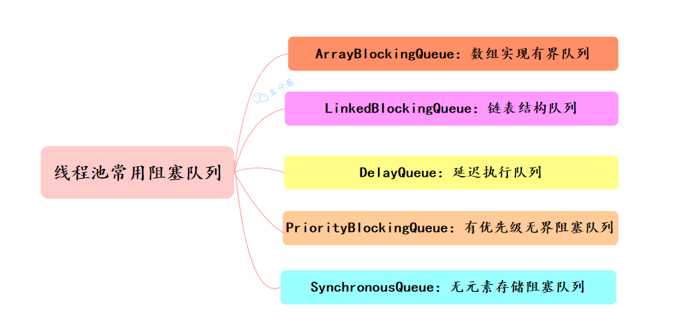

三分恶面渣逆袭：线程池常用阻塞队列
①、ArrayBlockingQueue：一个有界的先进先出的阻塞队列，底层是一个数组，适合固定大小的线程池。

```java
ArrayBlockingQueue<Integer> blockingQueue = new ArrayBlockingQueue<Integer>(10, true);
```
②、LinkedBlockingQueue：底层数据结构是链表，如果不指定大小，默认大小是 Integer.MAX_VALUE，相当于一个无界队列。
[技术派实战项目](https://javabetter.cn/zhishixingqiu/paicoding.html)中，就使用了 LinkedBlockingQueue 来配置 RabbitMQ 的消息队列。
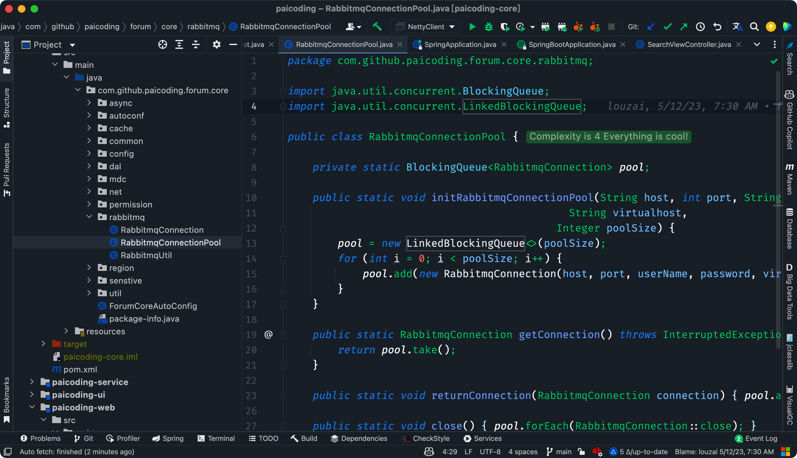

技术派实战项目源码
③、PriorityBlockingQueue：一个支持优先级排序的无界阻塞队列。任务按照其自然顺序或通过构造器给定的 Comparator 来排序。
适用于需要按照给定优先级处理任务的场景，比如优先处理紧急任务。
④、DelayQueue：类似于 PriorityBlockingQueue，由二叉堆实现的无界优先级阻塞队列。
Executors 中的 `newScheduledThreadPool()` 就使用了 DelayQueue 来实现延迟执行。

```java
public ScheduledThreadPoolExecutor(int corePoolSize) {
    super(corePoolSize, Integer.MAX_VALUE, 0, NANOSECONDS,
            new DelayedWorkQueue());
}
```
⑤、SynchronousQueue：实际上它不是一个真正的队列，因为没有容量。每个插入操作必须等待另一个线程的移除操作，同样任何一个移除操作都必须等待另一个线程的插入操作。
`Executors.newCachedThreadPool()` 就使用了 SynchronousQueue，这个线程池会根据需要创建新线程，如果有空闲线程则会重复使用，线程空闲 60 秒后会被回收。

```java
public static ExecutorService newCachedThreadPool() {
    return new ThreadPoolExecutor(0, Integer.MAX_VALUE,
                                    60L, TimeUnit.SECONDS,
                                    new SynchronousQueue<Runnable>());
}
```
> 
1. [Java 面试指南（付费）](https://javabetter.cn/zhishixingqiu/mianshi.html)收录的微众银行同学 1 Java 后端一面的原题：线程池的阻塞队列有哪些实现方式？
### [59.线程池提交 execute 和 submit 有什么区别？](https://javabetter.cn/sidebar/sanfene/javathread.html#_59-%E7%BA%BF%E7%A8%8B%E6%B1%A0%E6%8F%90%E4%BA%A4-execute-%E5%92%8C-submit-%E6%9C%89%E4%BB%80%E4%B9%88%E5%8C%BA%E5%88%AB)

1. execute 用于提交不需要返回值的任务
```java
threadsPool.execute(new Runnable() {
    @Override public void run() {
        // TODO Auto-generated method stub }
    });
```

1. submit()方法用于提交需要返回值的任务。线程池会返回一个 future 类型的对象，通过这个 future 对象可以判断任务是否执行成功，并且可以通过 future 的 get()方法来获取返回值
```java
Future<Object> future = executor.submit(harReturnValuetask);
try { Object s = future.get(); } catch (InterruptedException e) {
    // 处理中断异常
} catch (ExecutionException e) {
    // 处理无法执行任务异常
} finally {
    // 关闭线程池 executor.shutdown();
}
```
### [60.线程池怎么关闭知道吗？](https://javabetter.cn/sidebar/sanfene/javathread.html#_60-%E7%BA%BF%E7%A8%8B%E6%B1%A0%E6%80%8E%E4%B9%88%E5%85%B3%E9%97%AD%E7%9F%A5%E9%81%93%E5%90%97)
可以通过调用线程池的`shutdown`或`shutdownNow`方法来关闭线程池。它们的原理是遍历线程池中的工作线程，然后逐个调用线程的 interrupt 方法来中断线程，所以无法响应中断的任务可能永远无法终止。
**shutdown() 将线程池状态置为 shutdown,并不会立即停止**：

1. 停止接收外部 submit 的任务
2. 内部正在跑的任务和队列里等待的任务，会执行完
3. 等到第二步完成后，才真正停止**shutdownNow() 将线程池状态置为 stop。一般会立即停止，事实上不一定**：

1. 和 shutdown()一样，先停止接收外部提交的任务
2. 忽略队列里等待的任务
3. 尝试将正在跑的任务 interrupt 中断
4. 返回未执行的任务列表shutdown 和 shutdownnow 简单来说区别如下：

- shutdownNow()能立即停止线程池，正在跑的和正在等待的任务都停下了。这样做立即生效，但是风险也比较大。
- shutdown()只是关闭了提交通道，用 submit()是无效的；而内部的任务该怎么跑还是怎么跑，跑完再彻底停止线程池。### [61.线程池的线程数应该怎么配置？](https://javabetter.cn/sidebar/sanfene/javathread.html#_61-%E7%BA%BF%E7%A8%8B%E6%B1%A0%E7%9A%84%E7%BA%BF%E7%A8%8B%E6%95%B0%E5%BA%94%E8%AF%A5%E6%80%8E%E4%B9%88%E9%85%8D%E7%BD%AE)
首先，我会分析线程池中执行的任务类型是 CPU 密集型还是 IO 密集型？
①、对于 CPU 密集型任务，我的目标是尽量减少线程上下文切换，以优化 CPU 使用率。一般来说，核心线程数设置为处理器的核心数或核心数加一（以备不时之需，如某些线程因等待系统资源而阻塞时）是较理想的选择。
②、对于 IO 密集型任务，由于线程经常处于等待状态（等待 IO 操作完成），可以设置更多的线程来提高并发性（比如说 2 倍），从而增加 CPU 利用率。


常见线程池参数配置方案-来源美团技术博客
核心数可以通过 Java 的`Runtime.getRuntime().availableProcessors()`方法获取。
此外，每个线程都会占用一定的内存，因此我需要确保线程池的规模不会耗尽 JVM 内存，避免频繁的垃圾回收或内存溢出。
最后，我会根据业务需求和系统资源来调整线程池的参数，比如核心线程数、最大线程数、非核心线程的空闲存活时间、任务队列容量等。

```java
ThreadPoolExecutor executor = new ThreadPoolExecutor(
    cores, // 核心线程数设置为CPU核心数
    cores * 2, // 最大线程数为核心数的两倍
    60L, TimeUnit.SECONDS, // 非核心线程的空闲存活时间
    new LinkedBlockingQueue<>(100) // 任务队列容量
);
```
#### [如何知道你设置的线程数多了还是少了？](https://javabetter.cn/sidebar/sanfene/javathread.html#%E5%A6%82%E4%BD%95%E7%9F%A5%E9%81%93%E4%BD%A0%E8%AE%BE%E7%BD%AE%E7%9A%84%E7%BA%BF%E7%A8%8B%E6%95%B0%E5%A4%9A%E4%BA%86%E8%BF%98%E6%98%AF%E5%B0%91%E4%BA%86)
可以先通过 top 命令观察 CPU 的使用率，如果 CPU 使用率较低，可能是线程数过少；如果 CPU 使用率接近 100%，但吞吐量未提升，可能是线程数过多。
然后再通过 JProfiler、VisualVM 或 Arthas 分析线程运行情况，查看线程的状态、等待时间、运行时间等信息，进一步调整线程池的参数。
通常来说：

- 对于 CPU 密集型任务，线程数接近 CPU 核心数即可。
- 对于 IO 密集型任务，线程数可以简单设置为 CPU 核心数 × 2。> 
1. [Java 面试指南（付费）](https://javabetter.cn/zhishixingqiu/mianshi.html)收录的字节跳动同学 7 Java 后端实习一面的原题：线程池核心线程数你是怎么规划的，过程是怎么考量的？
2. [Java 面试指南（付费）](https://javabetter.cn/zhishixingqiu/mianshi.html)收录的哔哩哔哩同学 1 二面面试原题：聊聊你对线程池各个参数的理解；如何知道你设置的线程数多了还是少了？
### [62.有哪几种常见的线程池？](https://javabetter.cn/sidebar/sanfene/javathread.html#_62-%E6%9C%89%E5%93%AA%E5%87%A0%E7%A7%8D%E5%B8%B8%E8%A7%81%E7%9A%84%E7%BA%BF%E7%A8%8B%E6%B1%A0)
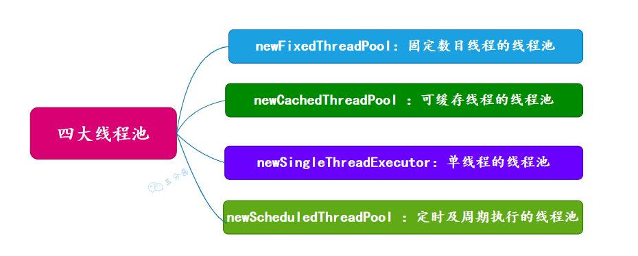

三分恶面渣逆袭：四大线程池
可以通过 Executors 工厂类来创建四种线程池：

- newFixedThreadPool (固定线程数目的线程池)
- newCachedThreadPool (可缓存线程的线程池)
- newSingleThreadExecutor (单线程的线程池)
- newScheduledThreadPool (定时及周期执行的线程池)> 
1. [Java 面试指南（付费）](https://javabetter.cn/zhishixingqiu/mianshi.html)收录的比亚迪同学 1 面试原题：有没有用过线程池，线程池有哪几种？
2. [Java 面试指南（付费）](https://javabetter.cn/zhishixingqiu/mianshi.html)收录的oppo 面经同学 8 后端开发秋招一面面试原题：线程池都有哪些以及核心参数介绍下
3. [Java 面试指南（付费）](https://javabetter.cn/zhishixingqiu/mianshi.html)收录的理想汽车面经同学 2 一面面试原题：JAVA中线程池有哪些？
### [63.能说一下四种常见线程池的原理吗？](https://javabetter.cn/sidebar/sanfene/javathread.html#_63-%E8%83%BD%E8%AF%B4%E4%B8%80%E4%B8%8B%E5%9B%9B%E7%A7%8D%E5%B8%B8%E8%A7%81%E7%BA%BF%E7%A8%8B%E6%B1%A0%E7%9A%84%E5%8E%9F%E7%90%86%E5%90%97)
前三种线程池的构造直接调用 ThreadPoolExecutor 的构造方法。
#### [newSingleThreadExecutor](https://javabetter.cn/sidebar/sanfene/javathread.html#newsinglethreadexecutor)

```java
public static ExecutorService newSingleThreadExecutor(ThreadFactory threadFactory) {
    return new FinalizableDelegatedExecutorService
        (new ThreadPoolExecutor(1, 1,
                                0L, TimeUnit.MILLISECONDS,
                                new LinkedBlockingQueue<Runnable>(),
                                threadFactory));
}
```
**线程池特点**

- 核心线程数为 1
- 最大线程数也为 1
- 阻塞队列是无界队列 LinkedBlockingQueue，可能会导致 OOM
- keepAliveTime 为 0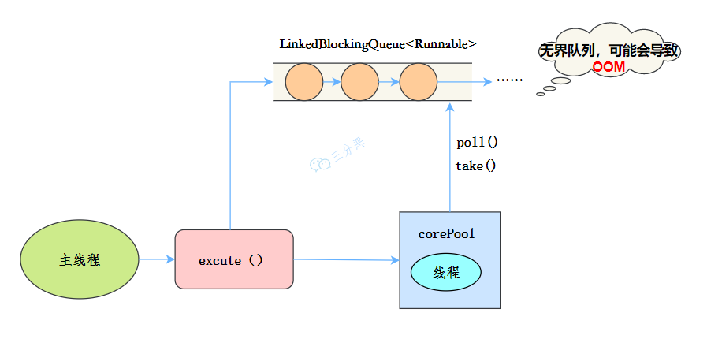

SingleThreadExecutor运行流程
工作流程：

- 提交任务
- 线程池是否有一条线程在，如果没有，新建线程执行任务
- 如果有，将任务加到阻塞队列
- 当前的唯一线程，从队列取任务，执行完一个，再继续取，一个线程执行任务。**适用场景**
适用于串行执行任务的场景，一个任务一个任务地执行。
#### [newFixedThreadPool](https://javabetter.cn/sidebar/sanfene/javathread.html#newfixedthreadpool)

```java
public static ExecutorService newFixedThreadPool(int nThreads, ThreadFactory threadFactory) {
    return new ThreadPoolExecutor(nThreads, nThreads,
                                  0L, TimeUnit.MILLISECONDS,
                                  new LinkedBlockingQueue<Runnable>(),
                                  threadFactory);
}
```
**线程池特点：**

- 核心线程数和最大线程数大小一样
- 没有所谓的非空闲时间，即 keepAliveTime 为 0
- 阻塞队列为无界队列 LinkedBlockingQueue，可能会导致 OOM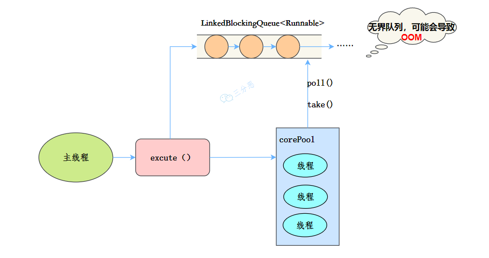

FixedThreadPool
工作流程：

- 提交任务
- 如果线程数少于核心线程，创建核心线程执行任务
- 如果线程数等于核心线程，把任务添加到 LinkedBlockingQueue 阻塞队列
- 如果线程执行完任务，去阻塞队列取任务，继续执行。**使用场景**
FixedThreadPool 适用于处理 CPU 密集型的任务，确保 CPU 在长期被工作线程使用的情况下，尽可能的少的分配线程，即适用执行长期的任务。
#### [newCachedThreadPool](https://javabetter.cn/sidebar/sanfene/javathread.html#newcachedthreadpool)

```java
public static ExecutorService newCachedThreadPool(ThreadFactory threadFactory) {
    return new ThreadPoolExecutor(0, Integer.MAX_VALUE,
                                  60L, TimeUnit.SECONDS,
                                  new SynchronousQueue<Runnable>(),
                                  threadFactory);
}
```
**线程池特点：**

- 核心线程数为 0
- 最大线程数为 Integer.MAX_VALUE，即无限大，可能会因为无限创建线程，导致 OOM
- 阻塞队列是 SynchronousQueue
- 非核心线程空闲存活时间为 60 秒当提交任务的速度大于处理任务的速度时，每次提交一个任务，就必然会创建一个线程。极端情况下会创建过多的线程，耗尽 CPU 和内存资源。由于空闲 60 秒的线程会被终止，长时间保持空闲的 CachedThreadPool 不会占用任何资源。
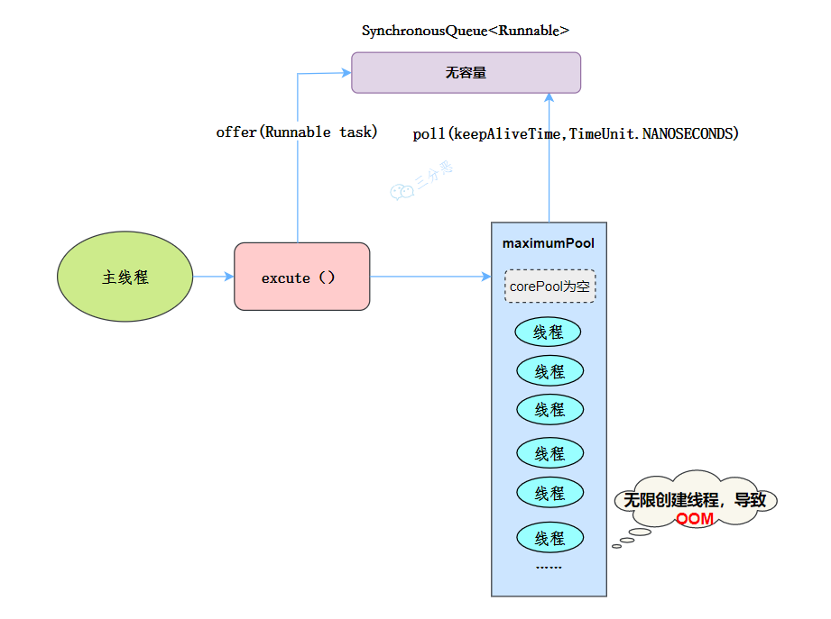

CachedThreadPool执行流程
工作流程：

- 提交任务
- 因为没有核心线程，所以任务直接加到 SynchronousQueue 队列。
- 判断是否有空闲线程，如果有，就去取出任务执行。
- 如果没有空闲线程，就新建一个线程执行。
- 执行完任务的线程，还可以存活 60 秒，如果在这期间，接到任务，可以继续活下去；否则，被销毁。**适用场景**
用于并发执行大量短期的小任务。
#### [newScheduledThreadPool](https://javabetter.cn/sidebar/sanfene/javathread.html#newscheduledthreadpool)

```java
public ScheduledThreadPoolExecutor(int corePoolSize) {
    super(corePoolSize, Integer.MAX_VALUE, 0, NANOSECONDS,
          new DelayedWorkQueue());
}
```
**线程池特点**

- 最大线程数为 Integer.MAX_VALUE，也有 OOM 的风险
- 阻塞队列是 DelayedWorkQueue
- keepAliveTime 为 0
- scheduleAtFixedRate() ：按某种速率周期执行
- scheduleWithFixedDelay()：在某个延迟后执行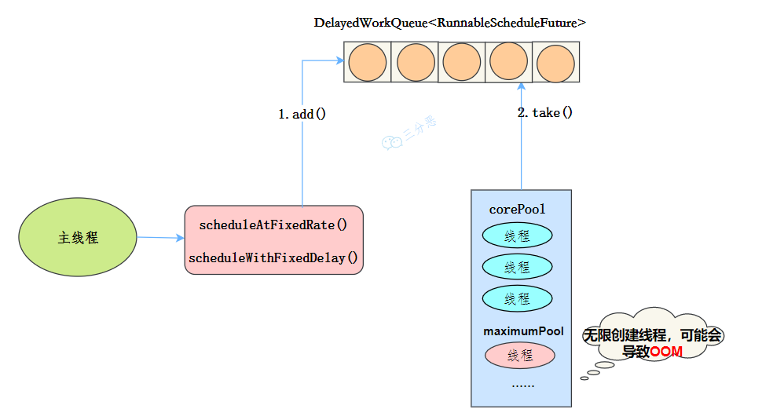

ScheduledThreadPool执行流程
**工作机制**

- 线程从 DelayQueue 中获取已到期的 ScheduledFutureTask（DelayQueue.take()）。到期任务是指 ScheduledFutureTask 的 time 大于等于当前时间。
- 线程执行这个 ScheduledFutureTask。
- 线程修改 ScheduledFutureTask 的 time 变量为下次将要被执行的时间。
- 线程把这个修改 time 之后的 ScheduledFutureTask 放回 DelayQueue 中（DelayQueue.add()）。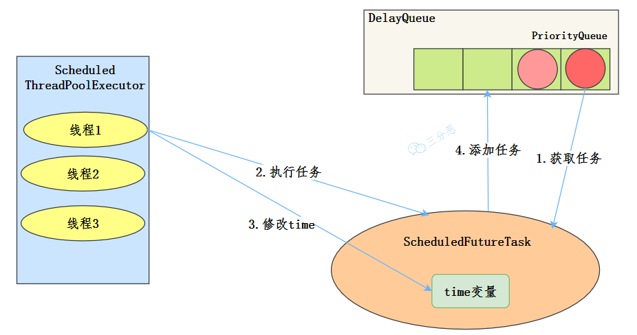

ScheduledThreadPoolExecutor执行流程
**使用场景**
周期性执行任务的场景，需要限制线程数量的场景
> 使用无界队列的线程池会导致什么问题吗？

例如 newFixedThreadPool 使用了无界的阻塞队列 LinkedBlockingQueue，如果线程获取一个任务后，任务的执行时间比较长，会导致队列的任务越积越多，导致机器内存使用不停飙升，最终导致 OOM。
### [64.线程池异常怎么处理知道吗？](https://javabetter.cn/sidebar/sanfene/javathread.html#_64-%E7%BA%BF%E7%A8%8B%E6%B1%A0%E5%BC%82%E5%B8%B8%E6%80%8E%E4%B9%88%E5%A4%84%E7%90%86%E7%9F%A5%E9%81%93%E5%90%97)
在使用线程池处理任务的时候，任务代码可能抛出 RuntimeException，抛出异常后，线程池可能捕获它，也可能创建一个新的线程来代替异常的线程，我们可能无法感知任务出现了异常，因此我们需要考虑线程池异常情况。
常见的异常处理方式：
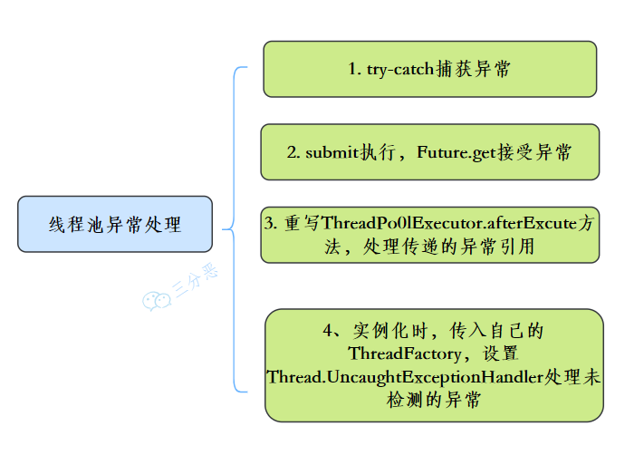

线程池异常处理
### [65.能说一下线程池有几种状态吗？](https://javabetter.cn/sidebar/sanfene/javathread.html#_65-%E8%83%BD%E8%AF%B4%E4%B8%80%E4%B8%8B%E7%BA%BF%E7%A8%8B%E6%B1%A0%E6%9C%89%E5%87%A0%E7%A7%8D%E7%8A%B6%E6%80%81%E5%90%97)
线程池有这几个状态：RUNNING,SHUTDOWN,STOP,TIDYING,TERMINATED。

```java
//线程池状态
private static final int RUNNING    = -1 << COUNT_BITS;
private static final int SHUTDOWN   =  0 << COUNT_BITS;
private static final int STOP       =  1 << COUNT_BITS;
private static final int TIDYING    =  2 << COUNT_BITS;
private static final int TERMINATED =  3 << COUNT_BITS;
```
线程池各个状态切换图：
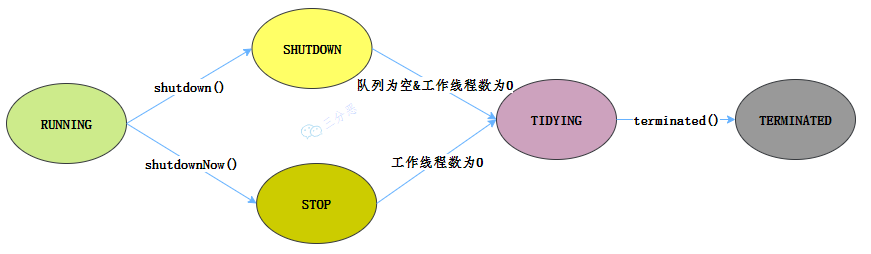

线程池状态切换图
**RUNNING**

- 该状态的线程池会接收新任务，并处理阻塞队列中的任务;
- 调用线程池的 shutdown()方法，可以切换到 SHUTDOWN 状态;
- 调用线程池的 shutdownNow()方法，可以切换到 STOP 状态;**SHUTDOWN**

- 该状态的线程池不会接收新任务，但会处理阻塞队列中的任务；
- 队列为空，并且线程池中执行的任务也为空,进入 TIDYING 状态;**STOP**

- 该状态的线程不会接收新任务，也不会处理阻塞队列中的任务，而且会中断正在运行的任务；
- 线程池中执行的任务为空,进入 TIDYING 状态;**TIDYING**

- 该状态表明所有的任务已经运行终止，记录的任务数量为 0。
- terminated()执行完毕，进入 TERMINATED 状态**TERMINATED**

- 该状态表示线程池彻底终止### [66.线程池如何实现参数的动态修改？](https://javabetter.cn/sidebar/sanfene/javathread.html#_66-%E7%BA%BF%E7%A8%8B%E6%B1%A0%E5%A6%82%E4%BD%95%E5%AE%9E%E7%8E%B0%E5%8F%82%E6%95%B0%E7%9A%84%E5%8A%A8%E6%80%81%E4%BF%AE%E6%94%B9)
线程池提供了几个 setter 方法来设置线程池的参数。
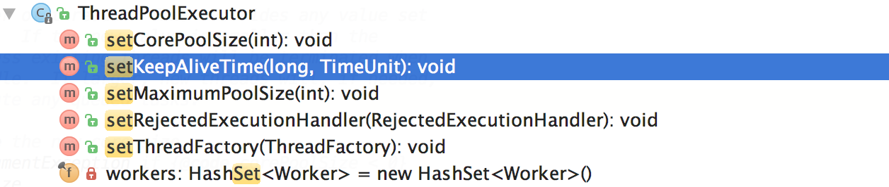

JDK 线程池参数设置接口来源参考[7]
这里主要有两个思路：
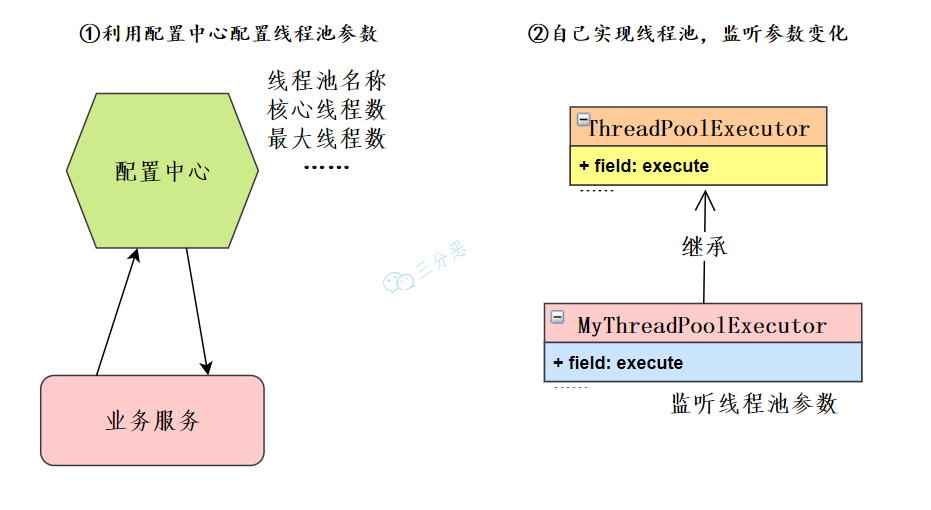

动态修改线程池参数

- 在我们微服务的架构下，可以利用配置中心如 Nacos、Apollo 等等，也可以自己开发配置中心。业务服务读取线程池配置，获取相应的线程池实例来修改线程池的参数。
- 如果限制了配置中心的使用，也可以自己去扩展**ThreadPoolExecutor**，重写方法，监听线程池参数变化，来动态修改线程池参数。### [67.线程池调优了解吗？（补充）](https://javabetter.cn/sidebar/sanfene/javathread.html#_67-%E7%BA%BF%E7%A8%8B%E6%B1%A0%E8%B0%83%E4%BC%98%E4%BA%86%E8%A7%A3%E5%90%97-%E8%A1%A5%E5%85%85)
> 2024 年 03 月 16 日增补

线程池配置没有固定的公式，通常事前会对线程池进行一定评估，常见的评估方案如下：
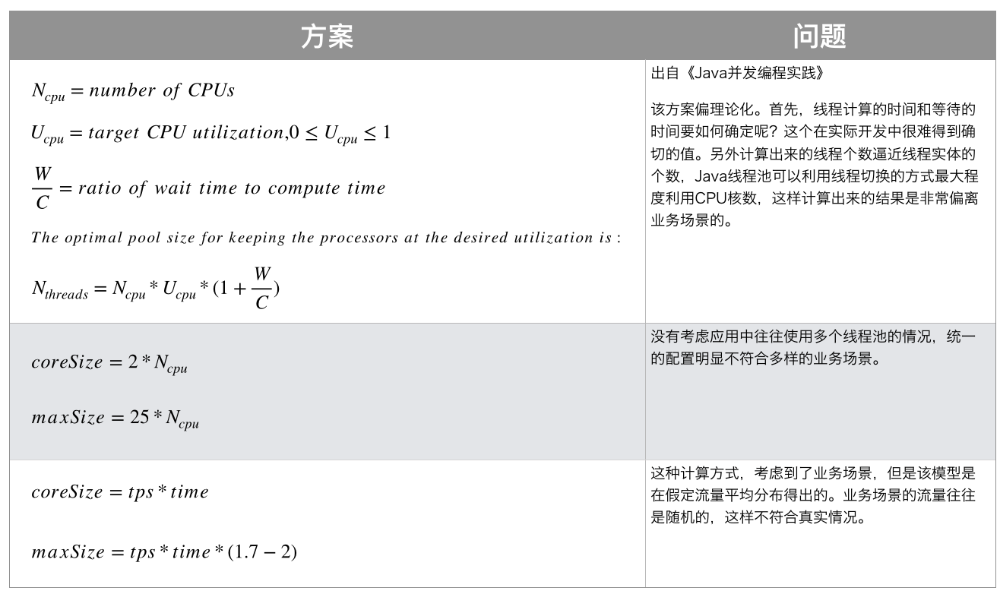

线程池评估方案 来源参考[7]
上线之前也要进行充分的测试，上线之后要建立完善的线程池监控机制。
事中结合监控告警机制，分析线程池的问题，或者可优化点，结合线程池动态参数配置机制来调整配置。
事后要注意仔细观察，随时调整。
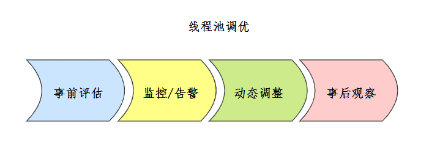

线程池调优
具体的调优案例可以查看参考[7]美团技术博客。
### [68.线程池在使用的时候需要注意什么？（补充）](https://javabetter.cn/sidebar/sanfene/javathread.html#_68-%E7%BA%BF%E7%A8%8B%E6%B1%A0%E5%9C%A8%E4%BD%BF%E7%94%A8%E7%9A%84%E6%97%B6%E5%80%99%E9%9C%80%E8%A6%81%E6%B3%A8%E6%84%8F%E4%BB%80%E4%B9%88-%E8%A1%A5%E5%85%85)
> 2024 年 03 月 16 日增补

我认为比较重要的关注点有 3 个：
①、选择合适的线程池大小

- **过小**的线程池可能会导致任务一直在排队
- **过大**的线程池可能会导致大家都在竞争 CPU 资源，增加上下文切换的开销可以根据业务是 IO 密集型还是 CPU 密集型来选择线程池大小：

- CPU 密集型：指的是任务主要使用来进行大量的计算，没有什么导致线程阻塞。一般这种场景的线程数设置为 CPU 核心数+1。
- IO 密集型：当执行任务需要大量的 io，比如磁盘 io，网络 io，可能会存在大量的阻塞，所以在 IO 密集型任务中使用多线程可以大大地加速任务的处理。一般线程数设置为 2*CPU 核心数。②、任务队列的选择

- 使用有界队列可以避免资源耗尽的风险，但是可能会导致任务被拒绝
- 使用无界队列虽然可以避免任务被拒绝，但是可能会导致内存耗尽一般需要设置有界队列的大小，比如 LinkedBlockingQueue 在构造的时候可以传入参数来限制队列中任务数据的大小，这样就不会因为无限往队列中扔任务导致系统的 oom。
③、尽量使用自定义的线程池，而不是使用 Executors 创建的线程池，因为 newFixedThreadPool 线程池由于使用了 LinkedBlockingQueue，队列的容量默认无限大，实际使用中出现任务过多时会导致内存溢出；newCachedThreadPool 线程池由于核心线程数无限大，当任务过多的时候会导致创建大量的线程，可能机器负载过高导致服务宕机。
> 
1. [Java 面试指南（付费）](https://javabetter.cn/zhishixingqiu/mianshi.html)收录的滴滴同学 2 技术二面的原题：线程池在使用的时候需要注意什么
### [69.你能设计实现一个线程池吗？](https://javabetter.cn/sidebar/sanfene/javathread.html#_69-%E4%BD%A0%E8%83%BD%E8%AE%BE%E8%AE%A1%E5%AE%9E%E7%8E%B0%E4%B8%80%E4%B8%AA%E7%BA%BF%E7%A8%8B%E6%B1%A0%E5%90%97)
推荐阅读：[三分恶线程池原理](https://mp.weixin.qq.com/s/Exy7pRGND9TCjRd9TZK4jg)
线程池的设计需要考虑这几个关键因素：

1. 核心线程池类：包含核心线程数、最大线程数。
2. 工作线程：线程池中实际工作的线程，从任务队列中获取任务并执行。
3. 任务队列：存放待执行任务的队列，可以使用阻塞队列实现。
4. 拒绝策略：当任务队列满时，处理新任务的策略。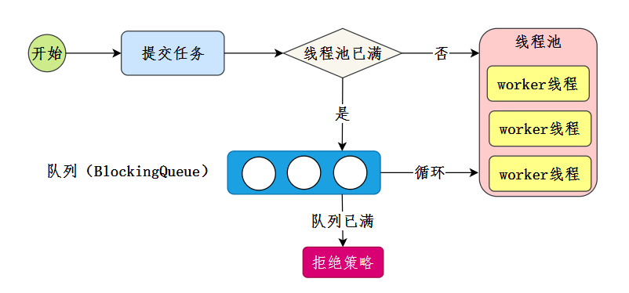

三分恶面渣逆袭：线程池主要实现流程
核心线程池类：

```java
/**
 * CustomThreadPoolExecutor is a simple implementation of a thread pool.
 */
public class CustomThreadPoolExecutor {

    private final int corePoolSize;
    private final int maximumPoolSize;
    private final long keepAliveTime;
    private final TimeUnit unit;
    private final BlockingQueue<Runnable> workQueue;
    private final RejectedExecutionHandler handler;

    private volatile boolean isShutdown = false;
    private int currentPoolSize = 0;

    /**
     * Constructs a CustomThreadPoolExecutor.
     *
     * @param corePoolSize    the number of core threads.
     * @param maximumPoolSize the maximum number of threads.
     * @param keepAliveTime   the time to keep extra threads alive.
     * @param unit            the time unit for keepAliveTime.
     * @param workQueue       the queue to hold runnable tasks.
     * @param handler         the handler to use when execution is blocked.
     */
    public CustomThreadPoolExecutor(int corePoolSize, int maximumPoolSize, long keepAliveTime, TimeUnit unit,
                                    BlockingQueue<Runnable> workQueue, RejectedExecutionHandler handler) {
        this.corePoolSize = corePoolSize;
        this.maximumPoolSize = maximumPoolSize;
        this.keepAliveTime = keepAliveTime;
        this.unit = unit;
        this.workQueue = workQueue;
        this.handler = handler;
    }

    /**
     * Executes a given task using the thread pool.
     *
     * @param task the task to execute.
     */
    public void execute(Runnable task) {
        if (isShutdown) {
            throw new IllegalStateException("ThreadPool is shutdown");
        }

        synchronized (this) {
            // If current pool size is less than core pool size, create a new worker thread
            if (currentPoolSize < corePoolSize) {
                new Worker(task).start();
                currentPoolSize++;
                return;
            }

            // Try to add task to the queue, if full create a new worker thread if possible
            if (!workQueue.offer(task)) {
                if (currentPoolSize < maximumPoolSize) {
                    new Worker(task).start();
                    currentPoolSize++;
                } else {
                    // If maximum pool size reached, apply the rejection handler
                    handler.rejectedExecution(task, null);
                }
            }
        }
    }

    /**
     * Shuts down the thread pool.
     */
    public void shutdown() {
        isShutdown = true;
    }

    /**
     * Worker is an internal class that represents a worker thread in the pool.
     */
    private class Worker extends Thread {
        private Runnable task;

        Worker(Runnable task) {
            this.task = task;
        }

        @Override
        public void run() {
            while (task != null || (task = getTask()) != null) {
                try {
                    task.run();
                } finally {
                    task = null;
                }
            }
        }

        /**
         * Gets a task from the work queue, waiting up to keepAliveTime if necessary.
         *
         * @return a task to run, or null if the keepAliveTime expires.
         */
        private Runnable getTask() {
            try {
                return workQueue.poll(keepAliveTime, unit);
            } catch (InterruptedException e) {
                return null;
            }
        }
    }
}
```
拒绝策略：

```java
/**
 * CustomRejectedExecutionHandler contains several common rejection policies.
 */
public class CustomRejectedExecutionHandler {

    /**
     * AbortPolicy throws a RuntimeException when the task is rejected.
     */
    public static class AbortPolicy implements RejectedExecutionHandler {
        public void rejectedExecution(Runnable r, ThreadPoolExecutor e) {
            throw new RuntimeException("Task " + r.toString() + " rejected from " + e.toString());
        }
    }

    /**
     * DiscardPolicy silently discards the rejected task.
     */
    public static class DiscardPolicy implements RejectedExecutionHandler {
        public void rejectedExecution(Runnable r, ThreadPoolExecutor e) {
            // Do nothing
        }
    }

    /**
     * CallerRunsPolicy runs the rejected task in the caller's thread.
     */
    public static class CallerRunsPolicy implements RejectedExecutionHandler {
        public void rejectedExecution(Runnable r, ThreadPoolExecutor e) {
            if (!e.isShutdown()) {
                r.run();
            }
        }
    }
}
```
使用示例：

```java
public class ThreadPoolTest {
    public static void main(String[] args) {
        // Create a thread pool with core size 2, max size 4, and a queue capacity of 2
        CustomThreadPoolExecutor executor = new CustomThreadPoolExecutor(
                2, 4, 10, TimeUnit.SECONDS,
                new LinkedBlockingQueue<>(2),
                new CustomRejectedExecutionHandler.AbortPolicy());

        // Submit 10 tasks to the pool
        for (int i = 0; i < 10; i++) {
            final int index = i;
            executor.execute(() -> {
                System.out.println("Task " + index + " is running");
                try {
                    Thread.sleep(2000);
                } catch (InterruptedException e) {
                    e.printStackTrace();
                }
            });
        }

        // Shutdown the thread pool
        executor.shutdown();
    }
}
```
执行结果：
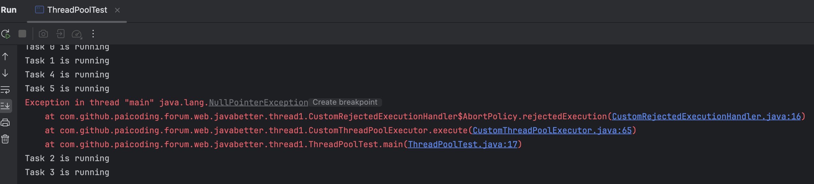

二哥的 Java 进阶之路：拒绝策略
#### [写一个数据库连接池，你现在可以写一下？](https://javabetter.cn/sidebar/sanfene/javathread.html#%E5%86%99%E4%B8%80%E4%B8%AA%E6%95%B0%E6%8D%AE%E5%BA%93%E8%BF%9E%E6%8E%A5%E6%B1%A0-%E4%BD%A0%E7%8E%B0%E5%9C%A8%E5%8F%AF%E4%BB%A5%E5%86%99%E4%B8%80%E4%B8%8B)
数据库连接池的核心功能主要包括：

- 连接的获取和释放
- 限制最大连接数，避免资源耗尽
- 连接的复用，避免频繁创建和销毁连接
```java
class SimpleConnectionPool {
    // 配置
    private String jdbcUrl;
    private String username;
    private String password;
    private int maxConnections;
    private BlockingQueue<Connection> connectionPool;

    // 构造方法
    public SimpleConnectionPool(String jdbcUrl, String username, String password, int maxConnections) throws SQLException {
        this.jdbcUrl = jdbcUrl;
        this.username = username;
        this.password = password;
        this.maxConnections = maxConnections;
        this.connectionPool = new LinkedBlockingQueue<>(maxConnections);

        // 初始化连接池
        for (int i = 0; i < maxConnections; i++) {
            connectionPool.add(createNewConnection());
        }
    }

    // 创建新连接
    private Connection createNewConnection() throws SQLException {
        return DriverManager.getConnection(jdbcUrl, username, password);
    }

    // 获取连接
    public Connection getConnection(long timeout, TimeUnit unit) throws InterruptedException, SQLException {
        Connection connection = connectionPool.poll(timeout, unit); // 等待指定时间获取连接
        if (connection == null) {
            throw new SQLException("Timeout: Unable to acquire a connection.");
        }
        return connection;
    }

    // 归还连接
    public void releaseConnection(Connection connection) throws SQLException {
        if (connection != null) {
            if (connection.isClosed()) {
                // 如果连接已关闭，创建一个新连接补充到池中
                connectionPool.add(createNewConnection());
            } else {
                // 将连接归还到池中
                connectionPool.offer(connection);
            }
        }
    }

    // 关闭所有连接
    public void closeAllConnections() throws SQLException {
        for (Connection connection : connectionPool) {
            if (!connection.isClosed()) {
                connection.close();
            }
        }
    }

    // 测试用例
    public static void main(String[] args) {
        try {
            SimpleConnectionPool pool = new SimpleConnectionPool(
                "jdbc:mysql://localhost:3306/pai_coding", "root", "", 5
            );

            // 获取连接
            Connection conn = pool.getConnection(5, TimeUnit.SECONDS);

            // 使用连接（示例查询）
            System.out.println("Connection acquired: " + conn);
            Thread.sleep(2000); // 模拟查询

            // 归还连接
            pool.releaseConnection(conn);
            System.out.println("Connection returned.");

            // 关闭所有连接
            pool.closeAllConnections();
        } catch (Exception e) {
            e.printStackTrace();
        }
    }
}
```
运行结果：
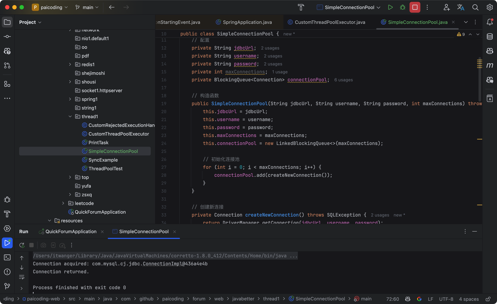

二哥的Java 进阶之路：数据库连接池
> 
1. [Java 面试指南（付费）](https://javabetter.cn/zhishixingqiu/mianshi.html)收录的美团面经同学 3 Java 后端技术一面面试原题：线程池怎么设计，拒绝策略有哪些，如何选择
2. [Java 面试指南（付费）](https://javabetter.cn/zhishixingqiu/mianshi.html)收录的哔哩哔哩同学 1 二面面试原题：给你一个需求，你需要写一个连接池，你现在可以写一下
### [70.单机线程池执行断电了应该怎么处理？](https://javabetter.cn/sidebar/sanfene/javathread.html#_70-%E5%8D%95%E6%9C%BA%E7%BA%BF%E7%A8%8B%E6%B1%A0%E6%89%A7%E8%A1%8C%E6%96%AD%E7%94%B5%E4%BA%86%E5%BA%94%E8%AF%A5%E6%80%8E%E4%B9%88%E5%A4%84%E7%90%86)
我们可以对正在处理和阻塞队列的任务做事务管理或者对阻塞队列中的任务持久化处理，并且当断电或者系统崩溃，操作无法继续下去的时候，可以通过回溯日志的方式来撤销`正在处理`的已经执行成功的操作。然后重新执行整个阻塞队列。
也就是说，对阻塞队列持久化；正在处理任务事务控制；断电之后正在处理任务的回滚，通过日志恢复该次操作；服务器重启后阻塞队列中的数据再加载。

### 常见场景题汇总

#### [场景1：线程池隔离（服务雪崩防护）]
**问题描述**：
某电商系统包含“订单服务”和“第三方支付服务”。两个服务共用同一个全局线程池。某天第三方支付接口响应极慢（从 50ms 变 5s），结果导致整个电商系统的下单、查询都卡死了。为什么？怎么解决？

**解答**：
*   **原因**：**线程资源耗尽**。因为支付接口慢，线程池中的线程都被支付任务占用了（处于 Waiting 状态），其他轻量级任务（如查询）拿不到线程去执行，导致整个系统不可用。这是典型的“级联故障”。
*   **解决方案**：**线程池隔离**（Bulkhead Pattern）。
    *   为核心业务（订单、支付、查询）分别创建独立的线程池。
    *   支付服务挂了，只会耗尽“支付线程池”，不会影响“查询线程池”。

#### [场景2：父子任务死锁]
**问题描述**：
你定义了一个固定大小为 1 的线程池 (`newFixedThreadPool(1)`)。
你提交了一个任务 A，任务 A 在执行过程中又向同一个线程池提交了任务 B，并且 A 需要等待 B 执行完成 (`futureB.get()`) 才能结束。
程序运行后卡死了，为什么？

**解答**：
这是典型的**线程池死锁**。
1.  线程池只有一个线程，被任务 A 抢占并运行。
2.  任务 A 提交任务 B 到队列，并阻塞等待 B 完成。
3.  任务 B 在队列中等待线程释放才能运行。
4.  **死锁形成**：A 等 B 运行，B 等 A 释放线程。
**教训**：
*   **不要在线程池任务中等待同一个线程池的子任务**。
*   父子任务应使用不同的线程池。

#### [场景3：ThreadLocal 上下文丢失]
**问题描述**：
在 Spring Boot 请求主线程中，我们将用户信息存入了 `ThreadLocal`。然后在一个异步任务（提交到线程池）中尝试获取该用户信息，发现取不到（为 null），或者取到了错误的用户信息。为什么？如何解决？

**解答**：
*   **原因**：
    *   **丢失**：`ThreadLocal` 是线程私有的。线程池中的线程是复用的，和主请求线程不是同一个，无法共享数据。
    *   **错误数据（脏读）**：如果线程池线程之前处理过其他请求，`ThreadLocal` 没清理，可能会读到旧数据。
*   **解决方案**：
    *   **手动传递**：在提交任务时，将用户信息作为参数传入。
    *   **TransmittableThreadLocal (TTL)**：阿里开源工具。配合 `TtlRunnable` 修饰任务，可以在任务提交时自动抓取当前线程上下文，并在任务执行时回放（Replay）到子线程，执行完后还原（Restore）。

#### [场景4：异常吞噬]
**问题描述**：
生产环境某个定时任务（ScheduledThreadPool）突然不跑了，但是日志里没有任何异常堆栈信息。可能是什么原因？

**解答**：
*   **原因**：线程池（特别是 `submit()` 或 `ScheduledExecutorService`）会捕获任务执行过程中的 RuntimeException，并将其封装在 `Future` 对象中。
    *   如果不调用 `future.get()`，异常就会被吞掉，不会打印到日志。
*   **解决**：
    *   **Try-Catch 包裹**：在 `run()` 方法内部最外层包裹 `try-catch` 并打印日志。
    *   **重写 `afterExecute`**：扩展 `ThreadPoolExecutor`，重写 `afterExecute` 方法统一处理异常。
