## [ThreadLocal](https://javabetter.cn/sidebar/sanfene/javathread.html#threadlocal)
推荐阅读：[ThreadLocal 全面解析](https://www.bilibili.com/video/BV1N741127FH/)
### [12.ThreadLocal 是什么？](https://javabetter.cn/sidebar/sanfene/javathread.html#_12-threadlocal-%E6%98%AF%E4%BB%80%E4%B9%88)
[ThreadLocal](https://javabetter.cn/thread/ThreadLocal.html) 是 Java 中提供的一种用于实现线程局部变量的工具类。它允许每个线程都拥有自己的独立副本，从而实现线程隔离，用于解决多线程中共享对象的线程安全问题。
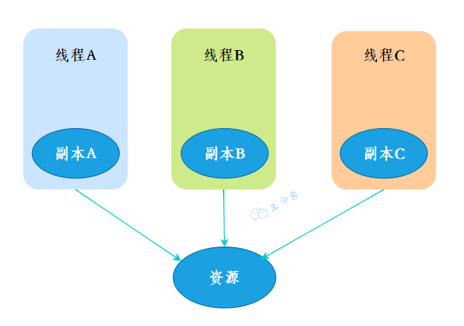

三分恶面渣逆袭：ThreadLocal线程副本
在 Web 应用中，可以使用 ThreadLocal 存储用户会话信息，这样每个线程在处理用户请求时都能方便地访问当前用户的会话信息。
在数据库操作中，可以使用 ThreadLocal 存储数据库连接对象，每个线程有自己独立的数据库连接，从而避免了多线程竞争同一数据库连接的问题。
在格式化操作中，例如日期格式化，可以使用 ThreadLocal 存储 SimpleDateFormat 实例，避免多线程共享同一实例导致的线程安全问题。
使用 ThreadLocal 通常分为四步：
①、创建 ThreadLocal

```java
//创建一个ThreadLocal变量
public static ThreadLocal<String> localVariable = new ThreadLocal<>();
```
②、设置 ThreadLocal 的值

```java
//设置ThreadLocal变量的值
localVariable.set("沉默王二是沙雕");
```
③、获取 ThreadLocal 的值

```java
//获取ThreadLocal变量的值
String value = localVariable.get();
```
④、删除 ThreadLocal 的值

```java
//删除ThreadLocal变量的值
localVariable.remove();
```
#### [ThreadLocal 有哪些优点？](https://javabetter.cn/sidebar/sanfene/javathread.html#threadlocal-%E6%9C%89%E5%93%AA%E4%BA%9B%E4%BC%98%E7%82%B9)
**①、线程隔离**：每个线程访问的变量副本都是独立的，避免了共享变量引起的线程安全问题。由于 ThreadLocal 实现了变量的线程独占，使得变量不需要同步处理，因此能够避免资源竞争。
**②、数据传递方便**：ThreadLocal 常用于在跨方法、跨类时传递上下文数据（如用户信息等），而不需要在方法间传递参数。
#### [除了 ThreadLocal，还有什么解决线程安全问题的方法？](https://javabetter.cn/sidebar/sanfene/javathread.html#%E9%99%A4%E4%BA%86-threadlocal-%E8%BF%98%E6%9C%89%E4%BB%80%E4%B9%88%E8%A7%A3%E5%86%B3%E7%BA%BF%E7%A8%8B%E5%AE%89%E5%85%A8%E9%97%AE%E9%A2%98%E7%9A%84%E6%96%B9%E6%B3%95)
①、Java 中的 synchronized 关键字可以用于方法和代码块，确保同一时间只有一个线程可以执行特定的代码段。

```java
public synchronized void method() {
    // 线程安全的操作
}
```
②、Java 并发包（java.util.concurrent.locks）中提供了 Lock 接口和一些实现类，如 ReentrantLock。相比于 synchronized，ReentrantLock 提供了公平锁和非公平锁。

```java
ReentrantLock lock = new ReentrantLock();

public void method() {
    lock.lock();
    try {
        // 线程安全的操作
    } finally {
        lock.unlock();
    }
}
```
③、Java 并发包还提供了一组原子变量类（如 AtomicInteger，AtomicLong 等），它们利用 CAS（比较并交换），实现了无锁的原子操作，适用于简单的计数器场景。

```java
AtomicInteger atomicInteger = new AtomicInteger(0);

public void increment() {
    atomicInteger.incrementAndGet();
}
```
④、Java 并发包提供了一些线程安全的集合类，如 ConcurrentHashMap，CopyOnWriteArrayList 等。这些集合类内部实现了必要的同步策略，提供了更高效的并发访问。

```java
ConcurrentHashMap<String, String> map = new ConcurrentHashMap<>();
```
⑤、volatile 变量保证了变量的可见性，修改操作是立即同步到主存的，读操作从主存中读取。

```java
private volatile boolean flag = false;
```
### [13.你在工作中用到过 ThreadLocal 吗？](https://javabetter.cn/sidebar/sanfene/javathread.html#_13-%E4%BD%A0%E5%9C%A8%E5%B7%A5%E4%BD%9C%E4%B8%AD%E7%94%A8%E5%88%B0%E8%BF%87-threadlocal-%E5%90%97)
有用到过，用来存储用户信息。
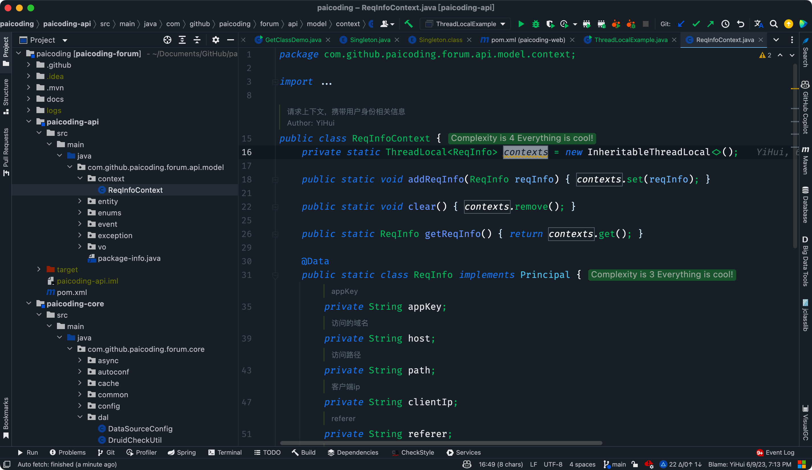

[技术派实战项目](https://javabetter.cn/zhishixingqiu/paicoding.html)是典型的 MVC 架构，登录后的用户每次访问接口，都会在请求头中携带一个 token，在控制层可以根据这个 token，解析出用户的基本信息。
假如在服务层和持久层也要用到用户信息，就可以在控制层拦截请求把用户信息存入 ThreadLocal。
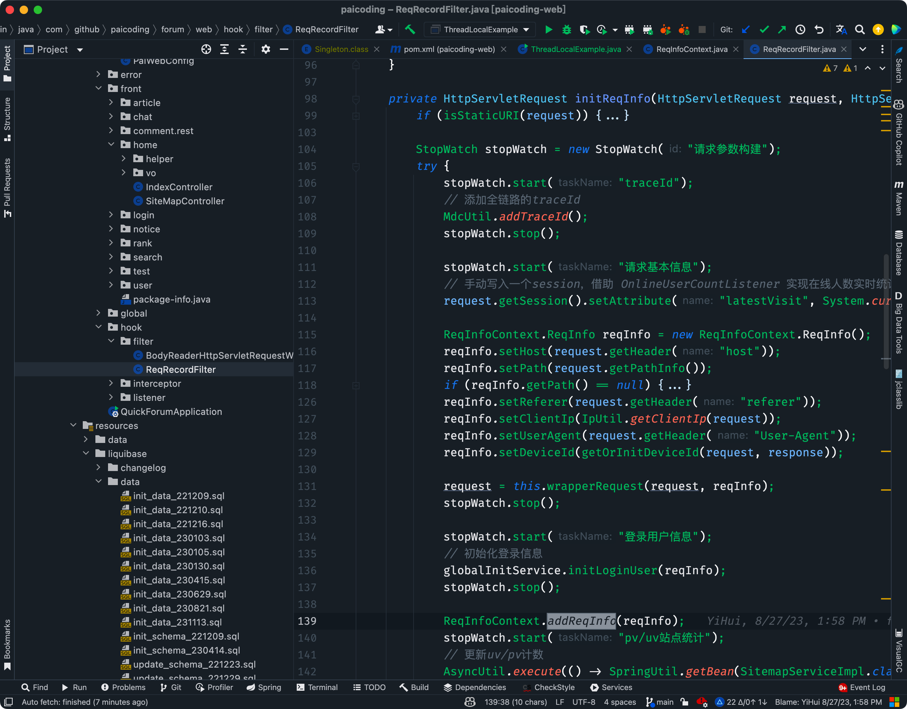

技术派实战源码
这样我们在任何一个地方，都可以取出 ThreadLocal 中存的用户信息。
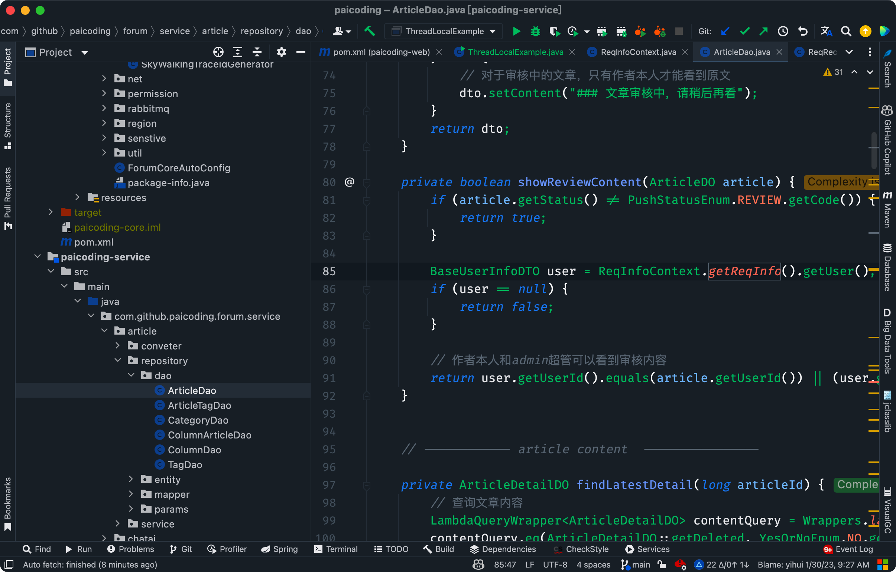

技术派实战源码
很多其它场景的 cookie、session 等等数据隔离都可以通过 ThreadLocal 去实现。
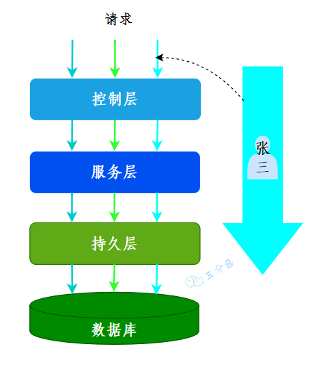

三分恶面渣逆袭：ThreadLoca存放用户上下文
数据库连接池也可以用 ThreadLocal，将数据库连接池的连接交给 ThreadLocal 进行管理，能够保证当前线程的操作都是同一个 Connnection。
> 
1. [Java 面试指南（付费）](https://javabetter.cn/zhishixingqiu/mianshi.html)收录的滴滴同学 2 技术二面的原题：ThreadLocal 有哪些问题，为什么使用线程池会存在复用问题
2. [Java 面试指南（付费）](https://javabetter.cn/zhishixingqiu/mianshi.html)收录的快手面经同学 1 部门主站技术部面试原题：请说一下 ThreadLocal 的作用和使用场景？
### [14.ThreadLocal 怎么实现的呢？](https://javabetter.cn/sidebar/sanfene/javathread.html#_14-threadlocal-%E6%80%8E%E4%B9%88%E5%AE%9E%E7%8E%B0%E7%9A%84%E5%91%A2)
ThreadLocal 本身并不存储任何值，它只是作为一个映射，来映射线程的局部变量。当一个线程调用 ThreadLocal 的 set 或 get 方法时，实际上是访问线程自己的 ThreadLocal.ThreadLocalMap。
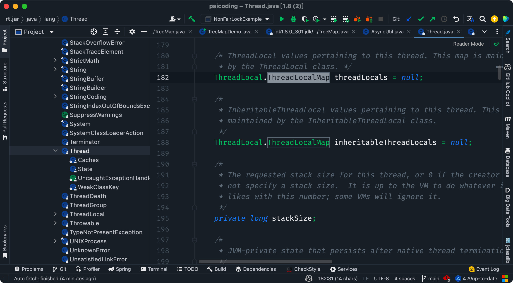

二哥的 Java 进阶之路：ThreadLocalMap
ThreadLocalMap 是 ThreadLocal 的静态内部类，它内部维护了一个 Entry 数组，key 是 ThreadLocal 对象，value 是线程的局部变量本身。
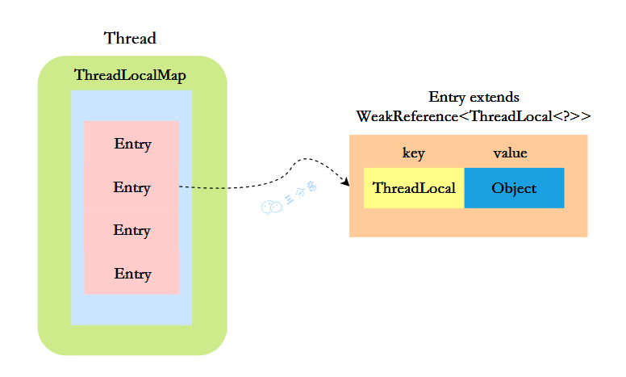

三分恶面渣逆袭：ThreadLoca结构图
早期的 ThreadLocal 不是这样的，它的 ThreadLocalMap 中使用 Thread 作为 key，这也是最简单的实现方式。
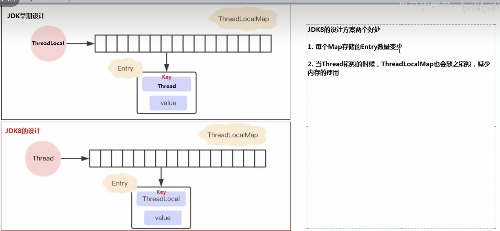

黑马：JDK 早期设计
优化后的方案有两个好处，一个是 Map 中存储的键值对变少了；另一个是 ThreadLocalMap 的生命周期和线程一样长，线程销毁的时候，ThreadLocalMap 也会被销毁。
Entry 继承了 WeakReference，它限定了 key 是一个弱引用，弱引用的好处是当内存不足时，JVM 会回收 ThreadLocal 对象，并且将其对应的 Entry 的 value 设置为 null，这样在很大程度上可以避免内存泄漏。

```java
static class Entry extends WeakReference<ThreadLocal<?>> {
    /** The value associated with this ThreadLocal. */
    Object value;

    //节点类
    Entry(ThreadLocal<?> k, Object v) {
        //key赋值
        super(k);
        //value赋值
        value = v;
    }
}
```
ThreadLocal 的实现原理就是，每个线程维护一个 Map，key 为 ThreadLocal 对象，value 为想要实现线程隔离的对象。
1、当需要存线程隔离的对象时，通过 ThreadLocal 的 set 方法将对象存入 Map 中。
2、当需要取线程隔离的对象时，通过 ThreadLocal 的 get 方法从 Map 中取出对象。
3、Map 的大小由 ThreadLocal 对象的多少决定。
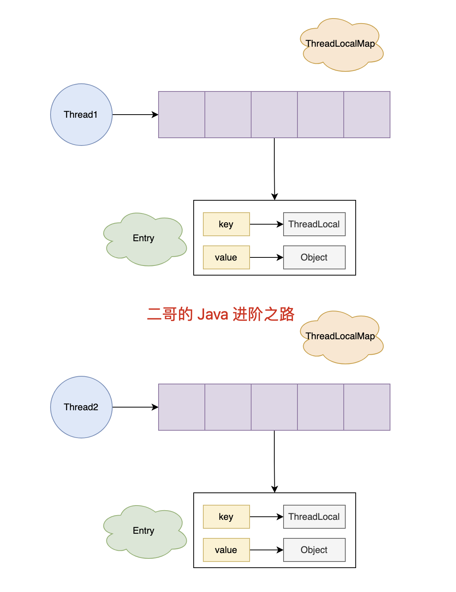

ThreadLocal 的结构
#### [什么是弱引用，什么是强引用？](https://javabetter.cn/sidebar/sanfene/javathread.html#%E4%BB%80%E4%B9%88%E6%98%AF%E5%BC%B1%E5%BC%95%E7%94%A8-%E4%BB%80%E4%B9%88%E6%98%AF%E5%BC%BA%E5%BC%95%E7%94%A8)
强引用，比如说 `User user = new User("沉默王二")` 中，user 就是一个强引用，`new User("沉默王二")` 就是一个强引用对象。
当 user 被置为 null 时（`user = null`），`new User("沉默王二")` 将会被垃圾回收；如果 user 不被置为 null，即便是内存空间不足，JVM 也不会回收 `new User("沉默王二")` 这个强引用对象，宁愿抛出 OutOfMemoryError。
弱引用，比如说下面这段代码：

```java
ThreadLocal<User> userThreadLocal = new ThreadLocal<>();
userThreadLocal.set(new User("沉默王二"));
```
①、userThreadLocal 是一个强引用，`new ThreadLocal<>()` 是一个强引用对象；
②、`new User("沉默王二")` 是一个强引用对象。
③、在 ThreadLocalMap 中，`key = new ThreadLocal<>()` 是一个弱引用对象。当 JVM 进行垃圾回收时，如果发现了弱引用对象，就会将其回收。
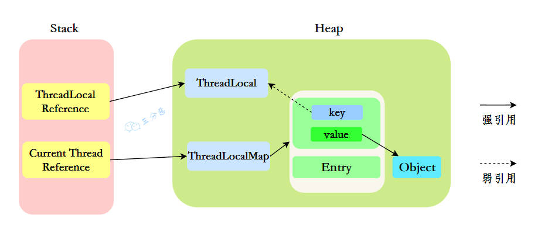

三分恶面渣逆袭：ThreadLocal内存分配
其关系链就是：

- ThreadLocal 强引用 -> ThreadLocal 对象。
- Thread 强引用 -> ThreadLocalMap。
- `ThreadLocalMap[i]` 强引用了 -> Entry。
- Entry.key 弱引用 -> ThreadLocal 对象。
- Entry.value 强引用 -> 线程的局部变量对象。### [15.ThreadLocal 内存泄露是怎么回事？](https://javabetter.cn/sidebar/sanfene/javathread.html#_15-threadlocal-%E5%86%85%E5%AD%98%E6%B3%84%E9%9C%B2%E6%98%AF%E6%80%8E%E4%B9%88%E5%9B%9E%E4%BA%8B)
通常情况下，随着线程 Thread 的结束，其内部的 ThreadLocalMap 也会被回收，从而避免了内存泄漏。
但如果一个线程一直在运行，并且其 `ThreadLocalMap` 中的 Entry.value 一直指向某个强引用对象，那么这个对象就不会被回收，从而导致内存泄漏。当 Entry 非常多时，可能就会引发更严重的内存溢出问题。


ThreadLocalMap 内存溢出
#### [那怎么解决内存泄漏问题呢？](https://javabetter.cn/sidebar/sanfene/javathread.html#%E9%82%A3%E6%80%8E%E4%B9%88%E8%A7%A3%E5%86%B3%E5%86%85%E5%AD%98%E6%B3%84%E6%BC%8F%E9%97%AE%E9%A2%98%E5%91%A2)
很简单，使用完 ThreadLocal 后，及时调用 `remove()` 方法释放内存空间。

```java
try {
    threadLocal.set(value);
    // 执行业务操作
} finally {
    threadLocal.remove(); // 确保能够执行清理
}
```
`remove()` 方法会将当前线程的 ThreadLocalMap 中的所有 key 为 null 的 Entry 全部清除，这样就能避免内存泄漏问题。

```java
private void remove(ThreadLocal<?> key) {
    Entry[] tab = table;
    int len = tab.length;
    int i = key.threadLocalHashCode & (len-1);
    for (Entry e = tab[i];
            e != null;
            e = tab[i = nextIndex(i, len)]) {
        if (e.get() == key) {
            e.clear();
            expungeStaleEntry(i);
            return;
        }
    }
}

public void clear() {
    this.referent = null;
}
```
#### [那为什么 key 要设计成弱引用？](https://javabetter.cn/sidebar/sanfene/javathread.html#%E9%82%A3%E4%B8%BA%E4%BB%80%E4%B9%88-key-%E8%A6%81%E8%AE%BE%E8%AE%A1%E6%88%90%E5%BC%B1%E5%BC%95%E7%94%A8)
弱引用的好处是，当内存不足的时候，JVM 会主动回收掉弱引用的对象。
比如说：

```java
WeakReference key = new WeakReference(new ThreadLocal());
```
key 是弱引用，`new WeakReference(new ThreadLocal())` 是弱引用对象，当 JVM 进行垃圾回收时，如果发现了弱引用对象，就会将其回收。
一旦 key 被回收，ThreadLocalMap 在进行 set、get 的时候就会对 key 为 null 的 Entry 进行清理。


总结一下，在 ThreadLocal 被垃圾收集后，下一次访问 ThreadLocalMap 时，Java 会自动清理那些键为 null 的条目（参照源码中的 replaceStaleEntry 方法），这个过程会在执行 ThreadLocalMap 相关操作（如 `get()`, `set()`, `remove()`）时触发。
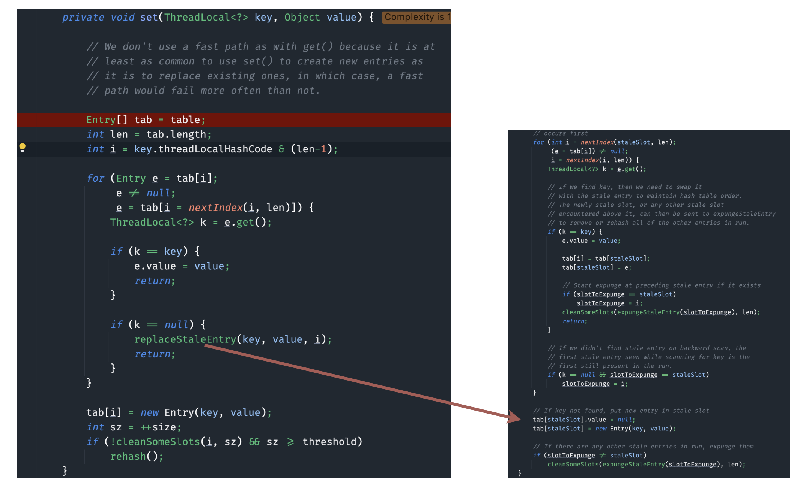

二哥的 Java 进阶之路
#### [你了解哪些 ThreadLocal 的改进方案？](https://javabetter.cn/sidebar/sanfene/javathread.html#%E4%BD%A0%E4%BA%86%E8%A7%A3%E5%93%AA%E4%BA%9B-threadlocal-%E7%9A%84%E6%94%B9%E8%BF%9B%E6%96%B9%E6%A1%88)
在 JDK 20 Early-Access Build 28 版本中，出现了 ThreadLocal 的改进方案，即 `ScopedValue`。
还有 Netty 中的 FastThreadLocal，它是 Netty 对 ThreadLocal 的优化，它内部维护了一个索引常量 index，每次创建 FastThreadLocal 中都会自动+1，用来取代 hash 冲突带来的损耗，用空间换时间。

```java
private final int index;

public FastThreadLocal() {
    index = InternalThreadLocalMap.nextVariableIndex();
}
public static int nextVariableIndex() {
    int index = nextIndex.getAndIncrement();
    if (index < 0) {
        nextIndex.decrementAndGet();
    }
    return index;
}
```
### [16.ThreadLocalMap 的源码看过吗？](https://javabetter.cn/sidebar/sanfene/javathread.html#_16-threadlocalmap-%E7%9A%84%E6%BA%90%E7%A0%81%E7%9C%8B%E8%BF%87%E5%90%97)
ThreadLocalMap 虽然被叫做 Map，其实它是没有实现 Map 接口的，但是结构还是和 HashMap 比较类似的，主要关注的是两个要素：`元素数组`和`散列方法`。
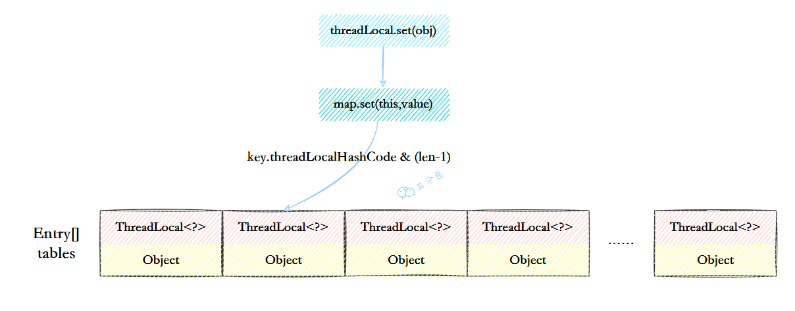

ThreadLocalMap结构示意图

- 元素数组一个 table 数组，存储 Entry 类型的元素，Entry 是 ThreaLocal 弱引用作为 key，Object 作为 value 的结构。

- 散列方法散列方法就是怎么把对应的 key 映射到 table 数组的相应下标，ThreadLocalMap 用的是哈希取余法，取出 key 的 threadLocalHashCode，然后和 table 数组长度减一&运算（相当于取余）。

```java
int i = key.threadLocalHashCode & (table.length - 1);
```
这里的 threadLocalHashCode 计算有点东西，每创建一个 ThreadLocal 对象，它就会新增`0x61c88647`，这个值很特殊，它是**斐波那契数** 也叫 **黄金分割数**。`hash`增量为 这个数字，带来的好处就是 `hash`**分布非常均匀**。

```java
private static final int HASH_INCREMENT = 0x61c88647;

    private static int nextHashCode() {
        return nextHashCode.getAndAdd(HASH_INCREMENT);
    }
```
### [17.ThreadLocalMap 怎么解决 Hash 冲突的？](https://javabetter.cn/sidebar/sanfene/javathread.html#_17-threadlocalmap-%E6%80%8E%E4%B9%88%E8%A7%A3%E5%86%B3-hash-%E5%86%B2%E7%AA%81%E7%9A%84)
我们可能都知道 HashMap 使用了链表来解决冲突，也就是所谓的链地址法。
ThreadLocalMap 没有使用链表，自然也不是用链地址法来解决冲突了，它用的是另外一种方式——**开放定址法**。开放定址法是什么意思呢？简单来说，就是这个坑被人占了，那就接着去找空着的坑。
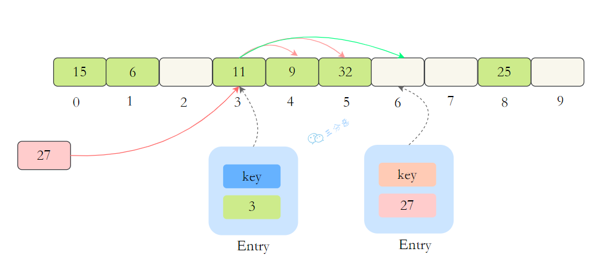

ThreadLocalMap解决冲突
如上图所示，如果我们插入一个 value=27 的数据，通过 hash 计算后应该落入第 4 个槽位中，而槽位 4 已经有了 Entry 数据，而且 Entry 数据的 key 和当前不相等。此时就会线性向后查找，一直找到 Entry 为 null 的槽位才会停止查找，把元素放到空的槽中。
在 get 的时候，也会根据 ThreadLocal 对象的 hash 值，定位到 table 中的位置，然后判断该槽位 Entry 对象中的 key 是否和 get 的 key 一致，如果不一致，就判断下一个位置。
### [18.ThreadLocalMap 扩容机制了解吗？](https://javabetter.cn/sidebar/sanfene/javathread.html#_18-threadlocalmap-%E6%89%A9%E5%AE%B9%E6%9C%BA%E5%88%B6%E4%BA%86%E8%A7%A3%E5%90%97)
在 ThreadLocalMap.set()方法的最后，如果执行完启发式清理工作后，未清理到任何数据，且当前散列数组中`Entry`的数量已经达到了列表的扩容阈值`(len*2/3)`，就开始执行`rehash()`逻辑：

```java
if (!cleanSomeSlots(i, sz) && sz >= threshold)
    rehash();
```
再着看 rehash()具体实现：这里会先去清理过期的 Entry，然后还要根据条件判断`size >= threshold - threshold / 4` 也就是`size >= threshold* 3/4`来决定是否需要扩容。

```java
private void rehash() {
    //清理过期Entry
    expungeStaleEntries();

    //扩容
    if (size >= threshold - threshold / 4)
        resize();
}

//清理过期Entry
private void expungeStaleEntries() {
    Entry[] tab = table;
    int len = tab.length;
    for (int j = 0; j < len; j++) {
        Entry e = tab[j];
        if (e != null && e.get() == null)
            expungeStaleEntry(j);
    }
}
```
接着看看具体的`resize()`方法，扩容后的`newTab`的大小为老数组的两倍，然后遍历老的 table 数组，散列方法重新计算位置，开放地址解决冲突，然后放到新的`newTab`，遍历完成之后，`oldTab`中所有的`entry`数据都已经放入到`newTab`中了，然后 table 引用指向`newTab`
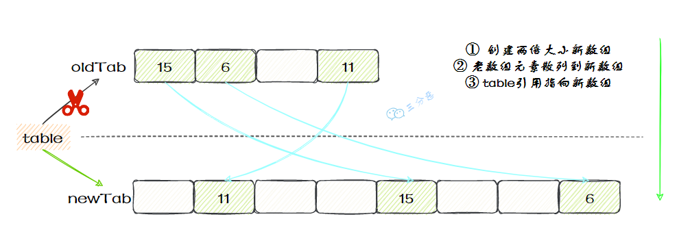

ThreadLocalMap扩容
具体代码：
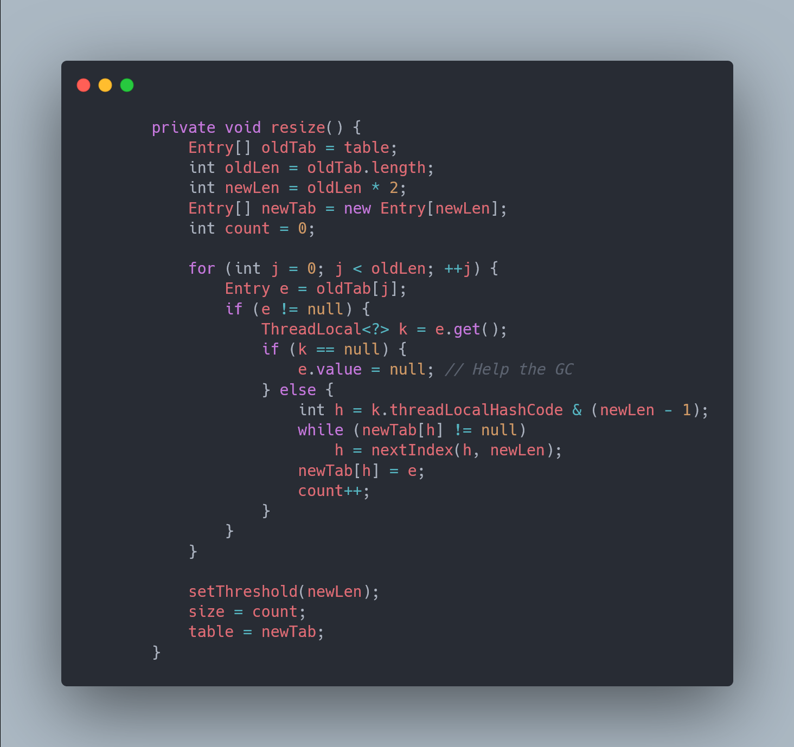

ThreadLocalMap resize
### [19.父子线程怎么共享数据？](https://javabetter.cn/sidebar/sanfene/javathread.html#_19-%E7%88%B6%E5%AD%90%E7%BA%BF%E7%A8%8B%E6%80%8E%E4%B9%88%E5%85%B1%E4%BA%AB%E6%95%B0%E6%8D%AE)
父线程能用 ThreadLocal 来给子线程传值吗？毫无疑问，不能。那该怎么办？
这时候可以用到另外一个类——`InheritableThreadLocal `。
使用起来很简单，在主线程的 InheritableThreadLocal 实例设置值，在子线程中就可以拿到了。

```java
public class InheritableThreadLocalTest {

    public static void main(String[] args) {
        final ThreadLocal threadLocal = new InheritableThreadLocal();
        // 主线程
        threadLocal.set("不擅技术");
        //子线程
        Thread t = new Thread() {
            @Override
            public void run() {
                super.run();
                System.out.println("鄙人三某 ，" + threadLocal.get());
            }
        };
        t.start();
    }
}
```
> 那原理是什么呢？

原理很简单，在 Thread 类里还有另外一个变量：

```java
ThreadLocal.ThreadLocalMap inheritableThreadLocals = null;
```
在 Thread.init 的时候，如果父线程的`inheritableThreadLocals`不为空，就把它赋给当前线程（子线程）的`inheritableThreadLocals `。

```java
if (inheritThreadLocals && parent.inheritableThreadLocals != null)
    this.inheritableThreadLocals =
        ThreadLocal.createInheritedMap(parent.inheritableThreadLocals);
```
GitHub 上标星 10000+ 的开源知识库《[二哥的 Java 进阶之路](https://github.com/itwanger/toBeBetterJavaer)》第一版 PDF 终于来了！包括 Java 基础语法、数组&字符串、OOP、集合框架、Java IO、异常处理、Java 新特性、网络编程、NIO、并发编程、JVM 等等，共计 32 万余字，500+张手绘图，可以说是通俗易懂、风趣幽默……详情戳：[太赞了，GitHub 上标星 10000+ 的 Java 教程](https://javabetter.cn/overview/)
微信搜 **沉默王二** 或扫描下方二维码关注二哥的原创公众号沉默王二，回复 **222** 即可免费领取。


### 常见场景题汇总

#### [场景1：ThreadLocal 内存泄漏真凶]
**问题描述**：
面试官问：ThreadLocal 的 Key 是弱引用（WeakReference），GC 的时候会被回收。那为什么还会说 ThreadLocal 会导致内存泄漏呢？

**解答**：
这是对 ThreadLocal 内存结构的经典误解。
*   **结构**：`Thread` -> `ThreadLocalMap` -> `Entry(Key, Value)`。
*   **泄漏路径**：
    1.  Key（ThreadLocal 对象）是弱引用，GC 时确实会被回收，导致 Key 变为 null。
    2.  但是 **Value**（业务对象）是强引用！
    3.  如果线程（Thread）一直不死（例如在线程池中），那么这条强引用链 `Thread -> Map -> Entry -> Value` 就会一直存在。
    4.  Key 没了，Value 还在，且无法访问（因为 Key 是 null），这就是内存泄漏。
*   **解决**：务必在 `finally` 块中调用 `threadLocal.remove()`。

#### [场景2：SimpleDateFormat 线程安全优化]
**问题描述**：
`SimpleDateFormat` 是非线程安全的。在 Web 应用中，如果每次请求都 `new SimpleDateFormat()` 会有性能损耗；如果定义为 `static` 共享又会报错。怎么解决？

**解答**：
使用 `ThreadLocal` 封装。
```java
private static final ThreadLocal<SimpleDateFormat> dateFormatHolder = 
    ThreadLocal.withInitial(() -> new SimpleDateFormat("yyyy-MM-dd"));

public void formatTime(Date date) {
    // 每个线程获取自己的 SimpleDateFormat 副本，互不干扰
    String str = dateFormatHolder.get().format(date);
}
```
这样既避免了频繁创建对象的开销，又保证了线程安全。
（注：JDK 8+ 推荐使用 `DateTimeFormatter`，它是线程安全的，无需 ThreadLocal）。

#### [场景3：Spring 事务管理的魔法]
**问题描述**：
在 Spring 中，我们在 Service 层开启事务 (`@Transactional`)，然后调用多个 DAO 层方法。这些 DAO 方法并没有手动传递 `Connection` 参数，为什么它们能使用同一个数据库连接，从而保证在同一个事务中？

**解答**：
Spring 使用了 **ThreadLocal**。
*   在事务开始时，Spring 获取一个数据库连接，并将其绑定到当前线程的 `ThreadLocal` map 中（通过 `TransactionSynchronizationManager`）。
*   后续的 DAO 方法执行时，会先去这个 `ThreadLocal` 中查找是否有已绑定的连接。
*   如果有，就直接使用，不再创建新连接。
这就是“连接绑定”机制，确保了同一线程内的多个操作共享同一个物理事务。

#### [场景4：全链路追踪（TraceId）]
**问题描述**：
在微服务架构中，如何让一个请求的 TraceId 贯穿整个服务内部的所有日志（包括 Controller、Service、Dao）？

**解答**：
1.  **入口拦截**：在拦截器（Interceptor/Filter）中，从请求头解析 TraceId。
2.  **存储**：存入 `MDC` (Mapped Diagnostic Context) 或自定义的 `ThreadLocal`。
3.  **日志打印**：Log4j/Logback 会自动从 MDC 中取出 TraceId 打印到每一行日志中。
4.  **出口清理**：请求结束时，在拦截器的 `afterCompletion` 中调用 `MDC.clear()` 或 `remove()`, 防止内存泄漏和数据污染。
