## [并发工具类](https://javabetter.cn/sidebar/sanfene/javathread.html#%E5%B9%B6%E5%8F%91%E5%B7%A5%E5%85%B7%E7%B1%BB)
### [43.CountDownLatch（倒计数器）了解吗？](https://javabetter.cn/sidebar/sanfene/javathread.html#_43-countdownlatch-%E5%80%92%E8%AE%A1%E6%95%B0%E5%99%A8-%E4%BA%86%E8%A7%A3%E5%90%97)
推荐阅读：[Java 并发编程通信工具类 Semaphore、Exchanger、CountDownLatch、CyclicBarrier、Phaser 等一网打尽](https://javabetter.cn/thread/CountDownLatch.html)
CountDownLatch 是 JUC 包中的一个同步工具类，用于协调多个线程之间的同步。它允许一个或多个线程等待，直到其他线程中执行的一组操作完成。它通过一个计数器来实现，该计数器由线程递减，直到到达零。

- 初始化：创建 CountDownLatch 对象时，指定计数器的初始值。
- 等待（await）：一个或多个线程调用 await 方法，进入等待状态，直到计数器的值变为零。
- 倒计数（countDown）：其他线程在完成各自任务后调用 countDown 方法，将计数器的值减一。当计数器的值减到零时，所有在 await 上等待的线程会被唤醒，继续执行。当等待多个线程完成各自的启动任务后再启动主线程的任务，就可以使用 CountDownLatch，以王者荣耀为例。
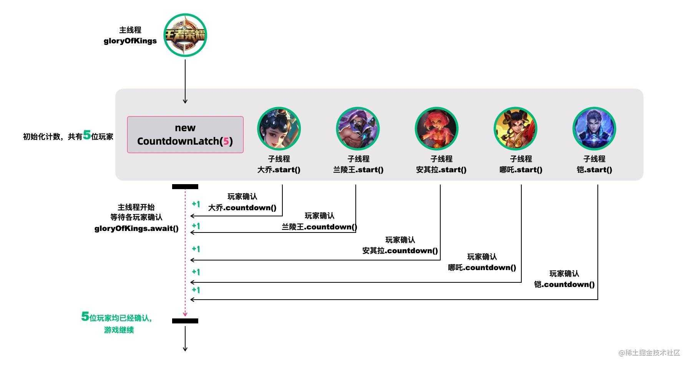

秦二爷：王者荣耀等待玩家确认
创建五个线程，分别代表大乔、兰陵王、安其拉、哪吒和铠等五个玩家。每个玩家都调用了`countDown()`方法，表示已经就位。主线程调用`await()`方法，等待所有玩家就位。

```java
public static void main(String[] args) throws InterruptedException {
    CountDownLatch countDownLatch = new CountDownLatch(5);

    Thread daqiao = new Thread(() -> {
        System.out.println("大乔已就位！");
        countDownLatch.countDown();
    });
    Thread lanlingwang = new Thread(() -> {
        System.out.println("兰陵王已就位！");
        countDownLatch.countDown();
    });
    Thread anqila = new Thread(() -> {
        System.out.println("安其拉已就位！");
        countDownLatch.countDown();
    });
    Thread nezha = new Thread(() -> {
        System.out.println("哪吒已就位！");
        countDownLatch.countDown();
    });
    Thread kai = new Thread(() -> {
        System.out.println("铠已就位！");
        countDownLatch.countDown();
    });

    daqiao.start();
    lanlingwang.start();
    anqila.start();
    nezha.start();
    kai.start();

    countDownLatch.await();
    System.out.println("全员就位，开始游戏！");
}
```
再比如说，可以使用 CountDownLatch 确保某些操作在一组操作完成之后才开始执行。


秦二爷：王者荣耀大家一起出生
五个玩家在等待倒计时结束后，一起出击。

```java
private static void waitToFight(CountDownLatch countDownLatch, String name) {
    try {
        countDownLatch.await(); // 在此等待信号再继续
        System.out.println(name + " 收到，发起进攻！");
    } catch (InterruptedException e) {
        Thread.currentThread().interrupt();
        System.out.println(name + " 被中断");
    }
}

public static void main(String[] args) {
    CountDownLatch countDownLatch = new CountDownLatch(1);

    Thread daqiao = new Thread(() -> waitToFight(countDownLatch, "大乔"), "Thread-大乔");
    Thread lanlingwang = new Thread(() -> waitToFight(countDownLatch, "兰陵王"), "Thread-兰陵王");
    Thread anqila = new Thread(() -> waitToFight(countDownLatch, "安琪拉"), "Thread-安琪拉");
    Thread nezha = new Thread(() -> waitToFight(countDownLatch, "哪吒"), "Thread-哪吒");
    Thread kai = new Thread(() -> waitToFight(countDownLatch, "凯"), "Thread-凯");

    daqiao.start();
    lanlingwang.start();
    anqila.start();
    nezha.start();
    kai.start();

    try {
        Thread.sleep(5000); // 模拟准备时间
    } catch (InterruptedException e) {
        Thread.currentThread().interrupt();
        System.out.println("主线程被中断");
    }

    System.out.println("敌军还有 5 秒到达战场，全军出击！");
    countDownLatch.countDown(); // 发出信号
}
```
CountDownLatch 的**核心方法**也不多：

- `CountDownLatch(int count)`：创建一个带有给定计数器的 CountDownLatch。
- `void await()`：阻塞当前线程，直到计数器为零。
- `void countDown()`：递减计数器的值，如果计数器值变为零，则释放所有等待的线程。#### [场景题：假如要查10万多条数据，用线程池分成20个线程去执行，怎么做到等所有的线程都查找完之后，即最后一条结果查找结束了，才输出结果？](https://javabetter.cn/sidebar/sanfene/javathread.html#%E5%9C%BA%E6%99%AF%E9%A2%98-%E5%81%87%E5%A6%82%E8%A6%81%E6%9F%A510%E4%B8%87%E5%A4%9A%E6%9D%A1%E6%95%B0%E6%8D%AE-%E7%94%A8%E7%BA%BF%E7%A8%8B%E6%B1%A0%E5%88%86%E6%88%9020%E4%B8%AA%E7%BA%BF%E7%A8%8B%E5%8E%BB%E6%89%A7%E8%A1%8C-%E6%80%8E%E4%B9%88%E5%81%9A%E5%88%B0%E7%AD%89%E6%89%80%E6%9C%89%E7%9A%84%E7%BA%BF%E7%A8%8B%E9%83%BD%E6%9F%A5%E6%89%BE%E5%AE%8C%E4%B9%8B%E5%90%8E-%E5%8D%B3%E6%9C%80%E5%90%8E%E4%B8%80%E6%9D%A1%E7%BB%93%E6%9E%9C%E6%9F%A5%E6%89%BE%E7%BB%93%E6%9D%9F%E4%BA%86-%E6%89%8D%E8%BE%93%E5%87%BA%E7%BB%93%E6%9E%9C)
为每个线程创建一个任务，使用 CountDownLatch 计数器控制线程同步。
每个线程任务完成后调用 `countDown()`，主线程使用 `await()` 等待所有线程完成。

```java
class DataQueryExample {

    public static void main(String[] args) throws InterruptedException {
        // 模拟10万条数据
        int totalRecords = 100000;
        int threadCount = 20;
        int batchSize = totalRecords / threadCount; // 每个线程处理的数据量

        // 创建线程池
        ExecutorService executor = Executors.newFixedThreadPool(threadCount);
        CountDownLatch latch = new CountDownLatch(threadCount);

        // 模拟查询结果
        ConcurrentLinkedQueue<String> results = new ConcurrentLinkedQueue<>();

        for (int i = 0; i < threadCount; i++) {
            int start = i * batchSize;
            int end = (i == threadCount - 1) ? totalRecords : (start + batchSize);
            
            executor.execute(() -> {
                try {
                    // 模拟查询操作
                    for (int j = start; j < end; j++) {
                        results.add("Data-" + j);
                    }
                    System.out.println(Thread.currentThread().getName() + " 处理数据 " + start + " - " + end);
                } finally {
                    latch.countDown(); // 线程任务完成，计数器减1
                }
            });
        }

        // 等待所有线程完成
        latch.await();
        executor.shutdown();

        // 输出结果
        System.out.println("所有线程执行完毕，查询结果总数：" + results.size());
    }
}
```
> 
1. [Java 面试指南（付费）](https://javabetter.cn/zhishixingqiu/mianshi.html)收录的顺丰科技同学 1 面试原题：并发编程 CountDownLatch 和消息队列
### [44.CyclicBarrier（同步屏障）了解吗？](https://javabetter.cn/sidebar/sanfene/javathread.html#_44-cyclicbarrier-%E5%90%8C%E6%AD%A5%E5%B1%8F%E9%9A%9C-%E4%BA%86%E8%A7%A3%E5%90%97)
CyclicBarrier 的字面意思是可循环使用（Cyclic）的屏障（Barrier）。它要做的事情是，让一 组线程到达一个屏障（也可以叫同步点）时被阻塞，直到最后一个线程到达屏障时，屏障才会开门，所有被屏障拦截的线程才会继续运行。
它和 CountDownLatch 类似，都可以协调多线程的结束动作，在它们结束后都可以执行特定动作，但是为什么要有 CyclicBarrier，自然是它有和 CountDownLatch 不同的地方。
不知道你听没听过一个新人 UP 主小约翰可汗，小约翰生平有两大恨——“想结衣结衣不依,迷爱理爱理不理。”我们来还原一下事情的经过：小约翰在亲政后认识了新垣结衣，于是决定第一次选妃，向结衣表白，等待回应。然而新垣结衣回应嫁给了星野源，小约翰伤心欲绝，发誓生平不娶，突然发现了铃木爱理，于是小约翰决定第二次选妃，求爱理搭理，等待回应。
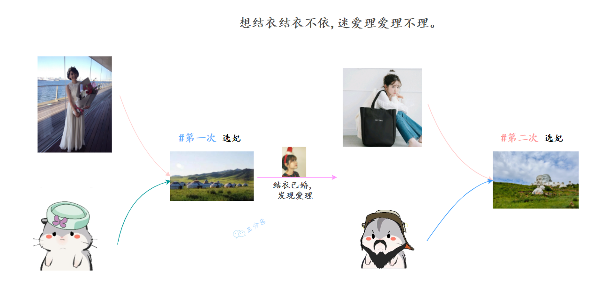

想结衣结衣不依,迷爱理爱理不理。
我们拿代码模拟这一场景，发现 CountDownLatch 无能为力了，因为 CountDownLatch 的使用是一次性的，无法重复利用，而这里等待了两次。此时，我们用 CyclicBarrier 就可以实现，因为它可以重复利用。
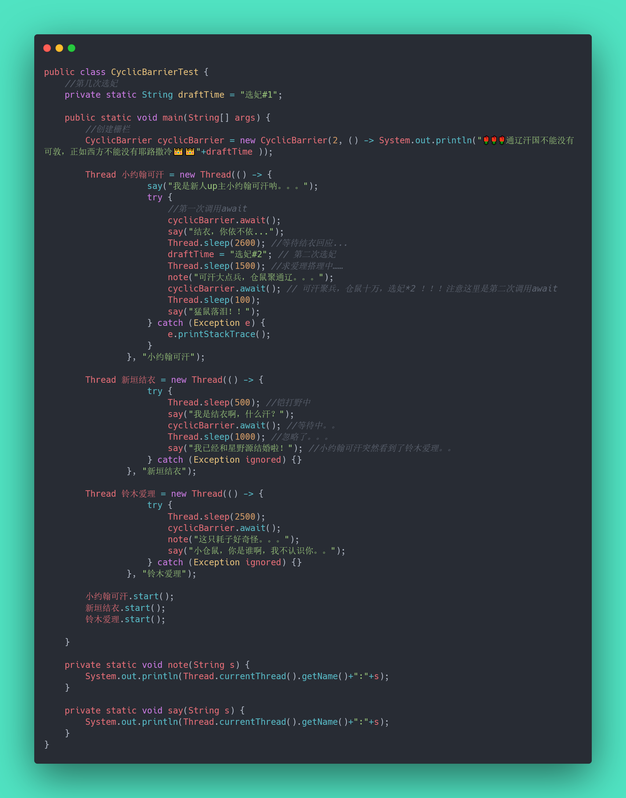

小约翰可汗选妃模拟代码
运行结果：
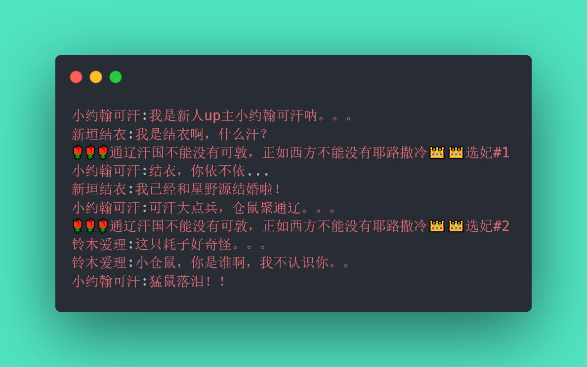

运行结果
CyclicBarrier 最最核心的方法，仍然是 await()：

- 如果当前线程不是第一个到达屏障的话，它将会进入等待，直到其他线程都到达，除非发生**被中断**、**屏障被拆除**、**屏障被重设**等情况；上面的例子抽象一下，本质上它的流程就是这样就是这样：
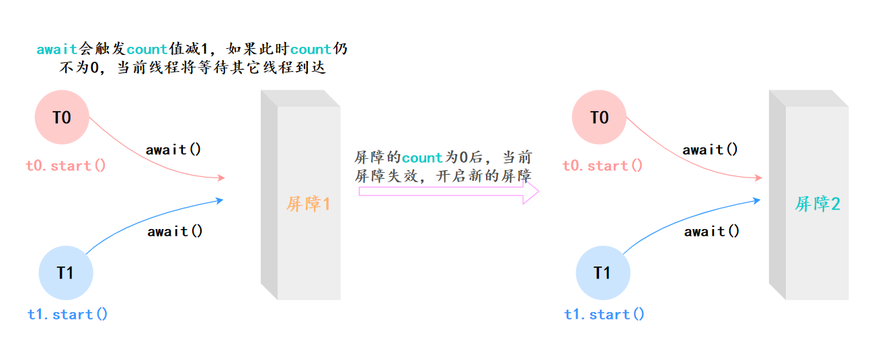

CyclicBarrier工作流程
### [45.CyclicBarrier 和 CountDownLatch 有什么区别？](https://javabetter.cn/sidebar/sanfene/javathread.html#_45-cyclicbarrier-%E5%92%8C-countdownlatch-%E6%9C%89%E4%BB%80%E4%B9%88%E5%8C%BA%E5%88%AB)
两者最核心的区别[18]：

- CountDownLatch 是一次性的，而 CyclicBarrier 则可以多次设置屏障，实现重复利用；
- CountDownLatch 中的各个子线程不可以等待其他线程，只能完成自己的任务；而 CyclicBarrier 中的各个线程可以等待其他线程它们区别用一个表格整理：
 | CyclicBarrier | CountDownLatch | 
|---|---|
 | CyclicBarrier 是可重用的，其中的线程会等待所有的线程完成任务。届时，屏障将被拆除，并可以选择性地做一些特定的动作。 | CountDownLatch 是一次性的，不同的线程在同一个计数器上工作，直到计数器为 0. | 
 | CyclicBarrier 面向的是线程数 | CountDownLatch 面向的是任务数 | 
 | 在使用 CyclicBarrier 时，你必须在构造中指定参与协作的线程数，这些线程必须调用 await()方法 | 使用 CountDownLatch 时，则必须要指定任务数，至于这些任务由哪些线程完成无关紧要 | 
 | CyclicBarrier 可以在所有的线程释放后重新使用 | CountDownLatch 在计数器为 0 时不能再使用 | 
 | 在 CyclicBarrier 中，如果某个线程遇到了中断、超时等问题时，则处于 await 的线程都会出现问题 | 在 CountDownLatch 中，如果某个线程出现问题，其他线程不受影响 | 
### [46.Semaphore（信号量）了解吗？](https://javabetter.cn/sidebar/sanfene/javathread.html#_46-semaphore-%E4%BF%A1%E5%8F%B7%E9%87%8F-%E4%BA%86%E8%A7%A3%E5%90%97)
Semaphore（信号量）是用来控制同时访问特定资源的线程数量，它通过协调各个线程，以保证合理的使用公共资源。
听起来似乎很抽象，现在汽车多了，开车出门在外的一个老大难问题就是停车 。停车场的车位是有限的，只能允许若干车辆停泊，如果停车场还有空位，那么显示牌显示的就是绿灯和剩余的车位，车辆就可以驶入；如果停车场没位了，那么显示牌显示的就是绿灯和数字 0，车辆就得等待。如果满了的停车场有车离开，那么显示牌就又变绿，显示空车位数量，等待的车辆就能进停车场。


停车场空闲车位提示-图片来源网络
我们把这个例子类比一下，车辆就是线程，进入停车场就是线程在执行，离开停车场就是线程执行完毕，看见红灯就表示线程被阻塞，不能执行，Semaphore 的本质就是**协调多个线程对共享资源的获取**。
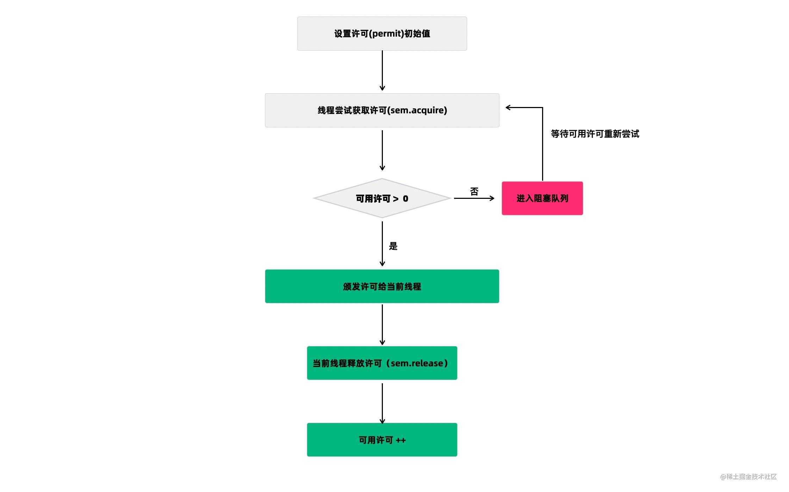

Semaphore许可获取-来源参考[18]
我们再来看一个 Semaphore 的用途：它可以用于做流量控制，特别是公用资源有限的应用场景，比如数据库连接。
假如有一个需求，要读取几万个文件的数据，因为都是 IO 密集型任务，我们可以启动几十个线程并发地读取，但是如果读到内存后，还需要存储到数据库中，而数据库的连接数只有 10 个，这时我们必须控制只有 10 个线程同时获取数据库连接保存数据，否则会报错无法获取数据库连接。这个时候，就可以使用 Semaphore 来做流量控制，如下：

```java
public class SemaphoreTest {
    private static final int THREAD_COUNT = 30;
    private static ExecutorService threadPool = Executors.newFixedThreadPool(THREAD_COUNT);
    private static Semaphore s = new Semaphore(10);

    public static void main(String[] args) {
        for (int i = 0; i < THREAD_COUNT; i++) {
            threadPool.execute(new Runnable() {
                @Override
                public void run() {
                    try {
                        s.acquire();
                        System.out.println("save data");
                        s.release();
                    } catch (InterruptedException e) {
                    }
                }
            });
        }
        threadPool.shutdown();
    }
}
```
在代码中，虽然有 30 个线程在执行，但是只允许 10 个并发执行。Semaphore 的构造方法` Semaphore（int permits`）接受一个整型的数字，表示可用的许可证数量。`Semaphore（10）`表示允许 10 个线程获取许可证，也就是最大并发数是 10。Semaphore 的用法也很简单，首先线程使用 Semaphore 的 acquire()方法获取一个许可证，使用完之后调用 release()方法归还许可证。还可以用 tryAcquire()方法尝试获取许可证。
### [47.Exchanger 了解吗？](https://javabetter.cn/sidebar/sanfene/javathread.html#_47-exchanger-%E4%BA%86%E8%A7%A3%E5%90%97)
Exchanger（交换者）是一个用于线程间协作的工具类。Exchanger 用于进行线程间的数据交换。它提供一个同步点，在这个同步点，两个线程可以交换彼此的数据。


英雄交换猎物-来源参考[18]
这两个线程通过 exchange 方法交换数据，如果第一个线程先执行 exchange()方法，它会一直等待第二个线程也执行 exchange 方法，当两个线程都到达同步点时，这两个线程就可以交换数据，将本线程生产出来的数据传递给对方。
Exchanger 可以用于遗传算法，遗传算法里需要选出两个人作为交配对象，这时候会交换两人的数据，并使用交叉规则得出 2 个交配结果。Exchanger 也可以用于校对工作，比如我们需要将纸制银行流水通过人工的方式录入成电子银行流水，为了避免错误，采用 AB 岗两人进行录入，录入到 Excel 之后，系统需要加载这两个 Excel，并对两个 Excel 数据进行校对，看看是否录入一致。

```java
public class ExchangerTest {
    private static final Exchanger<String> exgr = new Exchanger<String>();
    private static ExecutorService threadPool = Executors.newFixedThreadPool(2);

    public static void main(String[] args) {
        threadPool.execute(new Runnable() {
            @Override
            public void run() {
                try {
                    String A = "银行流水A"; // A录入银行流水数据
                    exgr.exchange(A);
                } catch (InterruptedException e) {
                }
            }
        });
        threadPool.execute(new Runnable() {
            @Override
            public void run() {
                try {
                    String B = "银行流水B"; // B录入银行流水数据
                    String A = exgr.exchange("B");
                    System.out.println("A和B数据是否一致：" + A.equals(B) + "，A录入的是："
                            + A + "，B录入是：" + B);
                } catch (InterruptedException e) {
                }
            }
        });
        threadPool.shutdown();
    }
}
```
假如两个线程有一个没有执行 exchange()方法，则会一直等待，如果担心有特殊情况发生，避免一直等待，可以使用`exchange(V x, long timeOut, TimeUnit unit) `设置最大等待时长。
### [48.能说一下 ConcurrentHashMap 的实现吗？（补充）](https://javabetter.cn/sidebar/sanfene/javathread.html#_48-%E8%83%BD%E8%AF%B4%E4%B8%80%E4%B8%8B-concurrenthashmap-%E7%9A%84%E5%AE%9E%E7%8E%B0%E5%90%97-%E8%A1%A5%E5%85%85)
> 2024 年 03 月 25 日增补，从集合框架篇移动到这里。

[ConcurrentHashMap](https://javabetter.cn/thread/ConcurrentHashMap.html) 是 HashMap 的线程安全版本。
在 JDK 7 时采用的是分段锁机制（Segment Locking），整个 Map 被分为若干段，每个段都可以独立地加锁。因此，不同的线程可以同时操作不同的段，从而实现并发访问。
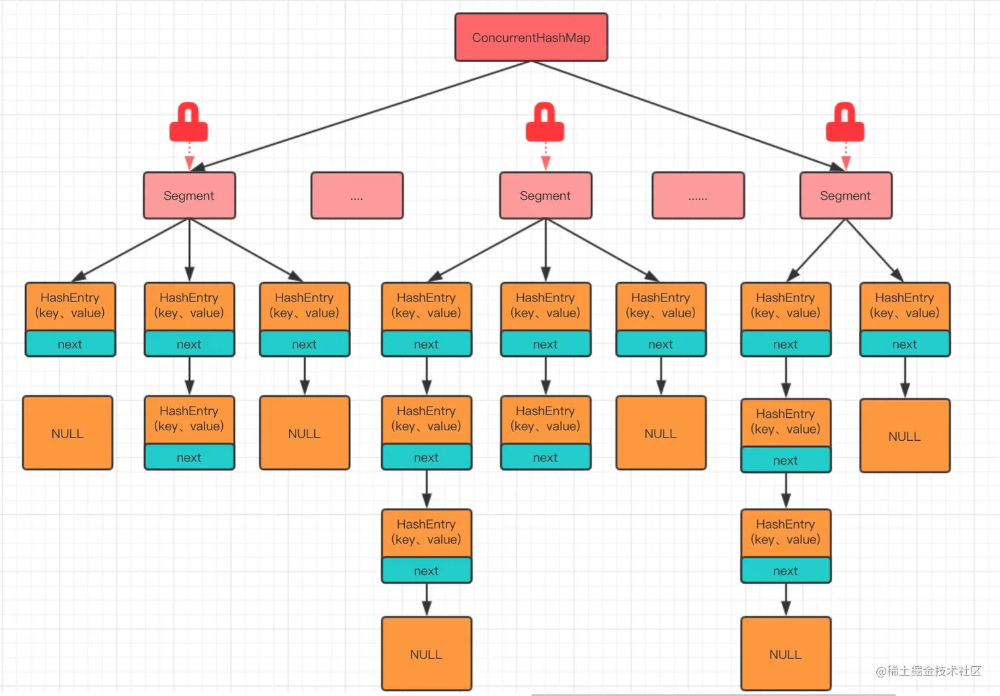

初念初恋：JDK 7 ConcurrentHashMap
在 JDK 8 及以上版本中，ConcurrentHashMap 的实现进行了优化，不再使用分段锁，而是使用了一种更加精细化的锁——桶锁，以及 CAS 无锁算法。每个桶（Node 数组的每个元素）都可以独立地加锁，从而实现更高级别的并发访问。


初念初恋：JDK 8 ConcurrentHashMap
对于读操作，通常不需要加锁，可以直接读取，ConcurrentHashMap 内部使用了 volatile 变量来保证内存可见性。
对于写操作，ConcurrentHashMap 使用 CAS 操作来实现无锁的更新，这是一种乐观锁的实现，因为它假设没有冲突发生，在实际更新数据时才检查是否有其他线程在尝试修改数据，如果有，采用悲观的锁策略，如 synchronized 代码块来保证数据的一致性。
#### [说一下 JDK 7 中的 ConcurrentHashMap 的实现原理？](https://javabetter.cn/sidebar/sanfene/javathread.html#%E8%AF%B4%E4%B8%80%E4%B8%8B-jdk-7-%E4%B8%AD%E7%9A%84-concurrenthashmap-%E7%9A%84%E5%AE%9E%E7%8E%B0%E5%8E%9F%E7%90%86)
JDK 7 的 ConcurrentHashMap 是由 Segment 数组结构和 HashEntry 数组构成的。Segment 是一种可重入的锁 [ReentrantLock](https://javabetter.cn/thread/reentrantLock.html)，HashEntry 则用于存储键值对数据。
一个 ConcurrentHashMap 里包含一个 Segment 数组，Segment 的结构和 HashMap 类似，是一种数组和链表结构，一个 Segment 里包含一个 HashEntry 数组，每个 HashEntry 是一个链表结构的元素，每个 Segment 守护着一个 HashEntry 数组里的元素，当对 HashEntry 数组的数据进行修改时，必须首先获得它对应的 Segment 锁。


三分恶面渣逆袭：ConcurrentHashMap示意图
**①、put 流程**
ConcurrentHashMap 的 put 流程和 HashMap 非常类似，只不过是先定位到具体的 Segment，然后通过 ReentrantLock 去操作而已。

1. 计算 hash，定位到 segment，segment 如果是空就先初始化；
2. 使用 ReentrantLock 加锁，如果获取锁失败则尝试自旋，自旋超过次数就阻塞获取，保证一定能获取到锁；
3. 遍历 HashEntry，key 相同就直接替换，不存在就插入。
4. 释放锁。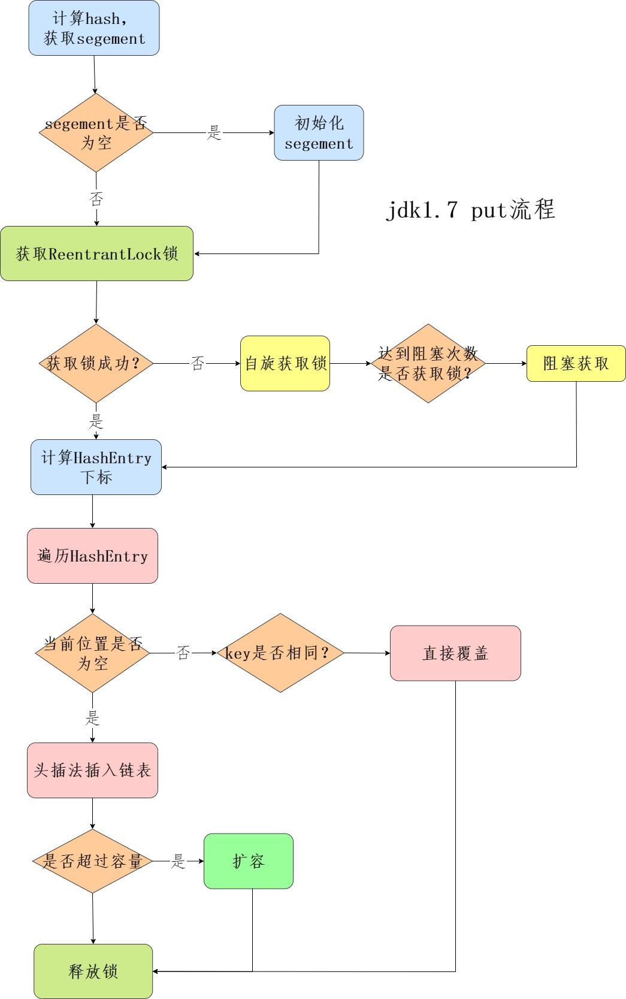

三分恶面渣逆袭：JDK7 put 流程
**②、get 流程**
get 也很简单，通过 `hash(key)` 定位到 segment，再遍历链表定位到具体的元素上，需要注意的是 value 是 [volatile 的](https://javabetter.cn/thread/volatile.html)，所以 get 是不需要加锁的。
#### [说一下 JDK 8 中的 ConcurrentHashMap 的实现原理？](https://javabetter.cn/sidebar/sanfene/javathread.html#%E8%AF%B4%E4%B8%80%E4%B8%8B-jdk-8-%E4%B8%AD%E7%9A%84-concurrenthashmap-%E7%9A%84%E5%AE%9E%E7%8E%B0%E5%8E%9F%E7%90%86)
JDK 8 中的 ConcurrentHashMap 取消了 Segment 分段锁，采用 CAS + synchronized 来保证并发安全性，整个容器只分为一个 Segment，即 table 数组。
Node 和 JDK 7 一样，使用 volatile 关键字，保证多线程操作时，变量的可见性。
ConcurrentHashMap 实现线程安全的关键点在于 put 流程。
**①、put 流程**
> 一句话：通过计算键的哈希值确定存储位置，如果桶为空，使用 CAS 插入节点；如果存在冲突，通过链表或红黑树插入。在冲突时，如果 CAS 操作失败，会退化为 synchronized 操作。写操作可能触发扩容或链表转为红黑树。

第一步，计算 hash，遍历 node 数组，如果 node 是空的话，就通过 CAS+自旋的方式初始化。

```java
// 准备初始化
tab = initTable();
// 具体实现
private final Node<K,V>[] initTable() {
    Node<K,V>[] tab; int sc;
    while ((tab = table) == null || tab.length == 0) {
        //如果正在初始化或者扩容
        if ((sc = sizeCtl) < 0)
            //等待
            Thread.yield(); // lost initialization race; just spin
        else if (U.compareAndSwapInt(this, SIZECTL, sc, -1)) {   //CAS操作
            try {
                if ((tab = table) == null || tab.length == 0) {
                    int n = (sc > 0) ? sc : DEFAULT_CAPACITY;
                    @SuppressWarnings("unchecked")
                    Node<K,V>[] nt = (Node<K,V>[])new Node<?,?>[n];
                    table = tab = nt;
                    sc = n - (n >>> 2);
                }
            } finally {
                sizeCtl = sc;
            }
            break;
        }
    }
    return tab;
}
```
第二步，如果当前数组位置是空，直接通过 CAS 自旋写入数据。

```java
static final <K,V> boolean casTabAt(Node<K,V>[] tab, int i,
                                    Node<K,V> c, Node<K,V> v) {
    return U.compareAndSwapObject(tab, ((long)i << ASHIFT) + ABASE, c, v);
}
```
第三步，如果 `hash==MOVED`，说明需要扩容。

```java
else if ((fh = f.hash) == MOVED)
    tab = helpTransfer(tab, f);
```
扩容的具体实现：

```java
final Node<K,V>[] helpTransfer(Node<K,V>[] tab, Node<K,V> f) {
    Node<K,V>[] nextTab; // 下一个表的引用，即新的扩容后的数组
    int sc; // 用于缓存sizeCtl的值
    // 检查条件：传入的表不为空，节点f是ForwardingNode类型，且f中的nextTable不为空
    if (tab != null && (f instanceof ForwardingNode) &&
        (nextTab = ((ForwardingNode<K,V>)f).nextTable) != null) {
        int rs = resizeStamp(tab.length); // 根据当前表长度计算resize stamp
        // 检查循环条件：nextTab等于nextTable，table等于传入的tab，且sizeCtl为负数（表示正在进行或准备进行扩容）
        while (nextTab == nextTable && table == tab &&
               (sc = sizeCtl) < 0) {
            // 检查是否应该停止扩容（比如：resize stamp不匹配，或者已达到最大并发扩容线程数，或者transferIndex已经不大于0）
            if ((sc >>> RESIZE_STAMP_SHIFT) != rs || sc == rs + 1 ||
                sc == rs + MAX_RESIZERS || transferIndex <= 0)
                break;
            // 尝试通过CAS增加sizeCtl的值，以表示有更多线程参与扩容
            if (U.compareAndSwapInt(this, SIZECTL, sc, sc + 1)) {
                transfer(tab, nextTab); // 调用transfer方法，实际进行数据迁移
                break;
            }
        }
        return nextTab; // 返回新的表引用
    }
    return table; // 如果不符合扩容协助条件，返回当前表引用
}
```
第四步，如果都不满足，就使用 synchronized 写入数据，和 HashMap 一样，key 的 hash 一样就覆盖，反之使用拉链法解决哈希冲突，当链表长度超过 8 就转换成红黑树。
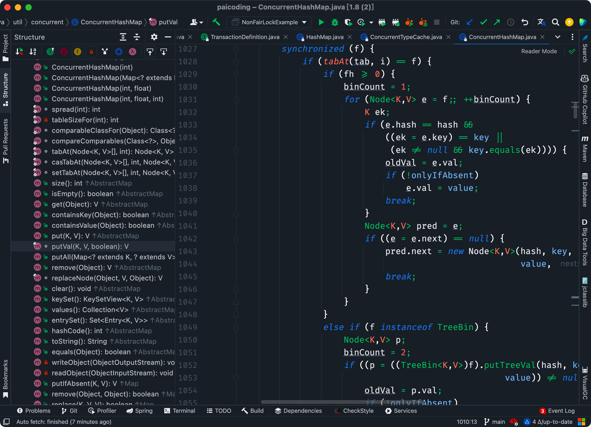

二哥的 Java 进阶之路：put 源码
ConcurrentHashmap JDK 8 put 流程图：
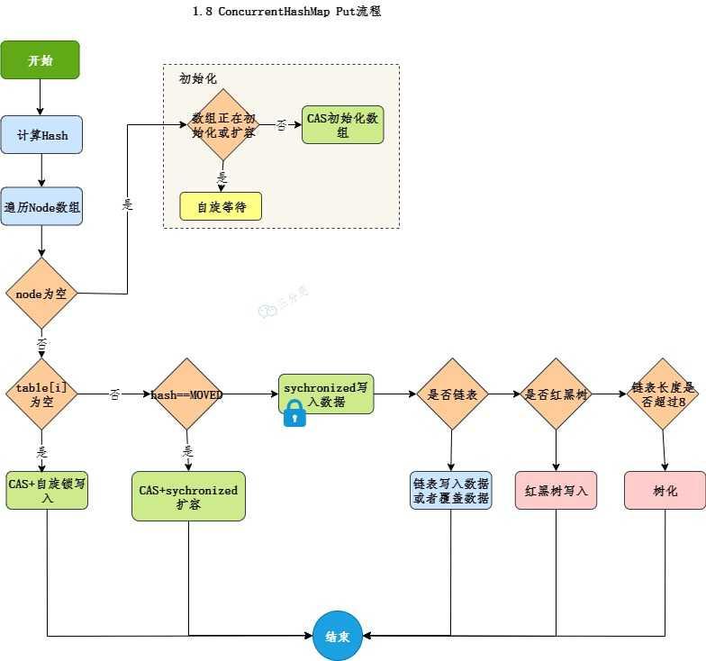

三分恶面渣逆袭：Java 8 put 流程
**②、get 查询**
> 通过计算哈希值快速定位桶，在桶中查找目标节点，多个 key 值时链表遍历和红黑树查找。读操作是无锁的，依赖 volatile 保证线程可见性。

get 查询的时候，也是通过 key 的 hash 进行定位，需要注意的是 ConcurrentHashMap 会判断 hash 值是否小于 0。
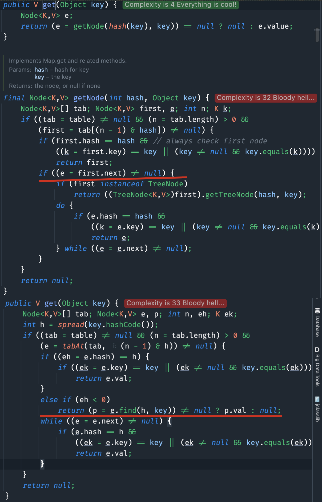

二哥的 Java 进阶之路：HashMap 和 ConcurrentHashMap 的 get 方法
如果小于 0，说明是个特殊节点，会调用节点的 find 方法进行查找，比如说 ForwardingNode 的 find 方法或者 TreeNode 的 find 方法。
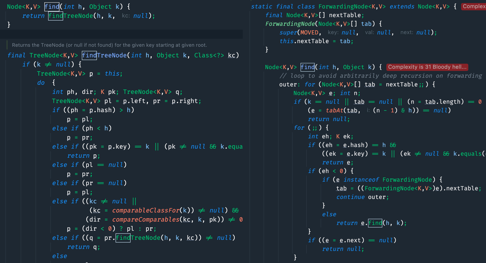

ForwardingNode和TreeNode的 find 方法
#### [总结一下 HashMap 和 ConcurrentHashMap 的区别？](https://javabetter.cn/sidebar/sanfene/javathread.html#%E6%80%BB%E7%BB%93%E4%B8%80%E4%B8%8B-hashmap-%E5%92%8C-concurrenthashmap-%E7%9A%84%E5%8C%BA%E5%88%AB)
①、HashMap 是非线程安全的，多线程环境下应该使用 ConcurrentHashMap。
②、由于 HashMap 仅在单线程环境下使用，所以不需要考虑同步问题，因此效率高于 ConcurrentHashMap。
#### [你项目中怎么使用 ConcurrentHashMap 的？](https://javabetter.cn/sidebar/sanfene/javathread.html#%E4%BD%A0%E9%A1%B9%E7%9B%AE%E4%B8%AD%E6%80%8E%E4%B9%88%E4%BD%BF%E7%94%A8-concurrenthashmap-%E7%9A%84)
在[技术派实战项目](https://javabetter.cn/zhishixingqiu/paicoding.html)中，很多地方都用到了 ConcurrentHashMap，比如说在异步工具类 AsyncUtil 中，使用 ConcurrentHashMap 来存储任务的名称和它们的运行时间，以便观察和分析任务的执行情况。
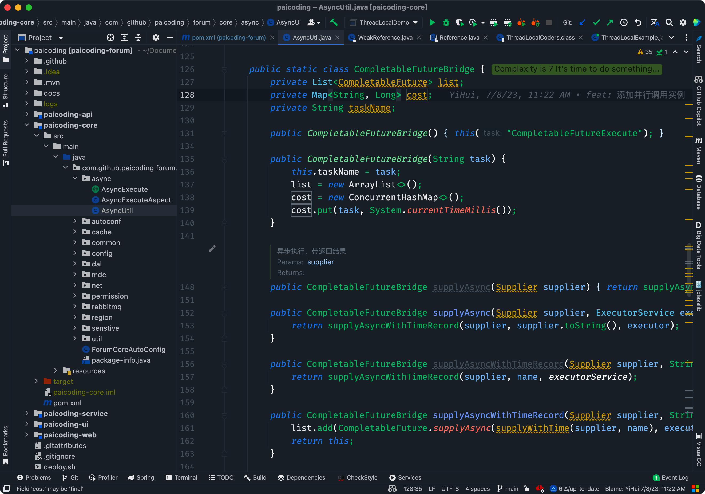

二哥的 Java 进阶之路
#### [ConcurrentHashMap 对 HashMap 的优化？](https://javabetter.cn/sidebar/sanfene/javathread.html#concurrenthashmap-%E5%AF%B9-hashmap-%E7%9A%84%E4%BC%98%E5%8C%96)
ConcurrentHashMap 是 HashMap 的线程安全版本，使用了 CAS、synchronized、volatile 来确保线程安全。
首先是 hash 的计算方法上，ConcurrentHashMap 的 spread 方法接收一个已经计算好的 hashCode，然后将这个哈希码的高 16 位与自身进行异或运算，这里的 HASH_BITS 是一个常数，值为 0x7fffffff，它确保结果是一个非负整数。

```java
static final int spread(int h) {
    return (h ^ (h >>> 16)) & HASH_BITS;
}
```
比 HashMap 的 hash 计算多了一个 `& HASH_BITS` 的操作。

```java
static final int hash(Object key) {
    int h;
    return (key == null) ? 0 : (h = key.hashCode()) ^ (h >>> 16);
}
```
另外，ConcurrentHashMap 对节点 Node 做了进一步的封装，比如说用 Forwarding Node 来表示正在进行扩容的节点。

```java
static final class ForwardingNode<K,V> extends Node<K,V> {
    final Node<K,V>[] nextTable;
    ForwardingNode(Node<K,V>[] tab) {
        super(MOVED, null, null, null);
        this.nextTable = tab;
    }
}
```
最后就是 put 方法，通过 CAS + synchronized 来保证线程安全。
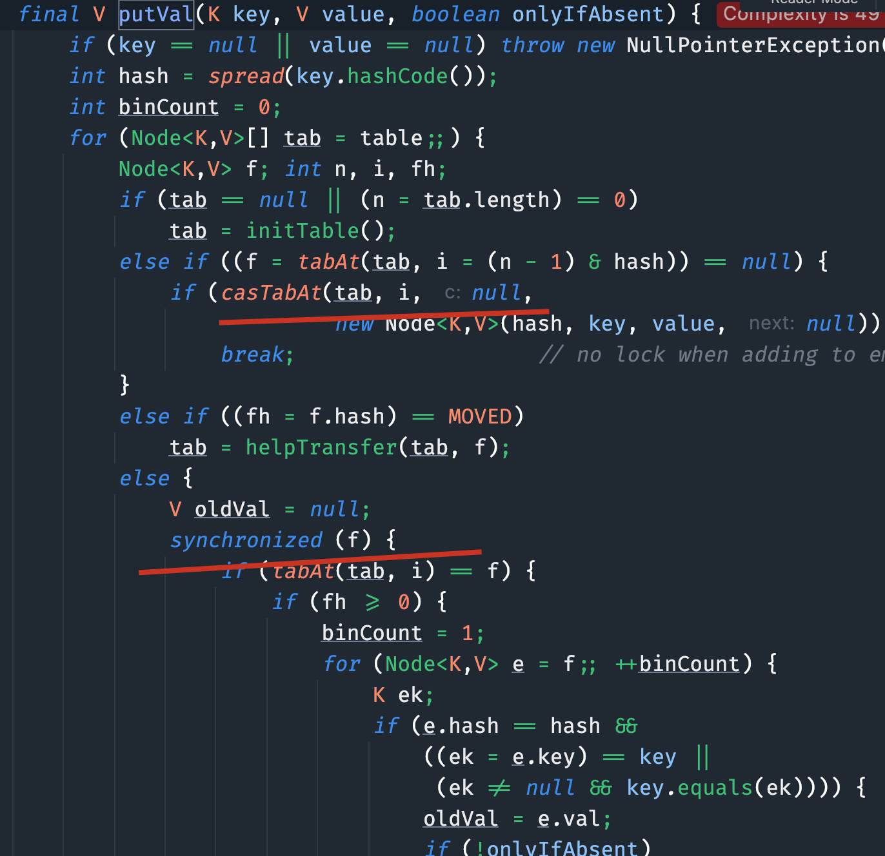

二哥的 Java 进阶之路：ConcurrentHashMap 的源码
#### [为什么 ConcurrentHashMap 在 JDK 1.7 中要用 ReentrantLock，而在 JDK 1.8 要用 synchronized](https://javabetter.cn/sidebar/sanfene/javathread.html#%E4%B8%BA%E4%BB%80%E4%B9%88-concurrenthashmap-%E5%9C%A8-jdk-1-7-%E4%B8%AD%E8%A6%81%E7%94%A8-reentrantlock-%E8%80%8C%E5%9C%A8-jdk-1-8-%E8%A6%81%E7%94%A8-synchronized)
ConcurrentHashMap 在 JDK 1.7 和 JDK 1.8 中的实现机制不同，主要体现在锁的机制上。
JDK 1.7 中的 ConcurrentHashMap 使用了分段锁机制，即 Segment 锁，每个 Segment 都是一个 ReentrantLock，这样可以保证每个 Segment 都可以独立地加锁，从而实现更高级别的并发访问。
而在 JDK 1.8 中，ConcurrentHashMap 取消了 Segment 分段锁，采用了更加精细化的锁——桶锁，以及 CAS 无锁算法，每个桶（Node 数组的每个元素）都可以独立地加锁，从而实现更高级别的并发访问。
再加上 JVM 对 synchronized 做了大量优化，如锁消除、锁粗化、自旋锁和偏向锁等，在低中等的竞争情况下，synchronized 的性能并不比 ReentrantLock 差，并且使用 synchronized 可以简化代码实现。
> 
1. [Java 面试指南（付费）](https://javabetter.cn/zhishixingqiu/mianshi.html)收录的华为面经同学 8 技术二面面试原题：ConcurrentHashMap 是悲观锁还是乐观锁?
2. [Java 面试指南（付费）](https://javabetter.cn/zhishixingqiu/mianshi.html)收录的快手面经同学 7 Java 后端技术一面面试原题：HashMap 和 CurrentHashMap 的区别
3. [Java 面试指南（付费）](https://javabetter.cn/zhishixingqiu/mianshi.html)收录的京东面经同学 1 Java 技术一面面试原题：ConcurrentHashMap 原理，你项目中怎么用的
4. [Java 面试指南（付费）](https://javabetter.cn/zhishixingqiu/mianshi.html)收录的腾讯云智面经同学 16 一面面试原题：ConcurrentHashMap、CopyOnWriteArrayList 的实现原理？
5. [Java 面试指南（付费）](https://javabetter.cn/zhishixingqiu/mianshi.html)收录的携程面经同学 10 Java 暑期实习一面面试原题：ConcurrentHashMap 怎么保证线程安全？1.7 与 1.8 的差别
6. [Java 面试指南（付费）](https://javabetter.cn/zhishixingqiu/mianshi.html)收录的快手面经同学 1 部门主站技术部面试原题：ConcurrentHashMap 对 HashMap 的优化？ConcurrentHashMap 1.8 比 1.7 的优化在哪里？
7. [Java 面试指南（付费）](https://javabetter.cn/zhishixingqiu/mianshi.html)收录的华为面经同学 11 面试原题：concurrenthashmap 如何保证线程安全？
8. [Java 面试指南（付费）](https://javabetter.cn/zhishixingqiu/mianshi.html)收录的得物面经同学 8 一面面试原题：你说高并发下 ReentrantLock 性能比 synchronized 高，那为什么 ConcurrentHashMap 在 JDK 1.7 中要用 ReentrantLock，而在 JDK 1.8 要用 synchronized
9. [Java 面试指南（付费）](https://javabetter.cn/zhishixingqiu/mianshi.html)收录的oppo 面经同学 8 后端开发秋招一面面试原题：讲一下concurrenthashmap的实现原理
10. [Java 面试指南（付费）](https://javabetter.cn/zhishixingqiu/mianshi.html)收录的快手同学 2 一面面试原题：线程安全的Map？ConcurrentHashMap如何实现的？为什么要分段？加一个锁不就可以了吗？
11. [Java 面试指南（付费）](https://javabetter.cn/zhishixingqiu/mianshi.html)收录的 OPPO 面经同学 1 面试原题：ConcurrentHashMap是通过锁机制来实现线程安全的吗？
12. [Java 面试指南（付费）](https://javabetter.cn/zhishixingqiu/mianshi.html)收录的快手同学 4 一面原题：刚刚提到了Spring使用ConcurrentHashMap来实现单例模式，大致说下ConcurrentHashMap的put和get方法流程？
13. [Java 面试指南（付费）](https://javabetter.cn/zhishixingqiu/mianshi.html)收录的腾讯面经同学 29 Java 后端一面原题：ConcurrentHashMap底层是怎么实现的？
### [49.ConcurrentHashMap 怎么保证可见性？（补充）](https://javabetter.cn/sidebar/sanfene/javathread.html#_49-concurrenthashmap-%E6%80%8E%E4%B9%88%E4%BF%9D%E8%AF%81%E5%8F%AF%E8%A7%81%E6%80%A7-%E8%A1%A5%E5%85%85)
> 2024 年 03 月 25 日增补

ConcurrentHashMap 保证可见性主要通过使用 volatile 关键字和 synchronized 同步块。
在 Java 中，volatile 关键字保证了变量的可见性，即一个线程修改了一个 volatile 变量后，其他线程可以立即看到这个修改。在 ConcurrentHashMap 的内部实现中，有些关键的变量被声明为 volatile，比如 Segment 数组和 Node 数组等。
此外，ConcurrentHashMap 还使用了 synchronized 同步块来保证复合操作的原子性。当一个线程进入 synchronized 同步块时，它会获得锁，然后执行同步块内的代码。当它退出 synchronized 同步块时，它会释放锁，并将在同步块内对共享变量的所有修改立即刷新到主内存，这样其他线程就可以看到这些修改了。
通过这两种机制，ConcurrentHashMap 保证了在并发环境下的可见性，从而确保了线程安全。
### [50.为什么 ConcurrentHashMap 比 Hashtable 效率高（补充）](https://javabetter.cn/sidebar/sanfene/javathread.html#_50-%E4%B8%BA%E4%BB%80%E4%B9%88-concurrenthashmap-%E6%AF%94-hashtable-%E6%95%88%E7%8E%87%E9%AB%98-%E8%A1%A5%E5%85%85)
> 2024 年 03 月 26 日增补，从集合框架移动到并发编程这里

Hashtable 在任何时刻只允许一个线程访问整个 Map，通过对整个 Map 加锁来实现线程安全。
而 ConcurrentHashMap（尤其是在 JDK 8 及之后版本）通过锁分离和 CAS 操作实现更细粒度的锁定策略，允许更高的并发。

```java
static final <K,V> boolean casTabAt(Node<K,V>[] tab, int i,
                                    Node<K,V> c, Node<K,V> v) {
    return U.compareAndSwapObject(tab, ((long)i << ASHIFT) + ABASE, c, v);
}
```
CAS 操作是一种乐观锁，它不会阻塞线程，而是在更新时检查是否有其他线程已经修改了数据，如果没有就更新，如果有就重试。
ConcurrentHashMap 允许多个读操作并发进行而不加锁，因为它通过 [volatile 变量](https://javabetter.cn/thread/volatile.html)来保证读取操作的内存可见性。相比之下，Hashtable 对读操作也加锁，增加了开销。

```java
public V get(Object key) {
    Node<K,V>[] tab; Node<K,V> e, p; int n, eh; K ek;
	// 1. 重hash
    int h = spread(key.hashCode());
    if ((tab = table) != null && (n = tab.length) > 0 &&
        (e = tabAt(tab, (n - 1) & h)) != null) {
        // 2. table[i]桶节点的key与查找的key相同，则直接返回
		if ((eh = e.hash) == h) {
            if ((ek = e.key) == key || (ek != null && key.equals(ek)))
                return e.val;
        }
		// 3. 当前节点hash小于0说明为树节点，在红黑树中查找即可
        else if (eh < 0)
            return (p = e.find(h, key)) != null ? p.val : null;
        while ((e = e.next) != null) {
		//4. 从链表中查找，查找到则返回该节点的value，否则就返回null即可
            if (e.hash == h &&
                ((ek = e.key) == key || (ek != null && key.equals(ek))))
                return e.val;
        }
    }
    return null;
}
```
> 
1. [Java 面试指南（付费）](https://javabetter.cn/zhishixingqiu/mianshi.html)收录的小米春招同学 K 一面面试原题：有哪些线程安全的 map，ConcurrentHashMap 怎么保证线程安全的，为什么比 hashTable 效率好
### [51.能说一下 CopyOnWriteArrayList 的实现原理吗？（补充）](https://javabetter.cn/sidebar/sanfene/javathread.html#_51-%E8%83%BD%E8%AF%B4%E4%B8%80%E4%B8%8B-copyonwritearraylist-%E7%9A%84%E5%AE%9E%E7%8E%B0%E5%8E%9F%E7%90%86%E5%90%97-%E8%A1%A5%E5%85%85)
> 2024 年 04 月 23 日增补，推荐阅读：[吊打 Java 并发面试官之 CopyOnWriteArrayList](https://javabetter.cn/thread/CopyOnWriteArrayList.html)

CopyOnWriteArrayList 是一个线程安全的 ArrayList，它遵循写时复制（Copy-On-Write）的原则，即在写操作时，会先复制一个新的数组，然后在新的数组上进行写操作，写完之后再将原数组引用指向新数组。
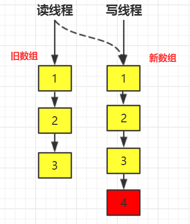

CL0610：最终一致性
这样，读操作总是在一个不变的数组版本上进行的，就不需要同步了。
> 
1. [Java 面试指南（付费）](https://javabetter.cn/zhishixingqiu/mianshi.html)收录的腾讯云智面经同学 16 一面面试原题：ConcurrentHashMap、CopyOnWriteArrayList 的实现原理？
2. [Java 面试指南（付费）](https://javabetter.cn/zhishixingqiu/mianshi.html)收录的腾讯面经同学 26 暑期实习微信支付面试原题：说一说常用的并发容器
### [52. 能说一下 BlockingQueue 吗？（补充）](https://javabetter.cn/sidebar/sanfene/javathread.html#_52-%E8%83%BD%E8%AF%B4%E4%B8%80%E4%B8%8B-blockingqueue-%E5%90%97-%E8%A1%A5%E5%85%85)
> 2024 年 08 月 18 日增补，从集合框架移动到并发编程这里

[BlockingQueue](https://javabetter.cn/thread/BlockingQueue.html) 代表的是线程安全的队列，不仅可以由多个线程并发访问，还添加了等待/通知机制，以便在队列为空时阻塞获取元素的线程，直到队列变得可用，或者在队列满时阻塞插入元素的线程，直到队列变得可用。
阻塞队列（BlockingQueue）被广泛用于“生产者-消费者”问题中，其原因是 BlockingQueue 提供了可阻塞的插入和移除方法。当队列容器已满，生产者线程会被阻塞，直到队列未满；当队列容器为空时，消费者线程会被阻塞，直至队列非空时为止。
BlockingQueue 接口的实现类有 ArrayBlockingQueue、DelayQueue、LinkedBlockingDeque、LinkedBlockingQueue、LinkedTransferQueue、PriorityBlockingQueue、SynchronousQueue 等。
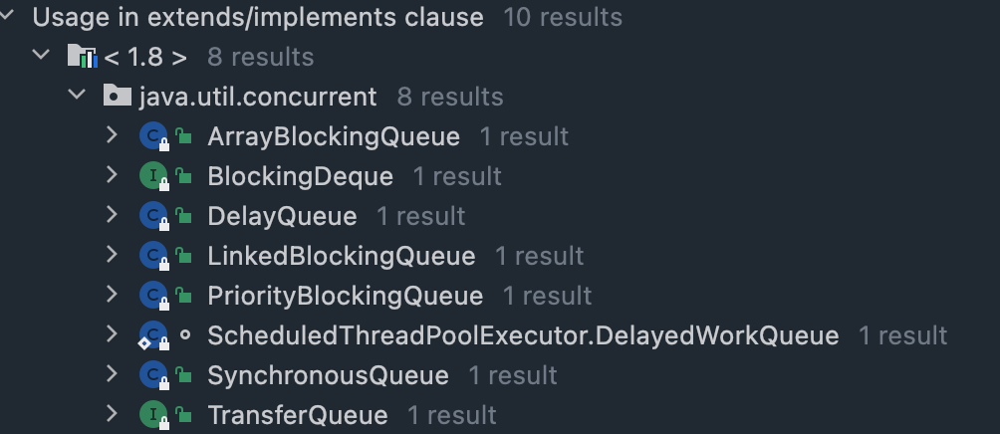

二哥的Java进阶之路
阻塞指的是一种程序执行状态，其中某个线程在等待某个条件满足时暂停其执行（即阻塞），直到条件满足时恢复其执行。
#### [阻塞队列是如何实现的？](https://javabetter.cn/sidebar/sanfene/javathread.html#%E9%98%BB%E5%A1%9E%E9%98%9F%E5%88%97%E6%98%AF%E5%A6%82%E4%BD%95%E5%AE%9E%E7%8E%B0%E7%9A%84)
就拿 ArrayBlockingQueue 来说，它是一个基于数组的有界阻塞队列，采用 [ReentrantLock](https://javabetter.cn/thread/reentrantLock.html) 锁来实现线程的互斥，而 ReentrantLock 底层采用的是 AQS 实现的队列同步，线程的阻塞调用 [LockSupport.park](https://javabetter.cn/thread/LockSupport.html) 实现，唤醒调用 LockSupport.unpark 实现。

```java
public void put(E e) throws InterruptedException {
    checkNotNull(e);
    // 使用ReentrantLock锁
    final ReentrantLock lock = this.lock;
    // 获取锁
    lock.lockInterruptibly();
    try {
        // 如果队列已满，阻塞
        while (count == items.length)
            notFull.await();
        // 插入元素
        enqueue(e);
    } finally {
        // 释放锁
        lock.unlock();
    }
}

/**
 * 插入元素
 */
private void enqueue(E x) {
    final Object[] items = this.items;
    items[putIndex] = x;
    if (++putIndex == items.length)
        putIndex = 0;
    count++;
	// 插入元素后，通知消费者线程可以继续取元素
    notEmpty.signal();
}

/**
 * 获取元素
 */
public E take() throws InterruptedException {
    final ReentrantLock lock = this.lock;
    // 获取锁
    lock.lockInterruptibly();
    try {
        // 如果队列为空，阻塞，等待生产者线程放入元素
        while (count == 0)
            notEmpty.await();
        // 移除元素并返回
        return dequeue();
    } finally {
        lock.unlock();
    }
}

/**
 * 移除元素并返回
 */
private E dequeue() {
    final Object[] items = this.items;
    @SuppressWarnings("unchecked")
    E x = (E) items[takeIndex];
    items[takeIndex] = null;
    // 数组是循环队列，如果到达数组末尾，从头开始
    if (++takeIndex == items.length)
        takeIndex = 0;
    count--;
    if (itrs != null)
        itrs.elementDequeued();
    // 移除元素后，通知生产者线程可以继续放入元素
    notFull.signal();
    return x;
}
```
> 
1. [Java 面试指南（付费）](https://javabetter.cn/zhishixingqiu/mianshi.html)收录的腾讯面经同学 26 暑期实习微信支付面试原题：说一说常用的并发容器
GitHub 上标星 10000+ 的开源知识库《[二哥的 Java 进阶之路](https://github.com/itwanger/toBeBetterJavaer)》第一版 PDF 终于来了！包括 Java 基础语法、数组&字符串、OOP、集合框架、Java IO、异常处理、Java 新特性、网络编程、NIO、并发编程、JVM 等等，共计 32 万余字，500+张手绘图，可以说是通俗易懂、风趣幽默……详情戳：[太赞了，GitHub 上标星 10000+ 的 Java 教程](https://javabetter.cn/overview/)
微信搜 **沉默王二** 或扫描下方二维码关注二哥的原创公众号沉默王二，回复 **222** 即可免费领取。


### 常见场景题汇总

#### [场景1：ConcurrentHashMap 的弱一致性]
**问题描述**：
我们在遍历 `ConcurrentHashMap` 的时候，如果有另一个线程向 Map 中添加了一个新元素。
1.  会抛出 `ConcurrentModificationException` 吗？
2.  遍历能否读到这个新元素？

**解答**：
1.  **不会抛异常**：`ConcurrentHashMap` 的迭代器是弱一致性的（Weakly Consistent），不同于 `HashMap` 的 Fail-Fast。
2.  **不一定能读到**：取决于新元素插入的位置是否在迭代器当前位置之后。如果插在已遍历过的桶中，就看不到；如果插在未遍历的桶中，就能看到。
**结论**：`ConcurrentHashMap` 不保证遍历过程中的快照一致性，只保证最终一致性。

#### [场景2：CopyOnWriteArrayList 的性能陷阱]
**问题描述**：
某系统有一个商品列表（约 10 万个商品），需要频繁更新商品的实时价格（每秒几百次更新）。开发人员为了保证线程安全，使用了 `CopyOnWriteArrayList`。这样做有什么问题？

**解答**：
**严重的性能问题**。
*   **原理**：`CopyOnWriteArrayList` 每次写操作（add/set/remove）都会**复制整个底层数组**。
*   **后果**：
    1.  **内存占用高**：频繁创建大数组对象。
    2.  **GC 频繁**：大量垃圾对象导致 Full GC。
    3.  **CPU 飙升**：数组复制操作消耗 CPU。
*   **修正**：读多写少才用 COW。高频写场景应使用 `Collections.synchronizedList` 或 `ConcurrentHashMap`（用 Map 存 ID->商品）。

#### [场景3：Semaphore 实现限流与降级]
**问题描述**：
你需要保护一个下游依赖服务，最多允许 50 个并发请求。如果超过 50 个，**不希望请求排队等待**，而是直接返回“系统繁忙”给用户。如何实现？

**解答**：
使用 `Semaphore` 的 **`tryAcquire()`** 方法。
```java
if (semaphore.tryAcquire()) {
    try {
        // 调用下游服务
    } finally {
        semaphore.release();
    }
} else {
    // 获取失败，立即返回降级结果
    return "系统繁忙，请稍后再试";
}
```
普通的 `acquire()` 会阻塞等待，不符合“立即返回”的要求。

#### [场景4：优雅关闭（毒丸模式）]
**问题描述**：
你有一个基于 `BlockingQueue` 的生产者-消费者模型。系统关闭时，如何通知消费者线程“处理完队列里剩余的任务后退出”，而不是强行中断？

**解答**：
使用**毒丸对象（Poison Pill）**策略。
1.  定义一个特殊的没有任何业务意义的对象（例如 `new Object()` 或 `POISON_PILL` 常量）。
2.  生产者停止生产业务数据后，向队列放入 N 个毒丸（N = 消费者线程数）。
3.  消费者从队列取到毒丸对象时，不再处理，而是执行 `break` 退出循环。
这样可以保证队列中的积压任务被处理完后再关闭。
