## [基础](https://javabetter.cn/sidebar/sanfene/javathread.html#%E5%9F%BA%E7%A1%80)
### [1.并行跟并发有什么区别？](https://javabetter.cn/sidebar/sanfene/javathread.html#_1-%E5%B9%B6%E8%A1%8C%E8%B7%9F%E5%B9%B6%E5%8F%91%E6%9C%89%E4%BB%80%E4%B9%88%E5%8C%BA%E5%88%AB)

- 并行：多核 CPU 上的多任务处理，多个任务在同一时间真正地同时执行。
- 并发：单核 CPU 上的多任务处理，多个任务在同一时间段内交替执行，通过时间片轮转实现交替执行。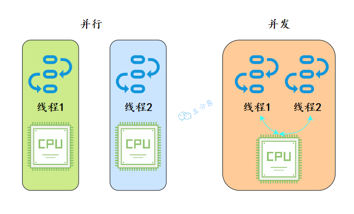

三分恶面渣逆袭：并行和并发
就好像我们去食堂打饭，并行就是每个人对应一个阿姨，同时打饭；而并发就是一个阿姨，轮流给每个人打饭。


三分恶面渣逆袭：并行并发和食堂打饭
#### [你对线程安全的理解是什么？](https://javabetter.cn/sidebar/sanfene/javathread.html#%E4%BD%A0%E5%AF%B9%E7%BA%BF%E7%A8%8B%E5%AE%89%E5%85%A8%E7%9A%84%E7%90%86%E8%A7%A3%E6%98%AF%E4%BB%80%E4%B9%88)
推荐阅读：[多线程带来了哪些问题？](https://javabetter.cn/thread/thread-bring-some-problem.html)
线程安全是并发编程中一个重要的概念，如果一段代码块或者一个方法在多线程环境中被多个线程同时执行时能够正确地处理共享数据，那么这段代码块或者方法就是线程安全的。
可以从三个要素来确保线程安全：
**①、原子性**：确保当某个线程修改共享变量时，没有其他线程可以同时修改这个变量，即这个操作是不可分割的。
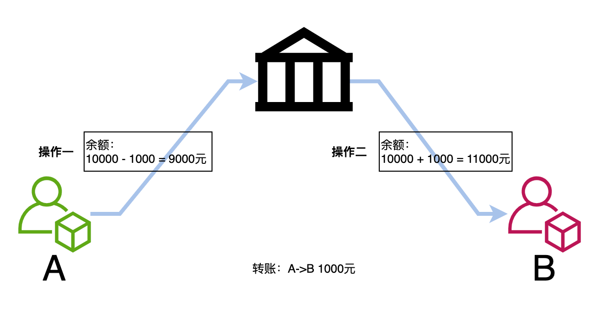

雷小帅：原子性
原子性可以通过互斥锁（如 synchronized）或原子操作（如 AtomicInteger 类中的方法）来保证。
**②、可见性**：确保一个线程对共享变量的修改可以立即被其他线程看到。
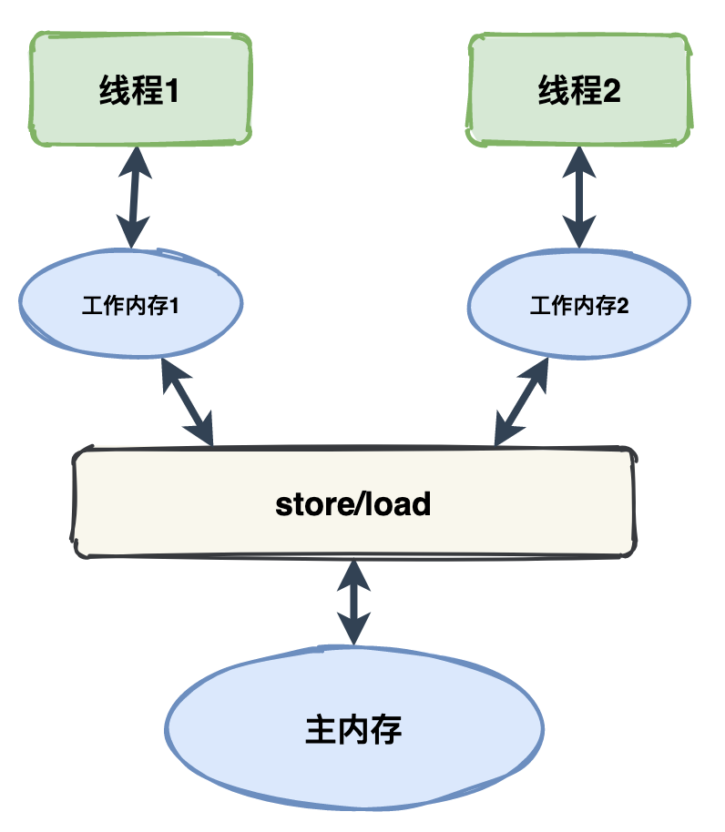

雷小帅：可见性
volatile 关键字可以保证了变量的修改对所有线程立即可见，并防止编译器优化导致的可见性问题。
**③、活跃性问题**：要确保线程不会因为死锁、饥饿、活锁等问题导致无法继续执行。
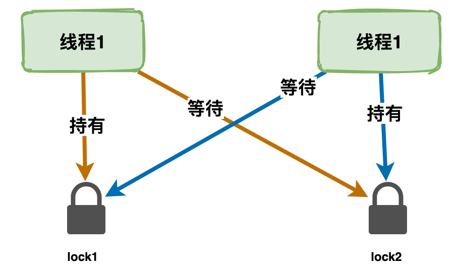

雷小帅：活跃性问题
> 
1. [Java 面试指南（付费）](https://javabetter.cn/zhishixingqiu/mianshi.html)收录的华为 OD 面经同学 1 一面面试原题：对于多线程编程的了解?
2. [Java 面试指南（付费）](https://javabetter.cn/zhishixingqiu/mianshi.html)收录的快手面经同学 1 部门主站技术部面试原题：你对线程安全的理解是什么？
### [2.说说什么是进程和线程？](https://javabetter.cn/sidebar/sanfene/javathread.html#_2-%E8%AF%B4%E8%AF%B4%E4%BB%80%E4%B9%88%E6%98%AF%E8%BF%9B%E7%A8%8B%E5%92%8C%E7%BA%BF%E7%A8%8B)
推荐阅读:[进程与线程的区别是什么？](https://javabetter.cn/thread/why-need-thread.html)
进程说简单点就是我们在电脑上启动的一个个应用。它是操作系统分配资源的最小单位。
线程是进程中的独立执行单元。多个线程可以共享同一个进程的资源，如内存；每个线程都有自己独立的栈和寄存器。
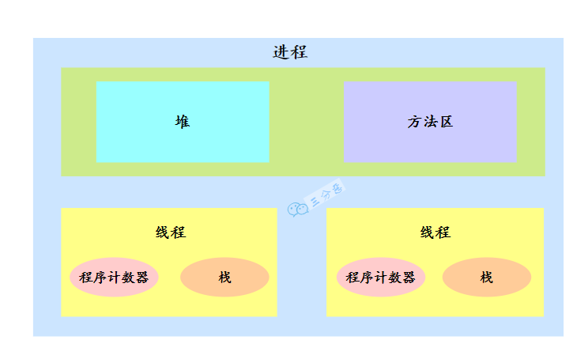

三分恶面渣逆袭：进程与线程关系
#### [如何理解协程？](https://javabetter.cn/sidebar/sanfene/javathread.html#%E5%A6%82%E4%BD%95%E7%90%86%E8%A7%A3%E5%8D%8F%E7%A8%8B)
协程通常被视为比线程更轻量级的并发单元，它们主要在一些支持异步编程模型的语言中得到了原生支持，如 Kotlin、Go 等。
不过，我们可以使用 CompletableFuture 来模拟协程式的异步执行任务。

```java
class CompletableFutureExample {

    public static void main(String[] args) throws ExecutionException, InterruptedException {
        // 异步执行任务1
        CompletableFuture<Integer> future1 = CompletableFuture.supplyAsync(() -> {
            try {
                Thread.sleep(1000); // 模拟耗时操作
            } catch (InterruptedException e) {
                e.printStackTrace();
            }
            return 10;
        });

        // 异步执行任务2
        CompletableFuture<Integer> future2 = CompletableFuture.supplyAsync(() -> {
            try {
                Thread.sleep(1000); // 模拟耗时操作
            } catch (InterruptedException e) {
                e.printStackTrace();
            }
            return 20;
        });

        // 合并两个任务的结果并计算
        CompletableFuture<Integer> resultFuture = future1.thenCombine(future2, Integer::sum);

        // 等待最终结果并打印
        System.out.println("结果: " + resultFuture.get());
    }
}
```
在这个示例中，我们创建了两个 CompletableFuture 对象来异步执行两个简单的数值返回任务。这两个任务都会休眠 1 秒钟来模拟耗时计算。
然后我们使用 thenCombine 方法来合并这两个任务的结果。最后，我们通过 get 方法等待最终结果的完成，并打印出来。
#### [说说线程的共享内存？](https://javabetter.cn/sidebar/sanfene/javathread.html#%E8%AF%B4%E8%AF%B4%E7%BA%BF%E7%A8%8B%E7%9A%84%E5%85%B1%E4%BA%AB%E5%86%85%E5%AD%98)
线程之间想要进行通信，可以通过消息传递和共享内存两种方法来完成。那 Java 采用的是共享内存的并发模型。
这个模型被称为 Java 内存模型，也就是 JMM，JMM 决定了一个线程对共享变量的写入何时对另外一个线程可见。
线程之间的共享变量存储在主内存（main memory）中，每个线程都有一个私有的本地内存（local memory），本地内存中存储了共享变量的副本。当然了，本地内存是 JMM 的一个抽象概念，并不真实存在。


深入浅出 Java 多线程：JMM
线程 A 与线程 B 之间如要通信的话，必须要经历下面 2 个步骤：

- 线程 A 把本地内存 A 中的共享变量副本刷新到主内存中。
- 线程 B 到主内存中读取线程 A 刷新过的共享变量，再同步到自己的共享变量副本中。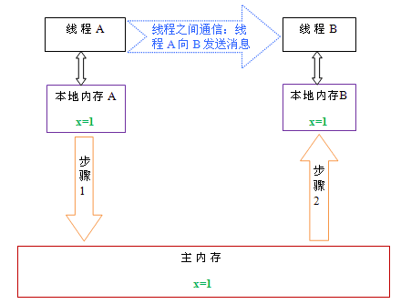

深入浅出 Java 多线程：线程间通信
### [3.说说线程有几种创建方式？](https://javabetter.cn/sidebar/sanfene/javathread.html#_3-%E8%AF%B4%E8%AF%B4%E7%BA%BF%E7%A8%8B%E6%9C%89%E5%87%A0%E7%A7%8D%E5%88%9B%E5%BB%BA%E6%96%B9%E5%BC%8F)
推荐阅读：[室友打了一把王者就学会了 Java 多线程](https://javabetter.cn/thread/wangzhe-thread.html)
Java 中创建线程主要有三种方式，分别为继承 Thread 类、实现 Runnable 接口、实现 Callable 接口。


二哥的 Java 进阶之路
第一种，继承 Thread 类，重写 `run()`方法，调用 `start()`方法启动线程。

```java
class ThreadTask extends Thread {
    public void run() {
        System.out.println("看完二哥的 Java 进阶之路，上岸了!");
    }

    public static void main(String[] args) {
        ThreadTask task = new ThreadTask();
        task.start();
    }
}
```
这种方法的缺点是，由于 Java 不支持多重继承，所以如果类已经继承了另一个类，就不能使用这种方法了。
第二种，实现 Runnable 接口，重写 `run()` 方法，然后创建 Thread 对象，将 Runnable 对象作为参数传递给 Thread 对象，调用 `start()` 方法启动线程。

```java
class RunnableTask implements Runnable {
    public void run() {
        System.out.println("看完二哥的 Java 进阶之路，上岸了!");
    }

    public static void main(String[] args) {
        RunnableTask task = new RunnableTask();
        Thread thread = new Thread(task);
        thread.start();
    }
}
```
这种方法的优点是可以避免 Java 的单继承限制，并且更符合面向对象的编程思想，因为 Runnable 接口将任务代码和线程控制的代码解耦了。
第三种，实现 Callable 接口，重写 `call()` 方法，然后创建 FutureTask 对象，参数为 Callable 对象；紧接着创建 Thread 对象，参数为 FutureTask 对象，调用 `start()` 方法启动线程。

```java
class CallableTask implements Callable<String> {
    public String call() {
        return "看完二哥的 Java 进阶之路，上岸了!";
    }

    public static void main(String[] args) throws ExecutionException, InterruptedException {
        CallableTask task = new CallableTask();
        FutureTask<String> futureTask = new FutureTask<>(task);
        Thread thread = new Thread(futureTask);
        thread.start();
        System.out.println(futureTask.get());
    }
}
```
这种方法的优点是可以获取线程的执行结果。
#### [一个 8G 内存的系统最多能创建多少线程?](https://javabetter.cn/sidebar/sanfene/javathread.html#%E4%B8%80%E4%B8%AA-8g-%E5%86%85%E5%AD%98%E7%9A%84%E7%B3%BB%E7%BB%9F%E6%9C%80%E5%A4%9A%E8%83%BD%E5%88%9B%E5%BB%BA%E5%A4%9A%E5%B0%91%E7%BA%BF%E7%A8%8B)
推荐阅读：[深入理解 JVM 的运行时数据区](https://javabetter.cn/jvm/neicun-jiegou.html)
在确定一个系统最多可以创建多个线程时，除了需要考虑系统的内存大小外，Java 虚拟机栈的大小也是值得考虑的因素。
线程在创建的时候会被分配一个虚拟机栈，在 64 位操作系统中，默认大小为 1M。
通过 `java -XX:+PrintFlagsFinal -version | grep ThreadStackSize` 这个命令可以查看 JVM 栈的默认大小。
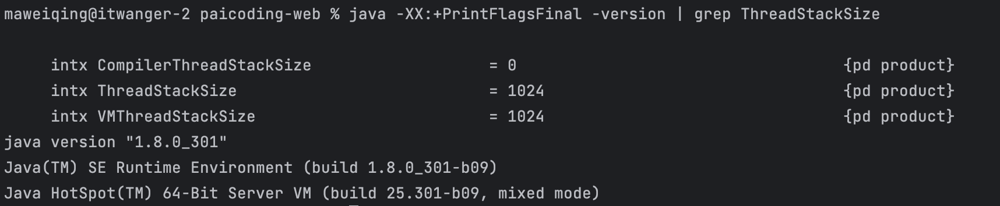

二哥的 Java 进阶之路：默认的虚拟机栈大小
其中 ThreadStackSize 的单位是字节，也就是说默认的 JVM 栈大小是 1024 KB，也就是 1M。
换句话说，8GB = 8 _ 1024 MB = 8 _ 1024 _ 1024 KB，所以一个 8G 内存的系统可以创建的线程数为 8 _ 1024 = 8192 个。
但操作系统本身的运行也需要消耗一定的内存，所以实际上可以创建的线程数肯定会比 8192 少一些。
可以通过下面这段代码来验证一下：

```java
public class StackOverflowErrorTest1 {
    private static AtomicInteger count = new AtomicInteger(0);
    public static void main(String[] args) {
        while (true) {
            testStackOverflowError();
        }
    }

    public static void testStackOverflowError() {
        System.out.println(count.incrementAndGet());
        testStackOverflowError();
    }
}
```
#### [启动一个 Java 程序，你能说说里面有哪些线程吗？](https://javabetter.cn/sidebar/sanfene/javathread.html#%E5%90%AF%E5%8A%A8%E4%B8%80%E4%B8%AA-java-%E7%A8%8B%E5%BA%8F-%E4%BD%A0%E8%83%BD%E8%AF%B4%E8%AF%B4%E9%87%8C%E9%9D%A2%E6%9C%89%E5%93%AA%E4%BA%9B%E7%BA%BF%E7%A8%8B%E5%90%97)
首先是 main 线程，这是程序开始执行的入口。
然后是垃圾回收线程，它是一个后台线程，负责回收不再使用的对象。
还有编译器线程，在及时编译中（JIT），负责把一部分热点代码编译后放到 codeCache 中，以提升程序的执行效率。


二哥的 Java 进阶之路：JIT
可以通过下面这段代码进行检测：

```java
class ThreadLister {
    public static void main(String[] args) {
        // 获取所有线程的堆栈跟踪
        Map<Thread, StackTraceElement[]> threads = Thread.getAllStackTraces();
        for (Thread thread : threads.keySet()) {
            System.out.println("Thread: " + thread.getName() + " (ID=" + thread.getId() + ")");
        }
    }
}
```
结果如下所示：

```java
Thread: Monitor Ctrl-Break (ID=5)
Thread: Reference Handler (ID=2)
Thread: main (ID=1)
Thread: Signal Dispatcher (ID=4)
Thread: Finalizer (ID=3)
```
简单解释下：

- `Thread: main (ID=1)` - 主线程，Java 程序启动时由 JVM 创建。
- `Thread: Reference Handler (ID=2)` - 这个线程是用来处理引用对象的，如软引用（SoftReference）、弱引用（WeakReference）和虚引用（PhantomReference）。负责清理被 JVM 回收的对象。
- `Thread: Finalizer (ID=3)` - 终结器线程，负责调用对象的 finalize 方法。对象在垃圾回收器标记为可回收之前，由该线程执行其 finalize 方法，用于执行特定的资源释放操作。
- `Thread: Signal Dispatcher (ID=4)` - 信号调度线程，处理来自操作系统的信号，将它们转发给 JVM 进行进一步处理，例如响应中断、停止等信号。
- `Thread: Monitor Ctrl-Break (ID=5)` - 监视器线程，通常由一些特定的 IDE 创建，用于在开发过程中监控和管理程序执行或者处理中断。### [4.调用 start()方法时会执行 run()方法，那怎么不直接调用 run()方法？](https://javabetter.cn/sidebar/sanfene/javathread.html#_4-%E8%B0%83%E7%94%A8-start-%E6%96%B9%E6%B3%95%E6%97%B6%E4%BC%9A%E6%89%A7%E8%A1%8C-run-%E6%96%B9%E6%B3%95-%E9%82%A3%E6%80%8E%E4%B9%88%E4%B8%8D%E7%9B%B4%E6%8E%A5%E8%B0%83%E7%94%A8-run-%E6%96%B9%E6%B3%95)
在 Java 中，启动一个新的线程应该调用其`start()`方法，而不是直接调用`run()`方法。
当调用`start()`方法时，会启动一个新的线程，并让这个新线程调用`run()`方法。这样，`run()`方法就在新的线程中运行，从而实现多线程并发。

```java
class MyThread extends Thread {
    public void run() {
        System.out.println(Thread.currentThread().getName());
    }

    public static void main(String[] args) {
        MyThread t1 = new MyThread();
        t1.start(); // 正确的方式，创建一个新线程，并在新线程中执行 run()
        t1.run(); // 仅在主线程中执行 run()，没有创建新线程
    }
}
```
如果直接调用`run()`方法，那么`run()`方法就在当前线程中运行，没有新的线程被创建，也就没有实现多线程的效果。
来看输出结果：
也就是说，`start()` 方法的调用会告诉 JVM 准备好所有必要的新线程结构，分配其所需资源，并调用线程的 `run()` 方法在这个新线程中执行。


### [5.线程有哪些常用的调度方法？](https://javabetter.cn/sidebar/sanfene/javathread.html#_5-%E7%BA%BF%E7%A8%8B%E6%9C%89%E5%93%AA%E4%BA%9B%E5%B8%B8%E7%94%A8%E7%9A%84%E8%B0%83%E5%BA%A6%E6%96%B9%E6%B3%95)
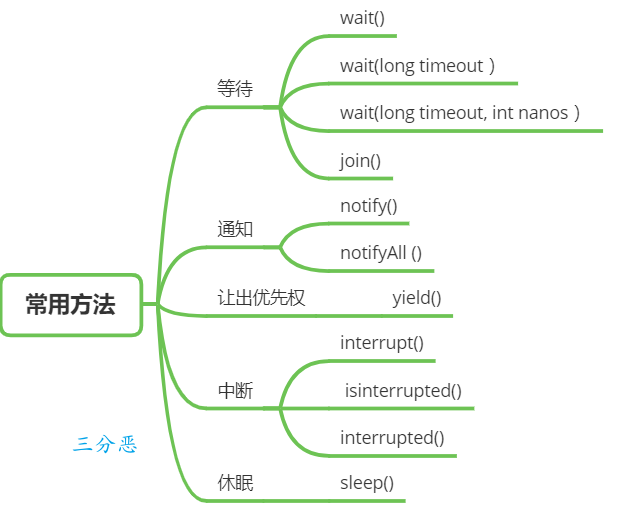

三分恶面渣逆袭：线程常用调度方法
#### [说说线程等待与通知？](https://javabetter.cn/sidebar/sanfene/javathread.html#%E8%AF%B4%E8%AF%B4%E7%BA%BF%E7%A8%8B%E7%AD%89%E5%BE%85%E4%B8%8E%E9%80%9A%E7%9F%A5)
在 Object 类中有一些方法可以用于线程的等待与通知。
①、`wait()`：当一个线程 A 调用一个共享变量的 `wait()` 方法时，线程 A 会被阻塞挂起，直到发生下面几种情况才会返回 ：

- 线程 B 调用了共享对象 `notify()`或者 `notifyAll()` 方法；
- 其他线程调用了线程 A 的 `interrupt()` 方法，线程 A 抛出 InterruptedException 异常返回。②、`wait(long timeout)` ：这个方法相比 `wait()` 方法多了一个超时参数，它的不同之处在于，如果线程 A 调用共享对象的 `wait(long timeout)`方法后，没有在指定的 timeout 时间内被其它线程唤醒，那么这个方法还是会因为超时而返回。
③、`wait(long timeout, int nanos)`，其内部调用的是 `wait(long timout)` 方法。
唤醒线程主要有下面两个方法：
①、`notify()`：一个线程 A 调用共享对象的 `notify()` 方法后，会唤醒一个在这个共享变量上调用 wait 系列方法后被挂起的线程。
一个共享变量上可能会有多个线程在等待，具体唤醒哪个等待的线程是随机的。
②、`notifyAll()`：不同于在共享变量上调用 `notify()` 方法会唤醒被阻塞到该共享变量上的一个线程，notifyAll 方法会唤醒所有在该共享变量上调用 wait 系列方法而被挂起的线程。
Thread 类还提供了一个 `join()` 方法，意思是如果一个线程 A 执行了 `thread.join()`，当前线程 A 会等待 thread 线程终止之后才从 `thread.join()` 返回。
#### [说说线程休眠](https://javabetter.cn/sidebar/sanfene/javathread.html#%E8%AF%B4%E8%AF%B4%E7%BA%BF%E7%A8%8B%E4%BC%91%E7%9C%A0)
`sleep(long millis)`：Thread 类中的静态方法，当一个执行中的线程 A 调用了 Thread 的 sleep 方法后，线程 A 会暂时让出指定时间的执行权。
但是线程 A 所拥有的监视器资源，比如锁，还是持有不让出的。指定的睡眠时间到了后该方法会正常返回，接着参与 CPU 的调度，获取到 CPU 资源后就可以继续运行。
#### [说说让出优先权](https://javabetter.cn/sidebar/sanfene/javathread.html#%E8%AF%B4%E8%AF%B4%E8%AE%A9%E5%87%BA%E4%BC%98%E5%85%88%E6%9D%83)
`yield()`：Thread 类中的静态方法，当一个线程调用 yield 方法时，实际是在暗示线程调度器，当前线程请求让出自己的 CPU，但是线程调度器可能会“装看不见”忽略这个暗示。
#### [说说线程中断](https://javabetter.cn/sidebar/sanfene/javathread.html#%E8%AF%B4%E8%AF%B4%E7%BA%BF%E7%A8%8B%E4%B8%AD%E6%96%AD)
推荐阅读：[interrupt 方法](https://www.cnblogs.com/myseries/p/10918819.html)
Java 中的线程中断是一种线程间的协作模式，通过设置线程的中断标志并不能直接终止该线程的执行。被中断的线程会根据中断状态自行处理。

- `void interrupt()` 方法：中断线程，例如，当线程 A 运行时，线程 B 可以调用线程 `interrupt()` 方法来设置线程的中断标志为 true 并立即返回。设置标志仅仅是设置标志, 线程 B 实际并没有被中断，会继续往下执行。
- `boolean isInterrupted()` 方法： 检测当前线程是否被中断。
- `boolean interrupted()` 方法： 检测当前线程是否被中断，与 isInterrupted 不同的是，该方法如果发现当前线程被中断，则会清除中断标志。为了响应中断，线程的执行代码应该这样编写：

```java
public void run() {
    try {
        while (!Thread.currentThread().isInterrupted()) {
            // 执行任务
        }
    } catch (InterruptedException e) {
        // 线程被中断时的清理代码
    } finally {
        // 线程结束前的清理代码
    }
}
```
stop 方法用来强制线程停止执行，目前已经处于废弃状态，因为 stop 方法会导致线程立即停止，可能会在不一致的状态下释放锁，破坏对象的一致性，导致难以发现的错误和资源泄漏。
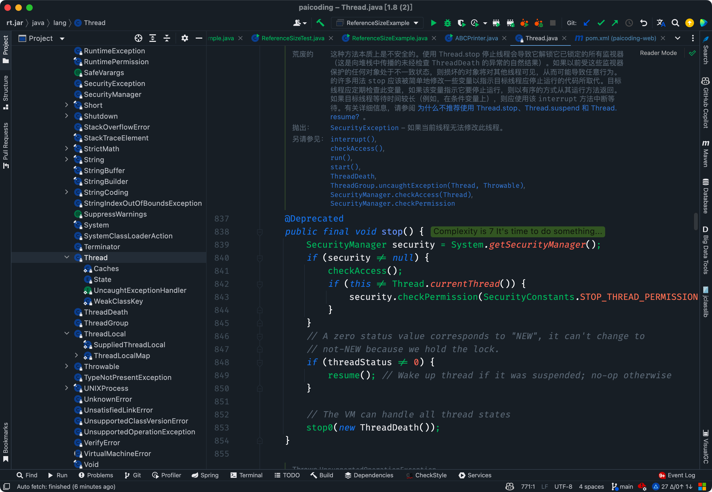

> 
1. [Java 面试指南（付费）](https://javabetter.cn/zhishixingqiu/mianshi.html)收录的帆软同学 3 Java 后端一面的原题：怎么停止一个线程，interrupt 和 stop 区别
### [6.线程有几种状态？](https://javabetter.cn/sidebar/sanfene/javathread.html#_6-%E7%BA%BF%E7%A8%8B%E6%9C%89%E5%87%A0%E7%A7%8D%E7%8A%B6%E6%80%81)
在 Java 中，线程共有 6 种状态：
 | 状态 | 说明 | 
|---|---|
 | NEW | 当线程被创建后，如通过`new Thread()`，它处于新建状态。此时，线程已经被分配了必要的资源，但还没有开始执行。 | 
 | RUNNABLE | 当调用线程的`start()`方法后，线程进入可运行状态。在这个状态下，线程可能正在运行也可能正在等待获取 CPU 时间片，具体取决于线程调度器的调度策略。 | 
 | BLOCKED | 线程在试图获取一个锁以进入同步块/方法时，如果锁被其他线程持有，线程将进入阻塞状态，直到它获取到锁。 | 
 | WAITING | 线程进入等待状态是因为调用了如下方法之一：`Object.wait()`或`LockSupport.park()`。在等待状态下，线程需要其他线程显式地唤醒，否则不会自动执行。 | 
 | TIME_WAITING | 当线程调用带有超时参数的方法时，如`Thread.sleep(long millis)`、`Object.wait(long timeout)` 或`LockSupport.parkNanos()`，它将进入超时等待状态。线程在指定的等待时间过后会自动返回可运行状态。 | 
 | TERMINATED | 当线程的`run()`方法执行完毕后，或者因为一个未捕获的异常终止了执行，线程进入终止状态。一旦线程终止，它的生命周期结束，不能再被重新启动。 | 
也就是说，线程的生命周期可以分为五个主要阶段：新建、可运行、运行中、阻塞/等待、和终止。线程在运行过程中会根据状态的变化在这些阶段之间切换。：
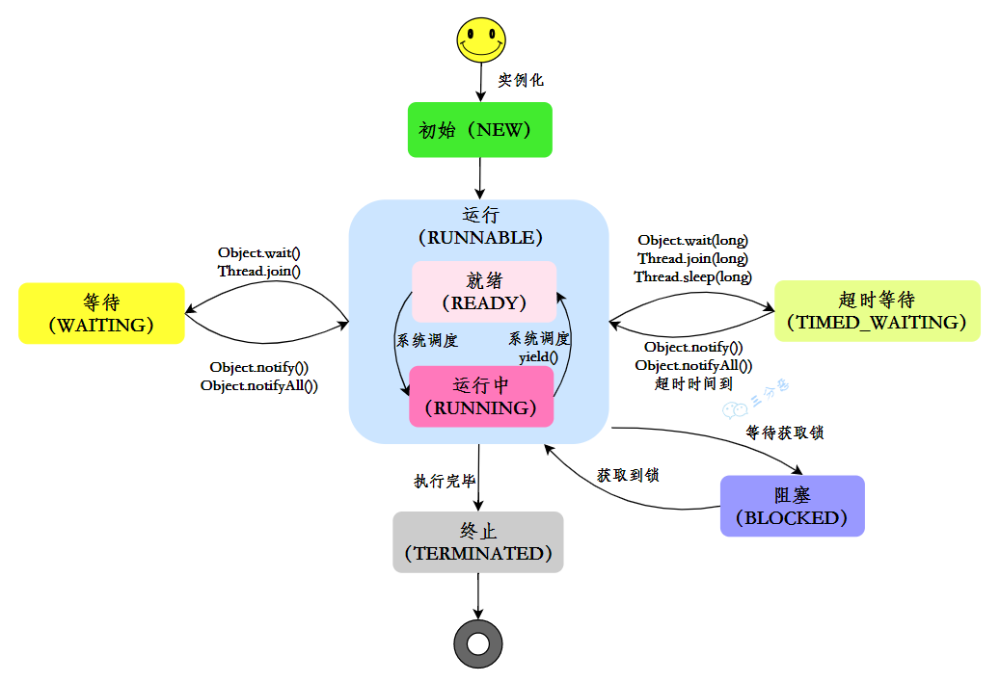

三分恶面渣逆袭：Java线程状态变化
#### [如何做到强制终止线程？](https://javabetter.cn/sidebar/sanfene/javathread.html#%E5%A6%82%E4%BD%95%E5%81%9A%E5%88%B0%E5%BC%BA%E5%88%B6%E7%BB%88%E6%AD%A2%E7%BA%BF%E7%A8%8B)
设置线程的中断标志，通知线程优雅地终止。

```java
class MyTask implements Runnable {
    @Override
    public void run() {
        while (!Thread.currentThread().isInterrupted()) {
            try {
                System.out.println("Running...");
                Thread.sleep(1000); // 模拟工作
            } catch (InterruptedException e) {
                // 捕获中断异常后，重置中断状态
                Thread.currentThread().interrupt();
                System.out.println("Thread interrupted, exiting...");
                break;
            }
        }
    }
}

public class Main {
    public static void main(String[] args) throws InterruptedException {
        Thread thread = new Thread(new MyTask());
        thread.start();
        Thread.sleep(3000); // 主线程等待3秒
        thread.interrupt(); // 请求终止线程
    }
}
```
中断结果：
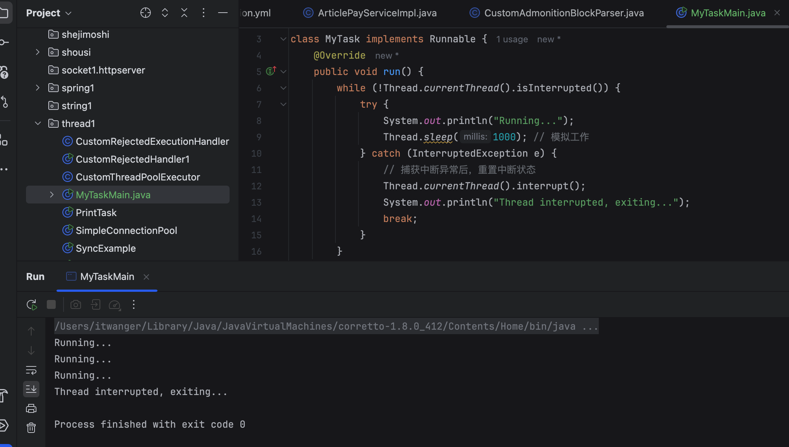

二哥的Java 进阶之路：线程中断
> 
1. [Java 面试指南（付费）](https://javabetter.cn/zhishixingqiu/mianshi.html)收录的招商银行面经同学 6 招银网络科技面试原题：线程的生命周期和状态？
2. [Java 面试指南（付费）](https://javabetter.cn/zhishixingqiu/mianshi.html)收录的快手同学 2 一面面试原题：线程有哪些状态？
3. [Java 面试指南（付费）](https://javabetter.cn/zhishixingqiu/mianshi.html)收录的 OPPO 面经同学 1 面试原题：Java里线程的生命周期
4. [Java 面试指南（付费）](https://javabetter.cn/zhishixingqiu/mianshi.html)收录的同学 D 小米一面原题：线程的生命周期
### [7.什么是线程上下文切换？](https://javabetter.cn/sidebar/sanfene/javathread.html#_7-%E4%BB%80%E4%B9%88%E6%98%AF%E7%BA%BF%E7%A8%8B%E4%B8%8A%E4%B8%8B%E6%96%87%E5%88%87%E6%8D%A2)
使用多线程的目的是为了充分利用 CPU，但是我们知道，并发其实是一个 CPU 来应付多个线程。
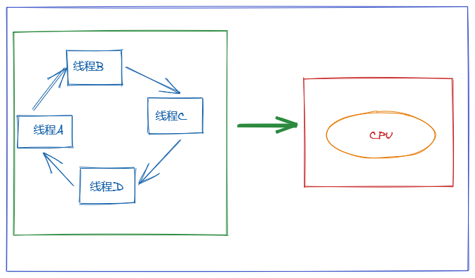

三分恶面渣逆袭：线程切换
为了让用户感觉多个线程是在同时执行的， CPU 资源的分配采用了时间片轮转也就是给每个线程分配一个时间片，线程在时间片内占用 CPU 执行任务。当线程使用完时间片后，就会处于就绪状态并让出 CPU 让其他线程占用，这就是上下文切换。
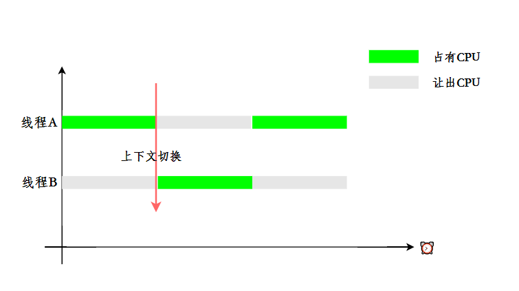

三分恶面渣逆袭：上下文切换时机
#### [线程可以被多核调度吗？](https://javabetter.cn/sidebar/sanfene/javathread.html#%E7%BA%BF%E7%A8%8B%E5%8F%AF%E4%BB%A5%E8%A2%AB%E5%A4%9A%E6%A0%B8%E8%B0%83%E5%BA%A6%E5%90%97)
当然可以，在现代操作系统和多核处理器的环境中，线程的调度和管理是操作系统内核的重要职责之一。
操作系统的调度器负责将线程分配给可用的 CPU 核心，从而实现并行处理。
多核处理器提供了并行执行多个线程的能力。每个核心可以独立执行一个或多个线程，操作系统的任务调度器会根据策略和算法，如优先级调度、轮转调度等，决定哪个线程何时在哪个核心上运行。
> 
1. [Java 面试指南（付费）](https://javabetter.cn/zhishixingqiu/mianshi.html)收录的字节跳动同学 7 Java 后端实习一面的原题：线程可以被多核调度吗？
2. [Java 面试指南（付费）](https://javabetter.cn/zhishixingqiu/mianshi.html)收录的携程面经同学 1 Java 后端技术一面面试原题：线程上下文切换（我答的内核态和用户态切换时机，和切换需要加载哪些内容）
### [8.守护线程了解吗？](https://javabetter.cn/sidebar/sanfene/javathread.html#_8-%E5%AE%88%E6%8A%A4%E7%BA%BF%E7%A8%8B%E4%BA%86%E8%A7%A3%E5%90%97)
Java 中的线程分为两类，分别为 daemon 线程（守护线程）和 user 线程（用户线程）。
在 JVM 启动时会调用 main 方法，main 方法所在的线程就是一个用户线程。其实在 JVM 内部同时还启动了很多守护线程， 比如垃圾回收线程。
那么守护线程和用户线程有什么区别呢？区别之一是当最后一个非守护线程束时， JVM 会正常退出，而不管当前是否存在守护线程，也就是说守护线程是否结束并不影响 JVM 退出。换而言之，只要有一个用户线程还没结束，正常情况下 JVM 就不会退出。
### [9.线程间有哪些通信方式？](https://javabetter.cn/sidebar/sanfene/javathread.html#_9-%E7%BA%BF%E7%A8%8B%E9%97%B4%E6%9C%89%E5%93%AA%E4%BA%9B%E9%80%9A%E4%BF%A1%E6%96%B9%E5%BC%8F)
线程之间传递信息有多种方式，比如说使用共享对象、`wait()` 和 `notify()` 方法、Exchanger 和 CompletableFuture。
①、**使用共享对象**，多个线程可以访问和修改同一个对象，从而实现信息的传递，比如说 volatile 和 synchronized 关键字。
[关键字 volatile](https://javabetter.cn/thread/volatile.html) 用来修饰成员变量，告知程序任何对该变量的访问均需要从共享内存中获取，而对它的改变必须同步刷新回共享内存，保证所有线程对变量访问的可见性。
[关键字 synchronized](https://javabetter.cn/thread/synchronized-1.html) 可以修饰方法，或者以同步代码块的形式来使用，确保多个线程在同一个时刻，只能有一个线程在执行某个方法或某个代码块。

```java
public class SharedObject {
    private String message;
    private boolean hasMessage = false;

    public synchronized void writeMessage(String message) {
        while (hasMessage) {
            try {
                wait();
            } catch (InterruptedException e) {
                Thread.currentThread().interrupt();
            }
        }
        this.message = message;
        hasMessage = true;
        notifyAll();
    }

    public synchronized String readMessage() {
        while (!hasMessage) {
            try {
                wait();
            } catch (InterruptedException e) {
                Thread.currentThread().interrupt();
            }
        }
        hasMessage = false;
        notifyAll();
        return message;
    }
}

public class Main {
    public static void main(String[] args) {
        SharedObject sharedObject = new SharedObject();

        Thread writer = new Thread(() -> {
            sharedObject.writeMessage("Hello from Writer!");
        });

        Thread reader = new Thread(() -> {
            String message = sharedObject.readMessage();
            System.out.println("Reader received: " + message);
        });

        writer.start();
        reader.start();
    }
}
```
②、**使用 wait() 和 notify()**，例如，生产者-消费者模式中，生产者生产数据，消费者消费数据，通过 `wait()` 和 `notify()` 方法可以实现生产和消费的协调。
一个线程调用共享对象的 `wait()` 方法时，它会进入该对象的等待池，并释放已经持有的该对象的锁，进入等待状态。
一个线程调用共享对象的 `notify()` 方法时，它会唤醒在该对象等待池中等待的一个线程，使其进入锁池，等待获取锁。
[Condition](https://javabetter.cn/thread/condition.html) 也提供了类似的方法，`await()` 负责等待、`signal()` 和 `signalAll()` 负责通知。
通常与锁（特别是 [ReentrantLock](https://javabetter.cn/thread/reentrantLock.html)）一起使用，为线程提供了一种等待某个条件成真的机制，并允许其他线程在该条件变化时通知等待线程。更灵活、更强大。

```java
class MessageBox {
    private String message;
    private boolean empty = true;

    public synchronized void produce(String message) {
        while (!empty) {
            try {
                wait();
            } catch (InterruptedException e) {
                Thread.currentThread().interrupt();
            }
        }
        empty = false;
        this.message = message;
        notifyAll();
    }

    public synchronized String consume() {
        while (empty) {
            try {
                wait();
            } catch (InterruptedException e) {
                Thread.currentThread().interrupt();
            }
        }
        empty = true;
        notifyAll();
        return message;
    }
}

public class Main {
    public static void main(String[] args) {
        MessageBox box = new MessageBox();

        Thread producer = new Thread(() -> {
            box.produce("Message from producer");
        });

        Thread consumer = new Thread(() -> {
            String message = box.consume();
            System.out.println("Consumer received: " + message);
        });

        producer.start();
        consumer.start();
    }
}
```
③、**使用 Exchanger**，Exchanger 是一个同步点，可以在两个线程之间交换数据。一个线程调用 `exchange()` 方法，将数据传递给另一个线程，同时接收另一个线程的数据。

```java
class Main {
    public static void main(String[] args) {
        Exchanger<String> exchanger = new Exchanger<>();

        Thread thread1 = new Thread(() -> {
            try {
                String message = "Message from thread1";
                String response = exchanger.exchange(message);
                System.out.println("Thread1 received: " + response);
            } catch (InterruptedException e) {
                Thread.currentThread().interrupt();
            }
        });

        Thread thread2 = new Thread(() -> {
            try {
                String message = "Message from thread2";
                String response = exchanger.exchange(message);
                System.out.println("Thread2 received: " + response);
            } catch (InterruptedException e) {
                Thread.currentThread().interrupt();
            }
        });

        thread1.start();
        thread2.start();
    }
}
```
④、**使用 CompletableFuture**，CompletableFuture 是 Java 8 引入的一个类，支持异步编程，允许线程在完成计算后将结果传递给其他线程。

```java
class Main {
    public static void main(String[] args) {
        CompletableFuture<String> future = CompletableFuture.supplyAsync(() -> {
            // 模拟长时间计算
            return "Message from CompletableFuture";
        });

        future.thenAccept(message -> {
            System.out.println("Received: " + message);
        });
    }
}
```
> 
1. [Java 面试指南（付费）](https://javabetter.cn/zhishixingqiu/mianshi.html)收录的华为 OD 的面试中出现过该原题。
2. [Java 面试指南（付费）](https://javabetter.cn/zhishixingqiu/mianshi.html)收录的阿里面经同学 1 闲鱼后端一面的原题：线程之间传递信息?
3. [Java 面试指南（付费）](https://javabetter.cn/zhishixingqiu/mianshi.html)收录的理想汽车面经同学 2 一面面试原题：线程内有哪些通信方式？线程之间有哪些通信方式？
### [10.请说说 sleep 和 wait 的区别？（补充）](https://javabetter.cn/sidebar/sanfene/javathread.html#_10-%E8%AF%B7%E8%AF%B4%E8%AF%B4-sleep-%E5%92%8C-wait-%E7%9A%84%E5%8C%BA%E5%88%AB-%E8%A1%A5%E5%85%85)
> 2024 年 03 月 21 日增补

sleep 会让当前线程休眠，不涉及对象类，也不需要获取对象的锁，属于 Thread 类的方法；wait 会让获得对象锁的线程实现等待，要提前获得对象的锁，属于 Object 类的方法。
它们之间的区别主要有以下几点：
①、所属类不同

- `sleep()` 方法专属于 `Thread` 类。
- `wait()` 方法专属于 `Object` 类。②、锁行为不同
当线程执行 sleep 方法时，它不会释放任何锁。也就是说，如果一个线程在持有某个对象的锁时调用了 sleep，它在睡眠期间仍然会持有这个锁。

```java
class SleepDoesNotReleaseLock {

    private static final Object lock = new Object();

    public static void main(String[] args) throws InterruptedException {
        Thread sleepingThread = new Thread(() -> {
            synchronized (lock) {
                System.out.println("Thread 1 会继续持有锁，并且进入睡眠状态");
                try {
                    Thread.sleep(5000);
                } catch (InterruptedException e) {
                    e.printStackTrace();
                }
                System.out.println("Thread 1 醒来了，并且释放了锁");
            }
        });

        Thread waitingThread = new Thread(() -> {
            synchronized (lock) {
                System.out.println("Thread 2 进入同步代码块");
            }
        });

        sleepingThread.start();
        Thread.sleep(1000);
        waitingThread.start();
    }
}
```
输出结果：

```java
Thread 1 会继续持有锁，并且进入睡眠状态
Thread 1 醒来了，并且释放了锁
Thread 2 进入同步代码块
```
从输出中我们可以看到，waitingThread 必须等待 sleepingThread 完成睡眠后才能进入同步代码块。
而当线程执行 wait 方法时，它会释放它持有的那个对象的锁，这使得其他线程可以有机会获取该对象的锁。

```java
class WaitReleasesLock {

    private static final Object lock = new Object();

    public static void main(String[] args) throws InterruptedException {
        Thread waitingThread = new Thread(() -> {
            synchronized (lock) {
                try {
                    System.out.println("Thread 1 持有锁，准备等待 5 秒");
                    lock.wait(5000);
                    System.out.println("Thread 1 醒来了，并且退出同步代码块");
                } catch (InterruptedException e) {
                    e.printStackTrace();
                }
            }
        });

        Thread notifyingThread = new Thread(() -> {
            synchronized (lock) {
                System.out.println("Thread 2 尝试唤醒等待中的线程");
                lock.notify();
                System.out.println("Thread 2 执行完了 notify");
            }
        });

        waitingThread.start();
        Thread.sleep(1000);
        notifyingThread.start();
    }
}
```
输出结果：

```java
Thread 1 持有锁，准备等待 5 秒
Thread 2 尝试唤醒等待中的线程
Thread 2 执行完了 notify
Thread 1 醒来了，并且退出同步代码块
```
这表明 waitingThread 在调用 wait 后确实释放了锁。
③、使用条件不同

- `sleep()` 方法可以在任何地方被调用。
- `wait()` 方法必须在同步代码块或同步方法中被调用，这是因为调用 `wait()` 方法的前提是当前线程必须持有对象的锁。否则会抛出 `IllegalMonitorStateException` 异常。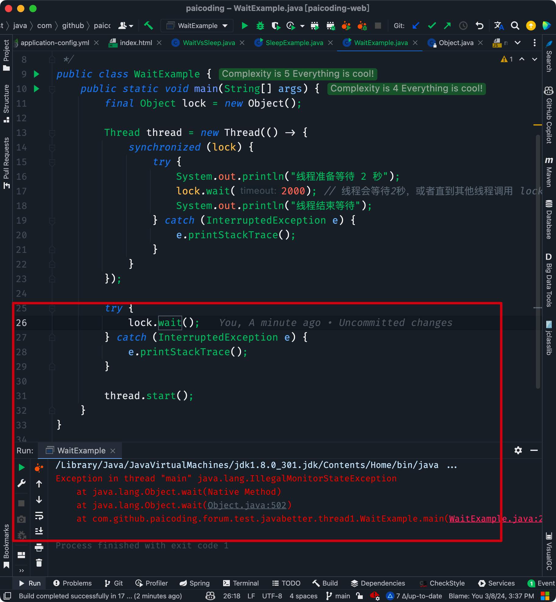

二哥的 Java 进阶之路：wait 方法必须在同步代码块中调用
④、唤醒方式不同

- 调用 sleep 方法后，线程会进入 TIMED_WAITING 状态（定时等待状态），即在指定的时间内暂停执行。当指定的时间结束后，线程会自动恢复到 RUNNABLE 状态（就绪状态），等待 CPU 调度再次执行。
- 调用 wait 方法后，线程会进入 WAITING 状态（无限期等待状态），直到有其他线程在同一对象上调用 notify 或 notifyAll，线程才会从 WAITING 状态转变为 RUNNABLE 状态，准备再次获得 CPU 的执行权。⑤、抛出异常不同

- `sleep()` 方法在等待期间，如果线程被中断，会抛出 `InterruptedException`。
- 如果线程被中断或等待时间到期时，`wait()` 方法同样会在等待期间抛出 `InterruptedException`。我们来通过代码再感受一下 `sleep()` 和 `wait()` 在用法上的区别，先看 `sleep()` 的用法：

```java
class SleepExample {
    public static void main(String[] args) {
        Thread thread = new Thread(() -> {
            System.out.println("线程准备休眠 2 秒");
            try {
                Thread.sleep(2000); // 线程将睡眠2秒
            } catch (InterruptedException e) {
                e.printStackTrace();
            }
            System.out.println("线程醒来了");
        });

        thread.start();
    }
}
```
再来看 `wait()` 的用法：

```java
class WaitExample {
    public static void main(String[] args) {
        final Object lock = new Object();

        Thread thread = new Thread(() -> {
            synchronized (lock) {
                try {
                    System.out.println("线程准备等待 2 秒");
                    lock.wait(2000); // 线程会等待2秒，或者直到其他线程调用 lock.notify()/notifyAll()
                    System.out.println("线程结束等待");
                } catch (InterruptedException e) {
                    e.printStackTrace();
                }
            }
        });

        thread.start();
    }
}
```
> 
1. [Java 面试指南（付费）](https://javabetter.cn/zhishixingqiu/mianshi.html)收录的腾讯 Java 后端实习一面原题：说说 sleep 和 wait 的区别
2. [二哥编程星球](https://javabetter.cn/zhishixingqiu/)球友[枕云眠美团 AI 面试原题](https://t.zsxq.com/BaHOh)：解释一下 java 线程中 sleep 和 wait 方法的主要区别？使用时会对线程状态有什么影响
3. [Java 面试指南（付费）](https://javabetter.cn/zhishixingqiu/mianshi.html)收录的快手同学 2 一面面试原题：调用wait()方法时是哪个状态，sleep和wait区别？
4. [Java 面试指南（付费）](https://javabetter.cn/zhishixingqiu/mianshi.html)收录的同学 D 小米一面原题：sleep和wait的区别
### [11.怎么保证线程安全？（补充）](https://javabetter.cn/sidebar/sanfene/javathread.html#_11-%E6%80%8E%E4%B9%88%E4%BF%9D%E8%AF%81%E7%BA%BF%E7%A8%8B%E5%AE%89%E5%85%A8-%E8%A1%A5%E5%85%85)
> 2024 年 05 月 01 日增补

多线程安全是指在并发环境下，多个线程访问共享资源时，程序能够正确地执行，而不会出现数据不一致或竞争条件等问题。反之，如果程序出现了数据不一致、死锁、饥饿等问题，就称为线程不安全。
为了保证线程安全，可以使用 synchronized 关键字或 ReentrantLock 来保证共享资源的互斥访问。
对于简单的变量操作，可以使用 Atomic 类来实现无锁线程安全。
可以使用线程安全容器，如 ConcurrentHashMap 或 CopyOnWriteArrayList。
对于每个线程独立的数据，可以使用 ThreadLocal 来为每个线程提供独立的变量副本。
对于简单的状态标志，可以使用 volatile 关键字确保多线程间的可见性。
#### [有个int的变量为0，十个线程轮流对其进行++操作（循环10000次），结果是大于小于还是等于10万，为什么？](https://javabetter.cn/sidebar/sanfene/javathread.html#%E6%9C%89%E4%B8%AAint%E7%9A%84%E5%8F%98%E9%87%8F%E4%B8%BA0-%E5%8D%81%E4%B8%AA%E7%BA%BF%E7%A8%8B%E8%BD%AE%E6%B5%81%E5%AF%B9%E5%85%B6%E8%BF%9B%E8%A1%8C-%E6%93%8D%E4%BD%9C-%E5%BE%AA%E7%8E%AF10000%E6%AC%A1-%E7%BB%93%E6%9E%9C%E6%98%AF%E5%A4%A7%E4%BA%8E%E5%B0%8F%E4%BA%8E%E8%BF%98%E6%98%AF%E7%AD%89%E4%BA%8E10%E4%B8%87-%E4%B8%BA%E4%BB%80%E4%B9%88)
在这个场景中，最终的结果会小于 100000，原因在于多线程环境下，++ 操作不是一个原子操作，会出现线程安全问题。
int++ 实际上可以分解为三步：

1. 读取变量的值。
2. 将读取到的值加 1。
3. 将结果写回变量。多个线程在并发执行 ++ 操作时，可能出现以下竞态条件：

- 线程 1 读取变量值为 0。
- 线程 2 也读取变量值为 0。
- 线程 1 进行加法运算并将结果 1 写回变量。
- 线程 2 进行加法运算并将结果 1 写回变量，覆盖了线程 1 的结果。可以通过 synchronized 或 AtomicInteger 实现线程安全。
#### [场景:有一个 key 对应的 value 是一个json 结构，json 当中有好几个子任务，这些子任务如果对 key 进行修改的话,会不会存在线程安全的问题?如何解决?如果是多个节点的情况，应该怎么加锁?](https://javabetter.cn/sidebar/sanfene/javathread.html#%E5%9C%BA%E6%99%AF-%E6%9C%89%E4%B8%80%E4%B8%AA-key-%E5%AF%B9%E5%BA%94%E7%9A%84-value-%E6%98%AF%E4%B8%80%E4%B8%AAjson-%E7%BB%93%E6%9E%84-json-%E5%BD%93%E4%B8%AD%E6%9C%89%E5%A5%BD%E5%87%A0%E4%B8%AA%E5%AD%90%E4%BB%BB%E5%8A%A1-%E8%BF%99%E4%BA%9B%E5%AD%90%E4%BB%BB%E5%8A%A1%E5%A6%82%E6%9E%9C%E5%AF%B9-key-%E8%BF%9B%E8%A1%8C%E4%BF%AE%E6%94%B9%E7%9A%84%E8%AF%9D-%E4%BC%9A%E4%B8%8D%E4%BC%9A%E5%AD%98%E5%9C%A8%E7%BA%BF%E7%A8%8B%E5%AE%89%E5%85%A8%E7%9A%84%E9%97%AE%E9%A2%98-%E5%A6%82%E4%BD%95%E8%A7%A3%E5%86%B3-%E5%A6%82%E6%9E%9C%E6%98%AF%E5%A4%9A%E4%B8%AA%E8%8A%82%E7%82%B9%E7%9A%84%E6%83%85%E5%86%B5-%E5%BA%94%E8%AF%A5%E6%80%8E%E4%B9%88%E5%8A%A0%E9%94%81)
会。
在单节点环境中，可以使用 synchronized 关键字或 ReentrantLock 来保证对 key 的修改操作是原子的。

```java
class KeyManager {
    private final ReentrantLock lock = new ReentrantLock();

    private String key = "{\"tasks\": [\"task1\", \"task2\"]}";

    public String readKey() {
        lock.lock();
        try {
            return key;
        } finally {
            lock.unlock();
        }
    }

    public void updateKey(String newKey) {
        lock.lock();
        try {
            this.key = newKey;
        } finally {
            lock.unlock();
        }
    }
}
```
在多节点环境中，可以使用分布式锁 Redisson 来保证对 key 的修改操作是原子的。

```java
class DistributedKeyManager {
    private final RedissonClient redisson;

    public DistributedKeyManager() {
        Config config = new Config();
        config.useSingleServer().setAddress("redis://127.0.0.1:6379");
        this.redisson = Redisson.create(config);
    }

    public void updateKey(String key, String newValue) {
        RLock lock = redisson.getLock(key);
        lock.lock();
        try {
            // 模拟读取和更新操作
            String currentValue = readFromDatabase(key); // 假设读取 JSON 数据
            String updatedValue = modifyJson(currentValue, newValue); // 修改 JSON
            writeToDatabase(key, updatedValue); // 写回数据库
        } finally {
            lock.unlock();
        }
    }

    private String readFromDatabase(String key) {
        // 模拟从数据库读取
        return "{\"tasks\": [\"task1\", \"task2\"]}";
    }

    private String modifyJson(String json, String newValue) {
        // 使用 JSON 库解析并修改
        return json.replace("task1", newValue);
    }

    private void writeToDatabase(String key, String value) {
        // 模拟写回数据库
    }
}
```
#### [说一个线程安全的使用场景？](https://javabetter.cn/sidebar/sanfene/javathread.html#%E8%AF%B4%E4%B8%80%E4%B8%AA%E7%BA%BF%E7%A8%8B%E5%AE%89%E5%85%A8%E7%9A%84%E4%BD%BF%E7%94%A8%E5%9C%BA%E6%99%AF)
一个常见的使用场景是在实现单例模式时确保线程安全。
单例模式确保一个类只有一个实例，并提供一个全局访问点。在多线程环境下，如果多个线程同时尝试创建实例，单例类必须确保只创建一个实例。
饿汉式是一种比较直接的实现方式，它通过在类加载时就立即初始化单例对象来保证线程安全。

```java
class Singleton {
    private static final Singleton instance = new Singleton();

    private Singleton() {
    }

    public static Singleton getInstance() {
        return instance;
    }
}
```
懒汉式单例则在第一次使用时初始化，这种方式需要使用双重检查锁定来确保线程安全，volatile 用来保证可见性，syncronized 用来保证同步。

```java
public class LazySingleton {
    private static volatile LazySingleton instance;

    private LazySingleton() {}

    public static LazySingleton getInstance() {
        if (instance == null) { // 第一次检查
            synchronized (LazySingleton.class) {
                if (instance == null) { // 第二次检查
                    instance = new LazySingleton();
                }
            }
        }
        return instance;
    }
}
```
#### [能说一下 Hashtable 数据结构底层吗？](https://javabetter.cn/sidebar/sanfene/javathread.html#%E8%83%BD%E8%AF%B4%E4%B8%80%E4%B8%8B-hashtable-%E6%95%B0%E6%8D%AE%E7%BB%93%E6%9E%84%E5%BA%95%E5%B1%82%E5%90%97)
与 HashMap 类似，Hashtable 的底层数据结构也是一个数组加上链表的方式，然后通过 synchronized 加锁来保证线程安全。
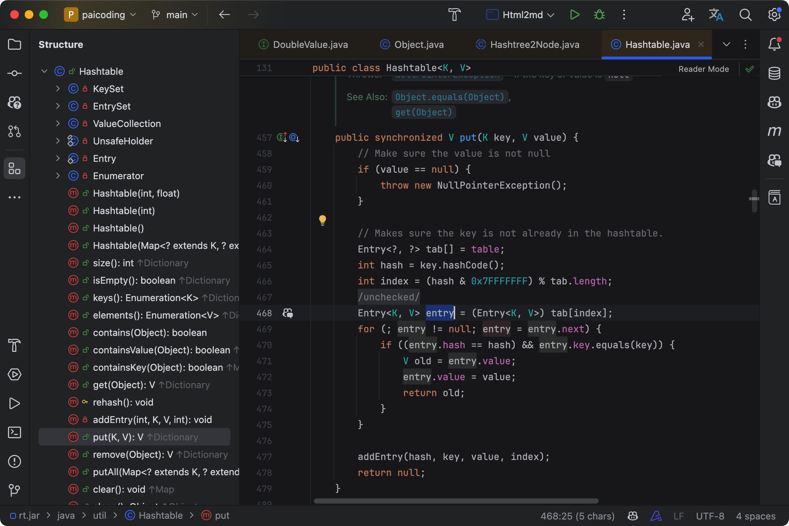

二哥的Java 进阶之路：Hashtable源码
## [并发容器和框架](https://javabetter.cn/sidebar/sanfene/javathread.html#%E5%B9%B6%E5%8F%91%E5%AE%B9%E5%99%A8%E5%92%8C%E6%A1%86%E6%9E%B6)
关于一些并发容器，可以去看看 [面渣逆袭：Java 集合连环三十问](https://mp.weixin.qq.com/s/SHkQ7LEOT0itt4bXMoDBPw)，里面有`CopyOnWriteArrayList`和`ConcurrentHashMap`这两种线程安全容器类的问答。。
### [71.Fork/Join 框架了解吗？](https://javabetter.cn/sidebar/sanfene/javathread.html#_71-fork-join-%E6%A1%86%E6%9E%B6%E4%BA%86%E8%A7%A3%E5%90%97)
Fork/Join 框架是 Java7 提供的一个用于并行执行任务的框架，是一个把大任务分割成若干个小任务，最终汇总每个小任务结果后得到大任务结果的框架。
要想掌握 Fork/Join 框架，首先需要理解两个点，**分而治之**和**工作窃取算法**。
**分而治之**
Fork/Join 框架的定义，其实就体现了分治思想：将一个规模为 N 的问题分解为 K 个规模较小的子问题，这些子问题相互独立且与原问题性质相同。求出子问题的解，就可得到原问题的解。
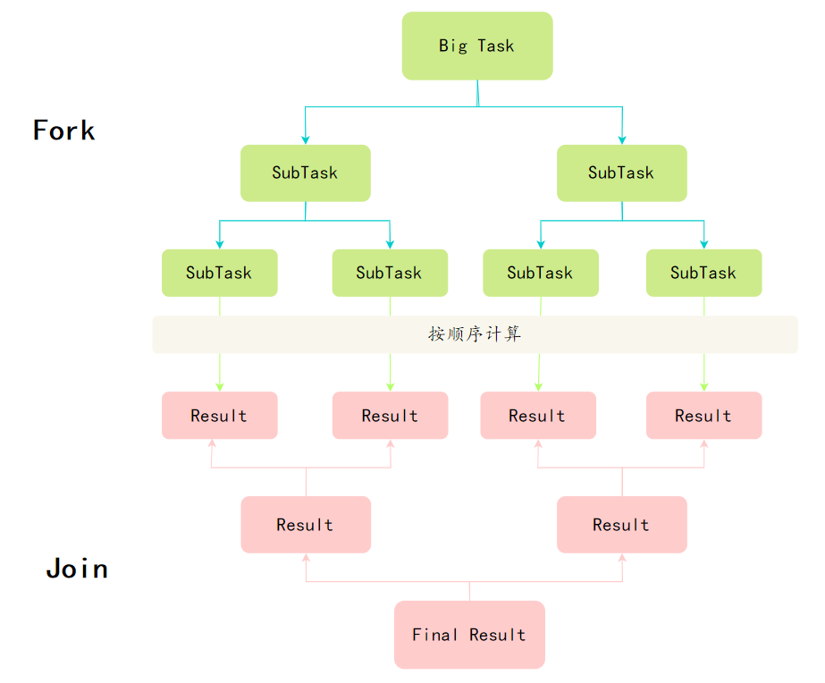

Fork/Join分治算法
**工作窃取算法**
大任务拆成了若干个小任务，把这些小任务放到不同的队列里，各自创建单独线程来执行队列里的任务。
那么问题来了，有的线程干活块，有的线程干活慢。干完活的线程不能让它空下来，得让它去帮没干完活的线程干活。它去其它线程的队列里窃取一个任务来执行，这就是所谓的**工作窃取**。
工作窃取发生的时候，它们会访问同一个队列，为了减少窃取任务线程和被窃取任务线程之间的竞争，通常任务会使用双端队列，被窃取任务线程永远从双端队列的头部拿，而窃取任务的线程永远从双端队列的尾部拿任务执行。
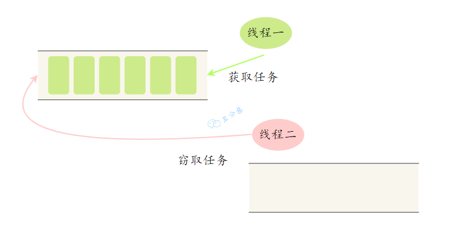

工作窃取
看一个 Fork/Join 框架应用的例子，计算 1~n 之间的和：1+2+3+…+n

- 设置一个分割阈值，任务大于阈值就拆分任务
- 任务有结果，所以需要继承 RecursiveTask
```java
public class CountTask extends RecursiveTask<Integer> {
    private static final int THRESHOLD = 16; // 阈值
    private int start;
    private int end;

    public CountTask(int start, int end) {
        this.start = start;
        this.end = end;
    }

    @Override
    protected Integer compute() {
        int sum = 0;
        // 如果任务足够小就计算任务
        boolean canCompute = (end - start) <= THRESHOLD;
        if (canCompute) {
            for (int i = start; i <= end; i++) {
                sum += i;
            }
        } else {
            // 如果任务大于阈值，就分裂成两个子任务计算
            int middle = (start + end) / 2;
            CountTask leftTask = new CountTask(start, middle);
            CountTask rightTask = new CountTask(middle + 1, end);
            // 执行子任务
            leftTask.fork();
            rightTask.fork(); // 等待子任务执行完，并得到其结果
            int leftResult = leftTask.join();
            int rightResult = rightTask.join(); // 合并子任务
            sum = leftResult + rightResult;
        }
        return sum;
    }

    public static void main(String[] args) {
        ForkJoinPool forkJoinPool = new ForkJoinPool(); // 生成一个计算任务，负责计算1+2+3+4
        CountTask task = new CountTask(1, 100); // 执行一个任务
        Future<Integer> result = forkJoinPool.submit(task);
        try {
            System.out.println(result.get());
        } catch (InterruptedException e) {
        } catch (ExecutionException e) {
        }
    }

}
```
ForkJoinTask 与一般 Task 的主要区别在于它需要实现 compute 方法，在这个方法里，首先需要判断任务是否足够小，如果足够小就直接执行任务。如果比较大，就必须分割成两个子任务，每个子任务在调用 fork 方法时，又会进 compute 方法，看看当前子任务是否需要继续分割成子任务，如果不需要继续分割，则执行当前子任务并返回结果。使用 join 方法会等待子任务执行完并得到其结果。

---
图文详解 71 道 Java 并发面试高频题，这次面试，一定吊打面试官，整理：沉默王二，戳[转载链接](https://mp.weixin.qq.com/s/bImCIoYsH_JEzTkBx2lj4A)，作者：三分恶，戳[原文链接](https://mp.weixin.qq.com/s/1jhBZrAb7bnvkgN1TgAUpw)。
*没有什么使我停留——除了目的，纵然岸旁有玫瑰、有绿荫、有宁静的港湾，我是不系之舟*。
**系列内容**：

- [面渣逆袭 Java SE 篇 👍](https://javabetter.cn/sidebar/sanfene/javase.html)
- [面渣逆袭 Java 集合框架篇 👍](https://javabetter.cn/sidebar/sanfene/javathread.html)
- [面渣逆袭 Java 并发编程篇 👍](https://javabetter.cn/sidebar/sanfene/collection.html)
- [面渣逆袭 JVM 篇 👍](https://javabetter.cn/sidebar/sanfene/jvm.html)
- [面渣逆袭 Spring 篇 👍](https://javabetter.cn/sidebar/sanfene/spring.html)
- [面渣逆袭 Redis 篇 👍](https://javabetter.cn/sidebar/sanfene/redis.html)
- [面渣逆袭 MyBatis 篇 👍](https://javabetter.cn/sidebar/sanfene/mybatis.html)
- [面渣逆袭 MySQL 篇 👍](https://javabetter.cn/sidebar/sanfene/mysql.html)
- [面渣逆袭操作系统篇 👍](https://javabetter.cn/sidebar/sanfene/os.html)
- [面渣逆袭计算机网络篇 👍](https://javabetter.cn/sidebar/sanfene/network.html)
- [面渣逆袭 RocketMQ 篇 👍](https://javabetter.cn/sidebar/sanfene/rocketmq.html)
- [面渣逆袭分布式篇 👍](https://javabetter.cn/sidebar/sanfene/fenbushi.html)
- [面渣逆袭微服务篇 👍](https://javabetter.cn/sidebar/sanfene/weifuwu.html)
- [面渣逆袭设计模式篇 👍](https://javabetter.cn/sidebar/sanfene/shejimoshi.html)
- [面渣逆袭 Linux 篇 👍](https://javabetter.cn/sidebar/sanfene/linux.html)
---
GitHub 上标星 10000+ 的开源知识库《[二哥的 Java 进阶之路](https://github.com/itwanger/toBeBetterJavaer)》第一版 PDF 终于来了！包括 Java 基础语法、数组&字符串、OOP、集合框架、Java IO、异常处理、Java 新特性、网络编程、NIO、并发编程、JVM 等等，共计 32 万余字，500+张手绘图，可以说是通俗易懂、风趣幽默……详情戳：[太赞了，GitHub 上标星 10000+ 的 Java 教程](https://javabetter.cn/overview/)
微信搜 **沉默王二** 或扫描下方二维码关注二哥的原创公众号沉默王二，回复 **222** 即可免费领取。


> 来自: [Java并发编程面试题，71道Java多线程八股文（2.1万字92张手绘图），面渣逆袭必看👍 | 二哥的Java进阶之路](https://javabetter.cn/sidebar/sanfene/javathread.html#_10-%E8%AF%B7%E8%AF%B4%E8%AF%B4-sleep-%E5%92%8C-wait-%E7%9A%84%E5%8C%BA%E5%88%AB-%E8%A1%A5%E5%85%85)

