## [锁](https://javabetter.cn/sidebar/sanfene/javathread.html#%E9%94%81)
### [26.synchronized 用过吗？怎么使用？](https://javabetter.cn/sidebar/sanfene/javathread.html#_26-synchronized-%E7%94%A8%E8%BF%87%E5%90%97-%E6%80%8E%E4%B9%88%E4%BD%BF%E7%94%A8)
在 Java 中，synchronized 是最常用的锁，它使用简单，并且可以保证线程安全，避免多线程并发访问时出现数据不一致的情况。
随着 JDK 版本的进化，synchronized 的性能也得到了进一步的提升，不再像以前样重量级了。
synchronized 可以用在方法和代码块中。
①、修饰方法

```java
public synchronized void increment() {
    this.count++;
}
```
当在方法声明中使用了 synchronized 关键字，就表示该方法是同步的，也就是说，线程在执行这个方法的时候，其他线程不能同时执行，需要等待锁释放。
如果是静态方法的话，锁的是这个类的 Class 对象，因为静态方法是属于类级别的。

```java
public static synchronized void increment() {
    count++;
}
```
②、修饰代码块

```java
public void increment() {
    synchronized (this) {
        this.count++;
    }
}
```
同步代码块可以减少需要同步的代码量，颗粒度更低，更灵活。synchronized 后面的括号中指定了要锁定的对象，可以是 this，也可以是其他对象。
> 
1. [Java 面试指南（付费）](https://javabetter.cn/zhishixingqiu/mianshi.html)收录的 360 面经同学 3 Java 后端技术一面面试原题：volatile 关键字，说说别的你知道的关键字
### [27.synchronized 的实现原理？](https://javabetter.cn/sidebar/sanfene/javathread.html#_27-synchronized-%E7%9A%84%E5%AE%9E%E7%8E%B0%E5%8E%9F%E7%90%86)
#### [synchronized 是怎么加锁的呢？](https://javabetter.cn/sidebar/sanfene/javathread.html#synchronized-%E6%98%AF%E6%80%8E%E4%B9%88%E5%8A%A0%E9%94%81%E7%9A%84%E5%91%A2)
synchronized 是 JVM 帮我们实现的，因此在使用的时候不用手动去 lock 和 unlock，JVM 会帮我们自动加锁和解锁。
①、synchronized 修饰代码块时，JVM 会通过 `monitorenter`、`monitorexit` 两个指令来实现同步：

- `monitorenter` 指向同步代码块的开始位置
- `monitorexit` 指向同步代码块的结束位置。使用 `javap -c -s -v -l SynchronizedDemo.class` 反编译一段 synchronized 代码块时，可以看到 monitorenter 和 monitorexit 指令。
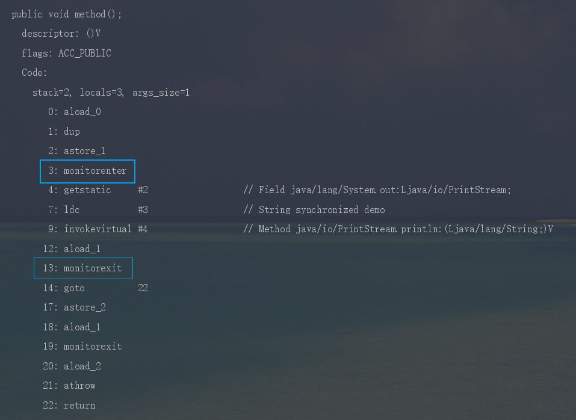

三分恶面渣逆袭：monitorenter和monitorexit
②、synchronized 修饰方法时，JVM 会通过 `ACC_SYNCHRONIZED` 标记符来实现同步。
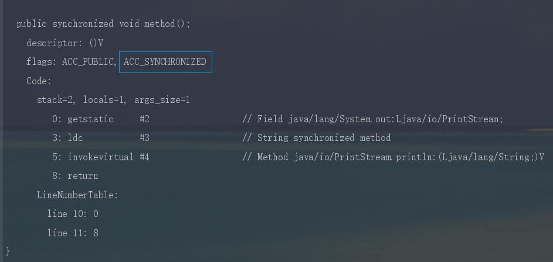

三分恶面渣逆袭：synchronized修饰同步方法
#### [synchronized 锁住的是什么呢？](https://javabetter.cn/sidebar/sanfene/javathread.html#synchronized-%E9%94%81%E4%BD%8F%E7%9A%84%E6%98%AF%E4%BB%80%E4%B9%88%E5%91%A2)
monitorenter、monitorexit 或者 ACC_SYNCHRONIZED 都是**基于 Monitor 实现**的。
实例对象结构里有对象头，对象头里面有一块结构叫 Mark Word，Mark Word 指针指向了**monitor**。
所谓的 Monitor 其实是一种**同步工具**，也可以说是一种**同步机制**。在 Java 虚拟机（HotSpot）中，Monitor 是由**ObjectMonitor 实现**的，可以叫做内部锁，或者 Monitor 锁。
ObjectMonitor 的工作原理：

- ObjectMonitor 有两个队列：_WaitSet、_EntryList，用来保存 ObjectWaiter 对象列表。
- _owner，获取 Monitor 对象的线程进入 _owner 区时， _count + 1。如果线程调用了 wait() 方法，此时会释放 Monitor 对象， _owner 恢复为空， _count - 1。同时该等待线程进入 _WaitSet 中，等待被唤醒。
```java
ObjectMonitor() {
    _header       = NULL;
    _count        = 0; // 记录线程获取锁的次数
    _waiters      = 0,
    _recursions   = 0;  //锁的重入次数
    _object       = NULL;
    _owner        = NULL;  // 指向持有ObjectMonitor对象的线程
    _WaitSet      = NULL;  // 处于wait状态的线程，会被加入到_WaitSet
    _WaitSetLock  = 0 ;
    _Responsible  = NULL ;
    _succ         = NULL ;
    _cxq          = NULL ;
    FreeNext      = NULL ;
    _EntryList    = NULL ;  // 处于等待锁block状态的线程，会被加入到该列表
    _SpinFreq     = 0 ;
    _SpinClock    = 0 ;
    OwnerIsThread = 0 ;
  }
```
可以类比一个去医院就诊的例子[18]：

- 首先，患者在**门诊大厅**前台或自助挂号机**进行挂号**；
- 随后，挂号结束后患者找到对应的**诊室就诊**：
- 诊室每次只能有一个患者就诊；
- 如果此时诊室空闲，直接进入就诊；
- 如果此时诊室内有其它患者就诊，那么当前患者进入**候诊室**，等待叫号；
- 就诊结束后，**走出就诊室**，候诊室的**下一位候诊患者**进入就诊室。

图片来源于网络：就诊
这个过程就和 Monitor 机制比较相似：

- **门诊大厅**：所有待进入的线程都必须先在**入口 Entry Set**挂号才有资格；
- **就诊室**：就诊室**_Owner**里里只能有一个线程就诊，就诊完线程就自行离开
- **候诊室**：就诊室繁忙时，进入**等待区（Wait Set）**，就诊室空闲的时候就从**等待区（Wait Set）**叫新的线程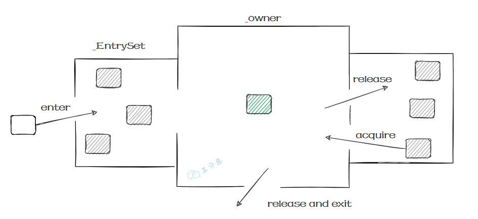

Java Montior机制
所以我们就知道了，同步是锁住的什么东西：

- monitorenter，在判断拥有同步标识 ACC_SYNCHRONIZED 抢先进入此方法的线程会优先拥有 Monitor 的 owner ，此时计数器 +1。
- monitorexit，当执行完退出后，计数器 -1，归 0 后被其他进入的线程获得。#### [会不会牵扯到 os 层面呢？](https://javabetter.cn/sidebar/sanfene/javathread.html#%E4%BC%9A%E4%B8%8D%E4%BC%9A%E7%89%B5%E6%89%AF%E5%88%B0-os-%E5%B1%82%E9%9D%A2%E5%91%A2)
会，synchronized 升级为重量级锁时，依赖于操作系统的互斥量（mutex）来实现，mutex 用于保证任何给定时间内，只有一个线程可以执行某一段特定的代码段。
> 
1. [Java 面试指南（付费）](https://javabetter.cn/zhishixingqiu/mianshi.html)收录的去哪儿面经同学 1 技术二面面试原题：synchronized 底层，会不会牵扯到 os 层面
### [28.除了原子性，synchronized 可见性，有序性，可重入性怎么实现？](https://javabetter.cn/sidebar/sanfene/javathread.html#_28-%E9%99%A4%E4%BA%86%E5%8E%9F%E5%AD%90%E6%80%A7-synchronized-%E5%8F%AF%E8%A7%81%E6%80%A7-%E6%9C%89%E5%BA%8F%E6%80%A7-%E5%8F%AF%E9%87%8D%E5%85%A5%E6%80%A7%E6%80%8E%E4%B9%88%E5%AE%9E%E7%8E%B0)
#### [synchronized 怎么保证可见性？](https://javabetter.cn/sidebar/sanfene/javathread.html#synchronized-%E6%80%8E%E4%B9%88%E4%BF%9D%E8%AF%81%E5%8F%AF%E8%A7%81%E6%80%A7)

- 线程加锁前，将清空工作内存中共享变量的值，从而使用共享变量时需要从主内存中重新读取最新的值。
- 线程加锁后，其它线程无法获取主内存中的共享变量。
- 线程解锁前，必须把共享变量的最新值刷新到主内存中。#### [synchronized 怎么保证有序性？](https://javabetter.cn/sidebar/sanfene/javathread.html#synchronized-%E6%80%8E%E4%B9%88%E4%BF%9D%E8%AF%81%E6%9C%89%E5%BA%8F%E6%80%A7)
synchronized 同步的代码块，具有排他性，一次只能被一个线程拥有，所以 synchronized 保证同一时刻，代码是单线程执行的。
因为 as-if-serial 语义的存在，单线程的程序能保证最终结果是有序的，但是不保证不会指令重排。
所以 synchronized 保证的有序是执行结果的有序性，而不是防止指令重排的有序性。
#### [synchronized 怎么实现可重入的呢？](https://javabetter.cn/sidebar/sanfene/javathread.html#synchronized-%E6%80%8E%E4%B9%88%E5%AE%9E%E7%8E%B0%E5%8F%AF%E9%87%8D%E5%85%A5%E7%9A%84%E5%91%A2)
可重入意味着同一个线程可以多次获得同一个锁，而不会被阻塞。具体来说，如果一个线程已经持有某个锁，那么它可以再次进入该锁保护的代码块或方法，而不会被阻塞。
synchronized 之所以支持可重入，是因为 Java 的对象头包含了一个 Mark Word，用于存储对象的状态，包括锁信息。
当一个线程获取对象锁时，JVM 会将该线程的 ID 写入 Mark Word，并将锁计数器设为 1。
如果一个线程尝试再次获取已经持有的锁，JVM 会检查 Mark Word 中的线程 ID。如果 ID 匹配，表示的是同一个线程，锁计数器递增。
当线程退出同步块时，锁计数器递减。如果计数器值为零，JVM 将锁标记为未持有状态，并清除线程 ID 信息。
### [29.锁升级？synchronized 优化了解吗？](https://javabetter.cn/sidebar/sanfene/javathread.html#_29-%E9%94%81%E5%8D%87%E7%BA%A7-synchronized-%E4%BC%98%E5%8C%96%E4%BA%86%E8%A7%A3%E5%90%97)
推荐阅读：[偏向锁、轻量级锁、重量级锁到底是什么？](https://javabetter.cn/thread/synchronized.html)
#### [什么是锁升级？](https://javabetter.cn/sidebar/sanfene/javathread.html#%E4%BB%80%E4%B9%88%E6%98%AF%E9%94%81%E5%8D%87%E7%BA%A7)
锁升级是 Java 虚拟机中的一个优化机制，用于提高多线程环境下 synchronized 的并发性能。锁升级涉及从较轻的锁状态（如无锁或偏向锁）逐步升级到较重的锁状态（如轻量级锁和重量级锁），以适应不同程度的竞争情况。
Java 对象头里的 `Mark Word` 会记录锁的状态，一共有四种状态：
①、无锁状态，在这个状态下，没有线程试图获取锁。
②、偏向锁，当第一个线程访问同步块时，锁会进入偏向模式。Mark Word 会被设置为偏向模式，并且存储了获取它的线程 ID。
偏向锁的目的是消除同一线程的后续锁获取和释放的开销。如果同一线程再次请求锁，就无需再次同步。
③、当有多个线程竞争锁，但没有锁竞争的强烈迹象（即线程交替执行同步块）时，偏向锁会升级为轻量级锁。
线程尝试通过[CAS 操作](https://javabetter.cn/thread/cas.html)（Compare-And-Swap）将对象头的 Mark Word 替换为指向锁记录的指针。如果成功，当前线程获取轻量级锁；如果失败，说明有竞争。
④、重量级锁，当锁竞争激烈时，轻量级锁会膨胀为重量级锁。
重量级锁通过将对象头的 Mark Word 指向监视器（Monitor）对象来实现，该对象包含了锁的持有者、锁的等待队列等信息。


三分恶面渣逆袭：Mark Word变化
#### [synchronized 做了哪些优化？](https://javabetter.cn/sidebar/sanfene/javathread.html#synchronized-%E5%81%9A%E4%BA%86%E5%93%AA%E4%BA%9B%E4%BC%98%E5%8C%96)
在 JDK1.6 之前，synchronized 是直接调用 ObjectMonitor 的 enter 和 exit 实现的，这种锁也被称为**重量级锁**。这也是为什么很多声音说不要用 synchronized 的原因，有点“谈虎色变”的感觉。
从 JDK 1.6 开始，HotSpot 对 Java 中的锁进行优化，如增加了适应性自旋、锁消除、锁粗化、轻量级锁和偏向锁等优化策略，极大提升了 synchronized 的性能。
**①、偏向锁**：当一个线程首次获得锁时，JVM 会将锁标记为偏向这个线程，将锁的标志位设置为偏向模式，并且在对象头中记录下该线程的 ID。
之后，当相同的线程再次请求这个锁时，就无需进行额外的同步。如果另一个线程尝试获取这个锁，偏向模式会被撤销，并且锁会升级为轻量级锁。
**②、轻量级锁**：多个线程在不同时段获取同一把锁，即不存在锁竞争的情况，也就没有线程阻塞。针对这种情况，JVM 采用轻量级锁来避免线程的阻塞与唤醒。
当一个线程尝试获取轻量级锁时，它会在自己的栈帧中创建一个锁记录（Lock Record），然后尝试使用 CAS 操作将对象头的 Mark Word 替换为指向锁记录的指针。
如果成功，该线程持有锁；如果失败，表示有其他线程竞争，锁会升级为重量级锁。
**③、自旋锁**：当线程尝试获取轻量级锁失败时，它会进行自旋，即循环检查锁是否可用，以避免立即进入阻塞状态。
自旋的次数不是固定的，而是根据之前在同一个锁上的自旋时间和锁的状态动态调整的。
**④、锁粗化**：如果 JVM 检测到一系列连续的锁操作实际上是在单一线程中完成的，则会将多个锁操作合并为一个更大范围的锁操作，这可以减少锁请求的次数。
锁粗化主要针对循环内连续加锁解锁的情况进行优化。
**⑤、锁消除**：JVM 的即时编译器（[JIT](https://javabetter.cn/jvm/jit.html)）可以在运行时进行代码分析，如果发现某些锁操作不可能被多个线程同时访问，那么这些锁操作就会被完全消除。锁消除可以减少不必要的同步开销。
#### [锁升级的过程是什么样的？](https://javabetter.cn/sidebar/sanfene/javathread.html#%E9%94%81%E5%8D%87%E7%BA%A7%E7%9A%84%E8%BF%87%E7%A8%8B%E6%98%AF%E4%BB%80%E4%B9%88%E6%A0%B7%E7%9A%84)
无锁-->偏向锁---> 轻量级锁---->重量级锁。
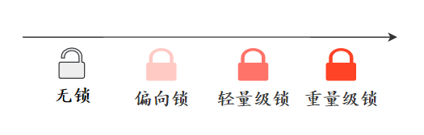

三分恶面渣逆袭：锁升级方向
稍微加点描述：
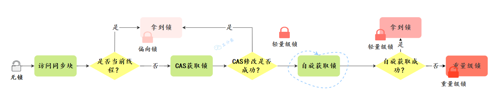

三分恶面渣逆袭：锁升级简略过程
完整的升级过程：
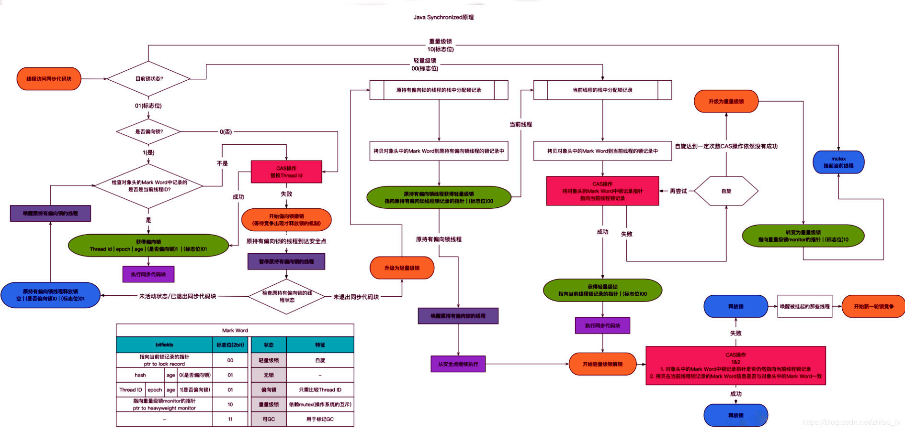

三分恶面渣逆袭：synchronized 锁升级过程
详细解释一下：
**①、从无锁到偏向锁：**
当一个线程首次访问同步块时，如果此对象无锁状态且偏向锁未被禁用，JVM 会将该对象头的锁标记改为偏向锁状态，并记录下当前线程的 ID。此时，对象头中的 Mark Word 中存储了持有偏向锁的线程 ID。
如果另一个线程尝试获取这个已被偏向的锁，JVM 会检查当前持有偏向锁的线程是否活跃。如果持有偏向锁的线程不活跃，则可以将锁重偏向至新的线程；如果持有偏向锁的线程还活跃，则需要撤销偏向锁，升级为轻量级锁。
**②、偏向锁的轻量级锁：**
进行偏向锁撤销时，会遍历堆栈的所有锁记录，暂停拥有偏向锁的线程，并检查锁对象。如果这个过程中发现有其他线程试图获取这个锁，JVM 会撤销偏向锁，并将锁升级为轻量级锁。
当有两个或以上线程竞争同一个偏向锁时，偏向锁模式不再有效，此时偏向锁会被撤销，对象的锁状态会升级为轻量级锁。
**③、轻量级锁到重量级锁：**
轻量级锁通过线程自旋来等待锁释放。如果自旋超过预定次数（自旋次数是可调的，并且自适应的），表明锁竞争激烈，轻量级锁的自旋已经不再高效。
当自旋等待失败，或者有线程在等待队列中等待相同的轻量级锁时，轻量级锁会升级为重量级锁。在这种情况下，JVM 会在操作系统层面创建一个互斥锁（Mutex），所有进一步尝试获取该锁的线程将会被阻塞，直到锁被释放。
> 
1. [Java 面试指南（付费）](https://javabetter.cn/zhishixingqiu/mianshi.html)收录的小米春招同学 K 一面面试原题：synchronized 锁升级过程
2. [Java 面试指南（付费）](https://javabetter.cn/zhishixingqiu/mianshi.html)收录的农业银行同学 1 面试原题：Java 的锁的优化
3. [Java 面试指南（付费）](https://javabetter.cn/zhishixingqiu/mianshi.html)收录的去哪儿面经同学 1 技术二面面试原题：锁升级，synchronized 底层，会不会牵扯到 os 层面
4. [Java 面试指南（付费）](https://javabetter.cn/zhishixingqiu/mianshi.html)收录的快手同学 2 一面面试原题：锁升级的过程？
### [30.synchronized 和 ReentrantLock 的区别？](https://javabetter.cn/sidebar/sanfene/javathread.html#_30-synchronized-%E5%92%8C-reentrantlock-%E7%9A%84%E5%8C%BA%E5%88%AB)
[synchronized](https://javabetter.cn/thread/synchronized-1.html) 是一个关键字，[ReentrantLock](https://javabetter.cn/thread/reentrantLock.html)是 Lock 接口的一个实现。


三分恶面渣逆袭：synchronized和ReentrantLock的区别
它们都可以用来实现同步，但也有一些区别：

- ReentrantLock 可以实现多路选择通知（绑定多个 [Condition](https://javabetter.cn/thread/condition.html)），而 synchronized 只能通过 wait 和 notify/notifyAll 方法唤醒一个线程或者唤醒全部线程（单路通知）；
- ReentrantLock 必须手动释放锁。通常需要在 finally 块中调用 unlock 方法以确保锁被正确释放；synchronized 会自动释放锁，当同步块执行完毕时，由 JVM 自动释放，不需要手动操作。
- ReentrantLock 通常能提供更好的性能，因为它可以更细粒度控制锁；synchronized 只能同步代码快或者方法，随着 JDK 版本的升级，两者之间性能差距已经不大了。#### [使用方式有什么不同？](https://javabetter.cn/sidebar/sanfene/javathread.html#%E4%BD%BF%E7%94%A8%E6%96%B9%E5%BC%8F%E6%9C%89%E4%BB%80%E4%B9%88%E4%B8%8D%E5%90%8C)
synchronized 可以直接在方法上加锁，也可以在代码块上加锁（无需手动释放锁，锁会自动释放），而 ReentrantLock 必须手动声明来加锁和释放锁。

```java
// synchronized 修饰方法
public synchronized void method() {
    // 业务代码
}

// synchronized 修饰代码块
synchronized (this) {
    // 业务代码
}

// ReentrantLock 加锁
ReentrantLock lock = new ReentrantLock();
lock.lock();
try {
    // 业务代码
} finally {
    lock.unlock();
}
```
随着 JDK 版本的升级，synchronized 的性能已经可以媲美 ReentrantLock 了，加入了偏向锁、轻量级锁和重量级锁的自适应优化等，所以可以大胆地用。
#### [功能特点有什么不同？](https://javabetter.cn/sidebar/sanfene/javathread.html#%E5%8A%9F%E8%83%BD%E7%89%B9%E7%82%B9%E6%9C%89%E4%BB%80%E4%B9%88%E4%B8%8D%E5%90%8C)
如果需要更细粒度的控制（如可中断的锁操作、尝试非阻塞获取锁、超时获取锁或者使用公平锁等），可以使用 Lock。

- ReentrantLock 提供了一种能够中断等待锁的线程的机制，通过 `lock.lockInterruptibly()`来实现这个机制。
- ReentrantLock 可以指定是公平锁还是非公平锁。
- ReentrantReadWriteLock 读写锁，读锁是共享锁，写锁是独占锁，读锁可以同时被多个线程持有，写锁只能被一个线程持有。这种锁的设计可以提高性能，特别是在读操作的数量远远超过写操作的情况下。Lock 还提供了`newCondition()`方法来创建等待通知条件[Condition](https://javabetter.cn/thread/condition.html)，比 synchronized 与 `wait()`、 `notify()/notifyAll()`方法的组合更强大。

```java
ReentrantLock lock = new ReentrantLock();
Condition condition = lock.newCondition();
```
#### [并发量大的情况下，使用 synchronized 还是 ReentrantLock？](https://javabetter.cn/sidebar/sanfene/javathread.html#%E5%B9%B6%E5%8F%91%E9%87%8F%E5%A4%A7%E7%9A%84%E6%83%85%E5%86%B5%E4%B8%8B-%E4%BD%BF%E7%94%A8-synchronized-%E8%BF%98%E6%98%AF-reentrantlock)
在并发量特别高的情况下，ReentrantLock 的性能可能会优于 synchronized，原因包括：

- ReentrantLock 提供了超时和公平锁等特性，可以更好地应对复杂的并发场景 。
- ReentrantLock 允许更细粒度的锁控制，可以有效减少锁竞争。
- ReentrantLock 支持条件变量 Condition，可以实现比 synchronized 更复杂的线程间通信机制。#### [Lock 了解吗？](https://javabetter.cn/sidebar/sanfene/javathread.html#lock-%E4%BA%86%E8%A7%A3%E5%90%97)
Lock 是 Java `java.util.concurrent.locks` 包中的一个接口，最常用的实现类是 ReentrantLock，提供了比 synchronized 更多的功能，如可中断的锁操作、尝试非阻塞获取锁、超时获取锁或者使用公平锁等。
#### [Lock.lock()的具体实现逻辑了解吗？](https://javabetter.cn/sidebar/sanfene/javathread.html#lock-lock-%E7%9A%84%E5%85%B7%E4%BD%93%E5%AE%9E%E7%8E%B0%E9%80%BB%E8%BE%91%E4%BA%86%E8%A7%A3%E5%90%97)
lock 方法用来获取锁，如果锁已经被其他线程获取，当前线程会一直等待直到获取锁。
具体实现由内部的 Sync 类来实现，ReentrantLock 有两种 Sync 实现：NonfairSync 和 FairSync，分别对应非公平锁和公平锁。
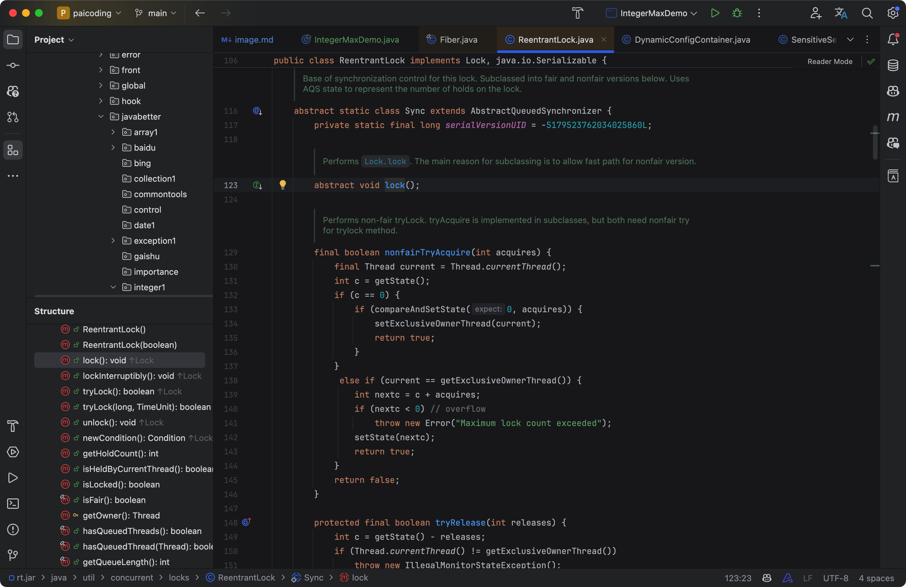

二哥的Java 进阶之路：Lock.lock() 方法源码
非公平锁尝试让当前线程直接通过 CAS 操作获取锁，如果获取失败则进入 AQS 队列等待。

```java
final void lock() {
    if (compareAndSetState(0, 1))  // 尝试直接获取锁
        setExclusiveOwnerThread(Thread.currentThread());
    else
        acquire(1);  // 如果获取失败，进入AQS队列等待
}
```
公平锁会直接让线程进入等待队列，按顺序获取锁，不允许插队。

```java
final void lock() {
    acquire(1);
}
```
acquire 方法由 AQS（AbstractQueuedSynchronizer）提供，是整个锁机制的核心，管理着获取和释放锁的流程、队列等待、线程调度等复杂操作。

```java
public final void acquire(int arg) {
    if (!tryAcquire(arg) &&
        acquireQueued(addWaiter(Node.EXCLUSIVE), arg))
        selfInterrupt();
}
```
> 
1. [Java 面试指南（付费）](https://javabetter.cn/zhishixingqiu/mianshi.html)收录的小米春招同学 K 一面面试原题：synchronized 和 lock 区别
2. [Java 面试指南（付费）](https://javabetter.cn/zhishixingqiu/mianshi.html)收录的小米面经同学 F 面试原题：synchronized 和 ReentrantLock 区别和场景
3. [Java 面试指南（付费）](https://javabetter.cn/zhishixingqiu/mianshi.html)收录的得物面经同学 8 一面面试原题：在并发量特别高的情况下是使用 synchronized 还是 ReentrantLock
4. [Java 面试指南（付费）](https://javabetter.cn/zhishixingqiu/mianshi.html)收录的拼多多面经同学 4 技术一面面试原题：java多线程，同步与互斥
5. [Java 面试指南（付费）](https://javabetter.cn/zhishixingqiu/mianshi.html)收录的快手同学 2 一面面试原题：Lock了解吗？Lock.lock()的具体实现逻辑？
6. [Java 面试指南（付费）](https://javabetter.cn/zhishixingqiu/mianshi.html)收录的理想汽车面经同学 2 一面面试原题：synchronized VS ReentrantLock VS CAS
### [31.AQS 了解多少？](https://javabetter.cn/sidebar/sanfene/javathread.html#_31-aqs-%E4%BA%86%E8%A7%A3%E5%A4%9A%E5%B0%91)
推荐阅读：[到底什么是 AQS?](https://javabetter.cn/thread/aqs.html)
AQS，也就是抽象队列同步器，由 Doug Lea 设计，是 Java 并发包`java.util.concurrent`的核心框架类，许多同步类的实现都依赖于它，如 ReentrantLock、Semaphore、CountDownLatch 等。
AQS 的思想是，如果被请求的共享资源空闲，则当前线程能够成功获取资源；否则，它将进入一个等待队列，当有其他线程释放资源时，系统会挑选等待队列中的一个线程，赋予其资源。
整个过程通过维护一个 int 类型的状态和一个先进先出（FIFO）的队列，来实现对共享资源的管理。


三分恶面渣逆袭：AQS抽象队列同步器
①、同步状态 state 由 volatile 修饰，保证了多线程之间的可见性；

```java
private volatile int state;
```
②、同步队列是通过内部定义的 Node 类来实现的，每个 Node 包含了等待状态、前后节点、线程的引用等。

```java
static final class Node {
    static final int CANCELLED =  1;
    static final int SIGNAL    = -1;
    static final int CONDITION = -2;
    static final int PROPAGATE = -3;

    volatile Node prev;

    volatile Node next;

    volatile Thread thread;
}
```
AQS 支持两种同步方式：

- 独占模式：这种方式下，每次只能有一个线程持有锁，例如 ReentrantLock。
- 共享模式：这种方式下，多个线程可以同时获取锁，例如 Semaphore 和 CountDownLatch。子类可以通过继承 AQS 并实现它的方法来管理同步状态，这些方法包括：

- `tryAcquire`：独占方式尝试获取资源，成功则返回 true，失败则返回 false；
- `tryRelease`：独占方式尝试释放资源；
- `tryAcquireShared(int arg)`：共享方式尝试获取资源；
- `tryReleaseShared(int arg)`：共享方式尝试释放资源；
- `isHeldExclusively()`：该线程是否正在独占资源。如果共享资源被占用，需要一种特定的阻塞等待唤醒机制来保证锁的分配，AQS 会将竞争共享资源失败的线程添加到一个 CLH 队列中。


三分恶面渣逆袭：CLH队列
在 CLH 锁中，当一个线程尝试获取锁并失败时，它会将自己添加到队列的尾部并自旋，等待前一个节点的线程释放锁。
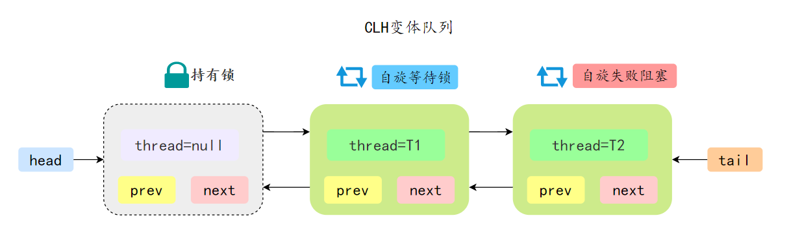

三分恶面渣逆袭：AQS变种CLH队列
> 
1. [Java 面试指南（付费）](https://javabetter.cn/zhishixingqiu/mianshi.html)收录的微众银行同学 1 Java 后端一面的原题：聊一聊 AQS
2. [Java 面试指南（付费）](https://javabetter.cn/zhishixingqiu/mianshi.html)收录的荣耀面经同学 4 面试原题：说一些你自己熟悉的技术(说了AQS，锁)
### [32.ReentrantLock 实现原理？](https://javabetter.cn/sidebar/sanfene/javathread.html#_32-reentrantlock-%E5%AE%9E%E7%8E%B0%E5%8E%9F%E7%90%86)
Lock 接口提供了比 synchronized 关键字更灵活的锁操作。[ReentrantLock](https://javabetter.cn/thread/reentrantLock.html) 就是 Lock 接口的一个实现，它提供了与 synchronized 关键字类似的锁功能，但更加灵活。

```java
class CounterWithLock {
    private int count = 0;
    private final Lock lock = new ReentrantLock();

    public void increment() {
        lock.lock();  // 获取锁
        try {
            count++;
        } finally {
            lock.unlock();  // 释放锁
        }
    }

    public int getCount() {
        return count;
    }
}
```
increment 方法先上锁，然后尝试增加 count 的值，在完成操作后释放锁。这样就可以保证 count 的操作是线程安全的。
ReentrantLock 是可重入的独占锁，只能有一个线程获取该锁，其它想获取该锁的线程会被阻塞。
可重入表示当前线程获取该锁后再次获取不会被阻塞，也就意味着同一个线程可以多次获得同一个锁而不会发生死锁。
`new ReentrantLock()` 默认创建的是非公平锁 NonfairSync。在非公平锁模式下，锁可能会授予刚刚请求它的线程，而不考虑等待时间。
ReentrantLock 也支持公平锁，该模式下，锁会授予等待时间最长的线程。
ReentrantLock 内部通过一个计数器来跟踪锁的持有次数。当线程调用`lock()`方法获取锁时，ReentrantLock 会检查当前状态，判断锁是否已经被其他线程持有。如果没有被持有，则当前线程将获得锁；如果锁已被其他线程持有，则当前线程将根据锁的公平性策略，可能会被加入到等待队列中。
线程首次获取锁时，计数器值变为 1；如果同一线程再次获取锁，计数器增加；每释放一次锁，计数器减 1。
当线程调用`unlock()`方法时，ReentrantLock 会将持有锁的计数减 1，如果计数到达 0，则释放锁，并唤醒等待队列中的线程来竞争锁。


三分恶面渣逆袭：ReentrantLock 非公平锁加锁流程简图
> 
1. [Java 面试指南（付费）](https://javabetter.cn/zhishixingqiu/mianshi.html)收录的小米春招同学 K 一面面试原题：公平锁和非公平锁 lock 怎么现实一个非公平锁
2. [Java 面试指南（付费）](https://javabetter.cn/zhishixingqiu/mianshi.html)收录的oppo 面经同学 8 后端开发秋招一面面试原题：讲讲ReentrantLock
### [33.ReentrantLock 怎么实现公平锁的？](https://javabetter.cn/sidebar/sanfene/javathread.html#_33-reentrantlock-%E6%80%8E%E4%B9%88%E5%AE%9E%E7%8E%B0%E5%85%AC%E5%B9%B3%E9%94%81%E7%9A%84)
ReentrantLock 的默认构造方法创建的是非公平锁 NonfairSync。

```java
public ReentrantLock() {
    sync = new NonfairSync();
}
```
可以通过有参构造方法传递 true 参数来创建公平锁 FairSync。

```java
ReentrantLock lock = new ReentrantLock(true);
--- ReentrantLock
// true 代表公平锁，false 代表非公平锁
public ReentrantLock(boolean fair) {
    sync = fair ? new FairSync() : new NonfairSync();
}
```
FairSync、NonfairSync 都是 ReentrantLock 的内部类，分别实现了公平锁和非公平锁的逻辑。
#### [非公平锁和公平锁有什么不同？](https://javabetter.cn/sidebar/sanfene/javathread.html#%E9%9D%9E%E5%85%AC%E5%B9%B3%E9%94%81%E5%92%8C%E5%85%AC%E5%B9%B3%E9%94%81%E6%9C%89%E4%BB%80%E4%B9%88%E4%B8%8D%E5%90%8C)
①、公平锁意味着在多个线程竞争锁时，获取锁的顺序与线程请求锁的顺序相同，即先来先服务（FIFO）。
虽然能保证锁的顺序，但实现起来比较复杂，因为需要额外维护一个有序队列。
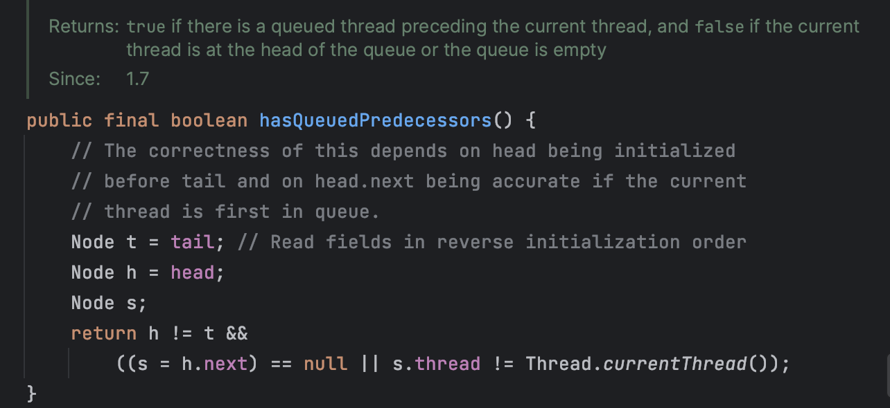

二哥的 Java 进阶之路
②、非公平锁不保证线程获取锁的顺序，当锁被释放时，任何请求锁的线程都有机会获取锁，而不是按照请求的顺序。
> 
1. [Java 面试指南（付费）](https://javabetter.cn/zhishixingqiu/mianshi.html)收录的快手面经同学 7 Java 后端技术一面面试原题：介绍一下公平锁与非公平锁
#### [怎么实现一个非公平锁呢？](https://javabetter.cn/sidebar/sanfene/javathread.html#%E6%80%8E%E4%B9%88%E5%AE%9E%E7%8E%B0%E4%B8%80%E4%B8%AA%E9%9D%9E%E5%85%AC%E5%B9%B3%E9%94%81%E5%91%A2)
要实现一个非公平锁，只需要在创建 ReentrantLock 实例时，不传递任何参数或者传递 false 给它的构造方法就好了。
> 
1. [Java 面试指南（付费）](https://javabetter.cn/zhishixingqiu/mianshi.html)收录的小米春招同学 K 一面面试原题：公平锁和非公平锁 lock 怎么现实一个非公平锁
### [34.CAS 了解多少？](https://javabetter.cn/sidebar/sanfene/javathread.html#_34-cas-%E4%BA%86%E8%A7%A3%E5%A4%9A%E5%B0%91)
推荐阅读：[一文彻底搞清楚 Java 实现 CAS 的原理](https://javabetter.cn/thread/cas.html)
在 Java 中，我们可以使用 [synchronized](https://javabetter.cn/thread/synchronized-1.html)关键字和 `CAS` 来实现加锁效果。
CAS 是一种乐观锁的实现方式，全称为“比较并交换”（Compare-and-Swap），是一种无锁的原子操作。
synchronized 是悲观锁，尽管随着 JDK 版本的升级，synchronized 关键字已经“轻量级”了很多，但依然是悲观锁，线程开始执行第一步就要获取锁，一旦获得锁，其他的线程进入后就会阻塞并等待锁。
CAS 是乐观锁，线程执行的时候不会加锁，它会假设此时没有冲突，然后完成某项操作；如果因为冲突失败了就重试，直到成功为止。
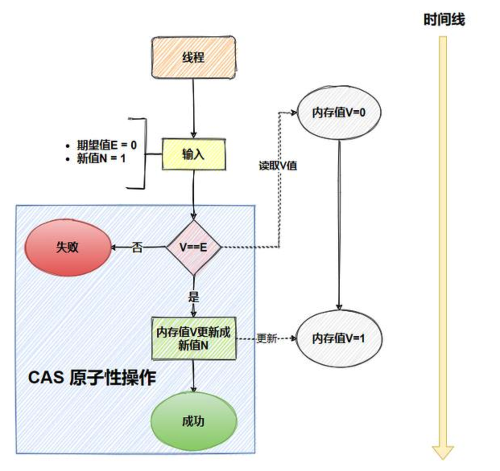

CAS 原子性：博客园的紫薇哥哥
在 CAS 中，有这样三个值：

- V：要更新的变量(var)
- E：预期值(expected)
- N：新值(new)比较并交换的过程如下：
判断 V 是否等于 E，如果等于，将 V 的值设置为 N；如果不等，说明已经有其它线程更新了 V，于是当前线程放弃更新，什么都不做。
这里的预期值 E 本质上指的是“旧值”。
这个比较和替换的操作是原子的，即不可中断，确保了数据的一致性。
举个例子，变量当前的值为 0，需要将其更新为 1，可以借助 AtomicInteger 类的 compareAndSet 方法来实现。

```java
AtomicInteger atomicInteger = new AtomicInteger(0);
int expect = 0;
int update = 1;
atomicInteger.compareAndSet(expect, update);
```
compareAndSet 就是一个 CAS 方法，它调用的是 Unsafe 的 compareAndSwapInt。
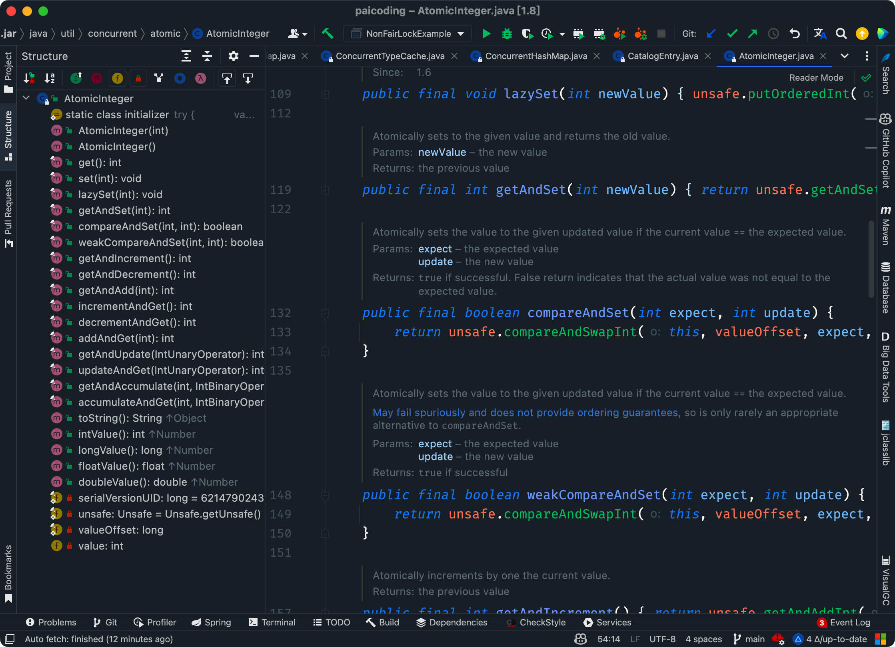

为了保证CAS的原子性，CPU 提供了两种实现方式：
①、总线锁定，通过锁定 CPU 的总线，禁止其他 CPU 或设备访问内存。在进行操作时，CPU 发出一个 LOCK 信号，这会阻止其他处理器对内存地址进行操作，直到当前指令执行完成。


总线锁定：博客园的紫薇哥哥
②、缓存锁定，当多个 CPU 操作同一块内存地址时，如果该内存地址已经被缓存到某个 CPU 的缓存中，缓存锁定机制会锁定该缓存行，防止其他 CPU 对这块内存进行修改。
现代CPU基本都支持和使用缓存锁定机制。
> 
1. [Java 面试指南（付费）](https://javabetter.cn/zhishixingqiu/mianshi.html)收录的华为面经同学 8 技术二面面试原题：乐观锁是怎样实现的？
2. [Java 面试指南（付费）](https://javabetter.cn/zhishixingqiu/mianshi.html)收录的携程面经同学 1 Java 后端技术一面面试原题：cas 和 aba（原子操作+时间戳）
3. [Java 面试指南（付费）](https://javabetter.cn/zhishixingqiu/mianshi.html)收录的腾讯面经同学 27 云后台技术一面面试原题：CAS算法具体内容是啥？他怎么保证数据原子性（这个没答出来）
### [35.CAS 有什么问题？如何解决？](https://javabetter.cn/sidebar/sanfene/javathread.html#_35-cas-%E6%9C%89%E4%BB%80%E4%B9%88%E9%97%AE%E9%A2%98-%E5%A6%82%E4%BD%95%E8%A7%A3%E5%86%B3)
CAS 存在三个经典问题。


三分恶面渣逆袭：CAS三大问题
#### [什么是 ABA 问题？如何解决？](https://javabetter.cn/sidebar/sanfene/javathread.html#%E4%BB%80%E4%B9%88%E6%98%AF-aba-%E9%97%AE%E9%A2%98-%E5%A6%82%E4%BD%95%E8%A7%A3%E5%86%B3)
如果一个位置的值原来是 A，后来被改为 B，再后来又被改回 A，那么进行 CAS 操作的线程将无法知晓该位置的值在此期间已经被修改过。
可以使用版本号/时间戳的方式来解决 ABA 问题。
比如说，每次变量更新时，不仅更新变量的值，还更新一个版本号。CAS 操作时不仅要求值匹配，还要求版本号匹配。

```java
public class OptimisticLockExample {
    private int version;
    private int value;

    public synchronized boolean updateValue(int newValue, int currentVersion) {
        if (this.version == currentVersion) {
            this.value = newValue;
            this.version++;
            return true;
        }
        return false;
    }
}
```
Java 的 AtomicStampedReference 类就实现了这种机制，它会同时检查引用值和 stamp 是否都相等。
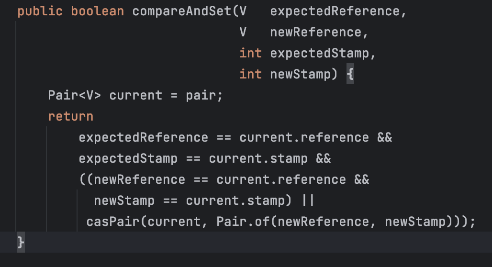

二哥的 Java 进阶之路：AtomicStampedReference
#### [循环性能开销](https://javabetter.cn/sidebar/sanfene/javathread.html#%E5%BE%AA%E7%8E%AF%E6%80%A7%E8%83%BD%E5%BC%80%E9%94%80)
自旋 CAS，如果一直循环执行，一直不成功，会给 CPU 带来非常大的执行开销。
> 怎么解决循环性能开销问题？

在 Java 中，很多使用自旋 CAS 的地方，会有一个自旋次数的限制，超过一定次数，就停止自旋。
#### [只能保证一个变量的原子操作](https://javabetter.cn/sidebar/sanfene/javathread.html#%E5%8F%AA%E8%83%BD%E4%BF%9D%E8%AF%81%E4%B8%80%E4%B8%AA%E5%8F%98%E9%87%8F%E7%9A%84%E5%8E%9F%E5%AD%90%E6%93%8D%E4%BD%9C)
CAS 保证的是对一个变量执行操作的原子性，如果对多个变量操作时，CAS 目前无法直接保证操作的原子性的。
> 怎么解决只能保证一个变量的原子操作问题？


- 可以考虑改用锁来保证操作的原子性
- 可以考虑合并多个变量，将多个变量封装成一个对象，通过 AtomicReference 来保证原子性。> 
1. [Java 面试指南（付费）](https://javabetter.cn/zhishixingqiu/mianshi.html)收录的携程面经同学 1 Java 后端技术一面面试原题：cas 和 aba（原子操作+时间戳）
### [36.Java 有哪些保证原子性的方法？如何保证多线程下 i++ 结果正确？](https://javabetter.cn/sidebar/sanfene/javathread.html#_36-java-%E6%9C%89%E5%93%AA%E4%BA%9B%E4%BF%9D%E8%AF%81%E5%8E%9F%E5%AD%90%E6%80%A7%E7%9A%84%E6%96%B9%E6%B3%95-%E5%A6%82%E4%BD%95%E4%BF%9D%E8%AF%81%E5%A4%9A%E7%BA%BF%E7%A8%8B%E4%B8%8B-i-%E7%BB%93%E6%9E%9C%E6%AD%A3%E7%A1%AE)
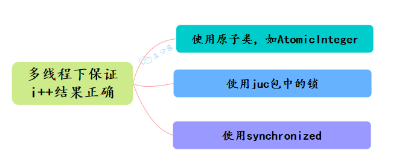

Java保证原子性方法

- 使用循环原子类，例如 AtomicInteger，实现 i++原子操作
- 使用 juc 包下的锁，如 ReentrantLock ，对 i++操作加锁 lock.lock()来实现原子性
- 使用 synchronized，对 i++操作加锁### [37.原子操作类了解多少？](https://javabetter.cn/sidebar/sanfene/javathread.html#_37-%E5%8E%9F%E5%AD%90%E6%93%8D%E4%BD%9C%E7%B1%BB%E4%BA%86%E8%A7%A3%E5%A4%9A%E5%B0%91)
当程序更新一个变量时，如果多线程同时更新这个变量，可能得到期望之外的值，比如变量 i=1，A 线程更新 i+1，B 线程也更新 i+1，经过两个线程操作之后可能 i 不等于 3，而是等于 2。因为 A 和 B 线程在更新变量 i 的时候拿到的 i 都是 1，这就是线程不安全的更新操作，一般我们会使用 synchronized 来解决这个问题，synchronized 会保证多线程不会同时更新变量 i。
其实除此之外，还有更轻量级的选择，Java 从 JDK 1.5 开始提供了 java.util.concurrent.atomic 包，这个包中的原子操作类提供了一种用法简单、性能高效、线程安全地更新一个变量的方式。
因为变量的类型有很多种，所以在 Atomic 包里一共提供了 13 个类，属于 4 种类型的原子更新方式，分别是原子更新基本类型、原子更新数组、原子更新引用和原子更新属性（字段）。
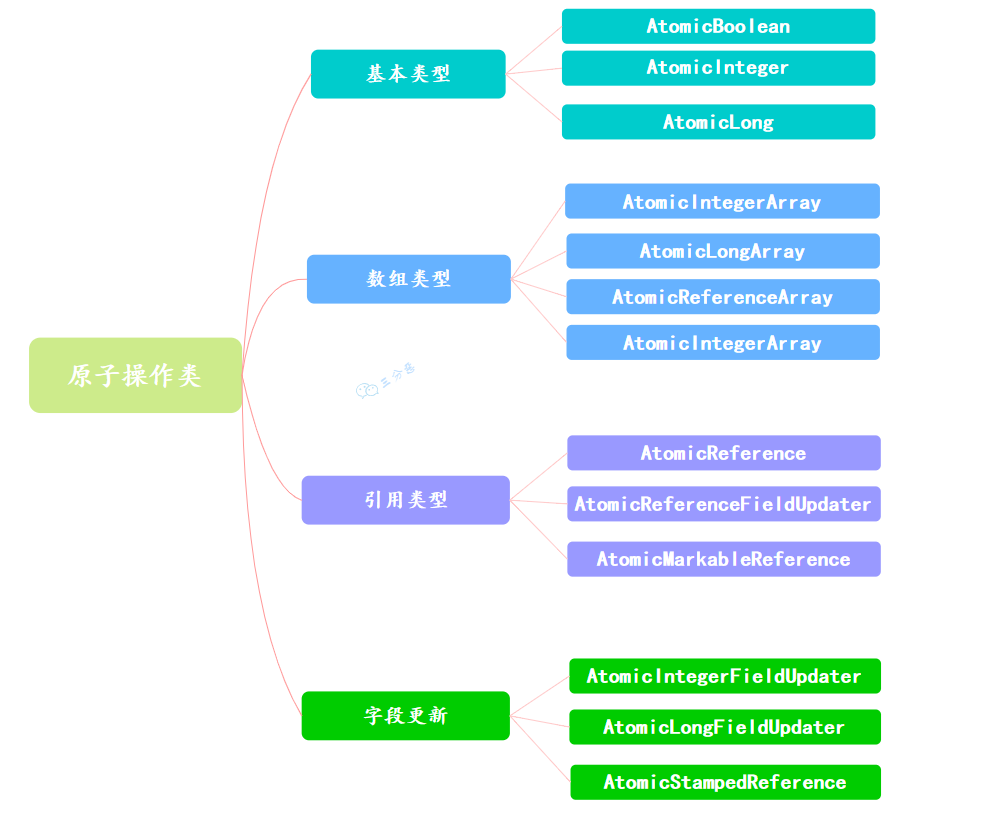

原子操作类
Atomic 包里的类基本都是使用 Unsafe 实现的包装类。
使用原子的方式更新基本类型，Atomic 包提供了以下 3 个类：

- AtomicBoolean：原子更新布尔类型。
- AtomicInteger：原子更新整型。
- AtomicLong：原子更新长整型。通过原子的方式更新数组里的某个元素，Atomic 包提供了以下 4 个类：

- AtomicIntegerArray：原子更新整型数组里的元素。
- AtomicLongArray：原子更新长整型数组里的元素。
- AtomicReferenceArray：原子更新引用类型数组里的元素。
- AtomicIntegerArray 类主要是提供原子的方式更新数组里的整型原子更新基本类型的 AtomicInteger，只能更新一个变量，如果要原子更新多个变量，就需要使用这个原子更新引用类型提供的类。Atomic 包提供了以下 3 个类：

- AtomicReference：原子更新引用类型。
- AtomicReferenceFieldUpdater：原子更新引用类型里的字段。
- AtomicMarkableReference：原子更新带有标记位的引用类型。可以原子更新一个布尔类型的标记位和引用类型。构造方法是 AtomicMarkableReference（V initialRef，boolean initialMark）。如果需原子地更新某个类里的某个字段时，就需要使用原子更新字段类，Atomic 包提供了以下 3 个类进行原子字段更新：

- AtomicIntegerFieldUpdater：原子更新整型的字段的更新器。
- AtomicLongFieldUpdater：原子更新长整型字段的更新器。
- AtomicStampedReference：原子更新带有版本号的引用类型。该类将整数值与引用关联起来，可用于原子的更新数据和数据的版本号，可以解决使用 CAS 进行原子更新时可能出现的 ABA 问题。### [38.AtomicInteger 的原理？](https://javabetter.cn/sidebar/sanfene/javathread.html#_38-atomicinteger-%E7%9A%84%E5%8E%9F%E7%90%86)
一句话概括：**使用 CAS 实现**。
以 AtomicInteger 的添加方法为例：

```java
public final int getAndIncrement() {
        return unsafe.getAndAddInt(this, valueOffset, 1);
    }
```
通过`Unsafe`类的实例来进行添加操作，来看看具体的 CAS 操作：

```java
public final int getAndAddInt(Object var1, long var2, int var4) {
    int var5;
    do {
        var5 = this.getIntVolatile(var1, var2);
    } while(!this.compareAndSwapInt(var1, var2, var5, var5 + var4));

    return var5;
}
```
compareAndSwapInt 是一个 native 方法，基于 CAS 来操作 int 类型变量。其它的原子操作类基本都是大同小异。
### [39.线程死锁了解吗？该如何避免？](https://javabetter.cn/sidebar/sanfene/javathread.html#_39-%E7%BA%BF%E7%A8%8B%E6%AD%BB%E9%94%81%E4%BA%86%E8%A7%A3%E5%90%97-%E8%AF%A5%E5%A6%82%E4%BD%95%E9%81%BF%E5%85%8D)
死锁发生在多个线程相互等待对方释放锁资源，导致所有线程都无法继续执行。
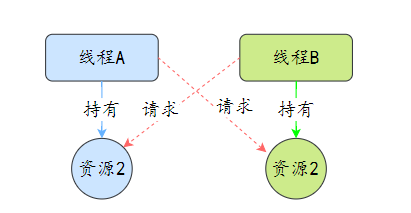

三分恶面渣逆袭：死锁示意图
#### [那么为什么会产生死锁呢？](https://javabetter.cn/sidebar/sanfene/javathread.html#%E9%82%A3%E4%B9%88%E4%B8%BA%E4%BB%80%E4%B9%88%E4%BC%9A%E4%BA%A7%E7%94%9F%E6%AD%BB%E9%94%81%E5%91%A2)
讲个笑话，死锁的产生也不是你想产生就产生的，它是有条件的：


三分恶面渣逆袭：死锁产生必备四条件

- **互斥条件**：资源不能被多个线程共享，一次只能由一个线程使用。如果一个线程已经占用了一个资源，其他请求该资源的线程必须等待，直到资源被释放。
- **持有并等待条件**：一个线程至少已经持有至少一个资源，且正在等待获取额外的资源，这些额外的资源被其他线程占有。
- **不可剥夺条件**：资源不能被强制从一个线程中抢占过来，只能由持有资源的线程主动释放。
- **循环等待条件**：存在一种线程资源的循环链，每个线程至少持有一个其他线程所需要的资源，然后又等待下一个线程所占有的资源。这形成了一个循环等待的环路。#### [该如何避免死锁呢？](https://javabetter.cn/sidebar/sanfene/javathread.html#%E8%AF%A5%E5%A6%82%E4%BD%95%E9%81%BF%E5%85%8D%E6%AD%BB%E9%94%81%E5%91%A2)
理解产生死锁的这四个必要条件后，就可以采取相应的措施来避免死锁，换句话说，就是**至少破坏死锁发生的一个条件**。

- **破坏互斥条件**：这通常不可行，因为加锁就是为了互斥。
- **破坏持有并等待条件**：一种方法是要求线程在开始执行前一次性地申请所有需要的资源。
- **破坏非抢占条件**：占用部分资源的线程进一步申请其他资源时，如果申请不到，可以主动释放它占有的资源。
- **破坏循环等待条件**：对所有资源类型进行排序，强制每个线程按顺序申请资源，这样可以避免循环等待的发生。> 
1. [Java 面试指南（付费）](https://javabetter.cn/zhishixingqiu/mianshi.html)收录的科大讯飞非凡计划研发类面经原题：死锁如何避免？
2. [Java 面试指南（付费）](https://javabetter.cn/zhishixingqiu/mianshi.html)收录的字节跳动商业化一面的原题：什么是死锁，死锁的产生条件，破坏死锁
### [40.那死锁问题怎么排查呢？](https://javabetter.cn/sidebar/sanfene/javathread.html#_40-%E9%82%A3%E6%AD%BB%E9%94%81%E9%97%AE%E9%A2%98%E6%80%8E%E4%B9%88%E6%8E%92%E6%9F%A5%E5%91%A2)
首先从系统级别上排查，比如说在 Linux 生产环境中，可以先使用 top ps 等命令查看进程状态，看看是否有进程占用了过多的资源。
接着，使用 JDK 自带的一些性能监控工具进行排查，比如说 jps、jstat、jinfo、jmap、jstack、jcmd 等等。
比如说，使用 `jps -l` 查看当前 Java 进程，然后使用 `jstack 进程号` 查看当前 Java 进程的线程堆栈信息，看看是否有线程在等待锁资源。
来编写一个死锁程序：

```java
class DeadLockDemo {
    private static final Object lock1 = new Object();
    private static final Object lock2 = new Object();

    public static void main(String[] args) {
        new Thread(() -> {
            synchronized (lock1) {
                System.out.println("线程1获取到了锁1");
                try {
                    Thread.sleep(1000);
                } catch (InterruptedException e) {
                    e.printStackTrace();
                }
                synchronized (lock2) {
                    System.out.println("线程1获取到了锁2");
                }
            }
        }).start();

        new Thread(() -> {
            synchronized (lock2) {
                System.out.println("线程2获取到了锁2");
                try {
                    Thread.sleep(1000);
                } catch (InterruptedException e) {
                    e.printStackTrace();
                }
                synchronized (lock1) {
                    System.out.println("线程2获取到了锁1");
                }
            }
        }).start();
    }
}
```
创建了两个线程，每个线程都试图按照不同的顺序获取两个[锁（lock1 和 lock2）](https://javabetter.cn/thread/thread-bring-some-problem.html#%E6%B4%BB%E8%B7%83%E6%80%A7%E9%97%AE%E9%A2%98)。这种锁的获取顺序不一致很容易导致死锁。
运行这段代码，果然卡住了。
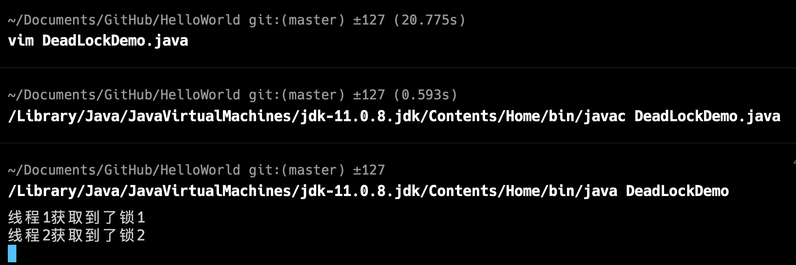

运行 `jstack pid` 命令，可以看到死锁的线程信息。诚不欺我！
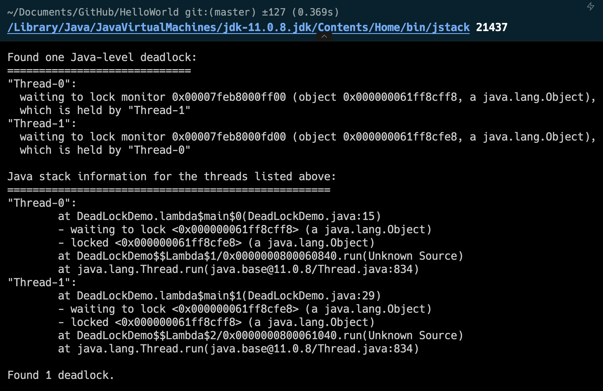

也可以使用一些可视化的性能监控工具，比如说 JConsole、VisualVM 等。
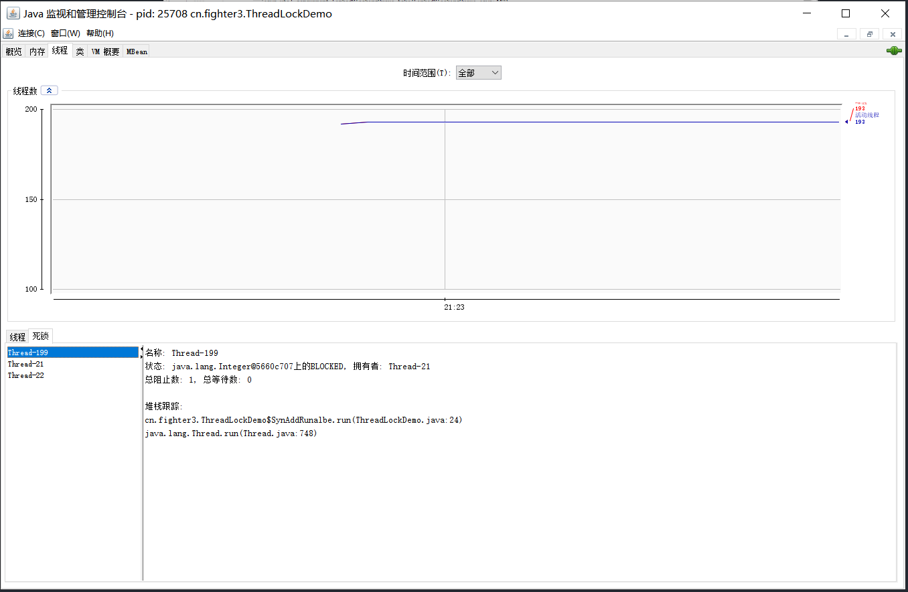

三分恶面渣逆袭：线程死锁检测
推荐阅读：

- [JVM 性能监控工具之命令行篇](https://javabetter.cn/jvm/console-tools.html)
- [JVM 性能监控工具之可视化篇](https://javabetter.cn/jvm/view-tools.html)
- [阿里开源的 Java 诊断神器 Arthas](https://javabetter.cn/jvm/arthas.html)> 
1. [Java 面试指南（付费）](https://javabetter.cn/zhishixingqiu/mianshi.html)收录的科大讯飞非凡计划研发类面经原题：发生死锁怎么排查？
### [41.聊聊线程同步和互斥？（补充）](https://javabetter.cn/sidebar/sanfene/javathread.html#_41-%E8%81%8A%E8%81%8A%E7%BA%BF%E7%A8%8B%E5%90%8C%E6%AD%A5%E5%92%8C%E4%BA%92%E6%96%A5-%E8%A1%A5%E5%85%85)
> 2024 年 03 月 12 日 新增

互斥，就是不同线程通过竞争进入临界区（共享数据或者硬件资源），为了防止冲突，在有限的时间内只允许其中一个线程独占使用共享资源。如不允许同时写。
同步，就是多个线程彼此合作，通过一定的逻辑关系来共同完成一个任务。一般来说，同步关系中往往包含了互斥关系。同时，临界区的资源会按照某种逻辑顺序进行访问。如先生产后使用。
在 Java 中，当我们要保护一个资源时，通常会使用 synchronized 关键字或者 Lock 接口的实现类（如 ReentrantLock）来给资源加锁。
锁在操作系统层面的意思就是 Mutex（互斥），意思就是某个线程获取锁（进入临界区）后，其他线程不能再进入临界区，这样就达到了互斥的目的。
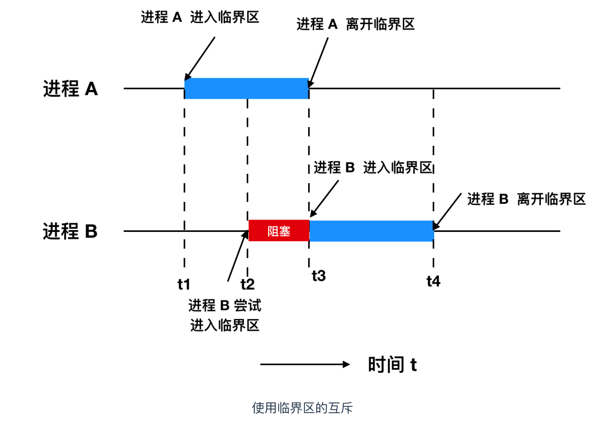

cxuan：使用临界区的互斥
锁要处理的问题大概有四种：

- 谁拿到了锁，可以是当前 class，可以是某个 lock 对象，或者实例的 markword；
- 抢占锁的规则，只能一个人抢 Mutex；能抢有限多次（Semaphore）；自己可以反复抢（可重入锁 ReentrantLock）；读可以反复抢，写只能一个人抢（读写锁ReadWriteLock）；
- 抢不到怎么办，等待，等待的时候怎么等，自旋，阻塞，或者超时；
- 锁被释放了还有其他等待锁的怎么办？通知所有人一起抢或者只告诉一个人抢（Condition 的 signalAll 或者 signal）恰当地使用锁，就能解决同步或者互斥的问题。
> 推荐阅读：[牛客：可能是全网最全的线程同步方式总结了](https://blog.nowcoder.net/n/7571c2a5ef82480380fea53875b8187b)

再补充一些。所谓同步，即协同步调，按预定的先后次序访问共享资源，以免造成混乱。
线程同步是多线程编程中的一个核心概念，它涉及到在多线程环境下如何安全地访问和修改共享资源的问题。
当有一个线程在对内存进行操作时，其他线程都不可以对这个内存地址进行操作，直到该线程完成操作，其他线程才能对该内存地址进行操作。
如果多个线程同时读写某个共享资源（如变量、文件等），而没有适当的同步机制，就可能导致数据不一致、数据损坏等问题的出现。
线程同步的实现方式有 6 种：互斥量、读写锁、条件变量、自旋锁、屏障、信号量。

- **互斥量**：互斥量（mutex）是一种最基本的同步手段，本质上是一把锁，在访问共享资源前先对互斥量进行加锁，访问完后再解锁。对互斥量加锁后，任何其他试图再次对互斥量加锁的线程都会被阻塞，直到当前线程解锁。
- **读写锁**：[读写锁](https://javabetter.cn/thread/ReentrantReadWriteLock.html)有三种状态，读模式加锁、写模式加锁和不加锁；一次只有一个线程可以占有写模式的读写锁，但是可以有多个线程同时占有读模式的读写锁。非常适合读多写少的场景。
- **条件变量**：[条件变量](https://javabetter.cn/thread/condition.html)是一种同步手段，它允许线程在满足特定条件时才继续执行，否则进入等待状态。条件变量通常与互斥量一起使用，以防止竞争条件的发生。
- **自旋锁**：自旋锁是一种锁的实现方式，它不会让线程进入睡眠状态，而是一直循环检测锁是否被释放。自旋锁适用于锁的持有时间非常短的情况。
- 信号量：信号量（[Semaphore](https://javabetter.cn/thread/CountDownLatch.html)）本质上是一个计数器，用于为多个进程提供共享数据对象的访问。#### [互斥和同步在时间上有要求吗？](https://javabetter.cn/sidebar/sanfene/javathread.html#%E4%BA%92%E6%96%A5%E5%92%8C%E5%90%8C%E6%AD%A5%E5%9C%A8%E6%97%B6%E9%97%B4%E4%B8%8A%E6%9C%89%E8%A6%81%E6%B1%82%E5%90%97)
互斥和同步在时间上是有一定要求的，因为它们都涉及到对资源的访问顺序和时机控制。
互斥的核心是保证同一时刻只有一个线程能访问共享资源或临界区。虽然互斥的重点不是线程执行的顺序，但它对访问的时间点有严格要求，以确保没有多个线程在同一时刻访问相同的资源。
同步强调的是线程之间的执行顺序和时间点的配合，特别是在多个线程需要依赖于彼此的执行结果时。例如，在 CountDownLatch 中，主线程会等待多个子线程的任务完成，子线程完成后才会减少计数，主线程会在计数器归零时继续执行。

```java
class SyncExample {
    public static void main(String[] args) throws InterruptedException {
        CountDownLatch latch = new CountDownLatch(3);
        
        // 创建3个子线程
        for (int i = 0; i < 3; i++) {
            new Thread(() -> {
                try {
                    Thread.sleep(1000); // 模拟任务
                    System.out.println("打完王者了.");
                } catch (InterruptedException e) {
                    e.printStackTrace();
                } finally {
                    latch.countDown(); // 每个线程任务完成后计数器减1
                }
            }).start();
        }
        
        System.out.println("等打完三把王者就去睡觉...");
        latch.await(); // 主线程等待子线程完成
        System.out.println("好，王者玩完了，可以睡了");
    }
}
```
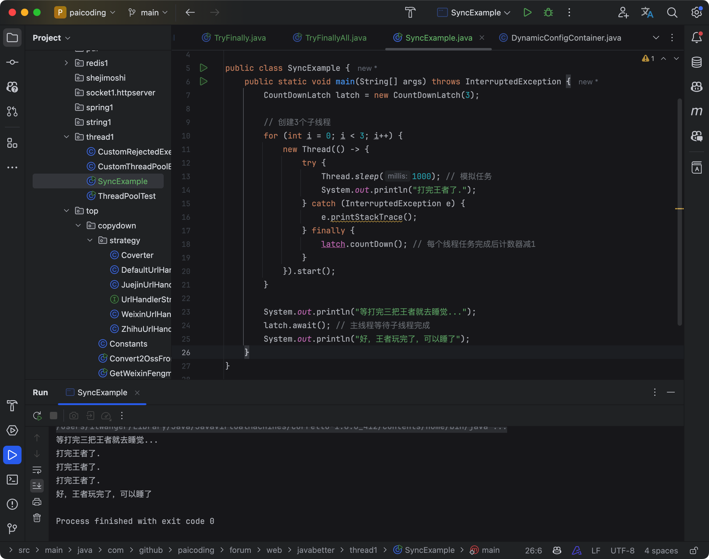

二哥的Java 进阶之路：CountDownLatch
> 
1. [Java 面试指南（付费）](https://javabetter.cn/zhishixingqiu/mianshi.html)收录的科大讯飞非凡计划研发类面经原题：聊聊线程同步
2. [Java 面试指南（付费）](https://javabetter.cn/zhishixingqiu/mianshi.html)收录的拼多多面经同学 4 技术一面面试原题：java多线程，同步与互斥，互斥和同步在时间上有要求吗？
### [42.聊聊悲观锁和乐观锁？（补充）](https://javabetter.cn/sidebar/sanfene/javathread.html#_42-%E8%81%8A%E8%81%8A%E6%82%B2%E8%A7%82%E9%94%81%E5%92%8C%E4%B9%90%E8%A7%82%E9%94%81-%E8%A1%A5%E5%85%85)
> 2024 年 05 月 01 日增补

对于悲观锁来说，它总是认为每次访问共享资源时会发生冲突，所以必须对每次数据操作加上锁，以保证临界区的程序同一时间只能有一个线程在执行。
悲观锁的代表有 [synchronized 关键字](https://javabetter.cn/thread/synchronized-1.html)和 [Lock 接口](https://javabetter.cn/thread/reentrantLock.html)。
乐观锁，顾名思义，它是乐观派。乐观锁总是假设对共享资源的访问没有冲突，线程可以不停地执行，无需加锁也无需等待。一旦多个线程发生冲突，乐观锁通常使用一种称为 [CAS](https://javabetter.cn/thread/cas.html) 的技术来保证线程执行的安全性。
由于乐观锁假想操作中没有锁的存在，因此不太可能出现死锁的情况，换句话说，乐观锁天生免疫死锁。

- 乐观锁多用于“读多写少“的环境，避免频繁加锁影响性能；
- 悲观锁多用于”写多读少“的环境，避免频繁失败和重试影响性能。> 
1. [Java 面试指南（付费）](https://javabetter.cn/zhishixingqiu/mianshi.html)收录的阿里面经同学 5 阿里妈妈 Java 后端技术一面面试原题：说说 Java 的并发系统(从悲观锁聊到乐观锁，还有线程、线程池之类的，聊了快十分钟这个)
2. [Java 面试指南（付费）](https://javabetter.cn/zhishixingqiu/mianshi.html)收录的阿里面经同学 1 闲鱼后端一面的原题：乐观锁、悲观锁、ABA 问题
3. [Java 面试指南（付费）](https://javabetter.cn/zhishixingqiu/mianshi.html)收录的腾讯云智面经同学 20 二面面试原题：乐观锁和悲观锁怎么理解的？
GitHub 上标星 10000+ 的开源知识库《[二哥的 Java 进阶之路](https://github.com/itwanger/toBeBetterJavaer)》第一版 PDF 终于来了！包括 Java 基础语法、数组&字符串、OOP、集合框架、Java IO、异常处理、Java 新特性、网络编程、NIO、并发编程、JVM 等等，共计 32 万余字，500+张手绘图，可以说是通俗易懂、风趣幽默……详情戳：[太赞了，GitHub 上标星 10000+ 的 Java 教程](https://javabetter.cn/overview/)
微信搜 **沉默王二** 或扫描下方二维码关注二哥的原创公众号沉默王二，回复 **222** 即可免费领取。


