## 三、垃圾收集
### [23.讲讲 JVM 的垃圾回收机制（补充）](https://javabetter.cn/sidebar/sanfene/jvm.html#_23-%E8%AE%B2%E8%AE%B2-jvm-%E7%9A%84%E5%9E%83%E5%9C%BE%E5%9B%9E%E6%94%B6%E6%9C%BA%E5%88%B6-%E8%A1%A5%E5%85%85)
> 本题是增补的内容，by 2024 年 03 月 09 日；参照：[深入理解 JVM 的垃圾回收机制](https://javabetter.cn/jvm/gc.html)

垃圾回收就是对内存堆中已经死亡的或者长时间没有使用的对象进行清除或回收。
JVM 在做 GC 之前，会先搞清楚什么是垃圾，什么不是垃圾，通常会通过可达性分析算法来判断对象是否存活。
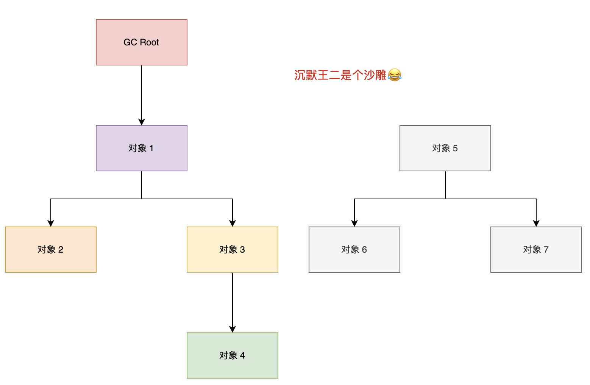

二哥的 Java 进阶之路：可达性分析
在确定了哪些垃圾可以被回收后，垃圾收集器（如 CMS、G1、ZGC）要做的事情就是进行垃圾回收，可以采用标记清除算法、复制算法、标记整理算法、分代收集算法等。
[技术派](https://javabetter.cn/zhishixingqiu/paicoding.html)项目使用的 JDK 8，所以默认采用的是 CMS 垃圾收集器。
#### [垃圾回收的过程是什么？](https://javabetter.cn/sidebar/sanfene/jvm.html#%E5%9E%83%E5%9C%BE%E5%9B%9E%E6%94%B6%E7%9A%84%E8%BF%87%E7%A8%8B%E6%98%AF%E4%BB%80%E4%B9%88)
Java 的垃圾回收过程主要分为标记存活对象、清除无用对象、以及内存压缩/整理三个阶段。不同的垃圾回收器在执行这些步骤时会采用不同的策略和算法。
### [24.如何判断对象仍然存活？](https://javabetter.cn/sidebar/sanfene/jvm.html#_24-%E5%A6%82%E4%BD%95%E5%88%A4%E6%96%AD%E5%AF%B9%E8%B1%A1%E4%BB%8D%E7%84%B6%E5%AD%98%E6%B4%BB)
Java 通过可达性分析算法来判断一个对象是否还存活。
通过一组名为 “GC Roots” 的根对象，进行递归扫描，无法从根对象到达的对象就是“垃圾”，可以被回收。
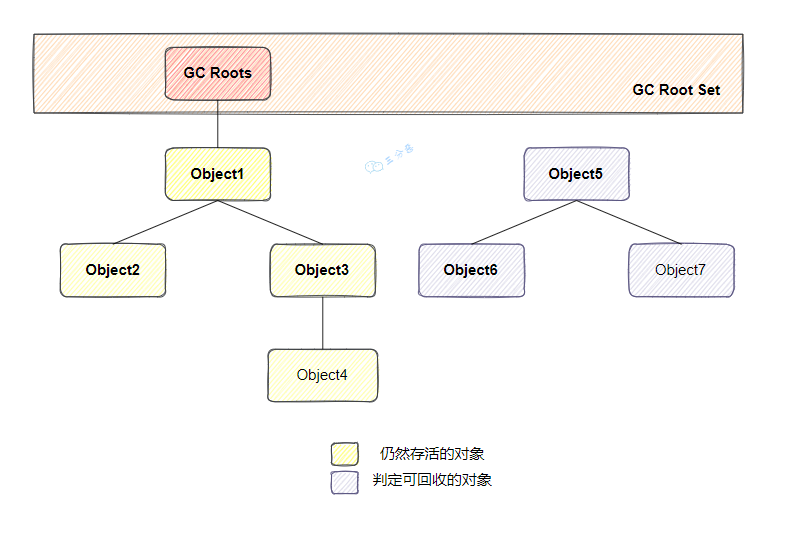

三分恶面渣逆袭：GC Root
这也是 G1、CMS 等主流垃圾收集器使用的主要算法。
#### [什么是引用计数法？](https://javabetter.cn/sidebar/sanfene/jvm.html#%E4%BB%80%E4%B9%88%E6%98%AF%E5%BC%95%E7%94%A8%E8%AE%A1%E6%95%B0%E6%B3%95)
每个对象有一个引用计数器，记录引用它的次数。当计数器为零时，对象可以被回收。
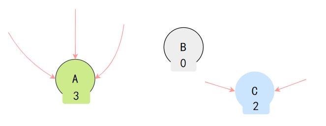

三分恶面渣逆袭：引用计数法
引用计数法无法解决循环引用的问题。例如，两个对象互相引用，但不再被其他对象引用，它们的引用计数都不为零，因此不会被回收。
#### [做可达性分析的时候，应该有哪些前置性的操作？](https://javabetter.cn/sidebar/sanfene/jvm.html#%E5%81%9A%E5%8F%AF%E8%BE%BE%E6%80%A7%E5%88%86%E6%9E%90%E7%9A%84%E6%97%B6%E5%80%99-%E5%BA%94%E8%AF%A5%E6%9C%89%E5%93%AA%E4%BA%9B%E5%89%8D%E7%BD%AE%E6%80%A7%E7%9A%84%E6%93%8D%E4%BD%9C)
在进行垃圾回收之前，JVM 会暂停所有正在执行的应用线程（称为 Stop-the-World）。
这是因为可达性分析过程必须确保在执行分析时，内存中的对象关系不会被应用线程修改。如果不暂停应用线程，可能会出现对象引用的改变，导致垃圾回收过程中判断对象是否可达的结果不一致，从而引发严重的内存错误或数据丢失。​
### [25.Java 中可作为 GC Roots 的引用有哪几种？](https://javabetter.cn/sidebar/sanfene/jvm.html#_25-java-%E4%B8%AD%E5%8F%AF%E4%BD%9C%E4%B8%BA-gc-roots-%E7%9A%84%E5%BC%95%E7%94%A8%E6%9C%89%E5%93%AA%E5%87%A0%E7%A7%8D)

1. 推荐阅读：[深入理解垃圾回收机制](https://javabetter.cn/jvm/gc.html)
2. 推荐阅读：[R 大的所谓“GC roots”](https://www.zhihu.com/question/53613423/answer/135743258)> 所谓的 GC Roots，就是一组必须活跃的引用，它们是程序运行时的起点，是一切引用链的源头。在 Java 中，GC Roots 包括以下几种：

- 虚拟机栈中的引用（方法的参数、局部变量等）
- 本地方法栈中 JNI 的引用
- 类静态变量
- 运行时常量池中的常量（String 或 Class 类型）
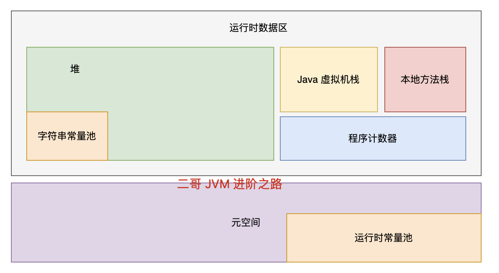

二哥的 java 进阶之路：GC Roots
**1、虚拟机栈中的引用（方法的参数、局部变量等）**
来看下面这段代码：

```java
public class StackReference {
    public void greet() {
        Object localVar = new Object(); // 这里的 localVar 是一个局部变量，存在于虚拟机栈中
        System.out.println(localVar.toString());
    }

    public static void main(String[] args) {
        new StackReference().greet();
    }
}
```
在 greet 方法中，localVar 是一个局部变量，存在于虚拟机栈中，可以被认为是 GC Roots。
在 greet 方法执行期间，localVar 引用的对象是活跃的，因为它是从 GC Roots 可达的。
当 greet 方法执行完毕后，localVar 的作用域结束，localVar 引用的 Object 对象不再由任何 GC Roots 引用（假设没有其他引用指向这个对象），因此它将有资格作为垃圾被回收掉 😁。
**2、本地方法栈中 JNI 的引用**
Java 通过 JNI（Java Native Interface）提供了一种机制，允许 Java 代码调用本地代码（通常是 C 或 C++ 编写的代码）。
当调用 Java 方法时，虚拟机会创建一个栈帧并压入虚拟机栈，而当它调用本地方法时，虚拟机会通过动态链接直接调用指定的本地方法。
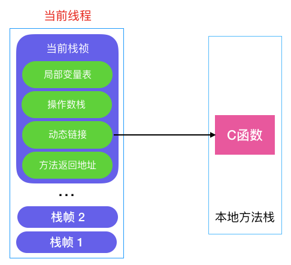

pecuyu：动态链接
JNI 引用是在 Java 本地接口（JNI）代码中创建的引用，这些引用可以指向 Java 堆中的对象。

```java
// 假设的JNI方法
public native void nativeMethod();

// 假设在C/C++中实现的本地方法
/*
 * Class:     NativeExample
 * Method:    nativeMethod
 * Signature: ()V
 */
JNIEXPORT void JNICALL Java_NativeExample_nativeMethod(JNIEnv *env, jobject thisObj) {
    jobject localRef = (*env)->NewObject(env, ...); // 在本地方法栈中创建JNI引用
    // localRef 引用的Java对象在本地方法执行期间是活跃的
}
```
在本地（C/C++）代码中，localRef 是对 Java 对象的一个 JNI 引用，它在本地方法执行期间保持 Java 对象活跃，可以被认为是 GC Roots。
一旦 JNI 方法执行完毕，除非这个引用是全局的（Global Reference），否则它指向的对象将会被作为垃圾回收掉（假设没有其他地方再引用这个对象）。
**3、类静态变量**
来看下面这段代码：

```java
public class StaticFieldReference {
    private static Object staticVar = new Object(); // 类静态变量

    public static void main(String[] args) {
        System.out.println(staticVar.toString());
    }
}
```
StaticFieldReference 类中的 staticVar 引用了一个 Object 对象，这个引用存储在元空间，可以被认为是 GC Roots。
只要 StaticFieldReference 类未被卸载，staticVar 引用的对象都不会被垃圾回收。如果 StaticFieldReference 类被卸载（这通常发生在其类加载器被垃圾回收时），那么 staticVar 引用的对象也将有资格被垃圾回收（如果没有其他引用指向这个对象）。
**4、运行时常量池中的常量**
来看这段代码：

```java
public class ConstantPoolReference {
    public static final String CONSTANT_STRING = "Hello, World"; // 常量，存在于运行时常量池中
    public static final Class<?> CONSTANT_CLASS = Object.class; // 类类型常量

    public static void main(String[] args) {
        System.out.println(CONSTANT_STRING);
        System.out.println(CONSTANT_CLASS.getName());
    }
}
```
在 ConstantPoolReference 中，CONSTANT_STRING 和 CONSTANT_CLASS 作为常量存储在运行时常量池。它们可以用来作为 GC Roots。
这些常量引用的对象（字符串"Hello, World"和 Object.class 类对象）在常量池中，只要包含这些常量的 ConstantPoolReference 类未被卸载，这些对象就不会被垃圾回收。
### [26.finalize()方法了解吗？有什么作用？](https://javabetter.cn/sidebar/sanfene/jvm.html#_26-finalize-%E6%96%B9%E6%B3%95%E4%BA%86%E8%A7%A3%E5%90%97-%E6%9C%89%E4%BB%80%E4%B9%88%E4%BD%9C%E7%94%A8)
用一个不太贴切的比喻，垃圾回收就是古代的秋后问斩，finalize()就是刀下留人，在人犯被处决之前，还要做最后一次审计，青天大老爷看看有没有什么冤情，需不需要刀下留人。
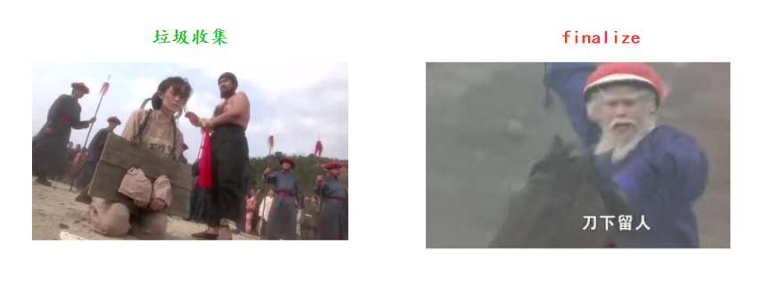

刀下留人
如果对象在进行可达性分析后发现没有与 GC Roots 相连接的引用链，那它将会被第一次标记，随后进行一次筛选，筛选的条件是此对象是否有必要执行 finalize()方法。如果对象在在 finalize()中成功拯救自己——只要重新与引用链上的任何一个对象建立关联即可，譬如把自己 （this 关键字）赋值给某个类变量或者对象的成员变量，那在第二次标记时它就”逃过一劫“；但是如果没有抓住这个机会，那么对象就真的要被回收了。
### [27.垃圾收集算法了解吗？](https://javabetter.cn/sidebar/sanfene/jvm.html#_27-%E5%9E%83%E5%9C%BE%E6%94%B6%E9%9B%86%E7%AE%97%E6%B3%95%E4%BA%86%E8%A7%A3%E5%90%97)
垃圾收集算法主要有三种，分别是标记-清除算法、标记-复制算法和标记-整理算法。
#### [说说标记-清除算法？](https://javabetter.cn/sidebar/sanfene/jvm.html#%E8%AF%B4%E8%AF%B4%E6%A0%87%E8%AE%B0-%E6%B8%85%E9%99%A4%E7%AE%97%E6%B3%95)
`标记-清除`算法分为两个阶段：

- **标记**：标记所有需要回收的对象
- **清除**：回收所有被标记的对象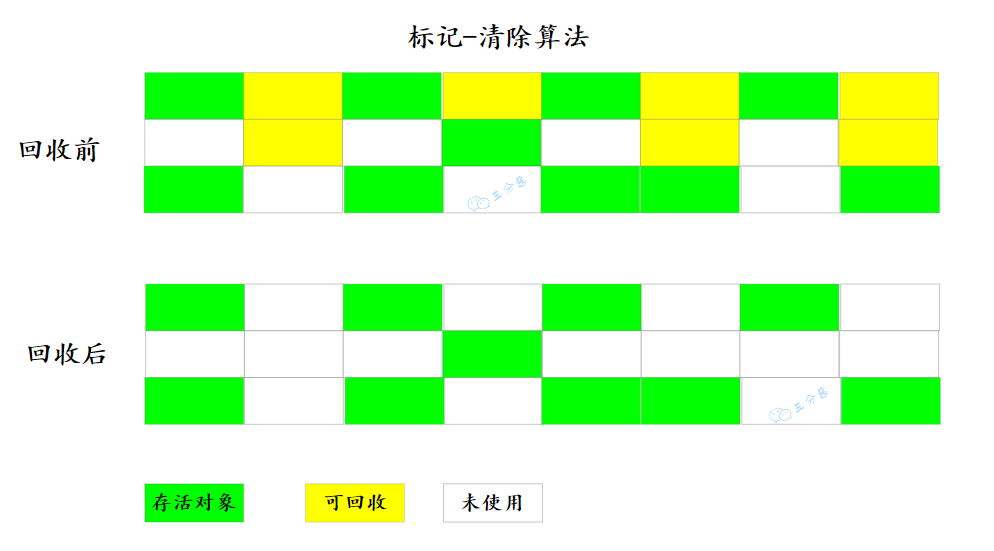

三分恶面渣逆袭：标记-清除算法
优点是实现简单，缺点是回收过程中会产生内存碎片。
#### [说说标记-复制算法？](https://javabetter.cn/sidebar/sanfene/jvm.html#%E8%AF%B4%E8%AF%B4%E6%A0%87%E8%AE%B0-%E5%A4%8D%E5%88%B6%E7%AE%97%E6%B3%95)
`标记-复制`算法可以解决标记-清除算法的内存碎片问题，因为它将内存空间划分为两块，每次只使用其中一块。当这一块的内存用完了，就将还存活着的对象复制到另外一块上面，然后清理掉这一块。
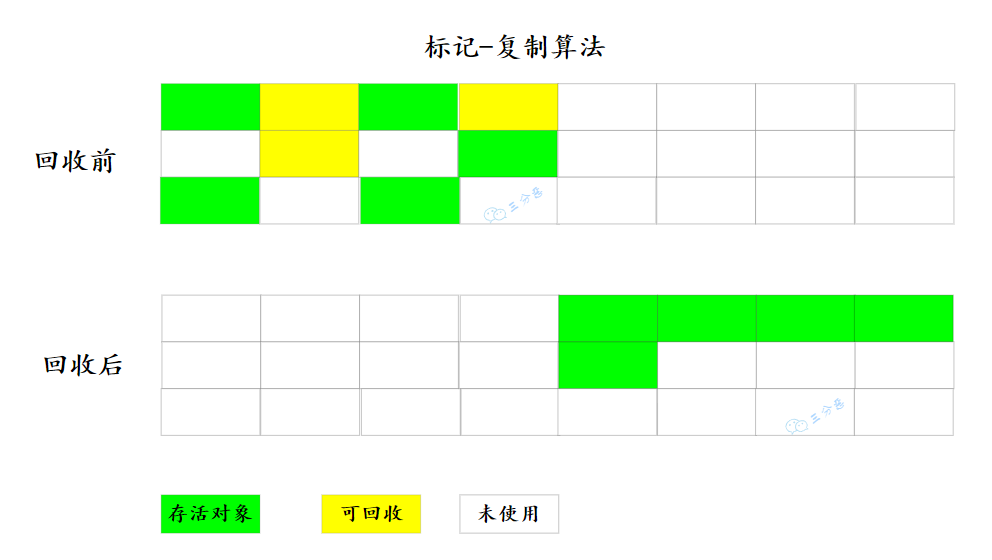

三分恶面渣逆袭：标记-复制算法
缺点是浪费了一半的内存空间。
#### [说说标记-整理算法？](https://javabetter.cn/sidebar/sanfene/jvm.html#%E8%AF%B4%E8%AF%B4%E6%A0%87%E8%AE%B0-%E6%95%B4%E7%90%86%E7%AE%97%E6%B3%95)
`标记-整理`算法是标记-清除复制算法的升级版，它不再划分内存空间，而是将存活的对象向内存的一端移动，然后清理边界以外的内存。
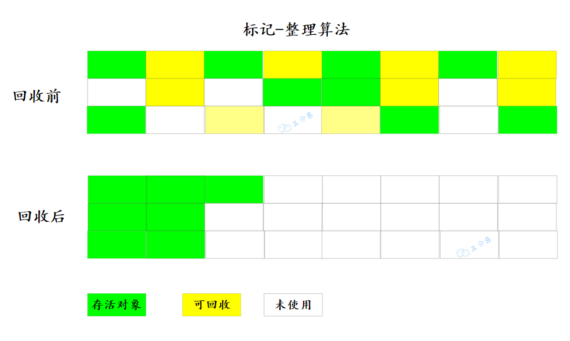

标记-整理算法
缺点是移动对象的成本比较高。
#### [说说分代收集算法？](https://javabetter.cn/sidebar/sanfene/jvm.html#%E8%AF%B4%E8%AF%B4%E5%88%86%E4%BB%A3%E6%94%B6%E9%9B%86%E7%AE%97%E6%B3%95)
`分代收集`算法是目前主流的垃圾收集算法，它根据对象存活周期的不同将内存划分为几块，一般分为新生代和老年代。


二哥的 Java 进阶之路：Java 堆划分
新生代用复制算法，因为大部分对象生命周期短。老年代用标记-整理算法，因为对象存活率较高。
#### [为什么要用分代收集呢？](https://javabetter.cn/sidebar/sanfene/jvm.html#%E4%B8%BA%E4%BB%80%E4%B9%88%E8%A6%81%E7%94%A8%E5%88%86%E4%BB%A3%E6%94%B6%E9%9B%86%E5%91%A2)
分代收集算法的核心思想是根据对象的生命周期优化垃圾回收。
新生代的对象生命周期短，使用复制算法可以快速回收。老年代的对象生命周期长，使用标记-整理算法可以减少移动对象的成本。
#### [标记复制的标记过程和复制过程会不会停顿？](https://javabetter.cn/sidebar/sanfene/jvm.html#%E6%A0%87%E8%AE%B0%E5%A4%8D%E5%88%B6%E7%9A%84%E6%A0%87%E8%AE%B0%E8%BF%87%E7%A8%8B%E5%92%8C%E5%A4%8D%E5%88%B6%E8%BF%87%E7%A8%8B%E4%BC%9A%E4%B8%8D%E4%BC%9A%E5%81%9C%E9%A1%BF)
在标记-复制算法 中，标记阶段和复制阶段都会触发STW。

- 标记阶段停顿是为了保证对象的引用关系不被修改。
- 复制阶段停顿是防止对象在复制过程中被修改。### [28.Minor GC、Major GC、Mixed GC、Full GC 都是什么意思？](https://javabetter.cn/sidebar/sanfene/jvm.html#_28-minor-gc%E3%80%81major-gc%E3%80%81mixed-gc%E3%80%81full-gc-%E9%83%BD%E6%98%AF%E4%BB%80%E4%B9%88%E6%84%8F%E6%80%9D)
Minor GC 也称为 Young GC，是指发生在年轻代（Young Generation）的垃圾收集。年轻代包含 Eden 区以及两个 Survivor 区。
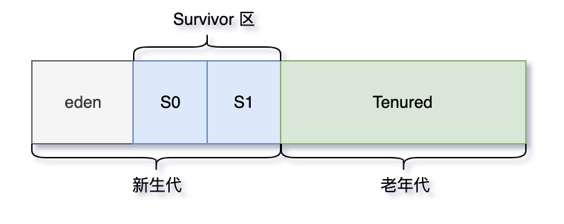

二哥的 Java 进阶之路：Java 堆划分
Major GC 也称为 Old GC，主要指的是发生在老年代的垃圾收集。CMS 收集器的特有行为。
Mixed GC 是 G1 垃圾收集器特有的一种 GC 类型，它在一次 GC 中同时清理年轻代和部分老年代。
Full GC 是最彻底的垃圾收集，涉及整个 Java 堆和方法区（元空间）。它是最耗时的 GC，通常在 JVM 压力很大时发生。
#### [FULL gc怎么去清理的？](https://javabetter.cn/sidebar/sanfene/jvm.html#full-gc%E6%80%8E%E4%B9%88%E5%8E%BB%E6%B8%85%E7%90%86%E7%9A%84)
Full GC 会从 GC Root 出发，标记所有可达对象。新生代使用复制算法，清空 Eden 区。老年代使用标记-整理算法，回收对象并消除碎片。
停顿时间较长（STW），会影响系统响应性能。
### [29.Young GC 什么时候触发？](https://javabetter.cn/sidebar/sanfene/jvm.html#_29-young-gc-%E4%BB%80%E4%B9%88%E6%97%B6%E5%80%99%E8%A7%A6%E5%8F%91)
如果 Eden 区没有足够的空间时，就会触发 Young GC 来清理新生代。
### [30.什么时候会触发 Full GC？](https://javabetter.cn/sidebar/sanfene/jvm.html#_30-%E4%BB%80%E4%B9%88%E6%97%B6%E5%80%99%E4%BC%9A%E8%A7%A6%E5%8F%91-full-gc)

- 在进行 Young GC 的时候，如果发现`老年代可用的连续内存空间` < `新生代历次 Young GC 后升入老年代的对象总和的平均大小`，说明本次 Young GC 后升入老年代的对象大小，可能超过了老年代当前可用的内存空间，就会触发 Full GC。
- 执行 Young GC 后老年代没有足够的内存空间存放转入的对象，会立即触发一次 Full GC。
- `System.gc()`、`jmap -dump` 等命令会触发 full gc。#### [空间分配担保是什么？](https://javabetter.cn/sidebar/sanfene/jvm.html#%E7%A9%BA%E9%97%B4%E5%88%86%E9%85%8D%E6%8B%85%E4%BF%9D%E6%98%AF%E4%BB%80%E4%B9%88)
空间分配担保是指在进行 Minor GC（新生代垃圾回收）前，JVM 会确保老年代有足够的空间存放从新生代晋升的对象。如果老年代空间不足，可能会触发 Full GC。
> 
1. [Java 面试指南（付费）](https://javabetter.cn/zhishixingqiu/mianshi.html)收录的快手同学 4 一面原题：如何判断死亡对象？GC Roots有哪些？空间分配担保是什么？
### [31.知道哪些垃圾收集器？](https://javabetter.cn/sidebar/sanfene/jvm.html#_31-%E7%9F%A5%E9%81%93%E5%93%AA%E4%BA%9B%E5%9E%83%E5%9C%BE%E6%94%B6%E9%9B%86%E5%99%A8)
推荐阅读：[深入理解 JVM 的垃圾收集器：CMS、G1、ZGC](https://javabetter.cn/jvm/gc-collector.html)
JVM 的垃圾收集器主要分为两大类：分代收集器和分区收集器，分代收集器的代表是 CMS，分区收集器的代表是 G1 和 ZGC。
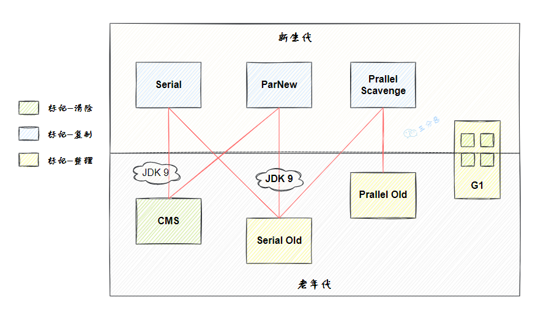

三分恶面渣逆袭：HotSpot虚拟机垃圾收集器
CMS 是第一个关注 GC 停顿时间（STW 的时间）的垃圾收集器，JDK 1.5 时引入，JDK9 被标记弃用，JDK14 被移除。
G1（Garbage-First Garbage Collector）在 JDK 1.7 时引入，在 JDK 9 时取代 CMS 成为了默认的垃圾收集器。
ZGC 是 JDK11 推出的一款低延迟垃圾收集器，适用于大内存低延迟服务的内存管理和回收，在 128G 的大堆下，最大停顿时间才 1.68 ms，性能远胜于 G1 和 CMS。
#### [说说 Serial 收集器？](https://javabetter.cn/sidebar/sanfene/jvm.html#%E8%AF%B4%E8%AF%B4-serial-%E6%94%B6%E9%9B%86%E5%99%A8)
Serial 收集器是最基础、历史最悠久的收集器。
如同它的名字（串行），它是一个单线程工作的收集器，使用一个处理器或一条收集线程去完成垃圾收集工作。并且进行垃圾收集时，必须暂停其他所有工作线程，直到垃圾收集结束——这就是所谓的“Stop The World”。
Serial/Serial Old 收集器的运行过程如图：
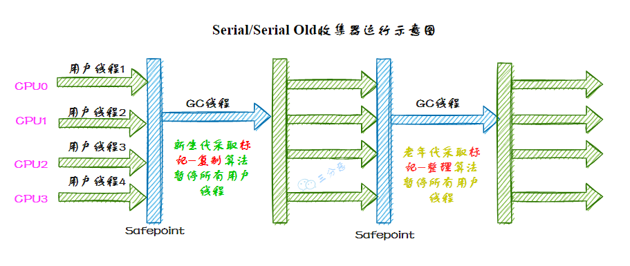

Serial/Serial Old收集器运行示意图
#### [说说 ParNew 收集器？](https://javabetter.cn/sidebar/sanfene/jvm.html#%E8%AF%B4%E8%AF%B4-parnew-%E6%94%B6%E9%9B%86%E5%99%A8)
ParNew 收集器实质上是 Serial 收集器的多线程并行版本，使用多条线程进行垃圾收集。
ParNew/Serial Old 收集器运行示意图如下：
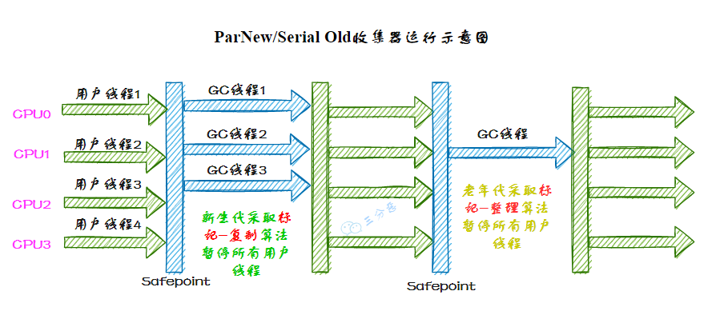

ParNew/Serial Old收集器运行示意图
#### [说说 Parallel Scavenge 收集器？](https://javabetter.cn/sidebar/sanfene/jvm.html#%E8%AF%B4%E8%AF%B4-parallel-scavenge-%E6%94%B6%E9%9B%86%E5%99%A8)
Parallel Scavenge 收集器是一款新生代收集器，基于标记-复制算法实现，也能够并行收集。和 ParNew 有些类似，但 Parallel Scavenge 主要关注的是垃圾收集的吞吐量——所谓吞吐量，就是 CPU 用于运行用户代码的时间和总消耗时间的比值，比值越大，说明垃圾收集的占比越小。
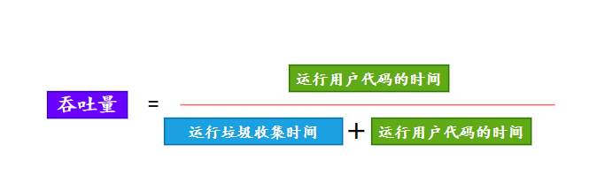

吞吐量
根据对象存活周期的不同会将内存划分为几块，一般是把 Java 堆分为新生代和老年代，这样就可以根据各个年代的特点采用最适当的收集算法。
#### [说说 Serial Old 收集器？](https://javabetter.cn/sidebar/sanfene/jvm.html#%E8%AF%B4%E8%AF%B4-serial-old-%E6%94%B6%E9%9B%86%E5%99%A8)
Serial Old 是 Serial 收集器的老年代版本，它同样是一个单线程收集器，使用标记-整理算法。
#### [说说 Parallel Old 收集器？](https://javabetter.cn/sidebar/sanfene/jvm.html#%E8%AF%B4%E8%AF%B4-parallel-old-%E6%94%B6%E9%9B%86%E5%99%A8)
Parallel Old 是 Parallel Scavenge 收集器的老年代版本，基于标记-整理算法实现，使用多条 GC 线程在 STW 期间同时进行垃圾回收。
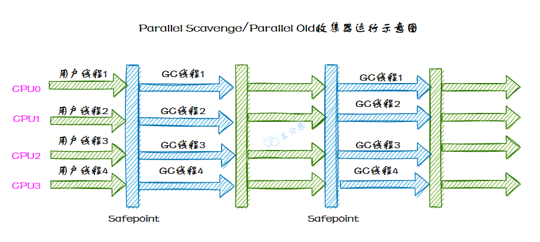

三分恶面渣逆袭：Parallel Old收集器
#### [说说 CMS 收集器？](https://javabetter.cn/sidebar/sanfene/jvm.html#%E8%AF%B4%E8%AF%B4-cms-%E6%94%B6%E9%9B%86%E5%99%A8)
CMS 在 JDK 1.5 时引入，JDK 9 时被标记弃用，JDK 14 时被移除。
CMS 是一种低延迟的垃圾收集器，采用标记-清除算法，分为初始标记、并发标记、重新标记和并发清除四个阶段，优点是垃圾回收线程和应用线程同时运行，停顿时间短，适合延迟敏感的应用，但容易产生内存碎片，可能触发 Full GC。
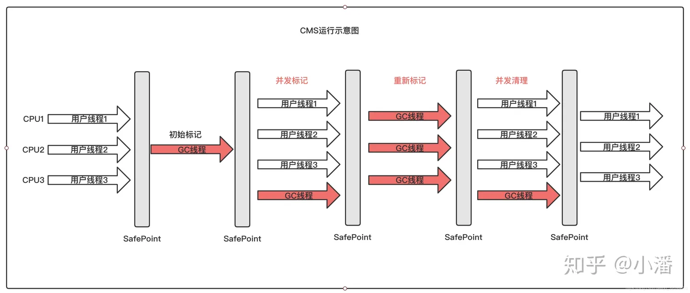

小潘：CMS
#### [说说 G1 收集器？](https://javabetter.cn/sidebar/sanfene/jvm.html#%E8%AF%B4%E8%AF%B4-g1-%E6%94%B6%E9%9B%86%E5%99%A8)
G1 在 JDK 1.7 时引入，在 JDK 9 时取代 CMS 成为默认的垃圾收集器。
G1 是一种面向大内存、高吞吐场景的垃圾收集器，它将堆划分为多个小的 Region，通过标记-整理算法，避免了内存碎片问题。优点是停顿时间可控，适合大堆场景，但调优较复杂。


有梦想的肥宅：G1
#### [说说 ZGC 收集器？](https://javabetter.cn/sidebar/sanfene/jvm.html#%E8%AF%B4%E8%AF%B4-zgc-%E6%94%B6%E9%9B%86%E5%99%A8)
ZGC 是 JDK 11 时引入的一款低延迟的垃圾收集器，最大特点是将垃圾收集的停顿时间控制在 10ms 以内，即使在 TB 级别的堆内存下也能保持较低的停顿时间。
它通过并发标记和重定位来避免大部分 Stop-The-World 停顿，主要依赖指针染色来管理对象状态。
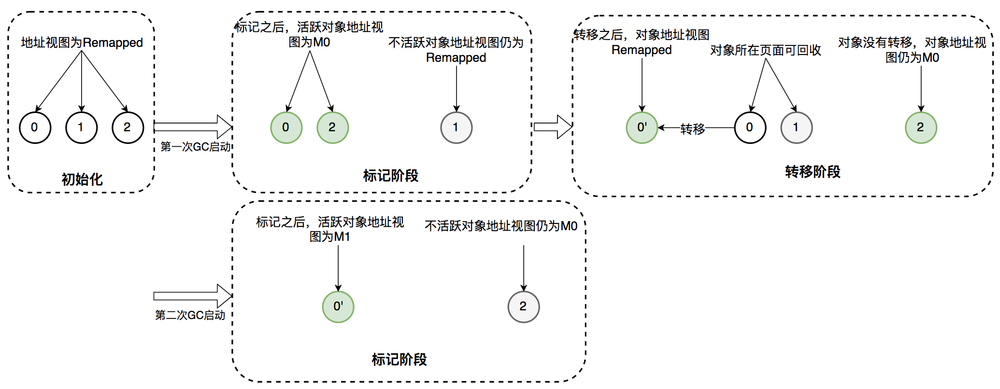

得物技术

- **标记对象的可达性**：通过在指针上增加标记位，不需要额外的标记位即可判断对象的存活状态。
- **重定位状态**：在对象被移动时，可以通过指针染色来更新对象的引用，而不需要等待全局同步。适用于需要超低延迟的场景，比如金融交易系统、电商平台。
#### [垃圾回收器的作用是什么？](https://javabetter.cn/sidebar/sanfene/jvm.html#%E5%9E%83%E5%9C%BE%E5%9B%9E%E6%94%B6%E5%99%A8%E7%9A%84%E4%BD%9C%E7%94%A8%E6%98%AF%E4%BB%80%E4%B9%88)
这一过程减少了程序员手动管理内存的负担，降低了内存泄漏和溢出错误的风险。
### [32.能详细说一下 CMS 收集器的垃圾收集过程吗？](https://javabetter.cn/sidebar/sanfene/jvm.html#_32-%E8%83%BD%E8%AF%A6%E7%BB%86%E8%AF%B4%E4%B8%80%E4%B8%8B-cms-%E6%94%B6%E9%9B%86%E5%99%A8%E7%9A%84%E5%9E%83%E5%9C%BE%E6%94%B6%E9%9B%86%E8%BF%87%E7%A8%8B%E5%90%97)
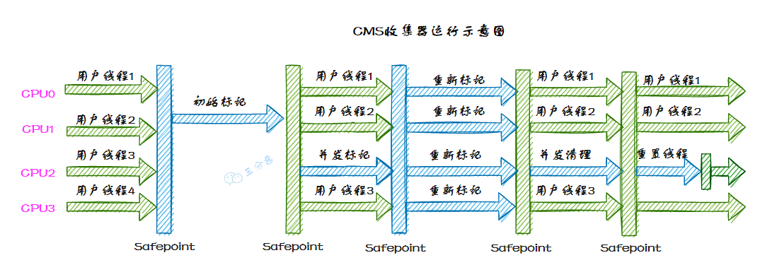

三分恶面渣逆袭：Concurrent Mark Sweep收集器运行示意图
CMS 使用**标记-清除**算法进行垃圾收集，分 4 大步：

- **初始标记**：标记所有从 GC Roots 直接可达的对象，这个阶段需要 STW，但速度很快。
- **并发标记**：从初始标记的对象出发，遍历所有对象，标记所有可达的对象。这个阶段是并发进行的。
- **重新标记**：完成剩余的标记工作，包括处理并发阶段遗留下来的少量变动，这个阶段通常需要短暂的 STW 停顿。
- **并发清除**：清除未被标记的对象，回收它们占用的内存空间。是的，remark 阶段通常会结合三色标记法来执行，确保在并发标记期间所有存活对象都被正确标记。目的是修正并发标记阶段中可能遗漏的对象引用变化。
在 remark 阶段，垃圾收集器会停止应用线程（STW），以确保在这个阶段不会有引用关系的进一步变化。这种暂停通常很短暂。remark 阶段主要包括以下操作：

1. 处理写屏障记录的引用变化：在并发标记阶段，应用程序可能会更新对象的引用（比如一个黑色对象新增了对一个白色对象的引用），这些变化通过写屏障记录下来。在 remark 阶段，GC 会处理这些记录，确保所有可达对象都正确地标记为灰色或黑色。
2. 扫描灰色对象：再次遍历灰色对象，处理它们的所有引用，确保引用的对象正确标记为灰色或黑色。
3. 清理：确保所有引用关系正确处理后，灰色对象标记为黑色，白色对象保持不变。这一步完成后，所有存活对象都应当是黑色的。#### [什么是三色标记法？](https://javabetter.cn/sidebar/sanfene/jvm.html#%E4%BB%80%E4%B9%88%E6%98%AF%E4%B8%89%E8%89%B2%E6%A0%87%E8%AE%B0%E6%B3%95)
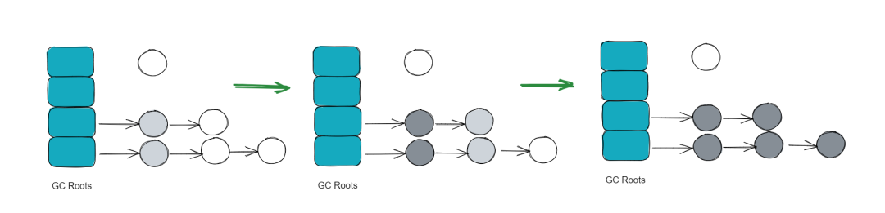

Java全栈架构师：三色标记法
三色标记法用于标记对象的存活状态，它将对象分为三类：

1. 白色（White）：尚未访问的对象。垃圾回收结束后，仍然为白色的对象会被认为是不可达的对象，可以回收。
2. 灰色（Gray）：已经访问到但未标记完其引用的对象。灰色对象是需要进一步处理的。
3. 黑色（Black）：已经访问到并且其所有引用对象都已经标记过。黑色对象是完全处理过的，不需要再处理。三色标记法的工作流程：
①、初始标记（Initial Marking）：从 GC Roots 开始，标记所有直接可达的对象为灰色。
②、并发标记（Concurrent Marking）：在此阶段，标记所有灰色对象引用的对象为灰色，然后将灰色对象自身标记为黑色。这个过程是并发的，和应用线程同时进行。
此阶段的一个问题是，应用线程可能在并发标记期间修改对象的引用关系，导致一些对象的标记状态不准确。
③、重新标记（Remarking）：重新标记阶段的目标是处理并发标记阶段遗漏的引用变化。为了确保所有存活对象都被正确标记，remark 需要在 STW 暂停期间执行。
④、使用写屏障（Write Barrier）来捕捉并发标记阶段应用线程对对象引用的更新。通过遍历这些更新的引用来修正标记状态，确保遗漏的对象不会被错误地回收。
### [33.G1 垃圾收集器了解吗？](https://javabetter.cn/sidebar/sanfene/jvm.html#_33-g1-%E5%9E%83%E5%9C%BE%E6%94%B6%E9%9B%86%E5%99%A8%E4%BA%86%E8%A7%A3%E5%90%97)
G1 在 JDK 1.7 时引入，在 JDK 9 时取代 CMS 成为默认的垃圾收集器。
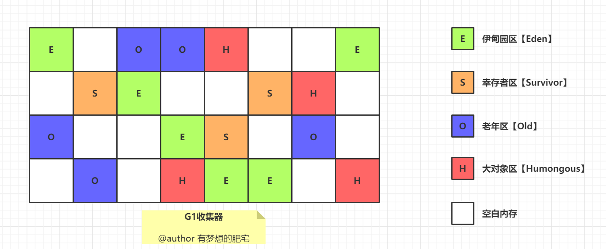

有梦想的肥宅：G1 收集器
G1 把 Java 堆划分为多个大小相等的独立区域Region，每个区域都可以扮演新生代（Eden 和 Survivor）或老年代的角色。
同时，G1 还有一个专门为大对象设计的 Region，叫 Humongous 区。
> 大对象的判定规则是，如果一个大对象超过了一个 Region 大小的 50%，比如每个 Region 是 2M，只要一个对象超过了 1M，就会被放入 Humongous 中。

这种区域化管理使得 G1 可以更灵活地进行垃圾收集，只回收部分区域而不是整个新生代或老年代。
G1 收集器的运行过程大致可划分为这几个步骤：
①、**并发标记**，G1 通过并发标记的方式找出堆中的垃圾对象。并发标记阶段与应用线程同时执行，不会导致应用线程暂停。
②、**混合收集**，在并发标记完成后，G1 会计算出哪些区域的回收价值最高（也就是包含最多垃圾的区域），然后优先回收这些区域。这种回收方式包括了部分新生代区域和老年代区域。
选择回收成本低而收益高的区域进行回收，可以提高回收效率和减少停顿时间。
③、**可预测的停顿**，G1 在垃圾回收期间仍然需要「Stop the World」。不过，G1 在停顿时间上添加了预测机制，用户可以 JVM 启动时指定期望停顿时间，G1 会尽可能地在这个时间内完成垃圾回收。
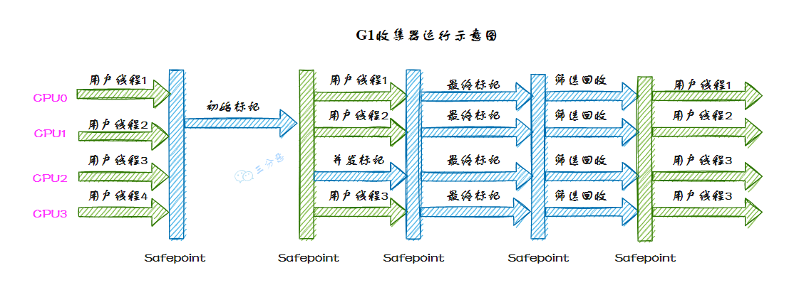

三分恶面渣逆袭：G1收集器运行示意图
### [34.有了 CMS，为什么还要引入 G1？](https://javabetter.cn/sidebar/sanfene/jvm.html#_34-%E6%9C%89%E4%BA%86-cms-%E4%B8%BA%E4%BB%80%E4%B9%88%E8%BF%98%E8%A6%81%E5%BC%95%E5%85%A5-g1)
 | 特性 | CMS | G1 | 
|---|---|---|
 | 设计目标 | 低停顿时间 | 可预测的停顿时间 | 
 | 并发性 | 是 | 是 | 
 | 内存碎片 | 是，容易产生碎片 | 否，通过区域划分和压缩减少碎片 | 
 | 收集代数 | 年轻代和老年代 | 整个堆，但区分年轻代和老年代 | 
 | 并发阶段 | 并发标记、并发清理 | 并发标记、并发清理、并发回收 | 
 | 停顿时间预测 | 较难预测 | 可配置停顿时间目标 | 
 | 容易出现的问题 | 内存碎片、Concurrent Mode Failure | 较少出现长时间停顿 | 

CMS 适用于对延迟敏感的应用场景，主要目标是减少停顿时间，但容易产生内存碎片。G1 则提供了更好的停顿时间预测和内存压缩能力，适用于大内存和多核处理器环境。
> 
1. [Java 面试指南（付费）](https://javabetter.cn/zhishixingqiu/mianshi.html)收录的快手面经同学 5 面试原题：CMS 垃圾收集器和 G1 垃圾收集器什么区别
### [35.你们线上用的什么垃圾收集器？为什么要用它？](https://javabetter.cn/sidebar/sanfene/jvm.html#_35-%E4%BD%A0%E4%BB%AC%E7%BA%BF%E4%B8%8A%E7%94%A8%E7%9A%84%E4%BB%80%E4%B9%88%E5%9E%83%E5%9C%BE%E6%94%B6%E9%9B%86%E5%99%A8-%E4%B8%BA%E4%BB%80%E4%B9%88%E8%A6%81%E7%94%A8%E5%AE%83)
我们生产环境中采用了设计比较优秀的 G1 垃圾收集器，因为它不仅能满足低停顿的要求，而且解决了 CMS 的浮动垃圾问题、内存碎片问题。
G1 非常适合大内存、多核处理器的环境。
> 以上是比较符合面试官预期的回答，但实际上，大多数情况下我们可能还是使用的 JDK 8 默认垃圾收集器。

可以通过以下命令查看当前 JVM 的垃圾收集器：

```java
java -XX:+PrintCommandLineFlags -version
```
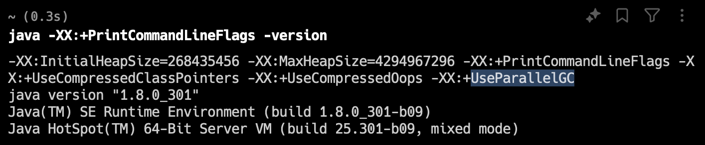

二哥的 Java 进阶之路：JDK 默认垃圾收集器
`UseParallelGC` = `Parallel Scavenge + Parallel Old`，表示新生代用`Parallel Scavenge`收集器，老年代使用`Parallel Old` 收集器。
因此你也可以这样回答：我们系统的业务相对复杂，但并发量并不是特别高，所以我们选择了适用于多核处理器、能够并行处理垃圾回收任务，且能提供高吞吐量的`Parallel GC`。
但这个说法不讨喜，你也可以回答：
我们系统采用的是 CMS 收集器，能够最大限度减少应用暂停时间。
#### [工作中项目使用的什么垃圾回收算法？](https://javabetter.cn/sidebar/sanfene/jvm.html#%E5%B7%A5%E4%BD%9C%E4%B8%AD%E9%A1%B9%E7%9B%AE%E4%BD%BF%E7%94%A8%E7%9A%84%E4%BB%80%E4%B9%88%E5%9E%83%E5%9C%BE%E5%9B%9E%E6%94%B6%E7%AE%97%E6%B3%95)
我们生产环境中采用了设计比较优秀的 G1 垃圾收集器，G1 采用的是分区式标记-整理算法，将堆划分为多个区域，按需回收，适用于大内存和多核环境，能够同时考虑吞吐量和暂停时间。
或者：
我们系统采用的是 CMS 收集器，CMS 采用的是标记-清除算法，能够并发标记和清除垃圾，减少暂停时间，适用于对延迟敏感的应用。
再或者：
我们系统采用的是 Parallel 收集器，Parallel 采用的是年轻代使用复制算法，老年代使用标记-整理算法，适用于高吞吐量要求的应用。
### [36.垃圾收集器应该如何选择？](https://javabetter.cn/sidebar/sanfene/jvm.html#_36-%E5%9E%83%E5%9C%BE%E6%94%B6%E9%9B%86%E5%99%A8%E5%BA%94%E8%AF%A5%E5%A6%82%E4%BD%95%E9%80%89%E6%8B%A9)
垃圾收集器的选择需要权衡的点还是比较多的——例如运行应用的基础设施如何？使用 JDK 的发行商是什么？等等……
这里简单地列一下上面提到的一些收集器的适用场景：

- Serial ：如果应用程序有一个很小的内存空间（大约 100 MB）亦或它在没有停顿时间要求的单线程处理器上运行。
- Parallel：如果优先考虑应用程序的峰值性能，并且没有时间要求要求，或者可以接受 1 秒或更长的停顿时间。
- CMS/G1：如果响应时间比吞吐量优先级高，或者垃圾收集暂停必须保持在大约 1 秒以内。
- ZGC：如果响应时间是高优先级的，或者堆空间比较大。
### 常见场景题汇总

#### [场景1：CPU 飙高排查（GC 导致）]
**问题描述**：
线上服务 CPU 突然飙升到 100% 报警。你登录机器后，通过 `top -H -p <pid>` 发现是几个 GC 线程（如 `GC task thread`）占用率极高。这是什么情况？怎么进一步确认和解决？

**解答**：
*   **原因**：很可能是 **频繁 Full GC**（GC Thrashing）。JVM 一直在做垃圾回收，但回收不到多少空间，陷入死循环。
*   **排查步骤**：
    1.  **确认 GC 频率**：执行 `jstat -gcutil <pid> 1000`（每秒刷新）。如果 `FGC`（Full GC 次数）快速增加，且 `Old`（老年代占用）一直居高不下，确认是 Full GC 问题。
    2.  **导出堆快照**：执行 `jmap -dump:format=b,file=heap.dump <pid>`。
    3.  **分析原因**：使用 MAT (Memory Analyzer Tool) 打开 dump 文件，查看“Dominator Tree”或“Histogram”，找出占用内存最大的对象（通常是内存泄漏或大对象缓存）。

#### [场景2：慢内存泄漏（OOM）]
**问题描述**：
系统运行初期一切正常，但每隔一周就会报 `OutOfMemoryError: Java heap space` 并宕机。重启后又正常运行一周。这是什么问题？

**解答**：
这是典型的**慢内存泄漏**。
*   **可能原因**：
    *   `static` 集合类（Map/List）只加不减。
    *   未关闭的资源（如数据库连接、IO 流）导致对象无法回收。
    *   `ThreadLocal` 未及时 remove。
*   **解决**：同上，必须在内存快溢出时（或定期）抓取 Heap Dump 进行对比分析，找出持续增长的对象。

#### [场景3：Metaspace 溢出]
**问题描述**：
应用报错 `java.lang.OutOfMemoryError: Metaspace`。增加堆内存（-Xmx）无效。为什么？

**解答**：
*   **原因**：Metaspace（元空间）存储的是**类的元数据**（Class Metadata），而不是对象实例。增加堆内存没用。
*   **常见场景**：
    *   大量使用反射或动态代理（CGLib, Spring AOP），生成了大量临时类。
    *   自定义 ClassLoader 加载了过多类且未卸载。
*   **解决**：
    *   增大 `-XX:MaxMetaspaceSize`。
    *   排查代码中是否有动态类生成失控的情况。

#### [场景4：CMS 的 Concurrent Mode Failure]
**问题描述**：
在使用 CMS 收集器的日志中，频繁出现 `Concurrent Mode Failure`，紧接着发生长时间的 Stop-The-World。这是为什么？

**解答**：
*   **现象**：CMS 还在并发标记/清理的时候，老年代已经满了（或者晋升失败），导致 CMS 无法继续。
*   **后果**：JVM 被迫**退化**为 Serial Old 收集器，使用单线程进行 Full GC，导致极长的停顿。
*   **解决**：
    *   **调低触发阈值**：减小 `-XX:CMSInitiatingOccupancyFraction`（让 CMS 更早开始 GC，预留更多空间）。
    *   **增加堆内存**。
    *   **切换 G1**：G1 更适合大堆且不容易出现这种退化。
