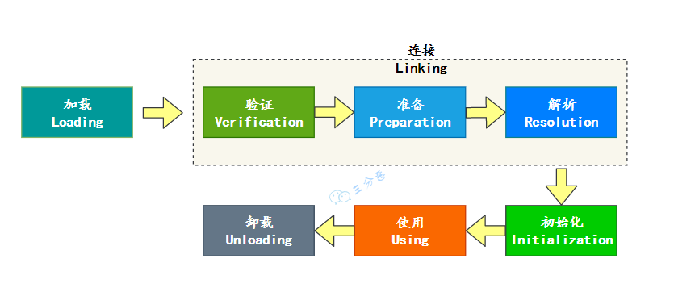
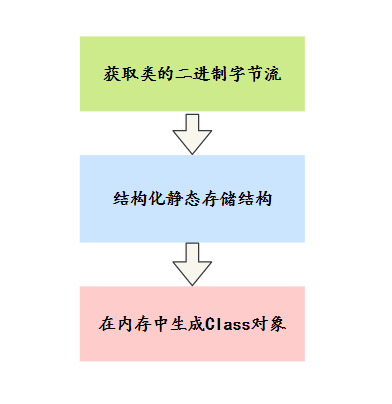
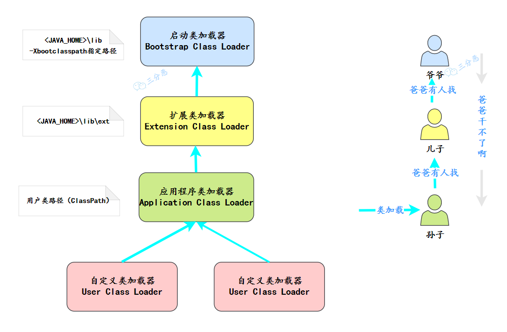
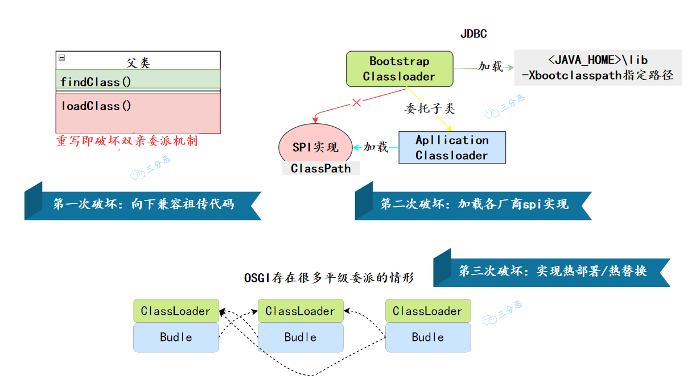
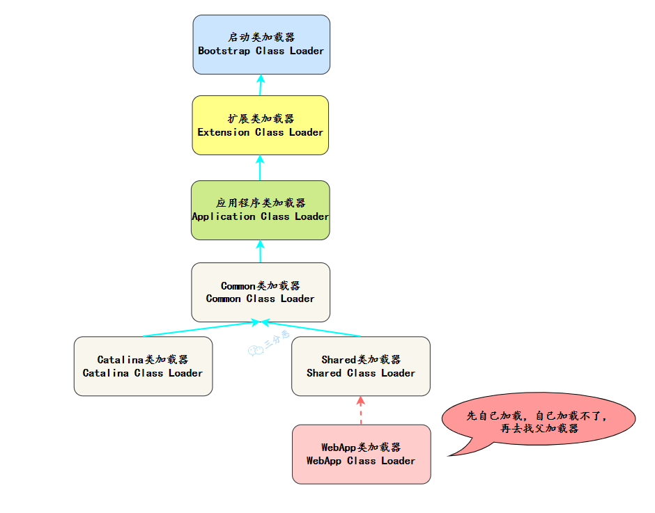

## 五、类加载机制
### [45.了解类的加载机制吗？（补充）](https://javabetter.cn/sidebar/sanfene/jvm.html#_45-%E4%BA%86%E8%A7%A3%E7%B1%BB%E7%9A%84%E5%8A%A0%E8%BD%BD%E6%9C%BA%E5%88%B6%E5%90%97-%E8%A1%A5%E5%85%85)
> 2024 年 03 月 29 日增补

JVM 的操作对象是 Class 文件，JVM 把 Class 文件中描述类的数据结构加载到内存中，并对数据进行校验、解析和初始化，最终形成可以被 JVM 直接使用的类型，这个过程被称为类加载机制。
其中最重要的三个概念就是：类加载器、类加载过程和类加载器的双亲委派模型。

- **类加载器**：负责加载类文件，将类文件加载到内存中，生成 Class 对象。
- **类加载过程**：加载、验证、准备、解析和初始化。
- **双亲委派模型**：当一个类加载器收到类加载请求时，它首先不会自己去尝试加载这个类，而是把请求委派给父类加载器去完成，依次递归，直到最顶层的类加载器，如果父类加载器无法完成加载请求，子类加载器才会尝试自己去加载。### [46.类加载器有哪些？](https://javabetter.cn/sidebar/sanfene/jvm.html#_46-%E7%B1%BB%E5%8A%A0%E8%BD%BD%E5%99%A8%E6%9C%89%E5%93%AA%E4%BA%9B)
类加载器（ClassLoader）用于动态加载 Java 类到 Java 虚拟机中。主要有四种类加载器：
①、**启动类加载器**（Bootstrap ClassLoader）负责加载 JVM 的核心类库，如 rt.jar 和其他核心库位于`JAVA_HOME/jre/lib`目录下的类。
②、**扩展类加载器**(Extension ClassLoader)：由`sun.misc.Launcher$ExtClassLoader`（或其它类似实现）实现。负责加载`JAVA_HOME/jre/lib/ext`目录下，或者由系统属性`java.ext.dirs`指定位置的类库。
③、**应用程序类加载器**（Application ClassLoader）：由`sun.misc.Launcher$AppClassLoader`（或其它类似实现）实现。
负责加载系统类路径（classpath）上的类库，通常是我们在开发 Java 应用程序时的主要类加载器。
我们编写的任何类都是由应用程序类加载器加载的，除非显式使用自定义类加载器。
④、**用户自定义类加载器** (User-Defined ClassLoader)，我们可以通过继承`java.lang.ClassLoader`类来创建自己的类加载器。
这种类加载器通常用于加载网络上的类、执行热部署（动态加载和替换应用程序的组件）或为了安全目的自定义类的加载方式。
### [47.能说一下类的生命周期吗？](https://javabetter.cn/sidebar/sanfene/jvm.html#_47-%E8%83%BD%E8%AF%B4%E4%B8%80%E4%B8%8B%E7%B1%BB%E7%9A%84%E7%94%9F%E5%91%BD%E5%91%A8%E6%9C%9F%E5%90%97)
一个类从被加载到虚拟机内存中开始，到从内存中卸载，整个生命周期需要经过七个阶段：加载 （Loading）、验证（Verification）、准备（Preparation）、解析（Resolution）、初始化 （Initialization）、使用（Using）和卸载（Unloading）。


三分恶面渣逆袭：类的生命周期
### [48.类装载的过程知道吗？](https://javabetter.cn/sidebar/sanfene/jvm.html#_48-%E7%B1%BB%E8%A3%85%E8%BD%BD%E7%9A%84%E8%BF%87%E7%A8%8B%E7%9F%A5%E9%81%93%E5%90%97)
> 推荐阅读：[一文彻底搞懂 Java 类加载机制](https://javabetter.cn/jvm/class-load.html)

类装载过程包括三个阶段：载入、链接（包括验证、准备、解析）、初始化。
①、载入：将类的二进制字节码加载到内存中。
②、链接可以细分为三个小的阶段：

- 验证：检查类文件格式是否符合 JVM 规范
- 准备：为类的静态变量分配内存并设置默认值。
- 解析：将符号引用替换为直接引用。③、初始化：执行静态代码块和静态变量初始化。
在准备阶段，静态变量已经被赋过默认初始值了，在初始化阶段，静态变量将被赋值为代码期望赋的值。
换句话说，初始化阶段是执行类的构造方法（[javap](https://javabetter.cn/jvm/bytecode.html) 中看到的 `<clinit>()` 方法）的过程。
#### [载入过程JVM 会做什么？](https://javabetter.cn/sidebar/sanfene/jvm.html#%E8%BD%BD%E5%85%A5%E8%BF%87%E7%A8%8Bjvm-%E4%BC%9A%E5%81%9A%E4%BB%80%E4%B9%88)


三分恶面渣逆袭：载入

- 1）通过一个类的全限定名来获取定义此类的二进制字节流。
- 2）将这个字节流所代表的静态存储结构转化为方法区的运行时数据结构。
- 3）在内存中生成一个代表这个类的 `java.lang.Class` 对象，作为方法区这个类的各种数据的访问入口。### [49.什么是双亲委派模型？](https://javabetter.cn/sidebar/sanfene/jvm.html#_49-%E4%BB%80%E4%B9%88%E6%98%AF%E5%8F%8C%E4%BA%B2%E5%A7%94%E6%B4%BE%E6%A8%A1%E5%9E%8B)
双亲委派模型要求类加载器在加载类时，先委托父加载器尝试加载，只有父加载器无法加载时，子加载器才会加载。


三分恶面渣逆袭：双亲委派模型

- 当一个类加载器需要加载某个类时，它首先会请求其父类加载器加载这个类。
- 这个过程会一直向上递归，也就是说，从子加载器到父加载器，再到更上层的加载器，一直到最顶层的启动类加载器。
- 启动类加载器会尝试加载这个类。如果它能够加载这个类，就直接返回；如果它不能加载这个类（因为这个类不在它的搜索范围内），就会将加载任务返回给委托它的子加载器。
- 子加载器接着尝试加载这个类。如果子加载器也无法加载这个类，它就会继续向下传递这个加载任务，依此类推。
- 这个过程会继续，直到某个加载器能够加载这个类，或者所有加载器都无法加载这个类，最终抛出 ClassNotFoundException。### [49.为什么要用双亲委派模型？](https://javabetter.cn/sidebar/sanfene/jvm.html#_49-%E4%B8%BA%E4%BB%80%E4%B9%88%E8%A6%81%E7%94%A8%E5%8F%8C%E4%BA%B2%E5%A7%94%E6%B4%BE%E6%A8%A1%E5%9E%8B)
**①、避免类的重复加载**：父加载器加载的类，子加载器无需重复加载。
**②、保证核心类库的安全性**：如 `java.lang.*` 只能由 Bootstrap ClassLoader 加载，防止被篡改。
> 
1. [Java 面试指南（付费）](https://javabetter.cn/zhishixingqiu/mianshi.html)收录的美团面经同学 16 暑期实习一面面试原题：讲一下类加载过程，双亲委派模型，双亲委派的好处
### [50.如何破坏双亲委派机制？](https://javabetter.cn/sidebar/sanfene/jvm.html#_50-%E5%A6%82%E4%BD%95%E7%A0%B4%E5%9D%8F%E5%8F%8C%E4%BA%B2%E5%A7%94%E6%B4%BE%E6%9C%BA%E5%88%B6)
如果不想打破双亲委派模型，就重写 ClassLoader 类中的 fifindClass()方法即可，无法被父类加载器加载的类最终会通过这个方法被加载。而如果想打破双亲委派模型则需要重写 loadClass()方法。
### [51.历史上有哪几次双亲委派机制的破坏？](https://javabetter.cn/sidebar/sanfene/jvm.html#_51-%E5%8E%86%E5%8F%B2%E4%B8%8A%E6%9C%89%E5%93%AA%E5%87%A0%E6%AC%A1%E5%8F%8C%E4%BA%B2%E5%A7%94%E6%B4%BE%E6%9C%BA%E5%88%B6%E7%9A%84%E7%A0%B4%E5%9D%8F)
双亲委派机制在历史上主要有三次破坏：


三分恶面渣逆袭：双亲委派模型的三次破坏
#### [说说第一次破坏](https://javabetter.cn/sidebar/sanfene/jvm.html#%E8%AF%B4%E8%AF%B4%E7%AC%AC%E4%B8%80%E6%AC%A1%E7%A0%B4%E5%9D%8F)
双亲委派模型的第一次“被破坏”其实发生在双亲委派模型出现之前——即 JDK 1.2 面世以前的“远古”时代。
由于双亲委派模型在 JDK 1.2 之后才被引入，但是类加载器的概念和抽象类 java.lang.ClassLoader 则在 Java 的第一个版本中就已经存在，为了向下兼容旧代码，所以无法以技术手段避免 loadClass()被子类覆盖的可能性，只能在 JDK 1.2 之后的 java.lang.ClassLoader 中添加一个新的 protected 方法 findClass()，并引导用户编写的类加载逻辑时尽可能去重写这个方法，而不是在 loadClass()中编写代码。
#### [说说第二次破坏](https://javabetter.cn/sidebar/sanfene/jvm.html#%E8%AF%B4%E8%AF%B4%E7%AC%AC%E4%BA%8C%E6%AC%A1%E7%A0%B4%E5%9D%8F)
双亲委派模型的第二次“被破坏”是由这个模型自身的缺陷导致的，如果有基础类型又要调用回用户的代码，那该怎么办呢？
例如我们比较熟悉的 JDBC:
各个厂商各有不同的 JDBC 的实现，Java 在核心包`\lib`里定义了对应的 SPI，那么这个就毫无疑问由`启动类加载器`加载器加载。
但是各个厂商的实现，是没办法放在核心包里的，只能放在`classpath`里，只能被`应用类加载器`加载。那么，问题来了，启动类加载器它就加载不到厂商提供的 SPI 服务代码。
为了解决这个问题，引入了一个不太优雅的设计：线程上下文类加载器 （Thread Context ClassLoader）。这个类加载器可以通过 java.lang.Thread 类的 setContext-ClassLoader()方法进行设置，如果创建线程时还未设置，它将会从父线程中继承一个，如果在应用程序的全局范围内都没有设置过的话，那这个类加载器默认就是应用程序类加载器。
JNDI 服务使用这个线程上下文类加载器去加载所需的 SPI 服务代码，这是一种父类加载器去请求子类加载器完成类加载的行为。
#### [说说第三次破坏](https://javabetter.cn/sidebar/sanfene/jvm.html#%E8%AF%B4%E8%AF%B4%E7%AC%AC%E4%B8%89%E6%AC%A1%E7%A0%B4%E5%9D%8F)
双亲委派模型的第三次“被破坏”是由于用户对程序动态性的追求而导致的，例如代码热替换（Hot Swap）、模块热部署（Hot Deployment）等。
OSGi 实现模块化热部署的关键是它自定义的类加载器机制的实现，每一个程序模块（OSGi 中称为 Bundle）都有一个自己的类加载器，当需要更换一个 Bundle 时，就把 Bundle 连同类加载器一起换掉以实现代码的热替换。在 OSGi 环境下，类加载器不再双亲委派模型推荐的树状结构，而是进一步发展为更加复杂的网状结构。
### [52.Tomcat 的类加载机制了解吗？](https://javabetter.cn/sidebar/sanfene/jvm.html#_52-tomcat-%E7%9A%84%E7%B1%BB%E5%8A%A0%E8%BD%BD%E6%9C%BA%E5%88%B6%E4%BA%86%E8%A7%A3%E5%90%97)
Tomcat 是主流的 Java Web 服务器之一，为了实现一些特殊的功能需求，自定义了一些类加载器。
Tomcat 类加载器如下：


Tomcat类加载器
Tomcat 实际上也是破坏了双亲委派模型的。
Tomact 是 web 容器，可能需要部署多个应用程序。不同的应用程序可能会依赖同一个第三方类库的不同版本，但是不同版本的类库中某一个类的全路径名可能是一样的。如多个应用都要依赖 hollis.jar，但是 A 应用需要依赖 1.0.0 版本，但是 B 应用需要依赖 1.0.1 版本。这两个版本中都有一个类是 com.hollis.Test.class。如果采用默认的双亲委派类加载机制，那么无法加载多个相同的类。
所以，Tomcat 破坏了**双亲委派原则**，提供隔离的机制，为每个 web 容器单独提供一个 WebAppClassLoader 加载器。每一个 WebAppClassLoader 负责加载本身的目录下的 class 文件，加载不到时再交 CommonClassLoader 加载，这和双亲委派刚好相反。
### [53.你觉得应该怎么实现一个热部署功能？](https://javabetter.cn/sidebar/sanfene/jvm.html#_53-%E4%BD%A0%E8%A7%89%E5%BE%97%E5%BA%94%E8%AF%A5%E6%80%8E%E4%B9%88%E5%AE%9E%E7%8E%B0%E4%B8%80%E4%B8%AA%E7%83%AD%E9%83%A8%E7%BD%B2%E5%8A%9F%E8%83%BD)
实现一个热部署（Hot Deployment）功能通常涉及到类的加载和卸载机制，使得在不重启应用程序的情况下，能够动态替换或更新应用程序的组件。
第一步，使用文件监控机制（如 Java NIO 的 WatchService）来监控类文件或配置文件的变更。当监控到文件变更时，触发热部署流程。

```java
class FileWatcher {
    public static void watchDirectoryPath(Path path) {
        // 检查路径是否是文件夹
        try {
            Boolean isFolder = (Boolean) Files.getAttribute(path, "basic:isDirectory", LinkOption.NOFOLLOW_LINKS);
            if (!isFolder) {
                throw new IllegalArgumentException("Path: " + path + " is not a folder");
            }
        } catch (IOException ioe) {
            // 文件 I/O 错误
            ioe.printStackTrace();
        }

        System.out.println("Watching path: " + path);

        // 我们获得文件系统的WatchService对象
        FileSystem fs = path.getFileSystem();

        try (WatchService service = fs.newWatchService()) {
            // 注册路径到监听服务
            // 监听目录内文件的创建、修改、删除事件
            path.register(service, ENTRY_CREATE, ENTRY_MODIFY, ENTRY_DELETE);

            // 开始无限循环，等待事件发生
            WatchKey key = null;
            while (true) {
                key = service.take(); // 会阻塞直到有事件发生

                // 对于每个发生的事件
                for (WatchEvent<?> watchEvent : key.pollEvents()) {
                    WatchEvent.Kind<?> kind = watchEvent.kind();

                    // 获取文件路径
                    @SuppressWarnings("unchecked")
                    WatchEvent<Path> ev = (WatchEvent<Path>) watchEvent;
                    Path fileName = ev.context();

                    System.out.println(kind.name() + ": " + fileName);
                }

                // 重置watchKey
                boolean valid = key.reset();
                // 退出循环如果watchKey无效
                if (!valid) {
                    break;
                }
            }
        } catch (Exception e) {
            e.printStackTrace();
        }
    }

    public static void main(String[] args) {
        // 监控当前目录
        Path pathToWatch = Paths.get(".");
        watchDirectoryPath(pathToWatch);
    }
}
```
第二步，创建一个自定义类加载器，继承自`java.lang.ClassLoader`，重写`findClass()`方法，实现类的加载。

```java
public class HotSwapClassLoader extends ClassLoader {
    public HotSwapClassLoader() {
        super(ClassLoader.getSystemClassLoader());
    }

    @Override
    protected Class<?> findClass(String name) throws ClassNotFoundException {
        // 加载指定路径下的类文件字节码
        byte[] classBytes = loadClassData(name);
        if (classBytes == null) {
            throw new ClassNotFoundException(name);
        }
        // 调用defineClass将字节码转换为Class对象
        return defineClass(name, classBytes, 0, classBytes.length);
    }

    private byte[] loadClassData(String name) {
        // 实现从文件系统或其他来源加载类文件的字节码
        // ...
        return null;
    }
}
```
像 Intellij IDEA 就提供了热部署功能，当我们修改了代码后，IDEA 会自动编译，如果是 Web 项目，在 Chrome 浏览器中装一个 LiveReload 插件，一旦编译完成，页面就会自动刷新。对于测试或者调试来说，就非常方便。
> 
1. [Java 面试指南（付费）](https://javabetter.cn/zhishixingqiu/mianshi.html)收录的小米暑期实习同学 E 一面面试原题：那你知道类的热更新的？
### [54.说说解释执行和编译执行的区别（补充）](https://javabetter.cn/sidebar/sanfene/jvm.html#_54-%E8%AF%B4%E8%AF%B4%E8%A7%A3%E9%87%8A%E6%89%A7%E8%A1%8C%E5%92%8C%E7%BC%96%E8%AF%91%E6%89%A7%E8%A1%8C%E7%9A%84%E5%8C%BA%E5%88%AB-%E8%A1%A5%E5%85%85)
> 2024 年 03 月 08 日增补

先说解释和编译的区别：

- 解释：将源代码逐行转换为机器码。
- 编译：将源代码一次性转换为机器码。一个是逐行，一个是一次性，再来说说解释执行和编译执行的区别：

- 解释执行：程序运行时，将源代码逐行转换为机器码，然后执行。
- 编译执行：程序运行前，将源代码一次性转换为机器码，然后执行。Java 一般被称为“解释型语言”，因为 Java 代码在执行前，需要先将源代码编译成字节码，然后在运行时，再由 JVM 的解释器“逐行”将字节码转换为机器码，然后执行。
这也是 Java 被诟病“慢”的主要原因。
但 JIT 的出现打破了这种刻板印象，JVM 会将热点代码（即运行频率高的代码）编译后放入 CodeCache，当下次执行再遇到这段代码时，会从 CodeCache 中直接读取机器码，然后执行。这大大提升了 Java 的执行效率。


图片来源于美团技术博客

---

---

### 常见场景题汇总

#### [场景1：Jar 包冲突（NoSuchMethodError）]
**问题描述**：
应用启动正常，但运行到某行代码时报错 `java.lang.NoSuchMethodError`。
排查发现项目中确实引入了该类，且 IDE 里跳转也没问题。为什么运行时找不到方法？

**解答**：
这是典型的 **Maven 依赖冲突（Jar Hell）**。
*   **原因**：项目中同时引入了某个 Jar 包的两个不同版本（例如 v1.0 和 v2.0）。
    *   v1.0 没有该方法，v2.0 有。
    *   JVM 类加载器只会加载其中一个版本（通常是 classpath 中靠前的那个）。如果加载了 v1.0，而代码里调用了 v2.0 的方法，就会报 `NoSuchMethodError`。
*   **解决**：
    1.  使用 `mvn dependency:tree` 查看依赖树。
    2.  使用 `<exclusion>` 排除低版本，或在 `<dependencyManagement>` 中锁定版本。

#### [场景2：Tomcat 的多应用隔离]
**问题描述**：
在同一个 Tomcat 容器中部署了两个 Web 应用（App1 和 App2）。App1 使用 Spring 4，App2 使用 Spring 5。它们会冲突吗？为什么？

**解答**：
**不会冲突**。
*   **原理**：Tomcat 打破了标准的双亲委派模型。
*   每个 Web 应用都有自己独立的 `WebAppClassLoader`。
*   加载类时，`WebAppClassLoader` 会**优先加载** `WEB-INF/classes` 和 `WEB-INF/lib` 下的类，而不是委托给父加载器。
*   因此，App1 加载的是自己的 Spring 4，App2 加载的是自己的 Spring 5，互不干扰。

#### [场景3：Class.forName vs ClassLoader.loadClass]
**问题描述**：
如果你想加载一个 JDBC 驱动类，应该用 `Class.forName("com.mysql.cj.jdbc.Driver")` 还是 `classLoader.loadClass("...")`？有什么区别？

**解答**：
应该用 **`Class.forName()`**。
*   **区别**：
    *   `Class.forName(name)`：不仅加载类，还会**执行类的初始化**（即执行 `static` 代码块）。JDBC 驱动通常在 static 块中将自己注册到 `DriverManager`。
    *   `loadClass(name)`：仅仅将 `.class` 文件加载到内存，**不执行初始化**。如果用这个，驱动不会被注册，数据库连接会失败。

#### [场景4：热部署的局限性]
**问题描述**：
在使用 IDEA 自带的热部署（HotSwap）调试时，为什么修改方法体内的代码可以立即生效，但如果添加了一个新方法或新字段，就会提示 "Schema Change not supported" 并不生效？

**解答**：
这是 JDK 标准 HotSwap 机制的限制。
*   **原理**：JDK 的 HotSwap 仅支持**替换方法体（Method Body）的字节码**。
*   **不支持**：修改类结构（如添加/删除字段、方法、修改继承关系）。因为这涉及到内存布局的改变，运行时的实例无法动态调整。
*   **解决**：使用更强大的工具如 JRebel 或 DCEVM（Dynamic Code Evolution VM）。
