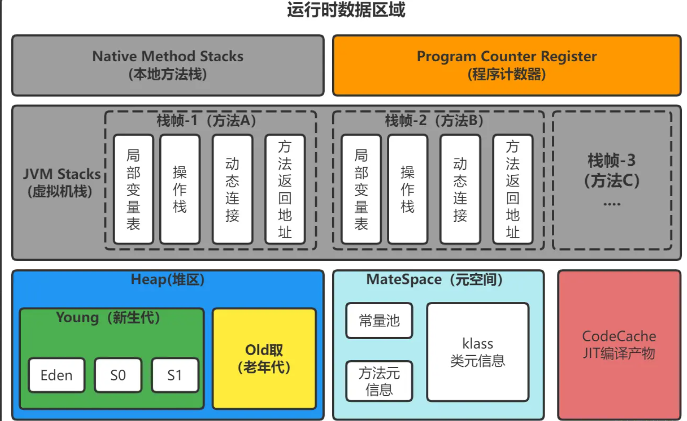
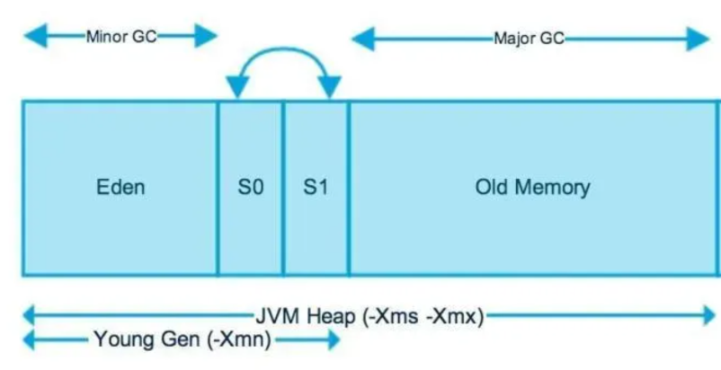
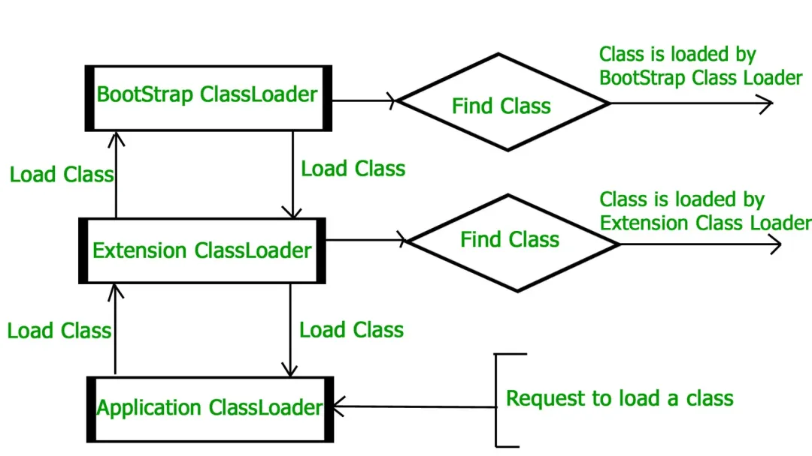

# 说说你了解的JVM内存模型
## 一句话总结 
JVM内存模型主要包含堆（存放对象实例）、方法区（存储类信息、常量）、虚拟机栈（线程私有方法调用）、本地方法栈（Native方法）和程序计数器（线程执行位置）。堆和方法区线程共享，栈和程序计数器线程私有，直接内存通过堆外分配管理。
## 详细解析 
Java 虚拟机（JVM）的内存区域分为多个部分，每个部分负责不同的任务。 

---
### **1. 程序计数器（Program Counter Register）**

- **作用**：记录当前线程执行的位置（字节码指令的地址），确保线程切换后能恢复到正确的位置。 
- **特点**： 
- **线程私有**：每个线程独立存储，互不影响。 
- **唯一无 OOM 的区域**：不会抛出OutOfMemoryError。 
- **Native 方法时值为空**：执行本地方法（如 C/C++ 代码）时，计数器值为undefined。 
---
### **2. 虚拟机栈（Java Virtual Machine Stacks）**

- **作用**：存储方法调用的栈帧（Stack Frame），每个方法从调用到完成对应一个栈帧的入栈到出栈。 
- **结构**： 
- **局部变量表**：存放基本数据类型（int,boolean等）、对象引用（指针）和返回地址。 
- **操作数栈**：执行字节码指令的临时数据存储区（如算术运算的中间结果）。 
- **动态链接**：指向运行时常量池的方法引用。 
- **方法出口**：记录方法返回的地址（正常返回或异常退出）。 
- **异常**： 
- **StackOverflowError**：栈深度超过限制（如无限递归）。 
- **OutOfMemoryError**：扩展栈时无法申请足够内存（较少见）。 
- **线程私有**：每个线程的栈独立分配。 
---
### **3. 本地方法栈（Native Method Stack）**

- **作用**：为 Native 方法（非 Java 代码，如 JNI 调用）提供栈空间。 
- **特点**： 
-  与虚拟机栈类似，但服务于本地方法。 
-  HotSpot 虚拟机将两者合并。 
- **异常**：同虚拟机栈（StackOverflowError和OutOfMemoryError）。 
---
### **4. 堆（Heap）**

- **作用**：存放对象实例和数组（所有线程共享的主内存区域）。 
- **结构**（分代模型）： 
- **新生代（Young Generation）**： 
- **Eden 区**：对象首次分配的区域。 
- **Survivor 区**（From/To）：存活对象在 Minor GC 后暂存。 
- **老年代（Old Generation）**：长期存活的对象（经过多次 GC 后晋升）。 
- **元数据区（JDK8+）**：替代永久代，存放类元信息。 
- **异常**：OutOfMemoryError（堆内存不足）。 
- **关键参数**： 
-  -Xms：初始堆大小。 
-  -Xmx：最大堆大小。 
-  -XX:NewRatio：新生代与老年代比例。 

---
### **5. 方法区（Method Area）**

- **作用**：存储类信息（类名、方法、字段）、常量、静态变量、即时编译器代码。 
- **演变**： 
- **JDK7 及之前**：称为永久代（PermGen），受-XX:PermSize和-XX:MaxPermSize控制。 
- **JDK8+**：改为元空间（Metaspace），使用本地内存，由-XX:MetaspaceSize和-XX:MaxMetaspaceSize配置。 
- **异常**：OutOfMemoryError（类元数据过多）。 
---
### **6. 运行时常量池（Runtime Constant Pool）**

- **位置**：方法区的一部分。 
- **内容**： 
-  编译期生成的字面量（如字符串常量"abc"）。 
-  符号引用（类、方法、字段的全限定名）。 
- **动态性**：运行期间可添加新常量（如String.intern()）。 
- **异常**：OutOfMemoryError（常量池溢出）。 
---
### **7. 直接内存（Direct Memory）**

- **作用**：通过ByteBuffer.allocateDirect()分配的堆外内存，提升 NIO 性能。 
- **特点**： 
-  不受 JVM 堆限制，但受系统内存影响。 
-  由-XX:MaxDirectMemorySize控制大小。 
- **异常**：OutOfMemoryError（直接内存耗尽）。 
---
### **8. 内存区域对比表**
 | **区域** | **线程共享** | **存储内容** | **异常** | **配置参数** | 
|---|---|---|---|---|
 | **程序计数器** |  私有  |  当前指令地址  |  无  |  无  | 
 | **虚拟机栈** |  私有  |  方法栈帧（局部变量、操作数栈）  |  StackOverflowError/OOM  |  -Xss（栈大小）  | 
 | **本地方法栈** |  私有  |  Native 方法栈帧  |  StackOverflowError/OOM  |  无  | 
 | **堆** |  共享  |  对象实例、数组  |  OOM: Java heap space  |  -Xms,-Xmx,-XX:NewRatio  | 
 | **方法区（元空间）** |  共享  |  类元数据、常量、静态变量  |  OOM: Metaspace  |  -XX:MetaspaceSize,-XX:MaxMetaspaceSize  | 
 | **直接内存** |  共享  |  堆外缓冲数据  |  OOM: Direct buffer memory  |  -XX:MaxDirectMemorySize  | 

---
### **9. 常见问题示例**

1. **堆内存溢出**： **解决**：增大-Xmx或优化代码减少对象创建。 

1. **元空间溢出**： **解决**：增大-XX:MaxMetaspaceSize或限制动态类生成。 

1. **栈溢出**： **解决**：检查递归终止条件或增大-Xss（谨慎使用）。 
​
> 来自: [JVM-牛客面经八股](https://www.nowcoder.com/exam/interview/89425779/test?paperId=61536920&order=0)

​
# 说说JVM的垃圾回收算法。
## 一句话总结 
​JVM主要垃圾回收算法包括：标记-清除（产生内存碎片）、复制算法（适合新生代）、标记-整理（适合老年代）。现代JVM多采用分代收集策略，结合不同算法管理新生代（复制）和老年代（标记-清除/整理）。还有增量、并发算法（如G1）减少停顿时间。
## 详细解析 
JVM的垃圾回收（GC）算法是自动内存管理的核心，其设计目标是在不同场景下平衡吞吐量、延迟和内存利用率。以下是主流算法及其特点的总结：
**一、基础算法分类**
 |  算法  |  原理  |  优点  |  缺点  |  适用场景  | 
|---|---|---|---|---|
 |  标记-清除  |  分标记（遍历对象图）和清除（回收未标记对象）两阶段  |  实现简单  |  内存碎片化，可能触发Full GC  |  老年代（CMS收集器）  | 
 |  复制算法  |  将堆分为两块，存活对象复制到另一块后清空原区域  |  无碎片，效率高  |  内存利用率低（仅用50%）  |  年轻代（Serial/Parallel）  | 
 |  标记-整理  |  标记后整理存活对象至内存一端，清理边界外空间  |  避免碎片，内存利用率高  |  整理耗时，可能引发STW  |  老年代（Serial Old）  | 
 |  分代收集  |  按对象生命周期划分新生代（复制算法）和老年代（标记-清除/整理）  |  针对性优化效率  |  需协调多代策略  |  通用方案（G1/Parallel GC）  | 

---
**二、进阶算法与优化策略**
 |  算法  |  原理  |  优点  |  缺点  |  适用场景  | 
|---|---|---|---|---|
 |  增量收集  |  将GC任务拆分为小步骤，与应用线程交替执行  |  减少单次STW时间  |  总GC时间增加，可能碎片化  |  早期CMS部分阶段  | 
 |  CMS  |  并发标记清除：初始标记（STW）→并发标记→重新标记（STW）→并发清除  |  低延迟（仅两次短暂STW）  |  无法处理浮动垃圾，可能触发Full GC  |  互联网服务端（低延迟需求）  | 
 |  G1  |  分区堆（Region），优先回收垃圾最多的Region，混合标记-清除与整理  |  可预测停顿时间，支持大堆  |  内存占用较高  |  大内存、低延迟（JDK 9+默认）  | 
 |  ZGC  |  染色指针+读屏障，全堆并发标记，STW极短（<10ms）  |  超低延迟，支持TB级堆  |  内存占用高，JDK 15+可用  |  超大规模内存应用  | 
 |  Shenandoah  |  类似ZGC，但通过Brooks指针实现并发压缩  |  低延迟，减少碎片  |  需额外内存维护指针  |  高吞吐与低延迟平衡场景  | 

---
**三、算法对比与选型**
 |  算法  |  吞吐量  |  延迟  |  内存利用率  |  适用代  |  典型收集器  | 
|---|---|---|---|---|---|
 |  标记-清除  |  中  |  高  |  低  |  老年代  |  CMS  | 
 |  复制算法  |  高  |  低  |  中  |  年轻代  |  Serial/Parallel  | 
 |  标记-整理  |  中  |  中  |  高  |  老年代  |  Serial Old  | 
 |  分代收集  |  高  |  中  |  中  |  年轻代+老年代  |  G1/Parallel GC  | 
 |  ZGC  |  高  |  极低  |  高  |  全堆  |  ZGC  | 

---
**四、总结**
JVM垃圾回收算法通过分代策略和混合回收实现高效内存管理： 

- **分代收集是主流**：结合不同区域对象特性选择高效算法，平衡吞吐量与延迟。 
- **演进趋势**：现代收集器（如 G1、ZGC）通过分区和并发处理进一步优化，减少 STW 时间。 
- **调优关键**：根据应用特性（如高吞吐或低延迟）选择合适的 GC 算法和收集器。 > 来自: [JVM-牛客面经八股](https://www.nowcoder.com/exam/interview/89425779/test?paperId=61536920&order=0)

​
​
​
​
# JVM类加载机制
## 一句话总结 
类加载机制是JVM动态加载类的过程，包含加载、验证、准备、解析和初始化五个阶段。加载阶段读取.class文件生成Class对象；验证确保字节码合法；准备为静态变量分配内存并赋默认值；解析将符号引用转为直接引用；初始化执行静态代码块和变量赋值。各阶段顺序执行，确保类正确加载且符合安全规范。
## 详细解析 
Java的类加载过程可以分为以下几个阶段，每个阶段都有其特定的任务和顺序： 
### **1. 加载（Loading）**

- **任务**：查找并加载类的二进制字节流（如.class文件），将类的静态存储结构转化为方法区的运行时数据结构，并在堆中生成一个代表该类的java.lang.Class对象。 
- **触发条件**：当程序首次主动使用类时（如实例化对象、访问静态字段等）。 
- **类加载器**： 
- **启动类加载器（Bootstrap ClassLoader）**：加载JAVA_HOME/lib下的核心类库（如rt.jar）。 
- **扩展类加载器（Extension ClassLoader）**：加载JAVA_HOME/lib/ext下的扩展类。 
- **应用程序类加载器（Application ClassLoader）**：加载用户类路径（ClassPath）的类。 
- **自定义类加载器**：用户可继承ClassLoader实现自定义加载逻辑（如热部署、模块化加载）。 
- **双亲委派模型**：子类加载器优先委派父类加载器加载类，确保核心类库的安全性和唯一性。 
---
### **2. 验证（Verification）**

- **任务**：确保字节码符合JVM规范，防止恶意代码破坏虚拟机。 
- **验证内容**： 
- **文件格式验证**：检查魔数（0xCAFEBABE）、版本号、常量池等。 
- **元数据验证**：检查类继承、字段/方法访问权限、抽象类实现等是否符合语义。 
- **字节码验证**：验证方法体中的指令逻辑（如操作数栈类型、跳转指令合法性）。 
- **符号引用验证**：检查符号引用能否正确解析（如类、方法、字段是否存在）。 
---
### **3. 准备（Preparation）**

- **任务**：为类的静态变量分配内存并设置初始值（默认值，非代码中显式赋予的值）。 
- **示例**： 
- **注意**：若字段被final修饰且为编译期常量（如public static final int VALUE = 123），则直接赋值到常量池，不经过准备阶段。 
---
### **4. 解析（Resolution）**

- **任务**：将常量池中的符号引用（Symbolic References）转换为直接引用（Direct References）。 
- **符号引用**：以符号（如全限定名）描述引用的目标。 
- **直接引用**：指向目标的指针、偏移量或句柄。 
- **解析目标**： 
-  类/接口解析 
-  字段解析 
-  方法解析 
-  接口方法解析 
- **特点**：解析阶段可能发生在初始化之后（支持动态绑定）。 
---
### **5. 初始化（Initialization）**

- **任务**：执行类构造器<clinit>()方法，完成静态变量赋值和静态代码块的执行。 
- **触发条件**：主动引用类的五种场景： 
1.  new实例化对象、访问类的静态字段（非final）或静态方法。 
2.  反射调用类（如Class.forName("com.example.Test")）。 
3.  初始化子类时，父类未初始化会先触发父类初始化。 
4.  虚拟机启动时指定的主类（包含main()方法的类）。 
5.  JDK7+的动态语言支持（如MethodHandle解析结果触发初始化）。 
- **线程安全**：JVM保证<clinit>()方法在多线程环境下被正确加锁同步。 
---
### **6. 类加载示例**

- **执行过程**： 
1.  访问Child.b触发Child类的初始化。 
2.  由于Child的父类Parent未初始化，先初始化Parent。 
3.  父类Parent初始化完成后，再初始化子类Child。 
​
# 双亲委派模型
## 一句话总结 
双亲委派模型是Java类加载机制，子类加载器先委托父类加载器尝试加载类，避免重复加载并保证核心类安全。打破方式包括：1. 重写ClassLoader的loadClass()方法，自定义加载逻辑；2. 使用线程上下文类加载器，强制指定类加载器层级；3. SPI等场景通过反向委派（如JDBC驱动加载）绕过默认机制。
## 详细解析 
### 一、双亲委派模型（Parent Delegation Model） 
#### 1. 基本概念 
双亲委派模型是Java类加载器（ClassLoader）的一种**层次化委托机制**，用于确保类加载的**唯一性、安全性和一致性**。其核心思想是：**类加载器加载类时，先委托给父类加载器尝试加载，父类无法加载时才由自身加载**。 
#### 2. 类加载器的层次结构 
Java的类加载器按层次分为以下几类（从顶层到底层）： 
 |  类加载器  |  职责  |  实现语言  | 
|---|---|---|
 | **引导类加载器（Bootstrap ClassLoader）** |  加载JVM核心类（如java.lang.*、java.util.*），路径通常是$JAVA_HOME/lib  |  C++（JVM实现）  | 
 | **扩展类加载器（Extension ClassLoader）** |  加载JVM扩展类（如javax.*），路径通常是$JAVA_HOME/lib/ext  |  Java  | 
 | **应用类加载器（Application ClassLoader）** |  加载用户项目中的类（如classpath下的类），是ClassLoader.getSystemClassLoader()的返回值  |  Java  | 
 | **自定义类加载器（Custom ClassLoader）** |  用户自定义的类加载器（如加载网络、数据库或加密的类文件）  |  Java  | 
**父子关系**：自定义类加载器的父加载器默认是应用类加载器，应用类加载器的父是扩展类加载器，扩展类加载器的父是引导类加载器（引导类加载器在Java层不可见，通常表示为null）。 
#### 3. 工作流程 
双亲委派的核心逻辑体现在ClassLoader的loadClass方法中，流程如下： 

1. **检查已加载**：当前类加载器先检查目标类是否已加载（通过findLoadedClass方法），若已加载则直接返回。 
2. **向上委托父类**：若未加载，委托给父类加载器尝试加载（递归此过程，直到引导类加载器）。 
3. **父类无法加载**：若父类加载器均无法加载（如不在其加载路径），则当前类加载器自己尝试加载（通过findClass方法）。 
4. **加载并解析**：加载成功后，调用resolveClass方法解析类（可选）。 **示例流程**：加载com.example.User类时： 

-  应用类加载器先委托给扩展类加载器 → 扩展类加载器委托给引导类加载器。 
-  引导类加载器检查java.lang等核心包，发现无com.example.User，返回失败。 
-  扩展类加载器同理，返回失败。 
-  应用类加载器最终自己加载classpath下的User.class。 
- 
#### 4. 设计目的 

- **避免类重复加载**：父类加载器已加载的类，子类无需重复加载，确保类在JVM中唯一。 
- **保证核心类安全**：防止用户自定义同名核心类（如java.lang.String）覆盖JDK原生类，避免安全漏洞。例如，用户自定义的java.lang.String会被双亲委派机制委托给引导类加载器，而引导类加载器已加载JDK的String，因此用户的类不会被加载。 ### 二、如何打破双亲委派模型？ 
虽然双亲委派模型是Java的默认机制，但在某些场景下需要打破它，例如： 
#### 1. 打破的典型场景 

- **父类加载器需要调用子类加载器的类**（如JDK的SPI机制，如JDBC、JNDI）：JDK提供接口（如java.sql.Driver）由引导类加载器加载，但接口的实现类（如MySQL的com.mysql.cj.jdbc.Driver）由应用类加载器加载。此时父类加载器（引导类）需要访问子类加载器（应用类）的类，双亲委派无法实现。 
- **热部署/热替换**（如OSGi、Spring Boot DevTools）：需要动态加载、卸载类的不同版本（如模块升级），要求同一个类的不同版本由不同加载器加载。 
- **自定义类加载需求**（如加密类加载、非标准路径加载）：需要从网络、数据库或加密文件中加载类，且不希望父类优先加载。 #### 2. 打破的核心方法 
打破双亲委派的关键是**重写类加载器的loadClass方法**，改变“先委托父类”的默认逻辑。 
#### 3. 具体实现方式 
##### （1）通过线程上下文类加载器（Thread Context ClassLoader） 
JDK的SPI机制（如JDBC）通过**线程上下文类加载器**打破双亲委派。**原理**：允许父类加载器（如引导类加载器）使用子类加载器（如应用类加载器）来加载类。 
**示例（JDBC）**： 

-  java.sql.DriverManager由引导类加载器加载，它需要加载应用类加载器路径下的Driver实现类（如MySQL的Driver）。 
-  DriverManager通过Thread.currentThread().getContextClassLoader()获取线程上下文类加载器（默认是应用类加载器），并用它加载Driver实现类，从而绕过了双亲委派的单向委托。 ##### （2）重写loadClass方法（自定义类加载器） 
自定义类加载器时，覆盖loadClass方法，改变委托逻辑（如不先委托父类，直接自己加载）。 
**示例代码**： 
##### （3）OSGi的动态模块加载 
OSGi（动态模块化框架）通过**Bundle类加载器**打破双亲委派，每个模块（Bundle）有独立的类加载器。加载类时： 

-  先检查当前Bundle的缓存。 
-  再根据Import-Package委托给导出该包的Bundle的类加载器（而非全局父类加载器）。 
-  最后才委托给父类加载器。这种机制支持模块的热部署（动态卸载/加载Bundle）。 ### 三、总结
双亲委派模型通过层次化委托保证了类的唯一性和核心类的安全，而打破它通常用于解决父类加载器需要子类资源、动态部署等场景。核心手段是重写loadClass方法或使用线程上下文类加载器，但需权衡安全性和复杂度。 
​
> 来自: [牛客网 - 找工作神器|笔试题库|面试经验|实习招聘内推，求职就业一站解决_牛客网](https://www.nowcoder.com/exam/interview/89425779/test?paperId=61536920&order=0)

​
​
