1.5 万字 51 张手绘图，详解 54 道 Java 虚拟机面试高频题（让天下没有难背的八股），面渣背会这些 JVM 八股文，这次吊打面试官，我觉得稳了（手动 dog）。整理：沉默王二，戳[转载链接](https://mp.weixin.qq.com/s/bHhqhl8mH3OAPt3EkaVc8Q)，作者：三分恶，戳[原文链接](https://mp.weixin.qq.com/s/XYsEJyIo46jXhHE1sOR_0Q)。
## [一、引言](https://javabetter.cn/sidebar/sanfene/jvm.html#%E4%B8%80%E3%80%81%E5%BC%95%E8%A8%80)
### [1.什么是 JVM?](https://javabetter.cn/sidebar/sanfene/jvm.html#_1-%E4%BB%80%E4%B9%88%E6%98%AF-jvm)
JVM，也就是 Java 虚拟机，它是 Java 实现跨平台的基石。
Java 程序运行的时候，编译器会将 Java 源代码（.java）编译成平台无关的 Java 字节码文件（.class），接下来对应平台的 JVM 会对字节码文件进行解释，翻译成对应平台的机器指令并运行。
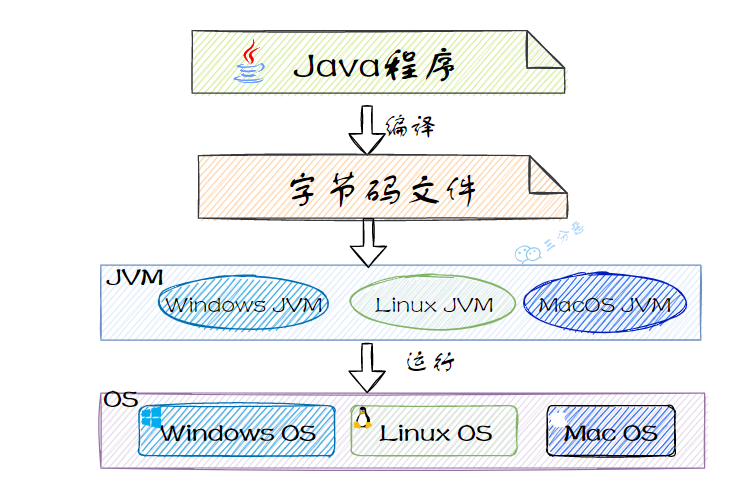

三分恶面渣逆袭：Java语言编译运行
也就实现了 Java 一次编译，处处运行的跨平台性。
#### [说说 JVM 的其他特性？](https://javabetter.cn/sidebar/sanfene/jvm.html#%E8%AF%B4%E8%AF%B4-jvm-%E7%9A%84%E5%85%B6%E4%BB%96%E7%89%B9%E6%80%A7)
①、垃圾回收：JVM 可以自动管理内存，通过垃圾回收机制（Garbage Collection）释放不再使用的对象所占用的内存。
②、JIT：JVM 包含一个即时编译器（JIT Compiler），它在运行时将热点代码缓存到 codeCache 中，下次执行的时候不用再一行一行解释，而是直接执行缓存后的机器码，执行效率会提高很多。
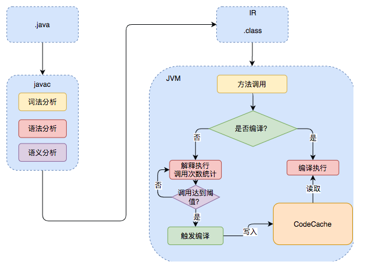

截图来自美团技术
③、多语言支持：任何可以通过 Java 编译的语言，比如说 Groovy、Kotlin、Scala 等，都可以在 JVM 上运行。
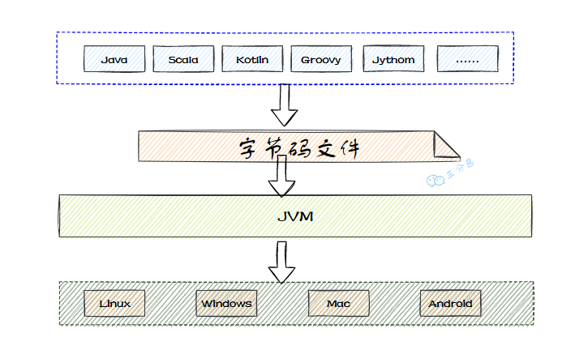

三分恶面渣逆袭：JVM跨语言
#### [为什么要学习 JVM？](https://javabetter.cn/sidebar/sanfene/jvm.html#%E4%B8%BA%E4%BB%80%E4%B9%88%E8%A6%81%E5%AD%A6%E4%B9%A0-jvm)
学习 JVM 可以帮助我们更好地优化程序性能、避免内存问题。
首先，了解 JVM 的内存模型和垃圾回收机制，可以帮助我们合理配置内存、减少 GC 停顿。
此外，掌握 JVM 的类加载机制可以帮助排查类加载冲突或异常。
JVM 还提供了很多调试和监控工具，比如使用 jmap 和 jstat 可以分析内存和线程的使用情况。
### [2.说说 JVM 的组织架构（补充）](https://javabetter.cn/sidebar/sanfene/jvm.html#_2-%E8%AF%B4%E8%AF%B4-jvm-%E7%9A%84%E7%BB%84%E7%BB%87%E6%9E%B6%E6%9E%84-%E8%A1%A5%E5%85%85)
> 本题是增补的内容，by 2024 年 03 月 08 日；

推荐阅读：[大白话带你认识 JVM](https://javabetter.cn/jvm/what-is-jvm.html)
JVM 大致可以划分为三个部分：类加载器、运行时数据区和执行引擎。
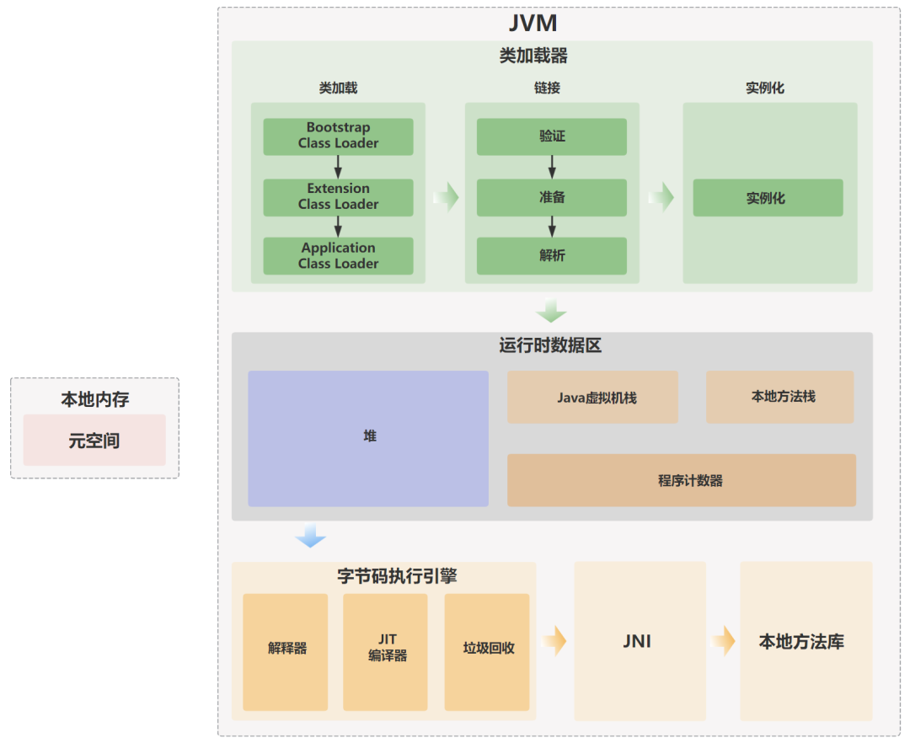

截图来源于网络
① 类加载器，负责从文件系统、网络或其他来源加载 Class 文件，将 Class 文件中的二进制数据读入到内存当中。
② 运行时数据区，JVM 在执行 Java 程序时，需要在内存中分配空间来处理各种数据，这些内存区域主要包括方法区、堆、栈、程序计数器和本地方法栈。
③ 执行引擎，JVM 的心脏，负责执行字节码。它包括一个虚拟处理器，还包括即时编译器 JIT 和垃圾回收器。
## [二、内存管理](https://javabetter.cn/sidebar/sanfene/jvm.html#%E4%BA%8C%E3%80%81%E5%86%85%E5%AD%98%E7%AE%A1%E7%90%86)
### [3.能说一下 JVM 的内存区域吗？](https://javabetter.cn/sidebar/sanfene/jvm.html#_3-%E8%83%BD%E8%AF%B4%E4%B8%80%E4%B8%8B-jvm-%E7%9A%84%E5%86%85%E5%AD%98%E5%8C%BA%E5%9F%9F%E5%90%97)
推荐阅读：[深入理解 JVM 的运行时数据区](https://javabetter.cn/jvm/neicun-jiegou.html)
按照 Java 虚拟机规范，JVM 的内存区域可以细分为`程序计数器`、`虚拟机栈`、`本地方法栈`、`堆`、`方法区`等。
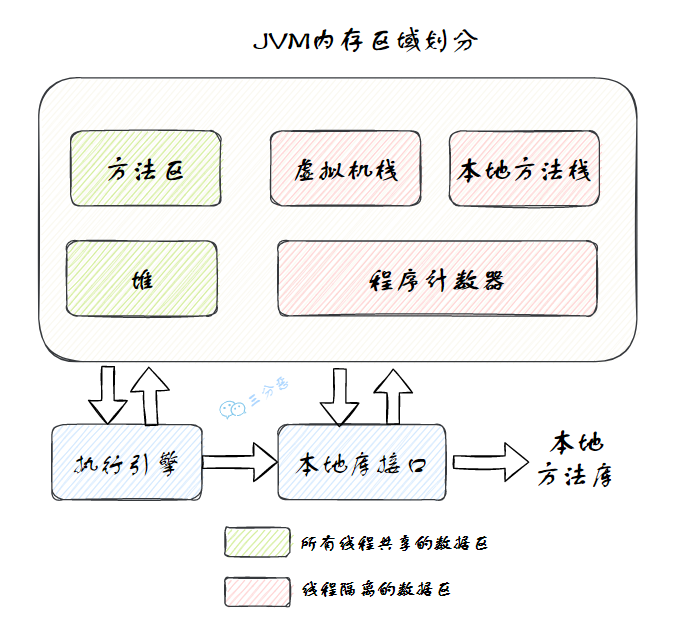

三分恶面渣逆袭：Java虚拟机运行时数据区
其中`方法区`和`堆`是线程共享的，`虚拟机栈`、`本地方法栈`和`程序计数器`是线程私有的。
#### [介绍一下程序计数器？](https://javabetter.cn/sidebar/sanfene/jvm.html#%E4%BB%8B%E7%BB%8D%E4%B8%80%E4%B8%8B%E7%A8%8B%E5%BA%8F%E8%AE%A1%E6%95%B0%E5%99%A8)
程序计数器也被称为 PC 寄存器，是一块较小的内存空间。它可以看作是当前线程所执行的字节码行号指示器。
#### [介绍一下 Java 虚拟机栈？](https://javabetter.cn/sidebar/sanfene/jvm.html#%E4%BB%8B%E7%BB%8D%E4%B8%80%E4%B8%8B-java-%E8%99%9A%E6%8B%9F%E6%9C%BA%E6%A0%88)
Java 虚拟机栈的生命周期与线程相同。
当线程执行一个方法时，会创建一个对应的[栈帧](https://javabetter.cn/jvm/stack-frame.html)，用于存储局部变量表、操作数栈、动态链接、方法出口等信息，然后栈帧会被压入栈中。当方法执行完毕后，栈帧会从栈中移除。
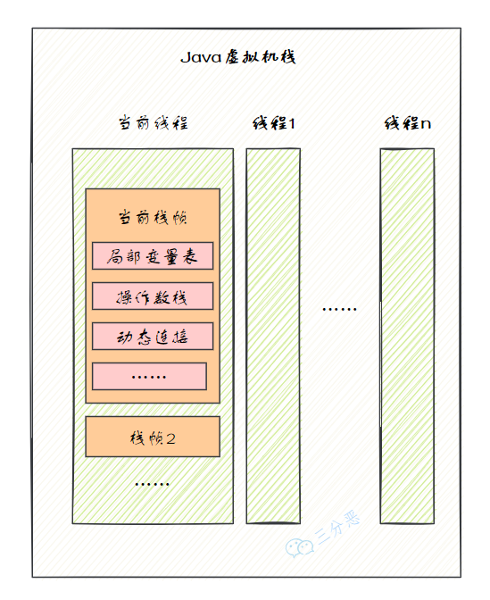

三分恶面渣逆袭：Java虚拟机栈
#### [一个什么都没有的空方法，完全空的参数什么都没有，那局部变量表里有没有变量？](https://javabetter.cn/sidebar/sanfene/jvm.html#%E4%B8%80%E4%B8%AA%E4%BB%80%E4%B9%88%E9%83%BD%E6%B2%A1%E6%9C%89%E7%9A%84%E7%A9%BA%E6%96%B9%E6%B3%95-%E5%AE%8C%E5%85%A8%E7%A9%BA%E7%9A%84%E5%8F%82%E6%95%B0%E4%BB%80%E4%B9%88%E9%83%BD%E6%B2%A1%E6%9C%89-%E9%82%A3%E5%B1%80%E9%83%A8%E5%8F%98%E9%87%8F%E8%A1%A8%E9%87%8C%E6%9C%89%E6%B2%A1%E6%9C%89%E5%8F%98%E9%87%8F)
对于静态方法，由于不需要访问实例对象（this），因此在局部变量表中不会有任何变量。
对于非静态方法，即使是一个完全空的方法，局部变量表中也会有一个用于存储 this 引用的变量。this 引用指向当前实例对象，在方法调用时被隐式传入。
比如说有这样一段代码：

```java
public class VarDemo1 {
    public void emptyMethod() {
        // 什么都没有
    }

    public static void staticEmptyMethod() {
        // 什么都没有
    }
}
```
用 `javap -v VarDemo1` 命令查看编译后的字节码：
在非静态方法 emptyMethod 的输出中，你会看到类似这样的内容：
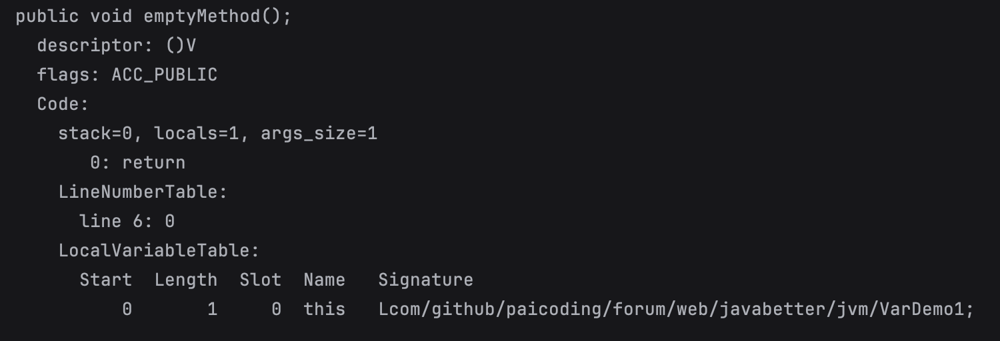

二哥的 Java 进阶之路：javap emptyMethod
这里的 locals=1 表示局部变量表有一个变量，即 this，Slot 0 位置存储了 this 引用。
而在静态方法 staticEmptyMethod 的输出中，你会看到类似这样的内容：
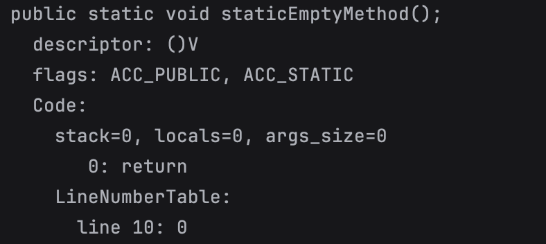

二哥的 Java 进阶之路：javap staticEmptyMethod
这里的 locals=0 表示局部变量表为空，因为静态方法没有 this 引用，也没有其他局部变量。
#### [介绍一下本地方法栈？](https://javabetter.cn/sidebar/sanfene/jvm.html#%E4%BB%8B%E7%BB%8D%E4%B8%80%E4%B8%8B%E6%9C%AC%E5%9C%B0%E6%96%B9%E6%B3%95%E6%A0%88)
本地方法栈与虚拟机栈相似，区别在于虚拟机栈是为 JVM 执行 Java 编写的方法服务的，而本地方法栈是为 Java 调用[本地（native）方法](https://javabetter.cn/oo/native-method.html)服务的，由 C/C++ 编写。
在本地方法栈中，主要存放了 native 方法的局部变量、动态链接和方法出口等信息。当一个 Java 程序调用一个 native 方法时，JVM 会切换到本地方法栈来执行这个方法。
#### [介绍一下本地方法栈的运行场景？](https://javabetter.cn/sidebar/sanfene/jvm.html#%E4%BB%8B%E7%BB%8D%E4%B8%80%E4%B8%8B%E6%9C%AC%E5%9C%B0%E6%96%B9%E6%B3%95%E6%A0%88%E7%9A%84%E8%BF%90%E8%A1%8C%E5%9C%BA%E6%99%AF)
当 Java 应用需要与操作系统底层或硬件交互时，通常会用到本地方法栈。
比如调用操作系统的特定功能，如内存管理、文件操作、系统时间、系统调用等。
举例：`System.currentTimeMillis()` 就是调用本地方法来获取操作系统的当前时间。
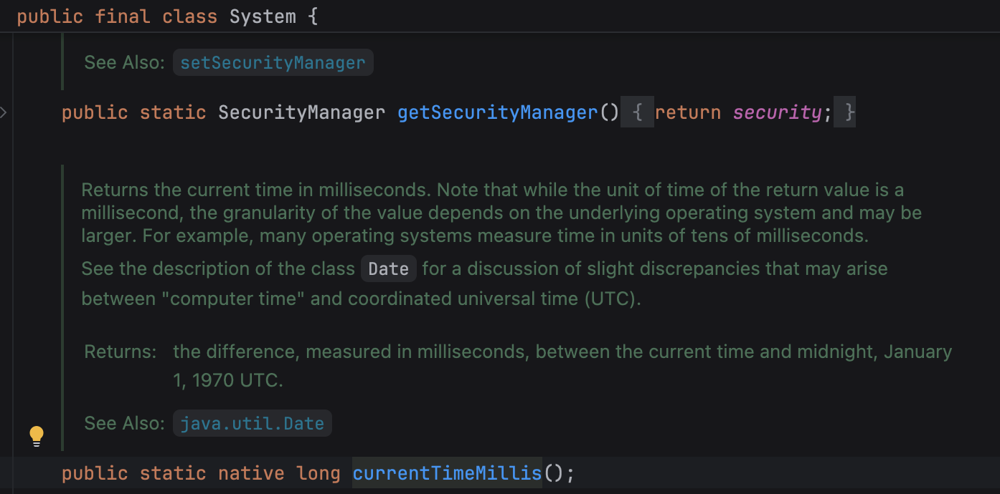

二哥的Java 进阶之路：currentTimeMillis方法源码
再比如 JVM 自身的一些底层功能也需要通过本地方法来实现。像 Object 类中的 `hashCode()` 方法、`clone()` 方法等。
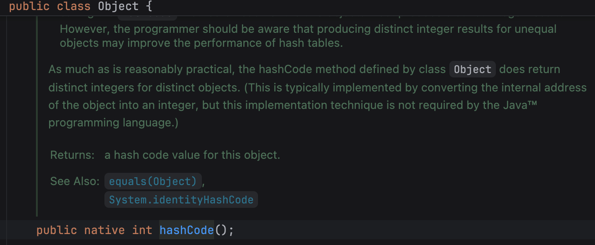

二哥的Java 进阶之路：hashCode方法源码
#### [native 方法解释一下？](https://javabetter.cn/sidebar/sanfene/jvm.html#native-%E6%96%B9%E6%B3%95%E8%A7%A3%E9%87%8A%E4%B8%80%E4%B8%8B)
推荐阅读：[手把手教你用 C语言实现 Java native 本地方法](https://javabetter.cn/oo/native-method.html)
Native 方法是在 Java 中通过 native 关键字声明的，用于调用非 Java 语言（如 C/C++）编写的代码。Java 可以通过 JNI（Java Native Interface）与底层系统、硬件设备、或高性能的本地库进行交互。
#### [介绍一下 Java 堆？](https://javabetter.cn/sidebar/sanfene/jvm.html#%E4%BB%8B%E7%BB%8D%E4%B8%80%E4%B8%8B-java-%E5%A0%86)
堆是 JVM 中最大的一块内存区域，被所有线程共享，在 JVM 启动时创建，主要用来存储 new 出来的对象。
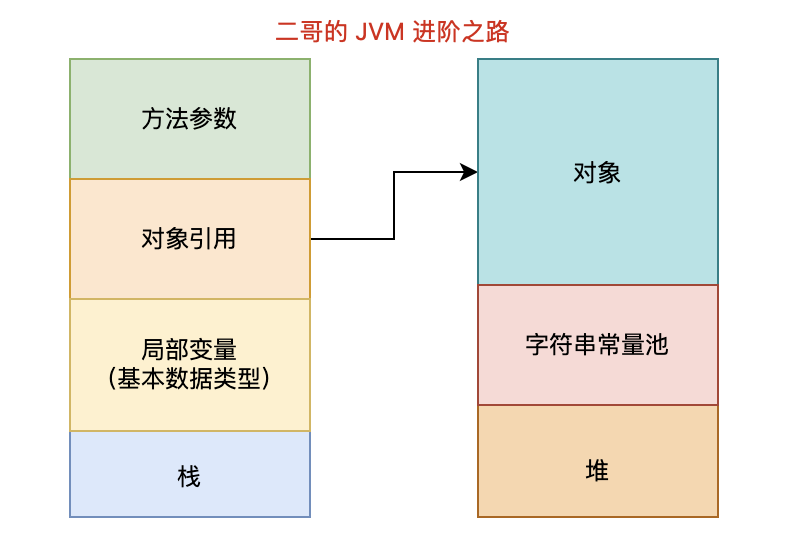

二哥的 Java 进阶之路：堆
Java 中“几乎”所有的对象都会在堆中分配，堆也是[垃圾收集器](https://javabetter.cn/jvm/gc-collector.html)管理的目标区域。
从内存回收的角度来看，由于垃圾收集器大部分都是基于分代收集理论设计的，所以堆也会被划分为`新生代`、`老年代`、`Eden空间`、`From Survivor空间`、`To Survivor空间`等。
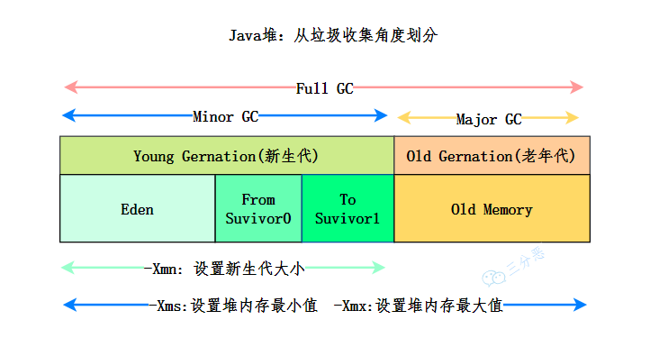

三分恶面渣逆袭：Java 堆内存结构
但随着 [JIT 编译器](https://javabetter.cn/jvm/jit.html)的发展和逃逸技术的逐渐成熟，“所有的对象都会分配到堆上”就不再那么绝对了。
从 JDK 7 开始，JVM 已经默认开启逃逸分析了，意味着如果某些方法中的对象引用没有被返回或者未被方法体外使用（也就是未逃逸出去），那么对象可以直接在栈上分配内存。
#### [堆和栈的区别是什么？](https://javabetter.cn/sidebar/sanfene/jvm.html#%E5%A0%86%E5%92%8C%E6%A0%88%E7%9A%84%E5%8C%BA%E5%88%AB%E6%98%AF%E4%BB%80%E4%B9%88)
堆属于线程共享的内存区域，几乎所有 new 出来的对象都会堆上分配，生命周期不由单个方法调用所决定，可以在方法调用结束后继续存在，直到不再被任何变量引用，最后被垃圾收集器回收。
栈属于线程私有的内存区域，主要存储局部变量、方法参数、对象引用等，通常随着方法调用的结束而自动释放，不需要垃圾收集器处理。
#### [介绍一下方法区？](https://javabetter.cn/sidebar/sanfene/jvm.html#%E4%BB%8B%E7%BB%8D%E4%B8%80%E4%B8%8B%E6%96%B9%E6%B3%95%E5%8C%BA)
方法区并不真实存在，属于 Java 虚拟机规范中的一个逻辑概念，用于存储已被 JVM 加载的类信息、常量、静态变量、即时编译器编译后的代码缓存等。
在 HotSpot 虚拟机中，方法区的实现称为永久代（PermGen），但在 Java 8 及之后的版本中，已经被元空间（Metaspace）所替代。
#### [变量存在堆栈的什么位置？](https://javabetter.cn/sidebar/sanfene/jvm.html#%E5%8F%98%E9%87%8F%E5%AD%98%E5%9C%A8%E5%A0%86%E6%A0%88%E7%9A%84%E4%BB%80%E4%B9%88%E4%BD%8D%E7%BD%AE)
对于局部变量来说，它存储在当前方法的栈帧中的局部变量表中。当方法执行完毕，栈帧被回收，局部变量也会被释放。

```java
public void method() {
    int localVar = 100;  // 局部变量，存储在栈帧中的局部变量表里
}
```
对于静态变量来说，它存储在 Java 规范中的方法区中，也就是元空间（Metaspace）。

```java
public class StaticVarDemo {
    public static int staticVar = 100;  // 静态变量，存储在方法区中
}
```
### [4.说一下 JDK1.6、1.7、1.8 内存区域的变化？](https://javabetter.cn/sidebar/sanfene/jvm.html#_4-%E8%AF%B4%E4%B8%80%E4%B8%8B-jdk1-6%E3%80%811-7%E3%80%811-8-%E5%86%85%E5%AD%98%E5%8C%BA%E5%9F%9F%E7%9A%84%E5%8F%98%E5%8C%96)
JDK1.6、1.7/1.8 内存区域发生了变化，主要体现在方法区的实现：

- JDK1.6 使用永久代实现方法区：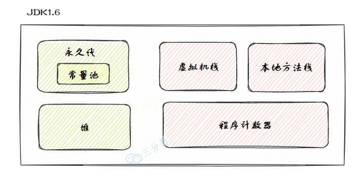

JDK 1.6内存区域

- JDK1.7 时发生了一些变化，将字符串常量池、静态变量，存放在堆上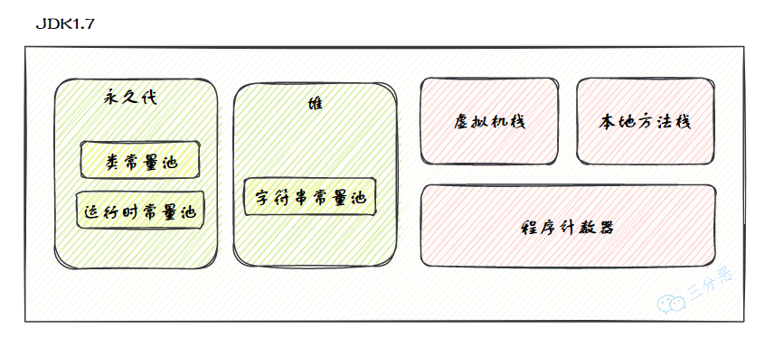

JDK 1.7内存区域

- 在 JDK1.8 时彻底干掉了永久代，而在直接内存中划出一块区域作为**元空间**，运行时常量池、类常量池都移动到元空间。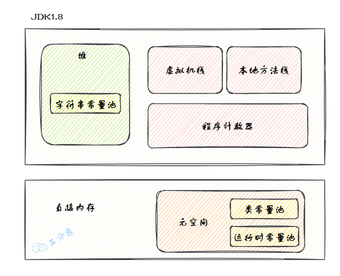

JDK 1.8内存区域
### [5.为什么使用元空间替代永久代作为方法区的实现？](https://javabetter.cn/sidebar/sanfene/jvm.html#_5-%E4%B8%BA%E4%BB%80%E4%B9%88%E4%BD%BF%E7%94%A8%E5%85%83%E7%A9%BA%E9%97%B4%E6%9B%BF%E4%BB%A3%E6%B0%B8%E4%B9%85%E4%BB%A3%E4%BD%9C%E4%B8%BA%E6%96%B9%E6%B3%95%E5%8C%BA%E7%9A%84%E5%AE%9E%E7%8E%B0)
Java 虚拟机规范规定的方法区只是换种方式实现。有客观和主观两个原因。

- 客观上使用永久代来实现方法区的决定的设计导致了 Java 应用更容易遇到内存溢出的问题（永久代有-XX：MaxPermSize 的上限，即使不设置也有默认大小，而 J9 和 JRockit 只要没有触碰到进程可用内存的上限，例如 32 位系统中的 4GB 限制，就不会出问题），而且有极少数方法 （例如 String::intern()）会因永久代的原因而导致不同虚拟机下有不同的表现。
- 主观上当 Oracle 收购 BEA 获得了 JRockit 的所有权后，准备把 JRockit 中的优秀功能，譬如 Java Mission Control 管理工具，移植到 HotSpot 虚拟机时，但因为两者对方法区实现的差异而面临诸多困难。考虑到 HotSpot 未来的发展，在 JDK 6 的 时候 HotSpot 开发团队就有放弃永久代，逐步改为采用本地内存（Native Memory）来实现方法区的计划了，到了 JDK 7 的 HotSpot，已经把原本放在永久代的字符串常量池、静态变量等移出，而到了 JDK 8，终于完全废弃了永久代的概念，改用与 JRockit、J9 一样在本地内存中实现的元空间（Meta-space）来代替，把 JDK 7 中永久代还剩余的内容（主要是类型信息）全部移到元空间中。### [6.对象创建的过程了解吗？](https://javabetter.cn/sidebar/sanfene/jvm.html#_6-%E5%AF%B9%E8%B1%A1%E5%88%9B%E5%BB%BA%E7%9A%84%E8%BF%87%E7%A8%8B%E4%BA%86%E8%A7%A3%E5%90%97)
当我们使用 new 关键字创建一个对象的时候，JVM 首先会检查 new 指令的参数是否能在常量池中定位到一个类的符号引用，然后检查这个符号引用代表的类是否已被加载、解析和初始化过。如果没有，就先执行相应的类加载过程。
如果已经加载，JVM 会为新生对象分配内存，内存分配完成之后，JVM 将分配到的内存空间初始化为零值（成员变量，数值类型是 0，布尔类型是 false，对象类型是 null），接下来设置对象头，对象头里包含了对象是哪个类的实例、对象的哈希码、对象的 GC 分代年龄等信息。
最后，JVM 会执行构造方法（`<init>`），将成员变量赋值为预期的值，这样一个对象就创建完成了。
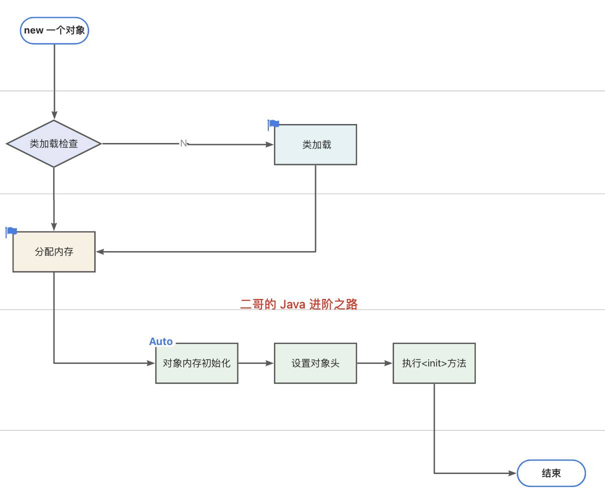

二哥的 Java 进阶之路：对象的创建过程
#### [对象的销毁过程了解吗？](https://javabetter.cn/sidebar/sanfene/jvm.html#%E5%AF%B9%E8%B1%A1%E7%9A%84%E9%94%80%E6%AF%81%E8%BF%87%E7%A8%8B%E4%BA%86%E8%A7%A3%E5%90%97)
对象创建完成后，就可以通过引用来访问对象的方法和属性，当对象不再被任何引用指向时，对象就会变成垃圾。
垃圾收集器会通过可达性分析算法判断对象是否存活，如果对象不可达，就会被回收。
垃圾收集器会通过标记清除、标记复制、标记整理等算法来回收内存，将对象占用的内存空间释放出来。
常用的垃圾收集器有 CMS、G1、ZGC 等，它们的回收策略和效率不同，可以根据具体的场景选择合适的垃圾收集器。
### [7.什么是指针碰撞？什么是空闲列表？](https://javabetter.cn/sidebar/sanfene/jvm.html#_7-%E4%BB%80%E4%B9%88%E6%98%AF%E6%8C%87%E9%92%88%E7%A2%B0%E6%92%9E-%E4%BB%80%E4%B9%88%E6%98%AF%E7%A9%BA%E9%97%B2%E5%88%97%E8%A1%A8)
在堆内存分配对象时，主要使用两种策略：指针碰撞和空闲列表。
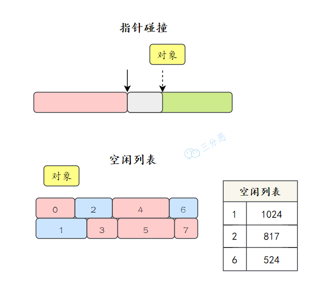

三分恶面渣逆袭：指针碰撞和空闲列表
①、指针碰撞（Bump the Pointer）
假设堆内存是一个连续的空间，分为两个部分，一部分是已经被使用的内存，另一部分是未被使用的内存。
在分配内存时，Java 虚拟机维护一个指针，指向下一个可用的内存地址，每次分配内存时，只需要将指针向后移动（碰撞）一段距离，然后将这段内存分配给对象实例即可。
②、空闲列表（Free List）
JVM 维护一个列表，记录堆中所有未占用的内存块，每个空间块都记录了大小和地址信息。
当有新的对象请求内存时，JVM 会遍历空闲列表，寻找足够大的空间来存放新对象。
分配后，如果选中的空闲块未被完全利用，剩余的部分会作为一个新的空闲块加入到空闲列表中。
指针碰撞适用于管理简单、碎片化较少的内存区域（如年轻代），而空闲列表适用于内存碎片化较严重或对象大小差异较大的场景（如老年代）。
> 
1. [Java 面试指南（付费）](https://javabetter.cn/zhishixingqiu/mianshi.html)收录的携程面经同学 1 Java 后端技术一面面试原题：对象创建到销毁，内存如何分配的，（类加载和对象创建过程，CMS，G1 内存清理和分配）
### [8.JVM 里 new 对象时，堆会发生抢占吗？JVM 是怎么设计来保证线程安全的？](https://javabetter.cn/sidebar/sanfene/jvm.html#_8-jvm-%E9%87%8C-new-%E5%AF%B9%E8%B1%A1%E6%97%B6-%E5%A0%86%E4%BC%9A%E5%8F%91%E7%94%9F%E6%8A%A2%E5%8D%A0%E5%90%97-jvm-%E6%98%AF%E6%80%8E%E4%B9%88%E8%AE%BE%E8%AE%A1%E6%9D%A5%E4%BF%9D%E8%AF%81%E7%BA%BF%E7%A8%8B%E5%AE%89%E5%85%A8%E7%9A%84)
会，假设 JVM 虚拟机上，每一次 new 对象时，指针就会向右移动一个对象 size 的距离，一个线程正在给 A 对象分配内存，指针还没有来的及修改，另一个为 B 对象分配内存的线程，又引用了这个指针来分配内存，这就发生了抢占。
有两种可选方案来解决这个问题：
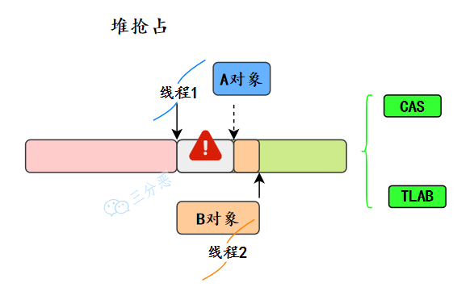

堆抢占和解决方案

- 采用 CAS 分配重试的方式来保证更新操作的原子性
- 每个线程在 Java 堆中预先分配一小块内存，也就是本地线程分配缓冲（Thread Local AllocationBuffer，TLAB），要分配内存的线程，先在本地缓冲区中分配，只有本地缓冲区用完了，分配新的缓存区时才需要同步锁定。
### [9.能说一下对象的内存布局吗？](https://javabetter.cn/sidebar/sanfene/jvm.html#_9-%E8%83%BD%E8%AF%B4%E4%B8%80%E4%B8%8B%E5%AF%B9%E8%B1%A1%E7%9A%84%E5%86%85%E5%AD%98%E5%B8%83%E5%B1%80%E5%90%97)
在 Java 中，对象的内存布局是由 Java 虚拟机规范定义的，但具体的实现细节可能因不同的 JVM 实现（如 HotSpot、OpenJ9 等）而异。
在 HotSpot 中，对象在堆内存中的存储布局可以划分为三个部分：对象头（Object Header）、实例数据（Instance Data）和对齐填充（Padding）。


三分恶面渣逆袭：对象的存储布局
①、**对象头**是每个对象都有的，包含三部分主要信息：

- **标记字**（Mark Word）：包含了对象自身的运行时数据，如哈希码（HashCode）、垃圾回收分代年龄、锁状态标志、线程持有的锁、偏向线程 ID 等信息。在 64 位操作系统下占 8 个字节，32 位操作系统下占 4 个字节。
- **类型指针**（Class Pointer）：指向对象所属类的元数据的指针，JVM 通过这个指针来确定对象的类。在开启了压缩指针的情况下，这个指针可以被压缩。在开启指针压缩的情况下占 4 个字节，否则占 8 个字节。
- **数组长度**（Array Length）：如果对象是数组类型，还会有一个额外的数组长度字段。占 4 个字节。注意，启用压缩指针（`-XX:+UseCompressedOops`）可以减少对象头中类型指针的大小，从而减少对象总体大小，提高内存利用率。
可以通过 `java -XX:+PrintFlagsFinal -version | grep UseCompressedOops` 命令来查看当前 JVM 是否开启了压缩指针。
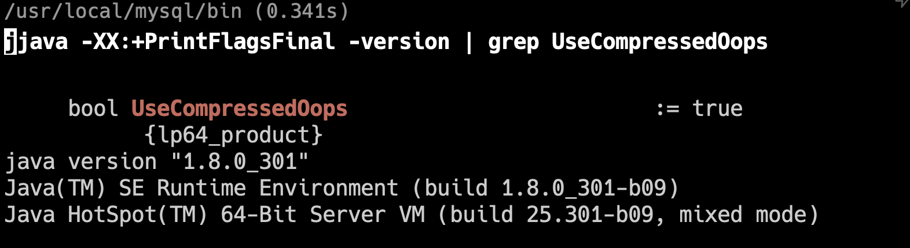

二哥的 Java 进阶之路：查看 JVM 是否开启压缩指针
如果压缩指针开启，会看到类似以下的输出，其中 bool UseCompressedOops 的值为 true。
在 JDK 8 中，压缩指针默认是开启的，以减少 64 位应用中对象引用的内存占用。
②、**实例数据**存储了对象的具体信息，即在类中定义的各种字段数据（不包括由父类继承的字段）。这部分的大小取决于对象的属性和它们的类型（如 int、long、引用类型等）。JVM 会对这些数据进行对齐，以确保高效的访问速度。
③、**对齐填充**，为了使对象的总大小是 8 字节的倍数（这在大多数现代计算机体系结构中是最优访问边界），JVM 可能会在对象末尾添加一些填充。这部分是为了满足内存对齐的需求，并不包含任何具体的数据。
#### [为什么非要进行 8 字节对齐呢？](https://javabetter.cn/sidebar/sanfene/jvm.html#%E4%B8%BA%E4%BB%80%E4%B9%88%E9%9D%9E%E8%A6%81%E8%BF%9B%E8%A1%8C-8-%E5%AD%97%E8%8A%82%E5%AF%B9%E9%BD%90%E5%91%A2)
这是因为 CPU 进行内存访问时，一次寻址的指针大小是 8 字节，正好是 L1 缓存行的大小。如果不进行内存对齐，则可能出现跨缓存行访问，导致额外的缓存行加载，降低了 CPU 的访问效率。
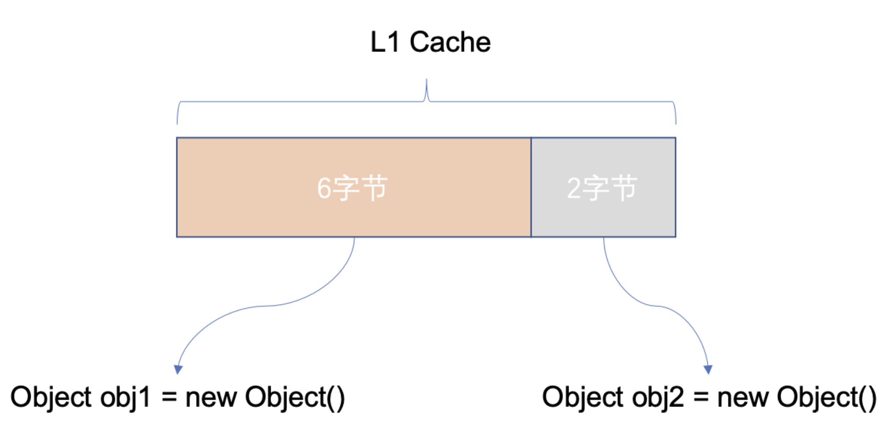

rickiyang：缓存行污染
比如说上图中 obj1 占 6 个字节，由于没有对齐，导致这一行缓存中多了 2 个字节 obj2 的数据，当 CPU 访问 obj2 的时候，就会导致缓存行的刷新，这就是缓存行污染。
也就说，8 字节对齐，是为了效率的提高，以空间换时间的一种方案。固然你还能够 16 字节对齐，可是 8 字节是最优选择。
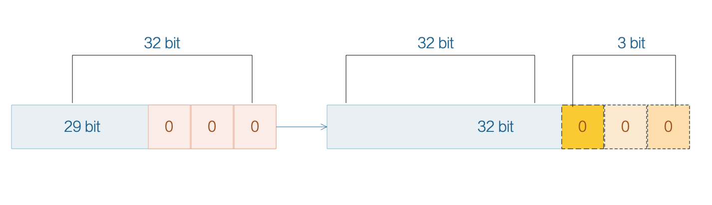

rickiyang：000 结尾
#### [Object a = new object()的大小](https://javabetter.cn/sidebar/sanfene/jvm.html#object-a-new-object-%E7%9A%84%E5%A4%A7%E5%B0%8F)
推荐阅读：[高端面试必备：一个 Java 对象占用多大内存](https://www.cnblogs.com/rickiyang/p/14206724.html)
一般来说，对象的大小是由对象头、实例数据和对齐填充三个部分组成的。

- 对象头的大小在 32 位 JVM 上是 8 字节，在 64 位 JVM 上是 16 字节（如果开启了压缩指针，就是 12 字节）。
- 实例数据的大小取决于对象的属性和它们的类型。对于`new Object()`来说，Object 类本身没有实例字段，因此这部分可能非常小或者为零。
- 对齐填充的大小取决于对象头和实例数据的大小，以确保对象的总大小是 8 字节的倍数。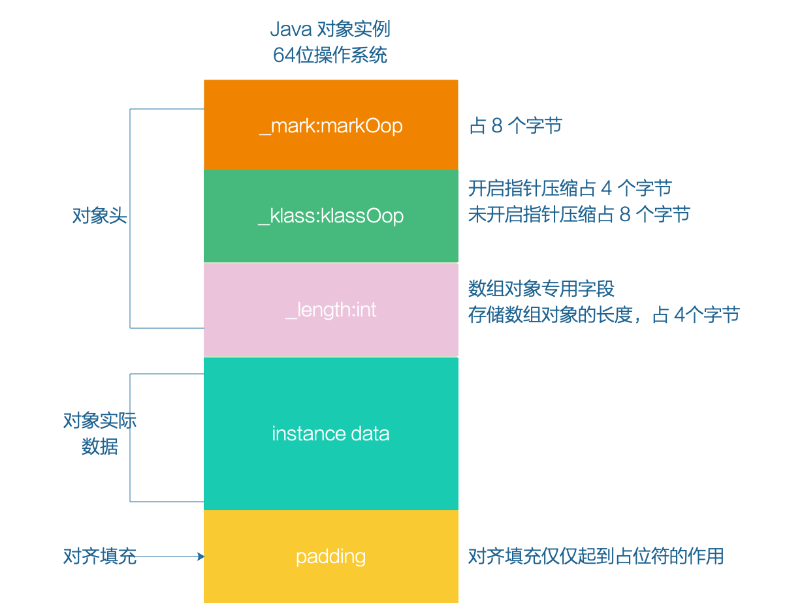

rickiyang：Java 对象模型
一般来说，目前的操作系统都是 64 位的，并且 JDK 8 中的压缩指针是默认开启的，因此在 64 位 JVM 上，`new Object()`的大小是 16 字节（12 字节的对象头 + 4 字节的对齐填充）。
为了确认我们的推理，我们可以使用 [JOL](https://openjdk.org/projects/code-tools/jol/) 工具来查看对象的内存布局：
> JOL 全称为 Java Object Layout，是分析 JVM 中对象布局的工具，该工具大量使用了 Unsafe、JVMTI 来解码布局情况。

第一步，在 pom.xml 中引入 JOL 依赖：

```java
<dependency>
    <groupId>org.openjdk.jol</groupId>
    <artifactId>jol-core</artifactId>
    <version>0.9</version>
</dependency>
```
第二步，使用 JOL 编写代码示例：

```java
public class JOLSample {
    public static void main(String[] args) {
        // 打印JVM详细信息（可选）
        System.out.println(VM.current().details());

        // 创建Object实例
        Object obj = new Object();

        // 打印Object实例的内存布局
        String layout = ClassLayout.parseInstance(obj).toPrintable();
        System.out.println(layout);
    }
}
```
第三步，运行代码，查看输出结果：
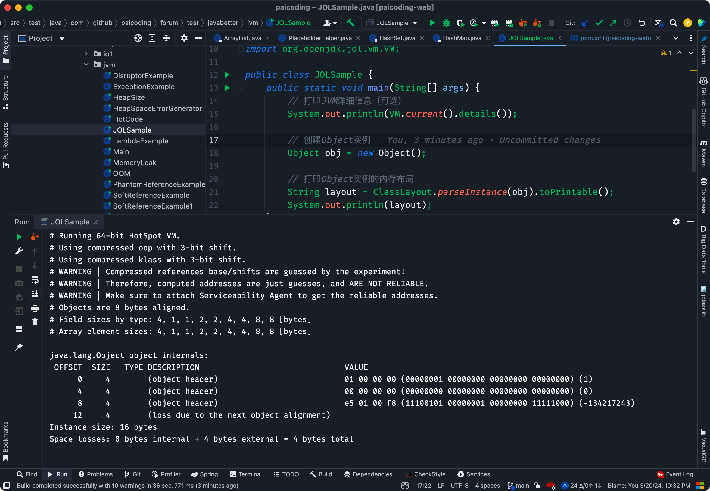

二哥的 Java 进阶之路：JOL 运行结果
可以看到有 OFFSET、SIZE、TYPE DESCRIPTION、VALUE 这几个名词头，它们的含义分别是

- OFFSET：偏移地址，单位字节；
- SIZE：占用的内存大小，单位字节；
- TYPE DESCRIPTION：类型描述，其中 object header 为对象头；
- VALUE：对应内存中当前存储的值，二进制 32 位；从上面的结果能看到对象头是 12 个字节，还有 4 个字节的 padding，一共 16 个字节。我们的推理是正确的。
#### [对象引用占多少大小？](https://javabetter.cn/sidebar/sanfene/jvm.html#%E5%AF%B9%E8%B1%A1%E5%BC%95%E7%94%A8%E5%8D%A0%E5%A4%9A%E5%B0%91%E5%A4%A7%E5%B0%8F)
推荐阅读：[Object o = new Object()占多少个字节？](https://www.cnblogs.com/dijia478/p/14677243.html)
在 64 位 JVM 上，未开启压缩指针时，对象引用占用 8 字节；开启压缩指针时，对象引用可被压缩到 4 字节。
而 HotSpot JVM 默认开启了压缩指针，因此在 64 位 JVM 上，对象引用占用 4 字节。
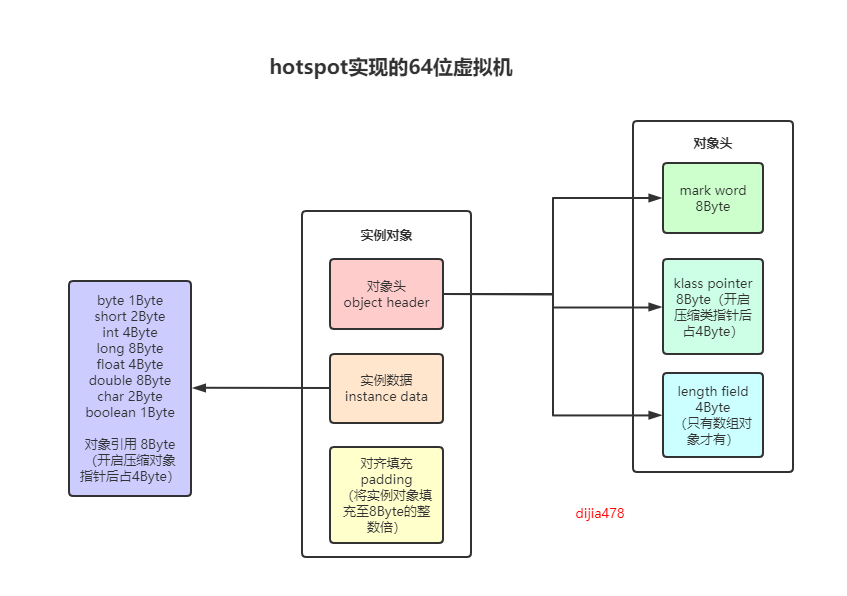

dijia478：对象头
我们可以通过下面这个例子来验证一下：

```java
class ReferenceSizeExample {
    private static class ReferenceHolder {
        Object reference;
    }

    public static void main(String[] args) {
        System.out.println(VM.current().details());
        System.out.println(ClassLayout.parseClass(ReferenceHolder.class).toPrintable());
    }
}
```
运行代码，查看输出结果：
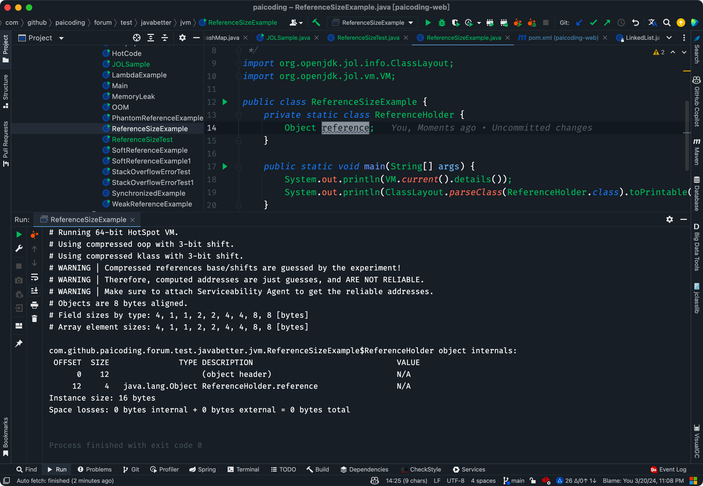

二哥的 Java 进阶之路：对象的引用有多大？
ReferenceHolder.reference 字段位于偏移量 12，大小为 4 字节。这表明在当前的 JVM 配置下（64 位 JVM 且压缩指针开启），对象引用占用的内存大小为 4 字节。
> 
1. [Java 面试指南（付费）](https://javabetter.cn/zhishixingqiu/mianshi.html)收录的帆软同学 3 Java 后端一面的原题：Object a = new object()的大小，对象引用占多少大小？
2. [Java 面试指南（付费）](https://javabetter.cn/zhishixingqiu/mianshi.html)收录的去哪儿面经同学 1 技术二面面试原题：Object 底层的数据结构（蒙了）
### [10.对象怎么访问定位？](https://javabetter.cn/sidebar/sanfene/jvm.html#_10-%E5%AF%B9%E8%B1%A1%E6%80%8E%E4%B9%88%E8%AE%BF%E9%97%AE%E5%AE%9A%E4%BD%8D)
Java 程序会通过栈上的 reference 数据来操作堆上的具体对象。由于 reference 类型在《Java 虚拟机规范》里面只规定了它是一个指向对象的引用，并没有定义这个引用应该通过什么方式去定位、访问到堆中对象的具体位置，所以对象访问方式也是由虚拟机实现而定的，主流的访问方式主要有使用句柄和直接指针两种：

- 如果使用句柄访问的话，Java 堆中将可能会划分出一块内存来作为句柄池，reference 中存储的就是对象的句柄地址，而句柄中包含了对象实例数据与类型数据各自具体的地址信息，其结构如图所示：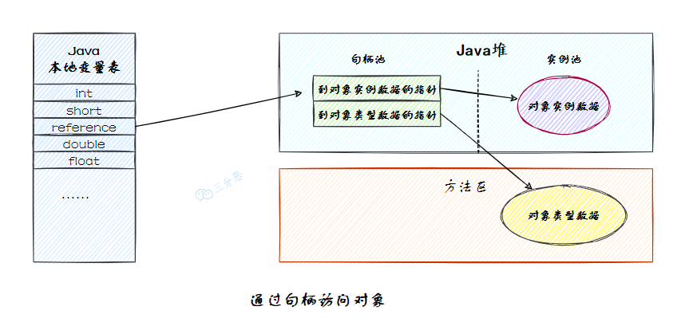

通过句柄访问对象

- 如果使用直接指针访问的话，Java 堆中对象的内存布局就必须考虑如何放置访问类型数据的相关信息，reference 中存储的直接就是对象地址，如果只是访问对象本身的话，就不需要多一次间接访问的开销，如图所示：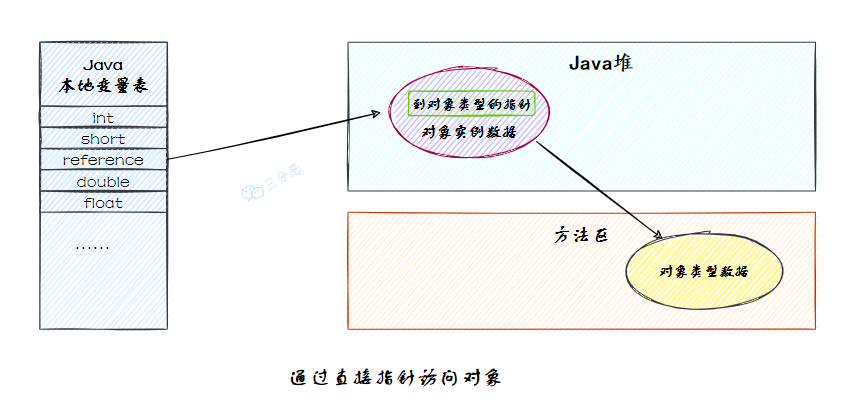

通过直接指针访问对象
这两种对象访问方式各有优势，使用句柄来访问的最大好处就是 reference 中存储的是稳定句柄地址，在对象被移动（垃圾收集时移动对象是非常普遍的行为）时只会改变句柄中的实例数据指针，而 reference 本身不需要被修改。
使用直接指针来访问最大的好处就是速度更快，它节省了一次指针定位的时间开销，由于对象访问在 Java 中非常频繁，因此这类开销积少成多也是一项极为可观的执行成本。
HotSpot 虚拟机主要使用直接指针来进行对象访问。
### [11.说一下对象有哪几种引用？](https://javabetter.cn/sidebar/sanfene/jvm.html#_11-%E8%AF%B4%E4%B8%80%E4%B8%8B%E5%AF%B9%E8%B1%A1%E6%9C%89%E5%93%AA%E5%87%A0%E7%A7%8D%E5%BC%95%E7%94%A8)
四种，分别是强引用（Strong Reference）、软引用（Soft Reference）、弱引用（Weak Reference）和虚引用（Phantom Reference）。
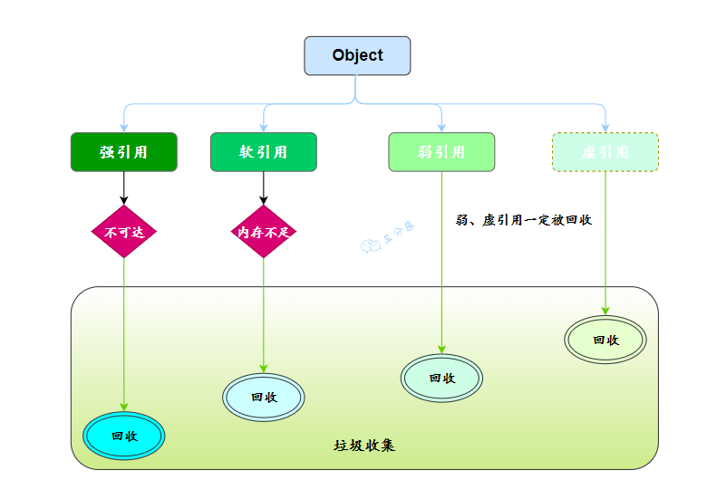

三分恶面渣逆袭：四种引用总结
强引用是 Java 中最常见的引用类型。使用 new 关键字赋值的引用就是强引用，只要强引用关联着对象，垃圾收集器就不会回收这部分对象。

```java
String str = new String("沉默王二");
```
软引用是一种相对较弱的引用类型，可以通过 SoftReference 类实现。软引用对象在内存不足时才会被回收。

```java
SoftReference<String> softRef = new SoftReference<>(new String("沉默王二"));
```
弱引用可以通过 WeakReference 类实现。弱引用对象在下一次垃圾回收时会被回收，不论内存是否充足。

```java
WeakReference<String> weakRef = new WeakReference<>(new String("沉默王二"));
```
虚引用可以通过 PhantomReference 类实现。虚引用对象在任何时候都可能被回收。主要用于跟踪对象被垃圾回收的状态，可以用于管理直接内存。

```java
PhantomReference<String> phantomRef = new PhantomReference<>(new String("沉默王二"), new ReferenceQueue<>());
```
> 
1. [Java 面试指南（付费）](https://javabetter.cn/zhishixingqiu/mianshi.html)收录的京东同学 4 云实习面试原题：四个引用(强软弱虚)
### [12.Java 堆的内存分区了解吗？](https://javabetter.cn/sidebar/sanfene/jvm.html#_12-java-%E5%A0%86%E7%9A%84%E5%86%85%E5%AD%98%E5%88%86%E5%8C%BA%E4%BA%86%E8%A7%A3%E5%90%97)
Java 堆被划分为**新生代**和**老年代**两个区域。
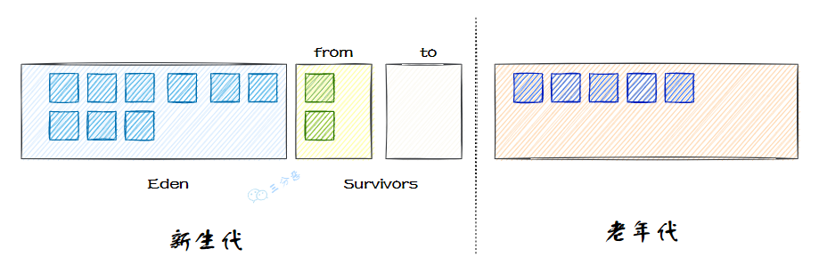

三分恶面渣逆袭：Java堆内存划分
新生代又被划分为 Eden 空间和两个 Survivor 空间（From 和 To）。

- **Eden 空间**：大多数新创建的对象会被分配到 Eden 空间中。当 Eden 区填满时，会触发一次轻量级的垃圾回收（Minor GC），清除不再使用的对象。
- **Survivor 空间**：每次 Minor GC 后，仍然存活的对象会从 Eden 区或 From 区复制到 To 区。From 和 To 区可以交替使用。对象在新生代中经历多次 GC 后，如果仍然存活，会被移动到老年代。
> 
1. [Java 面试指南（付费）](https://javabetter.cn/zhishixingqiu/mianshi.html)收录的得物面经同学 8 一面面试原题：Java 中堆内存怎么组织的
2. [Java 面试指南（付费）](https://javabetter.cn/zhishixingqiu/mianshi.html)收录的腾讯面经同学 27 云后台技术一面面试原题：怎么来区分对象是属于哪个代的？
### [13.说一下新生代的区域划分？](https://javabetter.cn/sidebar/sanfene/jvm.html#_13-%E8%AF%B4%E4%B8%80%E4%B8%8B%E6%96%B0%E7%94%9F%E4%BB%A3%E7%9A%84%E5%8C%BA%E5%9F%9F%E5%88%92%E5%88%86)
新生代的垃圾收集主要采用标记-复制算法，因为新生代的存活对象比较少，每次复制少量的存活对象效率比较高。
基于这种算法，虚拟机将内存分为一块较大的 Eden 空间和两块较小的 Survivor 空间，每次分配内存只使用 Eden 和其中一块 Survivor。发生垃圾收集时，将 Eden 和 Survivor 中仍然存活的对象一次性复制到另外一块 Survivor 空间上，然后直接清理掉 Eden 和已用过的那块 Survivor 空间。默认 Eden 和 Survivor 的大小比例是 8∶1。
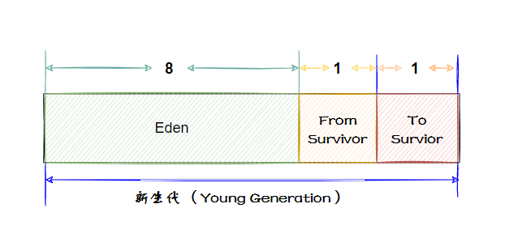

新生代内存划分
### [14.对象什么时候会进入老年代？](https://javabetter.cn/sidebar/sanfene/jvm.html#_14-%E5%AF%B9%E8%B1%A1%E4%BB%80%E4%B9%88%E6%97%B6%E5%80%99%E4%BC%9A%E8%BF%9B%E5%85%A5%E8%80%81%E5%B9%B4%E4%BB%A3)
对象通常会先在年轻代中分配，然后随着时间的推移和垃圾收集的处理，某些满足条件的对象会进入到老年代中。


二哥的 Java 进阶之路：对象进入老年代
①、**长期存活的对象将进入老年代**
对象在年轻代中存活足够长的时间（即经过足够多的垃圾回收周期）后，会晋升到老年代。
每次 GC 未被回收的对象，其年龄会增加。当对象的年龄超过一个特定阈值（默认通常是 15），它就会被移动到老年代。这个年龄阈值可以通过 JVM 参数`-XX:MaxTenuringThreshold`来设置。
②、**大对象直接进入老年代**
为了避免在年轻代中频繁复制大对象，JVM 提供了一种策略，允许大对象直接在老年代中分配。
这些是所谓的“大对象”，其大小超过了预设的阈值（由 JVM 参数`-XX:PretenureSizeThreshold`控制）。直接在老年代分配可以减少在年轻代和老年代之间的数据复制。
③、**动态对象年龄判定**
除了固定的年龄阈值，还会根据各个年龄段对象的存活大小和内存空间等因素动态调整对象的晋升策略。
比如说，在 Survivor 空间中相同年龄的所有对象大小总和大于 Survivor 空间的一半，那么年龄大于或等于该年龄的对象就可以直接进入老年代。
> 
1. [Java 面试指南（付费）](https://javabetter.cn/zhishixingqiu/mianshi.html)收录的阿里面经同学 5 阿里妈妈 Java 后端技术一面面试原题：哪些情况下对象会进入老年代？
2. [Java 面试指南（付费）](https://javabetter.cn/zhishixingqiu/mianshi.html)收录的京东面经同学 7 Java 后端技术一面面试原题：新生代对象转移到老年代的条件
3. [Java 面试指南（付费）](https://javabetter.cn/zhishixingqiu/mianshi.html)收录的拼多多面经同学 4 技术一面面试原题：对象什么时候进入老年代
### [15.什么是 Stop The World ? 什么是 OopMap ？什么是安全点？](https://javabetter.cn/sidebar/sanfene/jvm.html#_15-%E4%BB%80%E4%B9%88%E6%98%AF-stop-the-world-%E4%BB%80%E4%B9%88%E6%98%AF-oopmap-%E4%BB%80%E4%B9%88%E6%98%AF%E5%AE%89%E5%85%A8%E7%82%B9)
进行垃圾回收的过程中，会涉及对象的移动。为了保证对象引用更新的正确性，必须暂停所有的用户线程，像这样的停顿，虚拟机设计者形象描述为`Stop The World`。也简称为 STW。
在 HotSpot 中，有个数据结构（映射表）称为`OopMap`。一旦类加载动作完成的时候，HotSpot 就会把对象内什么偏移量上是什么类型的数据计算出来，记录到 OopMap。在即时编译过程中，也会在`特定的位置`生成 OopMap，记录下栈上和寄存器里哪些位置是引用。
这些特定的位置主要在：

- 1.循环的末尾（非 counted 循环）
- 2.方法临返回前 / 调用方法的 call 指令后
- 3.可能抛异常的位置这些位置就叫作**安全点(safepoint)。** 用户程序执行时并非在代码指令流的任意位置都能够在停顿下来开始垃圾收集，而是必须是执行到安全点才能够暂停。
用通俗的比喻，假如老王去拉车，车上东西很重，老王累的汗流浃背，但是老王不能在上坡或者下坡休息，只能在平地上停下来擦擦汗，喝口水。
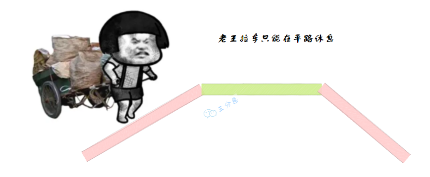

老王拉车只能在平路休息
### [16.对象一定分配在堆中吗？有没有了解逃逸分析技术？](https://javabetter.cn/sidebar/sanfene/jvm.html#_16-%E5%AF%B9%E8%B1%A1%E4%B8%80%E5%AE%9A%E5%88%86%E9%85%8D%E5%9C%A8%E5%A0%86%E4%B8%AD%E5%90%97-%E6%9C%89%E6%B2%A1%E6%9C%89%E4%BA%86%E8%A7%A3%E9%80%83%E9%80%B8%E5%88%86%E6%9E%90%E6%8A%80%E6%9C%AF)
在 Java 中，并不是所有对象都严格在堆上分配内存，虽然堆（Heap）是 Java 对象内存分配的主要区域。
在某些情况下，JVM 的即时编译器（JIT）可能会将对象分配在栈上，这被称为**逃逸分析**（Escape Analysis）。
也就是说，如果编译器确定一个对象不会在方法外部使用（即对象不会逃逸出方法的作用域），那么该对象可以分配在栈上，而不是堆上。
#### [什么是逃逸分析？](https://javabetter.cn/sidebar/sanfene/jvm.html#%E4%BB%80%E4%B9%88%E6%98%AF%E9%80%83%E9%80%B8%E5%88%86%E6%9E%90)
**逃逸分析**是指分析指针动态范围的方法，它同编译器优化原理的指针分析和外形分析相关联。当变量（或者对象）在方法中分配后，其指针有可能被返回或者被全局引用，这样就会被其他方法或者线程所引用，这种现象称作指针（或者引用）的逃逸(Escape)。
通俗点讲，当一个对象被 new 出来之后，它可能被外部所调用，如果是作为参数传递到外部了，就称之为方法逃逸。
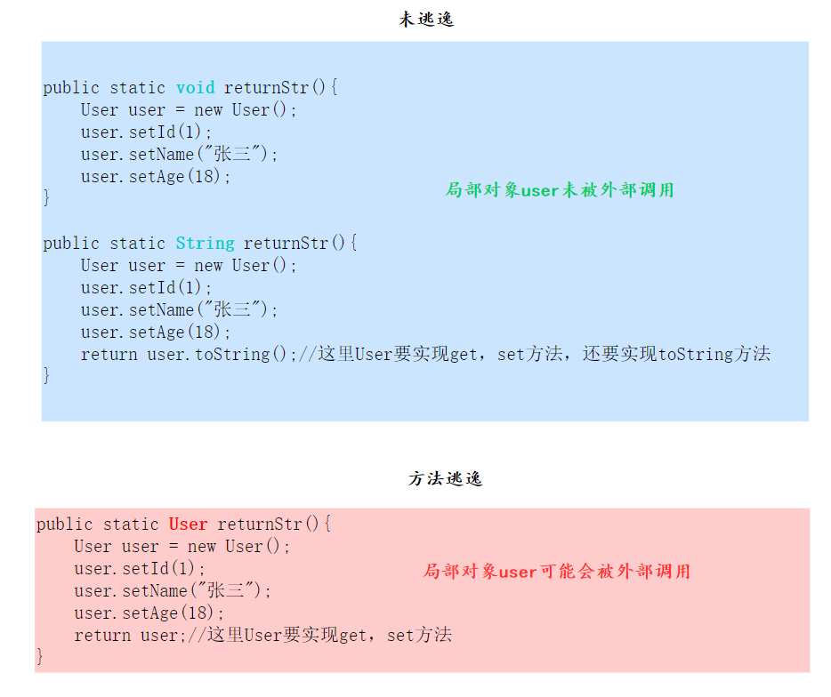

逃逸
除此之外，如果对象还有可能被外部线程访问到，例如赋值给可以在其它线程中访问的实例变量，这种就被称为线程逃逸。
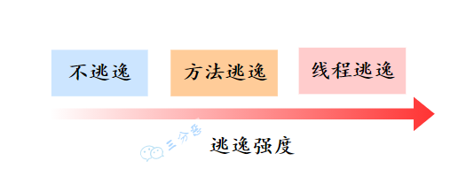

逃逸强度
#### [逃逸分析有什么好处？](https://javabetter.cn/sidebar/sanfene/jvm.html#%E9%80%83%E9%80%B8%E5%88%86%E6%9E%90%E6%9C%89%E4%BB%80%E4%B9%88%E5%A5%BD%E5%A4%84)

- 栈上分配如果确定一个对象不会逃逸到线程之外，那么久可以考虑将这个对象在栈上分配，对象占用的内存随着栈帧出栈而销毁，这样一来，垃圾收集的压力就降低很多。

- **同步消除**线程同步本身是一个相对耗时的过程，如果逃逸分析能够确定一个变量不会逃逸出线程，无法被其他线程访问，那么这个变量的读写肯定就不会有竞争， 对这个变量实施的同步措施也就可以安全地消除掉。

- **标量替换**如果一个数据是基本数据类型，不可拆分，它就被称之为标量。把一个 Java 对象拆散，将其用到的成员变量恢复为原始类型来访问，这个过程就称为标量替换。假如逃逸分析能够证明一个对象不会被方法外部访问，并且这个对象可以被拆散，那么可以不创建对象，直接用创建若干个成员变量代替，可以让对象的成员变量在栈上分配和读写。
> 
1. [Java 面试指南（付费）](https://javabetter.cn/zhishixingqiu/mianshi.html)收录的收钱吧面经同学 1 Java 后端一面面试原题：所有对象都在堆上对不对？
### [17.内存溢出和内存泄漏是什么意思？](https://javabetter.cn/sidebar/sanfene/jvm.html#_17-%E5%86%85%E5%AD%98%E6%BA%A2%E5%87%BA%E5%92%8C%E5%86%85%E5%AD%98%E6%B3%84%E6%BC%8F%E6%98%AF%E4%BB%80%E4%B9%88%E6%84%8F%E6%80%9D)
内存溢出，俗称 OOM，是指当程序请求分配内存时，由于没有足够的内存空间满足其需求，从而触发的错误。在 Java 中，这种情况会抛出 OutOfMemoryError。
内存溢出可能是由于内存泄漏导致的，也可能是因为程序一次性尝试分配大量内存，内存直接就干崩溃了导致的。
内存泄漏是指程序在使用完内存后，未能释放已分配的内存空间，导致这部分内存无法再被使用。随着时间的推移，内存泄漏会导致可用内存逐渐减少，最终可能导致内存溢出。
在 Java 中，内存泄漏通常发生在长期存活的对象持有短期存活对象的引用，而长期存活的对象又没有及时释放对短期存活对象的引用，从而导致短期存活对象无法被回收。
用一个比较有味道的比喻来形容就是，内存溢出是排队去蹲坑，发现没坑了；内存泄漏，就是有人占着茅坑不拉屎，占着茅坑不拉屎的多了可能会导致坑位不够用。
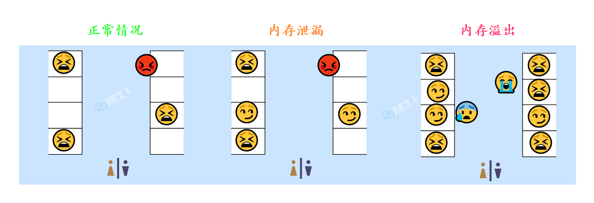

三分恶面渣逆袭：内存泄漏、内存溢出
> 
1. [Java 面试指南（付费）](https://javabetter.cn/zhishixingqiu/mianshi.html)收录的京东面经同学 1 Java 技术一面面试原题：说说 OOM 的原因
2. [Java 面试指南（付费）](https://javabetter.cn/zhishixingqiu/mianshi.html)收录的快手面经同学 1 部门主站技术部面试原题：了解 OOM 吗？
### [18.能手写内存溢出的例子吗？](https://javabetter.cn/sidebar/sanfene/jvm.html#_18-%E8%83%BD%E6%89%8B%E5%86%99%E5%86%85%E5%AD%98%E6%BA%A2%E5%87%BA%E7%9A%84%E4%BE%8B%E5%AD%90%E5%90%97)
导致内存溢出（OOM）的原因有很多，比如一次性创建了大量对象导致堆内存溢出；比如说元空间溢出，抛出 `java.lang.OutOfMemoryError：Metaspace`，比如说栈溢出，如果栈的深度超过了 JVM 栈所允许的深度，将会抛出 StackOverflowError。
堆内存溢出是最常见的 OOM 原因，通常是因为创建了大量的对象，且长时间无法被垃圾收集器回收，导致堆内存耗尽。
这就相当于一个房子里，不断堆积不能被回收的杂物，那么房子很快就会被堆满了。
来通过代码模拟一下堆内存溢出的情况。

```java
public class HeapSpaceErrorGenerator {
    public static void main(String[] args) {
        List<byte[]> bigObjects = new ArrayList<>();
        try {
            while (true) {
                // 创建一个大约 10MB 的数组
                byte[] bigObject = new byte[10 * 1024 * 1024];
                bigObjects.add(bigObject);
            }
        } catch (OutOfMemoryError e) {
            System.out.println("OutOfMemoryError 发生在 " + bigObjects.size() + " 对象后");
            throw e;
        }
    }
}
```
通过 VM 参数设置堆内存大小为 `-Xmx128M`，然后运行程序。
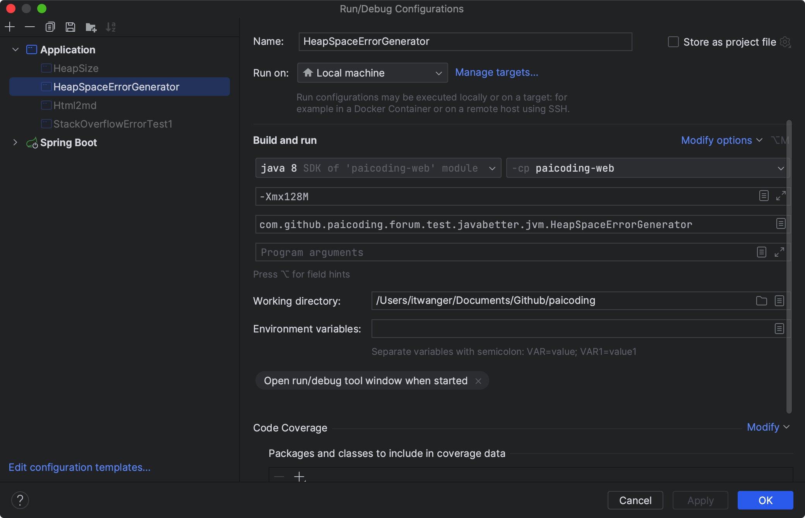

二哥的 Java 进阶之路
可以看到，堆内存溢出发生在 11 个对象后。
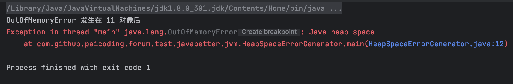

二哥的 Java 进阶之路
> 
1. [Java 面试指南（付费）](https://javabetter.cn/zhishixingqiu/mianshi.html)收录的京东面经同学 1 Java 技术一面面试原题：说说 OOM 的原因
2. [Java 面试指南（付费）](https://javabetter.cn/zhishixingqiu/mianshi.html)收录的快手面经同学 1 部门主站技术部面试原题：Java 哪些内存区域会发生 OOM？为什么？
### [19.内存泄漏可能由哪些原因导致呢？](https://javabetter.cn/sidebar/sanfene/jvm.html#_19-%E5%86%85%E5%AD%98%E6%B3%84%E6%BC%8F%E5%8F%AF%E8%83%BD%E7%94%B1%E5%93%AA%E4%BA%9B%E5%8E%9F%E5%9B%A0%E5%AF%BC%E8%87%B4%E5%91%A2)
比如说：
①、静态的集合中添加的对象越来越多，但却没有及时清理；

```java
public class OOM {
 static List list = new ArrayList();

 public void oomTests(){
   Object obj = new Object();

   list.add(obj);
  }
}
```
②、单例模式下对象持有的外部引用无法及时释放；
③、数据库、IO、Socket 等连接资源没有及时关闭；

```java
try {
    Connection conn = null;
    Class.forName("com.mysql.jdbc.Driver");
    conn = DriverManager.getConnection("url", "", "");
    Statement stmt = conn.createStatement();
    ResultSet rs = stmt.executeQuery("....");
  } catch (Exception e) {

  }finally {
    //不关闭连接
  }
```
④、变量的作用域不合理；

```java
class Simple {
    Object object;
    public void method1(){
        object = new Object();
        //...其他代码
        //由于作用域原因，method1执行完成之后，object 对象所分配的内存不会马上释放
    }
}
```
⑤、hash 值发生变化但对象却没有改变，这也是为什么 String 被设计成不可变对象的原因之一，就是因为假如 String 的哈希值发生了改变，但对应的值没变，就导致 HashMap 中的对象无法被及时清理；
⑥、使用完 ThreadLocal 没有使用 remove 方法来进行清除。
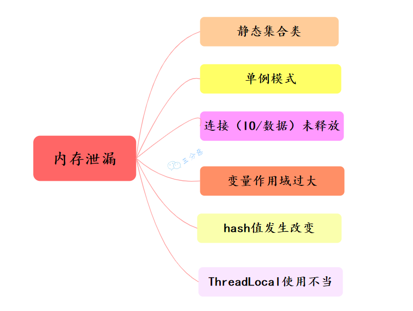

三分恶面渣逆袭：内存泄漏可能原因
### [20.有没有处理过内存泄漏问题？是如何定位的？](https://javabetter.cn/sidebar/sanfene/jvm.html#_20-%E6%9C%89%E6%B2%A1%E6%9C%89%E5%A4%84%E7%90%86%E8%BF%87%E5%86%85%E5%AD%98%E6%B3%84%E6%BC%8F%E9%97%AE%E9%A2%98-%E6%98%AF%E5%A6%82%E4%BD%95%E5%AE%9A%E4%BD%8D%E7%9A%84)
推荐阅读：

1. [一次内存溢出的排查优化实战](https://javabetter.cn/jvm/oom.html)
2. [JVM 性能监控工具之命令行篇](https://javabetter.cn/jvm/console-tools.html#jstack-%E8%B7%9F%E8%B8%AAjava%E5%A0%86%E6%A0%88)
3. [JVM 性能监控工具之可视化篇](https://javabetter.cn/jvm/view-tools.html)有，内存泄漏是指程序在运行过程中由于未能正确释放已分配的内存，导致内存无法被重用，从而引发内存耗尽等问题。
当时在做[技术派](https://javabetter.cn/zhishixingqiu/paicoding.html)项目的时候，由于 ThreadLocal 没有及时清理导致出现了内存泄漏问题。
常用的可视化监控工具有 JConsole、VisualVM、JProfiler、Eclipse Memory Analyzer (MAT)等。
也可以使用 JDK 自带的 jmap、jstack、jstat 等命令行工具来配合内存泄露问题的排查。
严重的**内存泄漏**往往伴随频繁的 **Full GC**，所以排查内存泄漏问题时，可以从 Full GC 入手。
第一步，使用 `jps -l` 查看运行的 Java 进程 ID。
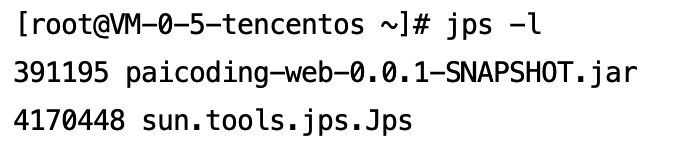

二哥的 Java 进阶之路：jps 查看技术派的进程 ID
第二步，使用`top -p [pid]` 查看进程使用 CPU 和内存占用情况。
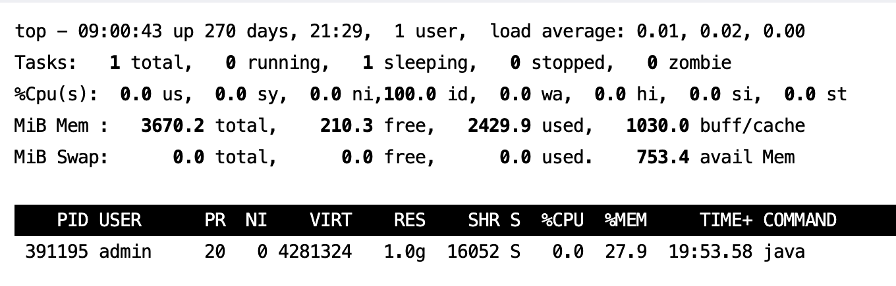

二哥的 Java 进阶之路：top -p
第三步，使用 `top -Hp [pid]` 查看进程下的所有线程占用 CPU 和内存情况。
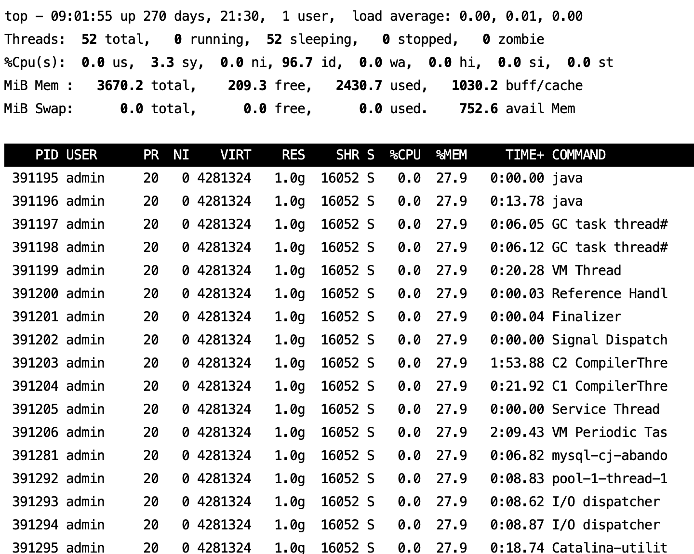

二哥的 Java 进阶之路：top -Hp
第四步，抓取线程栈：`jstack -F 29452 > 29452.txt`，可以多抓几次做个对比。
> 29452 为 pid，顺带作为文件名。

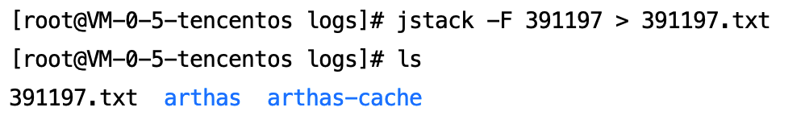

二哥的 Java 进阶之路：jstack
看看有没有线程死锁、死循环或长时间等待这些问题。
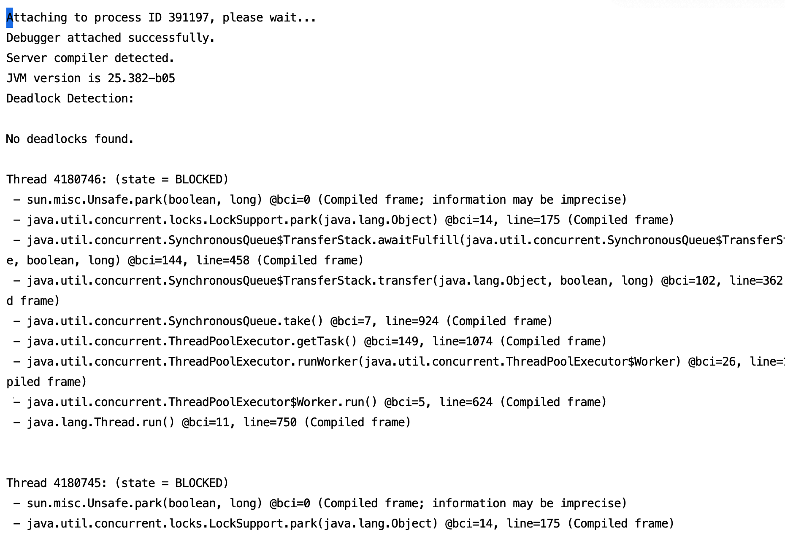

二哥的 Java 进阶之路：另外一组线程 id 的堆栈
第五步，可以使用`jstat -gcutil [pid] 5000 10` 每隔 5 秒输出 GC 信息，输出 10 次，查看 **YGC** 和 **Full GC** 次数。
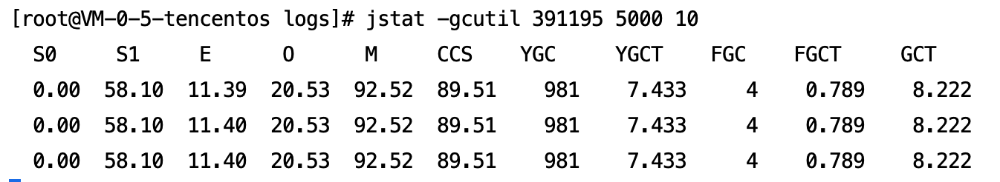

二哥的 Java 进阶之路：jstat
通常会出现 YGC 不增加或增加缓慢，而 Full GC 增加很快。
或使用 `jstat -gccause [pid] 5000` 输出 GC 摘要信息。
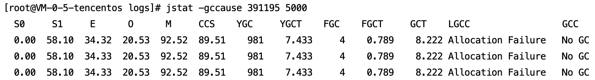

二哥的 Java 进阶之路：jstat
或使用 `jmap -heap [pid]` 查看堆的摘要信息，关注老年代内存使用是否达到阀值，若达到阀值就会执行 Full GC。
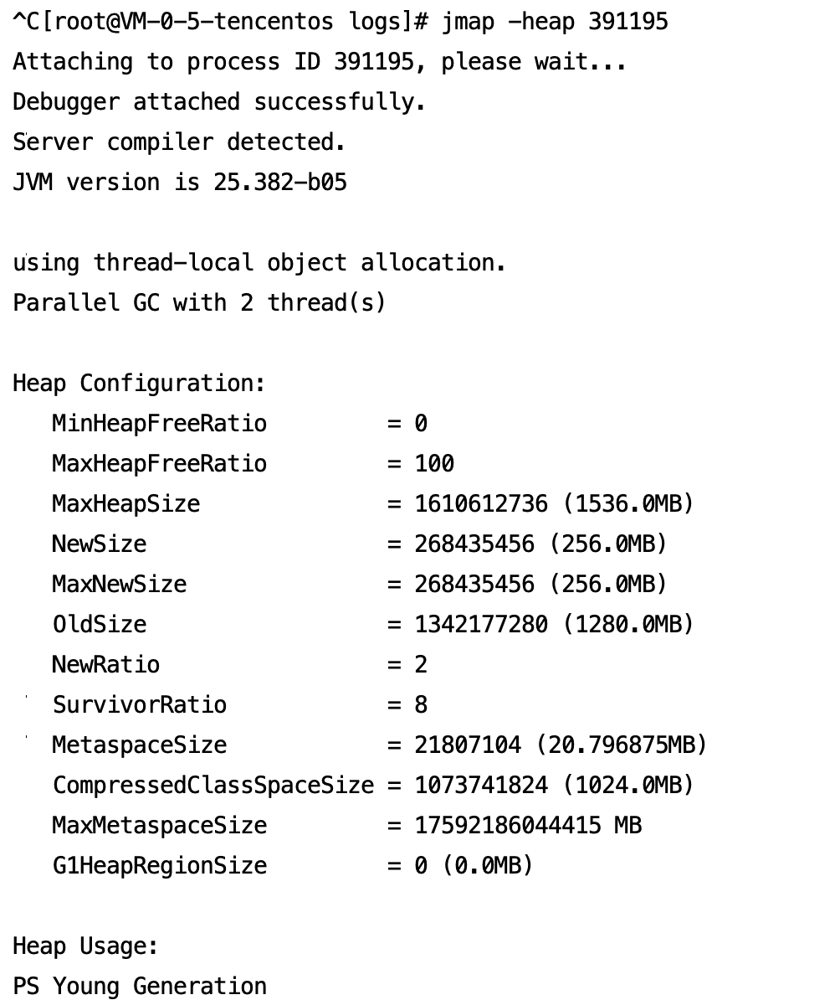

二哥的 Java 进阶之路：jmap
如果发现 `Full GC` 次数太多，就很大概率存在内存泄漏了。
第六步，生成 `dump` 文件，然后借助可视化工具分析哪个对象非常多，基本就能定位到问题根源了。
执行命令 `jmap -dump:format=b,file=heap.hprof 10025` 会输出进程 10025 的堆快照信息，保存到文件 heap.hprof 中。
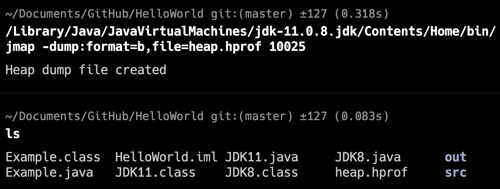

二哥的 Java 进阶之路：jmap
第七步，可以使用图形化工具分析，如 JDK 自带的 **VisualVM**，从菜单 > 文件 > 装入 dump 文件。
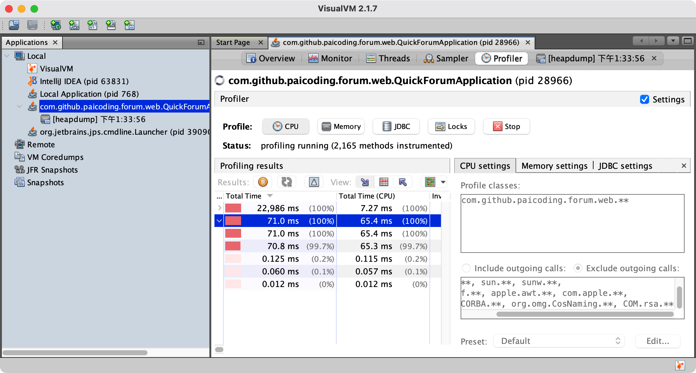

VisualVM
然后在结果观察内存占用最多的对象，找到内存泄漏的源头。
> 
1. [Java 面试指南（付费）](https://javabetter.cn/zhishixingqiu/mianshi.html)收录的京东同学 10 后端实习一面的原题：什么是内存泄露
2. [Java 面试指南（付费）](https://javabetter.cn/zhishixingqiu/mianshi.html)收录的快手面经同学 1 部门主站技术部面试原题：Java 哪些内存区域会发生 OOM？为什么？
3. [Java 面试指南（付费）](https://javabetter.cn/zhishixingqiu/mianshi.html)收录的美团面经同学 4 一面面试原题：内存泄漏怎么排查
### [21.有没有处理过内存溢出问题？](https://javabetter.cn/sidebar/sanfene/jvm.html#_21-%E6%9C%89%E6%B2%A1%E6%9C%89%E5%A4%84%E7%90%86%E8%BF%87%E5%86%85%E5%AD%98%E6%BA%A2%E5%87%BA%E9%97%AE%E9%A2%98)
有，内存溢出，也就是 Out of Memory，是指当程序请求分配内存时，由于没有足够的内存空间满足其需求，从而触发的错误。
当时在做[技术派](https://javabetter.cn/zhishixingqiu/paicoding.html)的时候，由于上传的文件过大，没有正确处理，导致一下子撑爆了内存，程序直接崩溃了。
当发生 OOM 时，可以导出堆转储（Heap Dump）文件进行分析。如果 JVM 还在运行，可以使用 jmap 命令手动生成 Heap Dump 文件：

```java
jmap -dump:format=b,file=heap.hprof <pid>
```
生成 Heap Dump 文件后，可以使用 MAT、JProfiler 等工具进行分析，查看内存中的对象占用情况，找到内存泄漏的原因。
如果生产环境的内存还有很多空余，可以适当增大堆内存大小，例如 `-Xmx4g` 参数。
或者检查代码中是否存在内存泄漏，如未关闭的资源、长生命周期的对象等。
之后，我会在本地进行压力测试，模拟高负载情况下的内存表现，确保修改有效，且没有引入新的问题。
> 
1. [Java 面试指南（付费）](https://javabetter.cn/zhishixingqiu/mianshi.html)收录的华为面经同学 9 Java 通用软件开发一面面试原题：如何排查 OOM？
2. [Java 面试指南（付费）](https://javabetter.cn/zhishixingqiu/mianshi.html)收录的荣耀面经同学 4 面试原题：有没遇到内存泄露，溢出的情况，怎么发生和处理的？
### [22.什么情况下会发生栈溢出？（补充）](https://javabetter.cn/sidebar/sanfene/jvm.html#_22-%E4%BB%80%E4%B9%88%E6%83%85%E5%86%B5%E4%B8%8B%E4%BC%9A%E5%8F%91%E7%94%9F%E6%A0%88%E6%BA%A2%E5%87%BA-%E8%A1%A5%E5%85%85)
> 2024 年 10 月 16 日增补

栈溢出（StackOverflowError）发生在程序调用栈的深度超过 JVM 允许的最大深度时。栈溢出的本质是因为线程的栈空间不足，导致无法再为新的栈帧分配内存。
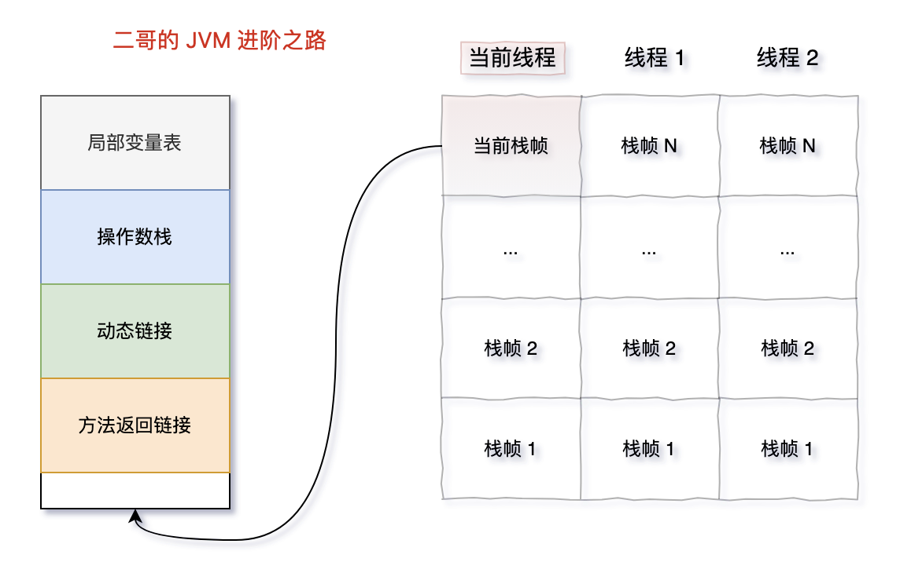

二哥的Java进阶之路：栈帧
当一个方法被调用时，JVM 会在栈中分配一个栈帧，用于存储该方法的执行信息。如果方法调用嵌套太深，栈帧不断压入栈中，最终会导致栈空间耗尽，抛出 StackOverflowError。
最常见的栈溢出场景是递归调用，尤其是没有正确的终止条件，导致递归无限进行。

```java
class StackOverflowExample {
    public static void recursiveMethod() {
        // 没有终止条件的递归调用
        recursiveMethod();
    }

    public static void main(String[] args) {
        recursiveMethod();  // 导致栈溢出
    }
}
```
另外，如果方法中定义了特别大的局部变量，栈帧会变得很大，导致栈空间更容易耗尽。

```java
public class LargeLocalVariables {
    public static void method() {
        int[] largeArray = new int[1000000];  // 大量局部变量
        method();  // 递归调用
    }

    public static void main(String[] args) {
        method();  // 导致栈溢出
    }
}
```
> 
1. [Java 面试指南（付费）](https://javabetter.cn/zhishixingqiu/mianshi.html)收录的 OPPO 面经同学 1 面试原题：什么情况下会发生栈溢出？
GitHub 上标星 10000+ 的开源知识库《[二哥的 Java 进阶之路](https://github.com/itwanger/toBeBetterJavaer)》第一版 PDF 终于来了！包括 Java 基础语法、数组&字符串、OOP、集合框架、Java IO、异常处理、Java 新特性、网络编程、NIO、并发编程、JVM 等等，共计 32 万余字，500+张手绘图，可以说是通俗易懂、风趣幽默……详情戳：[太赞了，GitHub 上标星 10000+ 的 Java 教程](https://javabetter.cn/overview/)
微信搜 **沉默王二** 或扫描下方二维码关注二哥的原创公众号沉默王二，回复 **222** 即可免费领取。


