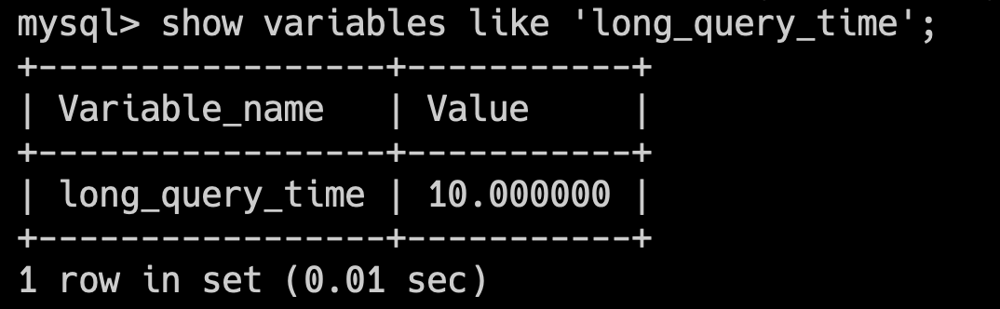
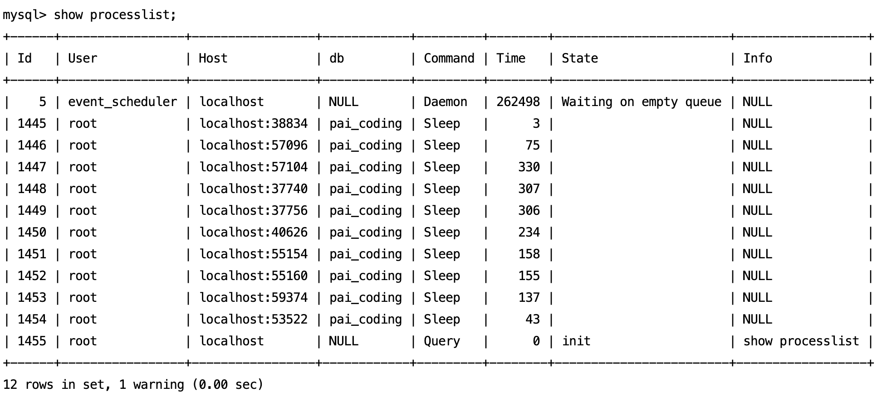
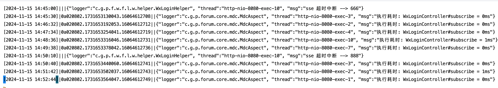
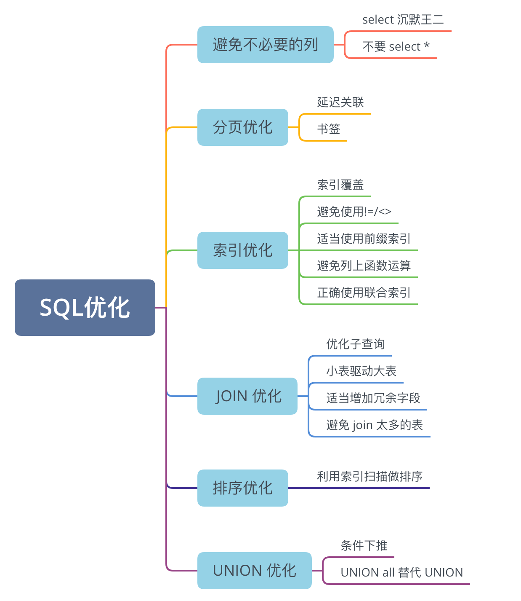
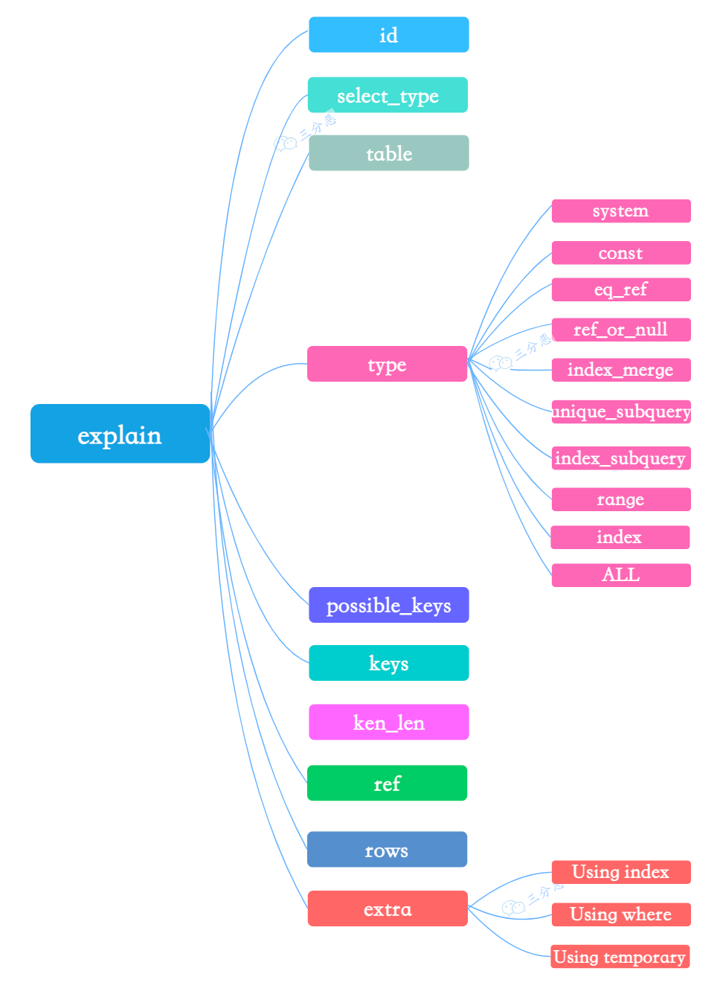

## SQL 优化
### 32.慢 SQL 怎么定位呢？
推荐阅读：[慢 SQL 优化一点小思路](https://juejin.cn/post/7048974570228809741)
#### 什么是慢 SQL？
慢 SQL 也就是执行时间较长的 SQL 语句，MySQL 中 long_query_time 默认值是 10 秒，也就是执行时间超过 10 秒的 SQL 语句会被记录到慢查询日志中。
可通过 `show variables like 'long_query_time';` 查看当前的 long_query_time 值。


不过，生产环境中，10 秒太久了，超过 1 秒的都可以认为是慢 SQL 了。

#### SQL 的执行过程了解吗？
了解：

1. 客户端发送 SQL 语句给 MySQL 服务器。
2. 如果查询缓存打开则会优先查询缓存，缓存中有对应的结果就直接返回。不过，MySQL 8.0 已经移除了查询缓存。
3. 分析器对 SQL 语句进行语法分析，判断是否有语法错误。
4. 搞清楚 SQL 语句要干嘛后，MySQL 会通过优化器生成执行计划。
5. 执行器调用存储引擎的接口，执行 SQL 语句。

SQL 执行过程中，优化器通过成本计算预估出执行效率最高的方式，基本的预估维度为：

- IO 成本：从磁盘读取数据到内存的开销。
- CPU 成本：CPU 处理内存中数据的开销。基于这两个维度，可以得出影响 SQL 执行效率的因素有：
**①、IO 成本**

- 数据量：数据量越大，IO 成本越高。所以要避免 `select *`；尽量分页查询。
- 数据从哪读取：尽量通过索引加快查询。**②、CPU 成本**

- 尽量避免复杂的查询条件，如有必要，考虑对子查询结果进行过滤。
- 尽量缩减计算成本，比如说为排序字段加上索引，提高排序效率；比如说使用 union all 替代 union，减少去重处理。#### 如何优化慢 SQL？
首先，找到那些比较慢的 SQL，可以通过启用慢查询日志，记录那些超过指定执行时间的查询。
也可以使用 `show processlist;` 命令查看当前正在执行的 SQL 语句，找出执行时间较长的 SQL。


或者在业务基建中加入对慢 SQL 的监控，常见的方案有字节码插桩、连接池扩展、ORM 框架扩展。


然后，使用 EXPLAIN 查看查询执行计划，判断查询是否使用了索引，是否有全表扫描等。

```sql
EXPLAIN SELECT * FROM your_table WHERE conditions;
```
最后，根据分析结果，通过添加或优化索引、调整查询语句或者增加内存缓冲区来优化 SQL。
#### 慢sql日志怎么开启？
慢 SQL 日志的开启方式有多种，比如说直接编辑 MySQL 的配置文件 my.cnf 或 my.ini，设置 slow_query_log 参数为 1，设置 slow_query_log_file 参数为慢查询日志的路径，设置 long_query_time 参数为慢查询的时间阈值。

```sql
[mysqld]
slow_query_log = 1
slow_query_log_file = /var/log/mysql/slow.log
long_query_time = 2  # 记录执行时间超过2秒的查询
```
然后重启 MySQL 服务就好了，也可以通过 set global 命令动态设置。

```sql
SET GLOBAL slow_query_log = 'ON';
SET GLOBAL slow_query_log_file = '/var/log/mysql/slow.log';
SET GLOBAL long_query_time = 2;
```
### 33.有哪些方式优化 SQL？
我在进行 SQL 优化的时候，主要通过以下几个方面进行优化：


#### 如何避免不必要的列？
比如说尽量避免使用 `select *`，只查询需要的列，减少数据传输量。

```sql
SELECT * FROM employees WHERE department_id = 5;
```
改成：

```sql
SELECT employee_id, first_name, last_name FROM employees WHERE department_id = 5;
```
#### 如何进行分页优化？
当数据量巨大时，传统的`LIMIT`和`OFFSET`可能会导致性能问题，因为数据库需要扫描`OFFSET + LIMIT`数量的行。
延迟关联（Late Row Lookups）和书签（Seek Method）是两种优化分页查询的有效方法。
**①、延迟关联**
延迟关联适用于需要从多个表中获取数据且主表行数较多的情况。它首先从索引表中检索出需要的行 ID，然后再根据这些 ID 去关联其他的表获取详细信息。

```sql
SELECT e.id, e.name, d.details
FROM employees e
JOIN department d ON e.department_id = d.id
ORDER BY e.id
LIMIT 1000, 20;
```
延迟关联后：

```sql
SELECT e.id, e.name, d.details
FROM (
    SELECT id
    FROM employees
    ORDER BY id
    LIMIT 1000, 20
) AS sub
JOIN employees e ON sub.id = e.id
JOIN department d ON e.department_id = d.id;
```
首先对`employees`表进行分页查询，仅获取需要的行的 ID，然后再根据这些 ID 关联获取其他信息，减少了不必要的 JOIN 操作。
**②、书签（Seek Method）**
书签方法通过记住上一次查询返回的最后一行的某个值，然后下一次查询从这个值开始，避免了扫描大量不需要的行。
假设需要对用户表进行分页，根据用户 ID 升序排列。

```sql
SELECT id, name
FROM users
ORDER BY id
LIMIT 1000, 20;
```
书签方式：

```sql
SELECT id, name
FROM users
WHERE id > last_max_id  -- 假设last_max_id是上一页最后一行的ID
ORDER BY id
LIMIT 20;
```
优化后的查询不再使用`OFFSET`，而是直接从上一页最后一个用户的 ID 开始查询。这里的`last_max_id`是上一次查询返回的最后一行的用户 ID。这种方法有效避免了不必要的数据扫描，提高了分页查询的效率。
#### 如何进行索引优化？
正确地使用索引可以显著减少 SQL 的查询时间，通常可以从索引覆盖、避免使用 `!=` 或者 `<>` 操作符、适当使用前缀索引、避免列上函数运算、正确使用联合索引等方面进行优化。
**①、利用覆盖索引**
使用非主键索引查询数据时需要回表，但如果索引的叶节点中已经包含要查询的字段，那就不会再回表查询了，这就叫覆盖索引。
举个例子，现在要从 test 表中查询 city 为上海的 name 字段。

```sql
select name from test where city='上海'
```
如果仅在 city 字段上添加索引，那么这条查询语句会先通过索引找到 city 为上海的行，然后再回表查询 name 字段，这就是回表查询。
为了避免回表查询，可以在 city 和 name 字段上建立联合索引，这样查询结果就可以直接从索引中获取。

```sql
alter table test add index index1(city,name);
```
**②、避免使用 != 或者 <> 操作符**
`!=` 或者 `<>` 操作符会导致 MySQL 无法使用索引，从而导致全表扫描。
例如，可以把`column<>'aaa'`，改成`column>'aaa' or column<'aaa'`，就可以使用索引了。
优化策略就是尽可能使用 `=`、`>`、`<`、`BETWEEN`等操作符，它们能够更好地利用索引。
**③、适当使用前缀索引**
适当使用前缀索引可以降低索引的空间占用，提高索引的查询效率。
比如，邮箱的后缀一般都是固定的`@xxx.com`，那么类似这种后面几位为固定值的字段就非常适合定义为前缀索引：

```sql
alter table test add index index2(email(6));
```
需要注意的是，MySQL 无法利用前缀索引做 order by 和 group by 操作。
**④、避免列上使用函数**
在 where 子句中直接对列使用函数会导致索引失效，因为数据库需要对每行的列应用函数后再进行比较，无法直接利用索引。

```sql
select name from test where date_format(create_time,'%Y-%m-%d')='2021-01-01';
```
可以改成：

```sql
select name from test where create_time>='2021-01-01 00:00:00' and create_time<'2021-01-02 00:00:00';
```
通过日期的范围查询，而不是在列上使用函数，可以利用 create_time 上的索引。
**⑤、正确使用联合索引**
正确地使用联合索引可以极大地提高查询性能，联合索引的创建应遵循最左前缀原则，即索引的顺序应根据列在查询中的使用频率和重要性来安排。

```sql
select * from messages where sender_id=1 and receiver_id=2 and is_read=0;
```
那就可以为 sender_id、receiver_id 和 is_read 这三个字段创建联合索引，但是要注意索引的顺序，应该按照查询中的字段顺序来创建索引。

```sql
alter table messages add index index3(sender_id,receiver_id,is_read);
```
#### 如何进行 JOIN 优化？
对于 JOIN 操作，可以通过优化子查询、小表驱动大表、适当增加冗余字段、避免 join 太多表等方式来进行优化。
**①、优化子查询**
子查询，特别是在 select 列表和 where 子句中的子查询，往往会导致性能问题，因为它们可能会为每一行外层查询执行一次子查询。
使用子查询：

```sql
select name from A where id in (select id from B);
```
使用 JOIN 代替子查询：

```sql
select A.name from A join B on A.id=B.id;
```
**②、小表驱动大表**
在执行 JOIN 操作时，应尽量让行数较少的表（小表）驱动行数较多的表（大表），这样可以减少查询过程中需要处理的数据量。
比如 left join，左表是驱动表，所以 A 表应小于 B 表，这样建立连接的次数就少，查询速度就快了。

```sql
select name from A left join B;
```
**③、适当增加冗余字段**
在某些情况下，通过在表中适当增加冗余字段来避免 JOIN 操作，可以提高查询效率，尤其是在高频查询的场景下。
比如，我们有一个订单表和一个商品表，查询订单时需要显示商品名称，如果每次都通过 JOIN 操作查询商品表，会降低查询效率。这时可以在订单表中增加一个冗余字段，存储商品名称，这样就可以避免 JOIN 操作。

```sql
select order_id,product_name from orders;
```
**④、避免使用 JOIN 关联太多的表**
《[阿里巴巴 Java 开发手册](https://javabetter.cn/pdf/ali-java-shouce.html)》上就规定，不要使用 join 关联太多的表，最多不要超过 3 张表。
因为 join 太多表会降低查询的速度，返回的数据量也会变得非常大，不利于后续的处理。
如果业务逻辑允许，可以考虑将复杂的 JOIN 查询分解成多个简单查询，然后在应用层组合这些查询的结果。
#### 如何进行排序优化？
MySQL 生成有序结果的方式有两种：一种是对结果集进行排序操作，另外一种是按照索引顺序扫描得出的自然有序结果。
因此在设计索引的时候要充分考虑到排序的需求。

```sql
select id, name from users order by name;
```
如果 name 字段上有索引，那么 MySQL 可以直接利用索引的有序性，避免排序操作。
#### 如何进行 UNION 优化？
UNION 操作用于合并两个或者多个 SELECT 语句的结果集。
**①、条件下推**
条件下推是指将 where、limit 等子句下推到 union 的各个子查询中，以便优化器可以充分利用这些条件进行优化。
假设我们有两个查询分支，需要合并结果并过滤：

```sql
SELECT * FROM (
    SELECT * FROM A
    UNION
    SELECT * FROM B
) AS sub
WHERE sub.id = 1;
```
可以改写成：

```sql
SELECT * FROM A WHERE id = 1
UNION
SELECT * FROM B WHERE id = 1;
```
通过将查询条件下推到 UNION 的每个分支中，每个分支查询都只处理满足条件的数据，减少了不必要的数据合并和过滤。
### 34.怎么看执行计划 explain，如何理解其中各个字段的含义？
explain 是 MySQL 提供的一个用于查看查询执行计划的工具，可以帮助我们分析查询语句的性能瓶颈，找出慢 SQL 的原因。
使用方式也非常简单，在 select 语句前加上 `explain` 关键字就可以了。

```sql
explain select * from students where id =9
```


explain 的输出结果中包含了很多字段，下面是一些常见的字段含义：
①、**id** 列：查询的标识符。
②、**select_type** 列：查询的类型。常见的类型有：

- SIMPLE：简单查询，不包含子查询或者 UNION 查询。
- PRIMARY：查询中如果包含子查询，则最外层查询被标记为 PRIMARY。
- SUBQUERY：子查询。
- DERIVED：派生表的 SELECT，FROM 子句的子查询。③、**table** 列：查的哪个表。
④、**type** 列：表示 MySQL 在表中找到所需行的方式，性能从最优到最差分别为：system > const > eq_ref > ref > range > index > ALL。

- system，表只有一行，一般是系统表，往往不需要进行磁盘 IO，速度非常快
- const：表中只有一行匹配，或通过主键或唯一索引获取单行记录。通常用于使用主键或唯一索引的精确匹配查询，性能非常高。
- eq_ref：对于每个来自上一张表的记录，最多只返回一条匹配记录，通常用于多表关联且使用主键或唯一索引的查询。效率非常高，适合多表关联查询。
- ref：使用非唯一索引或前缀索引查询的情况，返回符合条件的多行记录。通常用于普通索引或联合索引查询，效率较高，但不如 const 和 eq_ref。
- range：只检索给定范围的行，使用索引来检索。在`where`语句中使用 `bettween...and`、`<`、`>`、`<=`、`in` 等条件查询 `type` 都是 `range`。
- index：全索引扫描，即扫描整个索引而不访问数据行。
- ALL：全表扫描，效率最低。⑤、**possible_keys** 列：可能会用到的索引，但并不一定实际被使用。
⑥、**key** 列：实际使用的索引。如果为 NULL，则没有使用索引。
⑦、**key_len** 列：MySQL 决定使用的索引长度（以字节为单位）。当表有多个索引可用时，key_len 字段可以帮助识别哪个索引最有效。通常情况下，更短的 key_len 意味着数据库在比较键值时需要处理更少的数据。
⑧、**ref** 列：用于与索引列比较的值来源。

- const：表示常量，这个值是在查询中被固定的。例如在 WHERE `column = 'value'`中。
- 一个或多个列的名称，通常在 JOIN 操作中，表示 JOIN 条件依赖的字段。
- NULL，表示没有使用索引，或者查询使用的是全表扫描。⑨、**rows** 列：估算查到结果集需要扫描的数据行数，原则上 rows 越少越好。
⑩、**Extra** 列：附加信息。

- Using index：表示只利用了索引。
- Using where：表示使用了 WHERE 过滤。
- Using temporary ：表示使用了临时表来存储中间结果。示例：


#### type的执行效率等级，达到什么级别比较合适？
从高到低的效率排序是 system、const、eq_ref、ref、range、index 和 ALL。
一般情况下，建议 type 值达到 const、eq_ref 或 ref，因为这些类型表明查询使用了索引进行精确匹配，效率较高。
如果是范围查询，range 类型也是可以接受的。
通常要避免出现 ALL 类型，因为它表示全表扫描，性能最低。
