## 底层结构
这一部分就比较深了，如果不是简历上写了精通 Redis，应该不会怎么问。
### 49.说说 Redis 底层数据结构？
Redis 的底层数据结构有**动态字符串(sds)**、**链表(list)**、**字典(ht)**、**跳跃表(skiplist)**、**整数集合(intset)**、**压缩列表(ziplist)** 等。
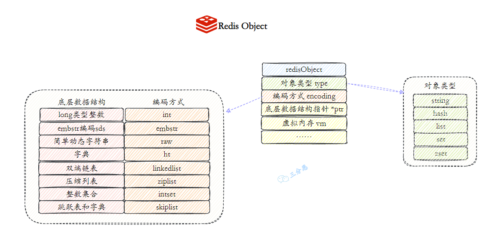

比如说 string 是通过 SDS 实现的，list 是通过链表实现的，hash 是通过字典实现的，set 是通过字典实现的，zset 是通过跳跃表实现的。
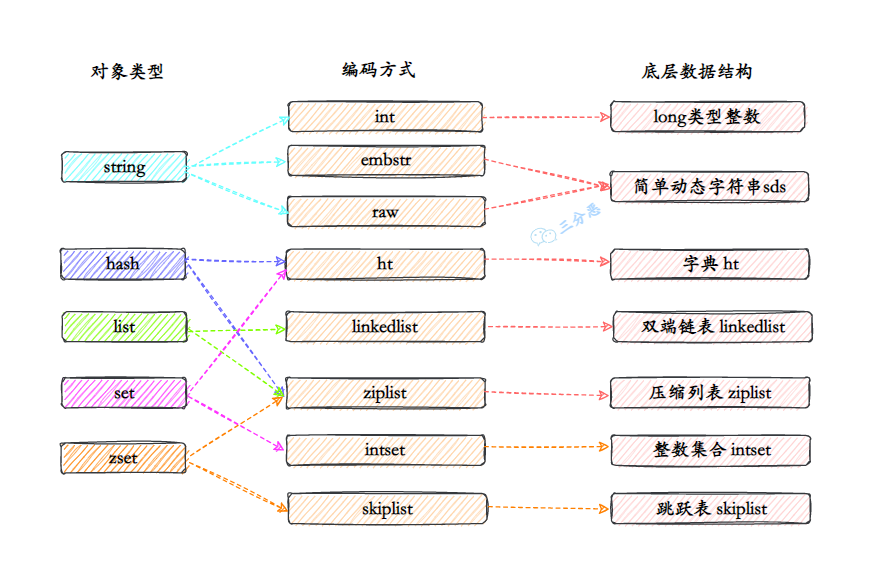

#### 简单介绍下 SDS？
Redis 是通过 C 语言实现的，但 Redis 并没有直接使用 C 语言的字符串，而是自己实现了一种叫做动态字符串 SDS 的类型。

```c
struct sdshdr {
    int len; // buf 中已使用的长度
    int free; // buf 中未使用的长度
    char buf[]; // 数据空间
};
```
因为 C 语⾔的字符串不记录⾃身的⻓度信息，当需要获取字符串⻓度时，需要遍历整个字符串，时间复杂度为 O(N)。
⽽ SDS 保存了⻓度信息，这样就将获取字符串⻓度的时间由 O(N) 降低到了 O(1)。
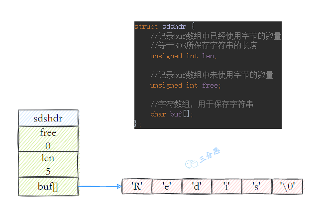

#### 简单介绍下链表 linkedlist
Redis 的链表是⼀个双向⽆环链表结构，和 Java 中的 [LinkedList](https://javabetter.cn/collection/linkedlist.html) 类似。
链表的节点由⼀个叫做 listNode 的结构来表示，每个节点都有指向其前置节点和后置节点的指针，同时头节点的前置和尾节点的后置均指向 null。
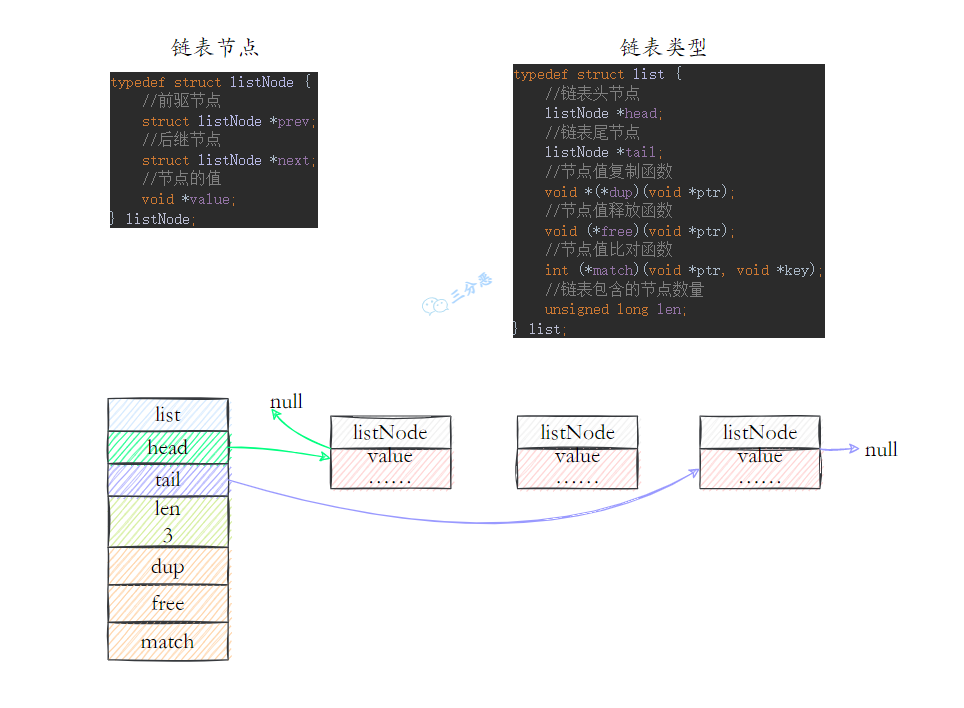

#### 简单介绍下字典 dict
⽤于保存键值对的抽象数据结构。Redis 使⽤ hash 表作为底层实现，一个哈希表里可以有多个哈希表节点，而每个哈希表节点就保存了字典里中的一个键值对。
每个字典带有两个 hash 表，供平时使⽤和 rehash 时使⽤，hash 表使⽤链地址法来解决键冲突，被分配到同⼀个索引位置的多个键值对会形成⼀个单向链表，在对 hash 表进⾏扩容或者缩容的时候，为了服务的可⽤性，rehash 的过程不是⼀次性完成的，⽽是渐进式的。
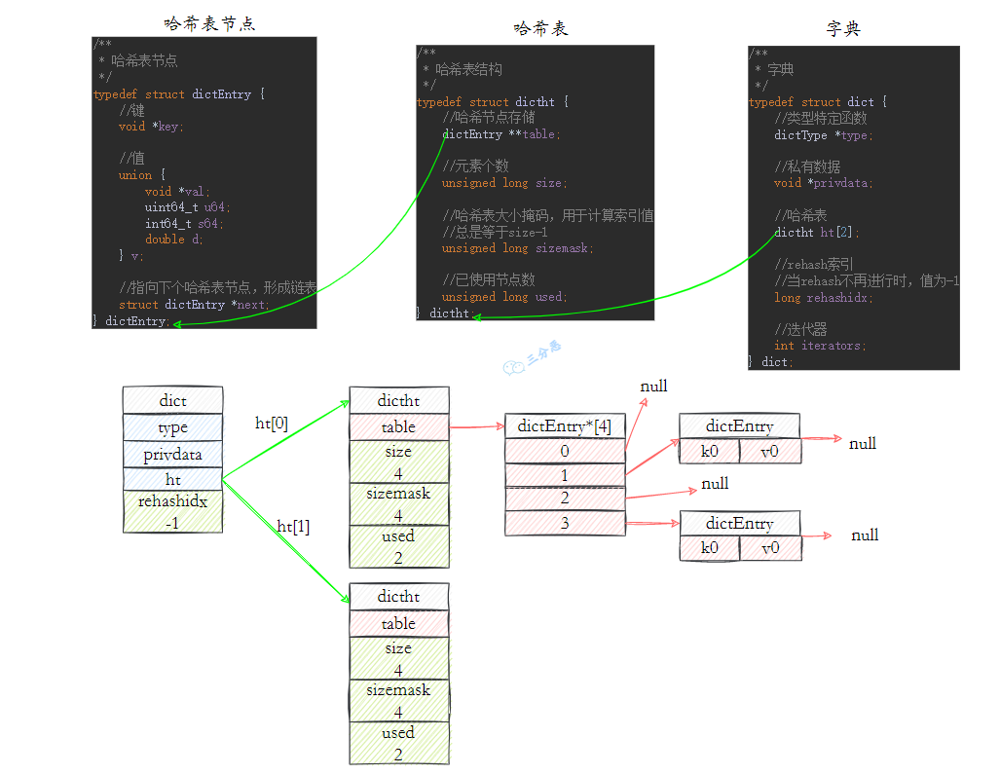

#### 简单介绍下跳表 skiplist
推荐阅读：[全网最详细的跳表文章](https://www.jianshu.com/p/9d8296562806)
跳表是有序集合 Zset 的底层实现之⼀。在 Redis 7.0 之前，如果有序集合的元素个数小于 128 个，并且每个元素的值小于 64 字节时，Redis 会使用压缩列表作为 Zset 的底层实现，否则会使用跳表；在 Redis 7.0 之后，压缩列表已经废弃，交由 listpack 来替代。
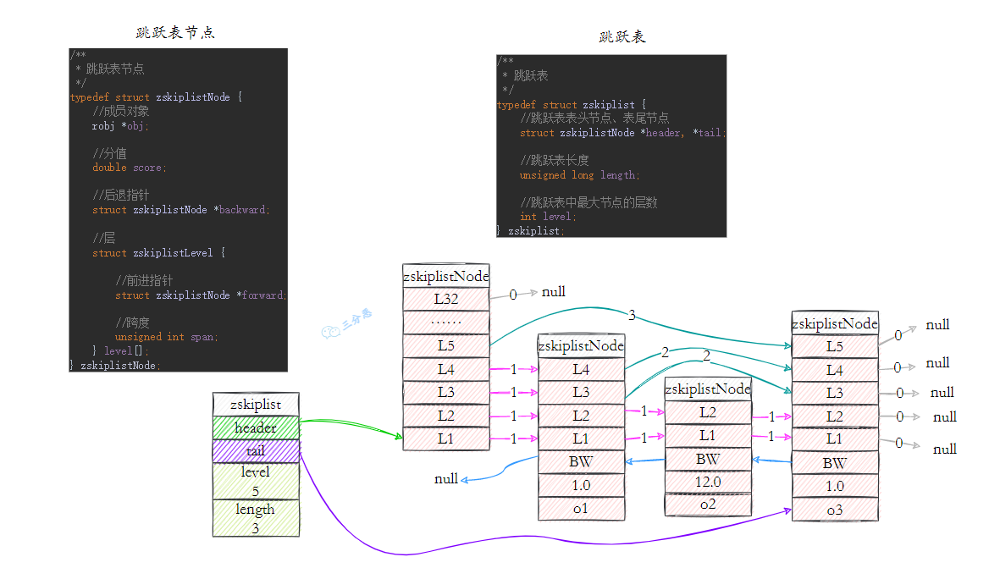

跳表由 zskiplist 和 zskiplistNode 组成，zskiplist ⽤于保存跳表的基本信息（表头、表尾、⻓度、层高等）。

```c
typedef struct zskiplist {
    struct zskiplistNode *header, *tail;
    unsigned long length;
    int level;
} zskiplist;
```
zskiplistNode ⽤于表示跳表节点，每个跳表节点的层⾼是不固定的，每个节点都有⼀个指向保存了当前节点的分值和成员对象的指针。

```c
typedef struct zskiplistNode {
    sds ele;
    double score;
    struct zskiplistNode *backward;
    struct zskiplistLevel {
        struct zskiplistNode *forward;
        unsigned int span;
    } level[];
} zskiplistNode;
```
#### 简单介绍下整数集合 intset
⽤于保存整数值的集合抽象数据结构，不会出现重复元素，底层实现为数组。
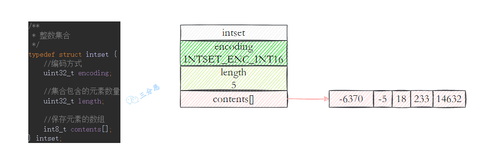

#### 简单介绍下压缩列表 ziplist
压缩列表是为节约内存⽽开发的顺序性数据结构，它可以包含任意多个节点，每个节点可以保存⼀个字节数组或者整数值。
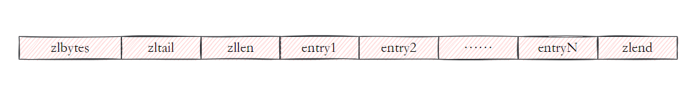

#### 简单介绍下紧凑列表 listpack
listpack 是 Redis 用来替代压缩列表（ziplist）的一种内存更加紧凑的数据结构。
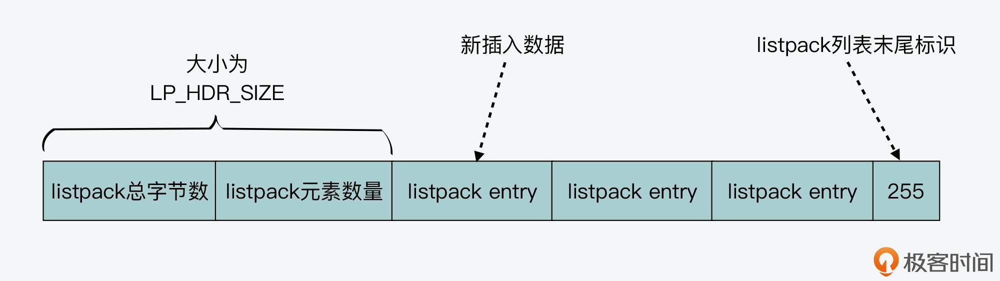

为了避免 ziplist 引起的连锁更新问题，listpack 中的元素不再像 ziplist 那样，保存其前一个元素的长度，而是保存当前元素的编码类型、数据，以及编码类型和数据的长度。
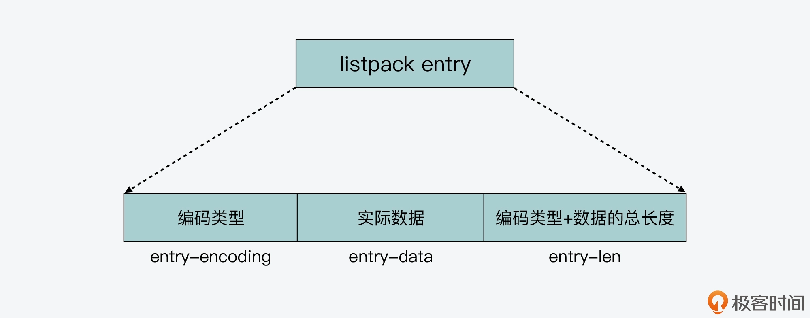

listpack 每个元素项不再保存上一个元素的长度，而是优化元素内字段的顺序，来保证既可以从前也可以向后遍历。
但因为 List/Hash/Set/ZSet 都严重依赖 ziplist，所以这个替换之路很漫长。
> 
1. [Java 面试指南（付费）](https://javabetter.cn/zhishixingqiu/mianshi.html)收录的字节跳动商业化一面的原题：说说 Redis 的 zset，什么是跳表，插入一个节点要构建几层索引
2. [Java 面试指南（付费）](https://javabetter.cn/zhishixingqiu/mianshi.html)收录的字节跳动面经同学 9 飞书后端技术一面面试原题：Redis 的数据类型，ZSet 的实现
3. [Java 面试指南（付费）](https://javabetter.cn/zhishixingqiu/mianshi.html)收录的小米暑期实习同学 E 一面面试原题：你知道 Redis 的 zset 底层实现吗
4. [Java 面试指南（付费）](https://javabetter.cn/zhishixingqiu/mianshi.html)收录的腾讯面经同学 23 QQ 后台技术一面面试原题：zset 的底层原理
5. [Java 面试指南（付费）](https://javabetter.cn/zhishixingqiu/mianshi.html)收录的快手面经同学 7 Java 后端技术一面面试原题：说一下 ZSet 底层结构
6. [Java 面试指南（付费）](https://javabetter.cn/zhishixingqiu/mianshi.html)收录的美团同学 9 一面面试原题：redis的数据结构底层原理？
7. [Java 面试指南（付费）](https://javabetter.cn/zhishixingqiu/mianshi.html)收录的腾讯面经同学 27 云后台技术一面面试原题：Zset的底层实现？
8. [Java 面试指南（付费）](https://javabetter.cn/zhishixingqiu/mianshi.html)收录的得物面经同学 9 面试题目原题：Zset的底层如何实现？
### 50.Redis 的 SDS 和 C 中字符串相比有什么优势？
C 语言使用了一个长度为 `N+1` 的字符数组来表示长度为 `N` 的字符串，并且字符数组最后一个元素总是 `\0`，这种简单的字符串表示方式 不符合 Redis 对字符串在安全性、效率以及功能方面的要求。
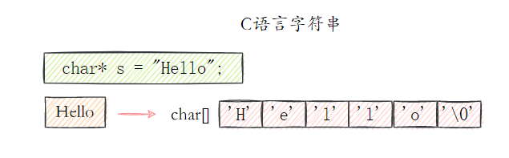

#### C 语言的字符串可能有什么问题？
这样简单的数据结构可能会造成以下一些问题：

- **获取字符串长度复杂度高** ：因为 C 不保存数组的长度，每次都需要遍历一遍整个数组，时间复杂度为 O(n)；
- 不能杜绝 **缓冲区溢出/内存泄漏** 的问题 : C 字符串不记录自身长度带来的另外一个问题是容易造成缓存区溢出（buffer overflow），例如在字符串拼接的时候，新的
- C 字符串 **只能保存文本数据** → 因为 C 语言中的字符串必须符合某种编码（比如 ASCII），例如中间出现的 `'\0'` 可能会被判定为提前结束的字符串而识别不了；#### Redis 如何解决？优势？
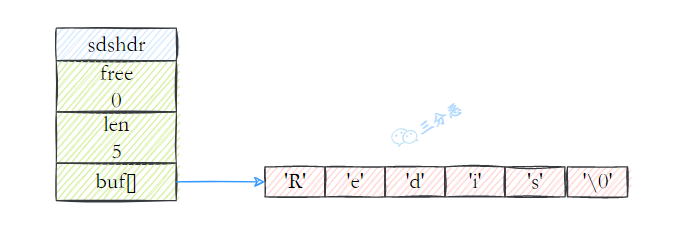

简单来说一下 Redis 如何解决的：

1. **多增加 len 表示当前字符串的长度**：这样就可以直接获取长度了，复杂度 O(1)；
2. **自动扩展空间**：当 SDS 需要对字符串进行修改时，首先借助于 `len` 和 `alloc` 检查空间是否满足修改所需的要求，如果空间不够的话，SDS 会自动扩展空间，避免了像 C 字符串操作中的溢出情况；
3. **有效降低内存分配次数**：C 字符串在涉及增加或者清除操作时会改变底层数组的大小造成重新分配，SDS 使用了 **空间预分配** 和 **惰性空间释放** 机制，简单理解就是每次在扩展时是成倍的多分配的，在缩容是也是先留着并不正式归还给 OS；
4. **二进制安全**：C 语言字符串只能保存 `ascii` 码，对于图片、音频等信息无法保存，SDS 是二进制安全的，写入什么读取就是什么，不做任何过滤和限制；### 51.字典是如何实现的？Rehash 了解吗？
字典是 Redis 服务器中出现最为频繁的复合型数据结构。除了 **hash** 结构的数据会用到字典外，整个 Redis 数据库的所有 `key` 和 `value` 也组成了一个 **全局字典**，还有带过期时间的 `key` 也是一个字典。*(存储在 RedisDb 数据结构中)*
#### 字典结构是什么样的呢？
**Redis** 中的字典相当于 Java 中的 **HashMap**，内部实现也差不多类似，采用哈希与运算计算下标位置；通过 **"数组 + 链表" ****的****链地址法** 来解决哈希冲突，同时这样的结构也吸收了两种不同数据结构的优点。
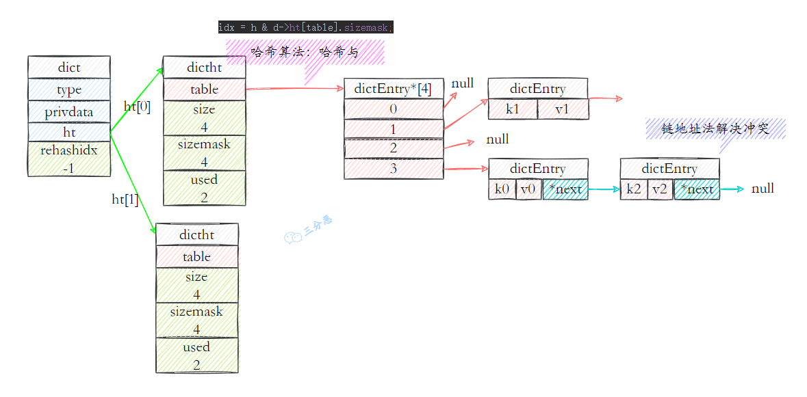

#### 字典是怎么扩容的？
字典结构内部包含 **两个 hashtable**，通常情况下只有一个哈希表 `ht[0]` 有值，在扩容的时候，把 `ht[0]`里的值 rehash 到 `ht[1]`，然后进行 **渐进式 rehash** ——所谓渐进式 rehash，指的是这个 rehash 的动作并不是一次性、集中式地完成的，而是分多次、渐进式地完成的。
待搬迁结束后，`h[1]`就取代 `h[0]`存储字典的元素。
### 52.跳表是如何实现的？原理？
跳表是一种有序的数据结构，它通过在每个节点中维持多个指向其它节点的指针，从而达到快速访问节点的目的。
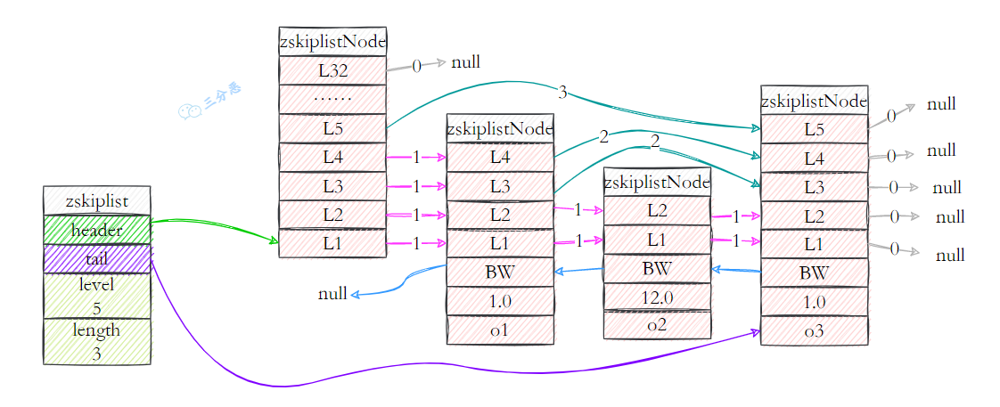

#### 为什么使用跳表？
首先，因为 zset 要支持随机的插入和删除，所以它 **不宜使用数组来实现**，关于排序问题，我们也很容易就想到 **红黑树/ 平衡树** 这样的树形结构，为什么 Redis 不使用这样一些结构呢？

1. **性能考虑：** 在高并发的情况下，树形结构需要执行一些类似于 rebalance 这样的可能涉及整棵树的操作，相对来说跳跃表的变化只涉及局部；
2. **实现考虑：** 在复杂度与红黑树相同的情况下，跳跃表实现起来更简单，看起来也更加直观；基于以上的一些考虑，Redis 基于 **William Pugh** 的论文做出一些改进后采用了 **跳跃表** 这样的结构。
本质是解决查找问题。
#### 跳跃表是怎么实现的？
跳跃表的节点里有这些元素：
①、**层**
跳跃表节点的 level 数组可以包含多个元素，每个元素都包含一个指向其它节点的指针，程序可以通过这些层来加快访问其它节点的速度，一般来说，层的数量月多，访问其它节点的速度就越快。
每次创建一个新的跳跃表节点的时候，程序都根据幂次定律，随机生成一个介于 1 和 32 之间的值作为 level 数组的大小，这个大小就是层的“高度”
②、**前进指针**
每个层都有一个指向表尾的前进指针（`level[i].forward` 属性），用于从表头向表尾方向访问节点。
我们看一下跳跃表从表头到表尾，遍历所有节点的路径：
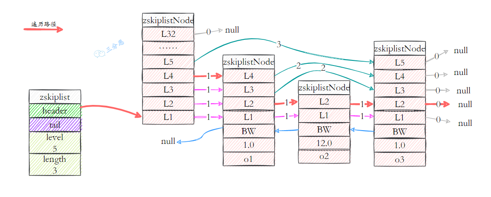

③、**跨度**
层的跨度用于记录两个节点之间的距离。跨度是用来计算排位（rank）的：在查找某个节点的过程中，将沿途访问过的所有层的跨度累计起来，得到的结果就是目标节点在跳跃表中的排位。
例如查找，分值为 3.0、成员对象为 o3 的节点时，沿途经历的层：查找的过程只经过了一个层，并且层的跨度为 3，所以目标节点在跳跃表中的排位为 3。
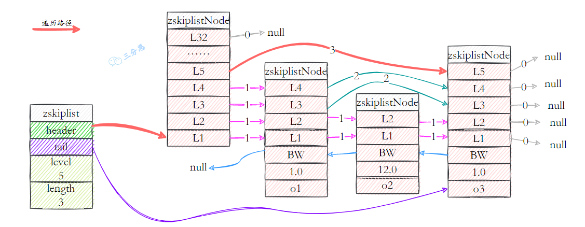

④、**分值和成员**
节点的分值（score 属性）是一个 double 类型的浮点数，跳跃表中所有的节点都按分值从小到大来排序。
节点的成员对象（obj 属性）是一个指针，它指向一个字符串对象，而字符串对象则保存这一个 SDS 值。
#### 为什么 hash 表范围查询效率比跳表低？
哈希表是一种基于键值对的数据结构，主要用于快速查找、插入和删除操作。
哈希表通过计算键的哈希值来确定值的存储位置，这使得它在单个元素的访问上非常高效，时间复杂度为 O(1)。
然而，哈希表内的元素是无序的。因此，对于范围查询（如查找所有在某个范围内的元素），哈希表无法直接支持，必须遍历整个表来检查哪些元素满足条件，这使得其在范围查询上的效率低下，时间复杂度为 O(n)。
跳表是一种有序的数据结构，能够保持元素的排序顺序。
它通过多层的链表结构实现快速的插入、删除和查找操作，其中每一层都是下一层的一个子集，并且元素在每一层都是有序的。
当进行范围查询时，跳表可以从最高层开始，快速定位到范围的起始点，然后沿着下一层继续直到找到范围的结束点。这种分层的结构使得跳表在进行范围查询时非常高效，时间复杂度为 O(log n) 加上范围内元素的数量。
> 
1. [Java 面试指南（付费）](https://javabetter.cn/zhishixingqiu/mianshi.html)收录的小米暑期实习同学 E 一面面试原题：为什么 hash 表范围查询效率比跳表低
2. [Java 面试指南（付费）](https://javabetter.cn/zhishixingqiu/mianshi.html)收录的腾讯面经同学 23 QQ 后台技术一面面试原题：zset 的底层原理
3. [Java 面试指南（付费）](https://javabetter.cn/zhishixingqiu/mianshi.html)收录的得物面经同学 8 一面面试原题：跳表的结构
4. [Java 面试指南（付费）](https://javabetter.cn/zhishixingqiu/mianshi.html)收录的美团面经同学 4 一面面试原题：Redis 跳表
5. [Java 面试指南（付费）](https://javabetter.cn/zhishixingqiu/mianshi.html)收录的阿里系面经同学 19 饿了么面试原题：跳表了解吗
### 53.压缩列表了解吗？
压缩列表是 Redis **为了节约内存** 而使用的一种数据结构，由一系列特殊编码的连续内存块组成的顺序型数据结构。
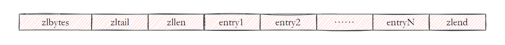

hash、list、zset 在元素较少时会使用压缩列表。
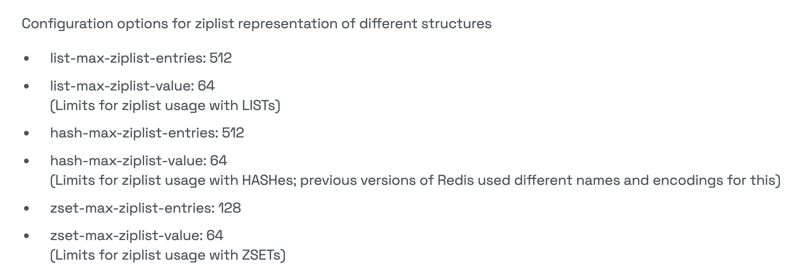

一个压缩列表包含任意多个节点，每个节点可以保存一个字节数组或者一个整数值。
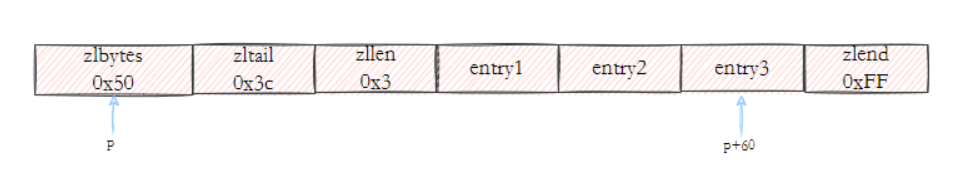


- **zlbyttes**：记录整个压缩列表占用的内存字节数
- **zltail**：记录压缩列表表尾节点距离压缩列表的起始地址有多少字节
- **zllen**：记录压缩列表包含的节点数量
- **entryX**：列表节点
- **zlend**：用于标记压缩列表的末端
> 
1. [Java 面试指南（付费）](https://javabetter.cn/zhishixingqiu/mianshi.html)收录的同学 30 腾讯音乐面试原题：什么情况下使用压缩列表
### 54.快速列表 quicklist 了解吗？
Redis 早期版本存储 list 列表数据结构使用的是压缩列表 ziplist 和普通的双向链表 linkedlist，也就是说当元素少时使用 ziplist，当元素多时用 linkedlist。
但考虑到链表的附加空间相对较高，`prev` 和 `next` 指针就要占去 `16` 个字节（64 位操作系统占用 `8` 个字节），另外每个节点的内存都是单独分配，会家具内存的碎片化，影响内存管理效率。
后来 Redis 新版本（3.2）对列表数据结构进行了改造，使用 `quicklist` 代替了 `ziplist` 和 `linkedlist`，quicklist 是综合考虑了时间效率与空间效率引入的新型数据结构。
quicklist 由 list 和 ziplist 结合而成，它是一个由 ziplist 充当节点的双向链表。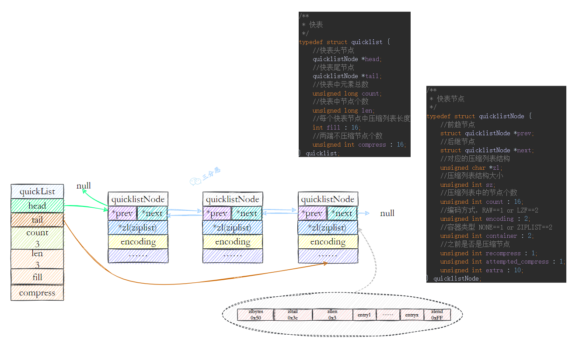

GitHub 上标星 10000+ 的开源知识库《[二哥的 Java 进阶之路](https://github.com/itwanger/toBeBetterJavaer)》第一版 PDF 终于来了！包括 Java 基础语法、数组&字符串、OOP、集合框架、Java IO、异常处理、Java 新特性、网络编程、NIO、并发编程、JVM 等等，共计 32 万余字，500+张手绘图，可以说是通俗易懂、风趣幽默……详情戳：[太赞了，GitHub 上标星 10000+ 的 Java 教程](https://javabetter.cn/overview/)
微信搜 **沉默王二** 或扫描下方二维码关注二哥的原创公众号沉默王二，回复 **222** 即可免费领取。


