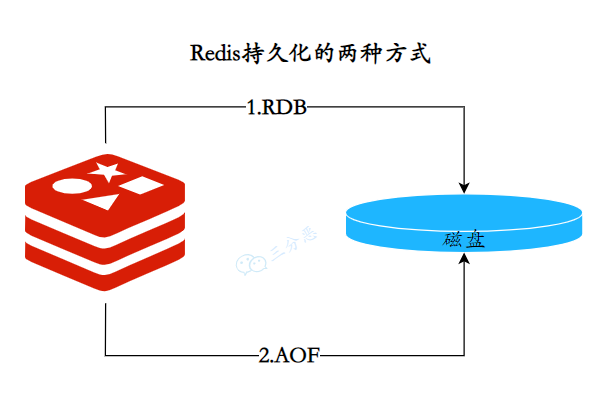
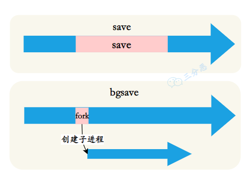
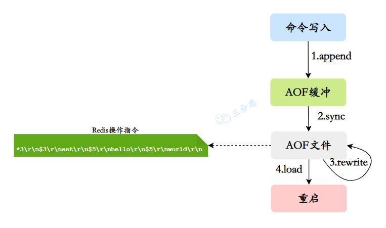
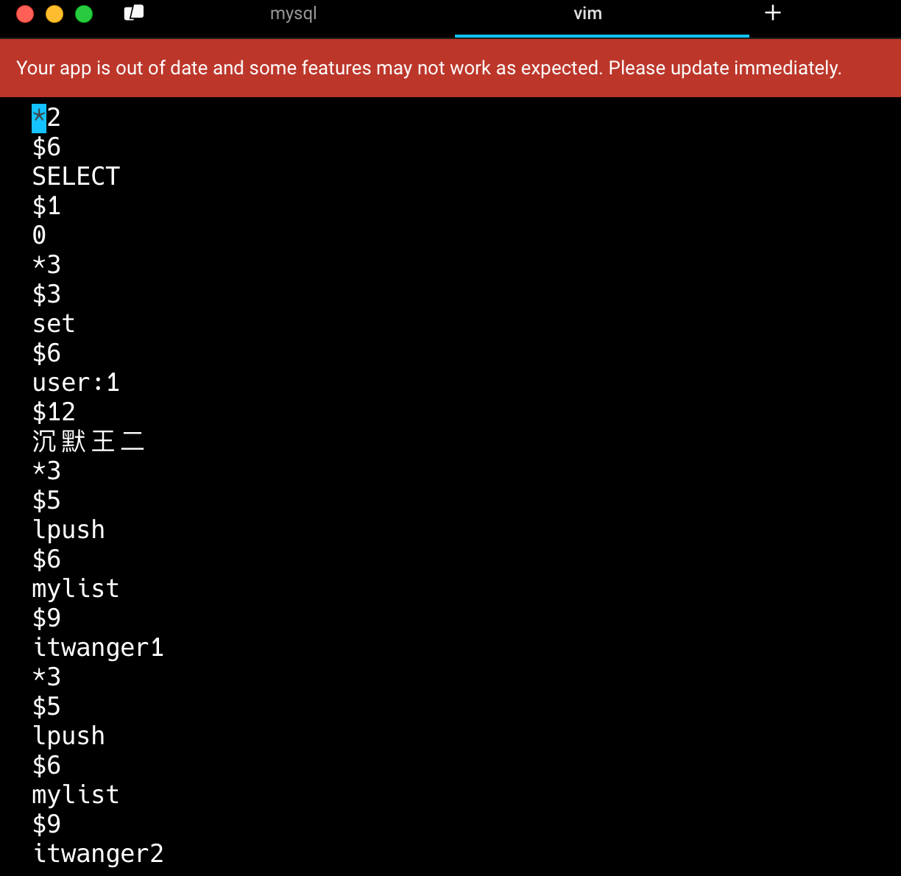
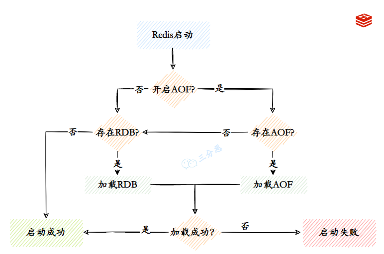
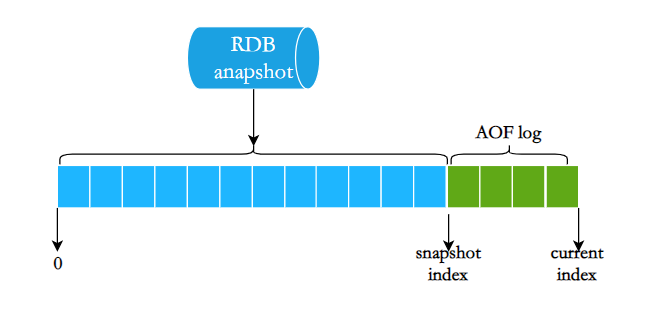

## 持久化
### 10.Redis 持久化⽅式有哪些？有什么区别？
Redis 的持久化机制保证了 Redis 服务器在重启后数据不丢失，通过 RDB 和 AOF 文件来恢复内存中原有的数据。
这两种持久化方式可以单独使用，也可以同时使用。


#### 说一下 RDB？
RDB 持久化通过创建数据集的快照来工作，在指定的时间间隔内将 Redis 在某一时刻的数据状态保存到磁盘的一个 RDB 文件中。
可通过 save 和 bgsave 命令两个命令来手动触发 RDB 持久化操作：


**①、save 命令**：会同步地将 Redis 的所有数据保存到磁盘上的一个 RDB 文件中。这个操作会阻塞所有客户端请求直到 RDB 文件被完全写入磁盘。
当 Redis 数据集较大时，使用 SAVE 命令会导致 Redis 服务器停止响应客户端的请求。
不推荐在生产环境中使用，除非数据集非常小，或者可以接受服务暂时的不可用状态。
**②、bgsave 命令**：会在后台异步地创建 Redis 的数据快照，并将快照保存到磁盘上的 RDB 文件中。这个命令会立即返回，Redis 服务器可以继续处理客户端请求。
在 BGSAVE 命令执行期间，Redis 会继续响应客户端的请求，对服务的可用性影响较小。快照的创建过程是由一个子进程完成的，主进程不会被阻塞。是在生产环境中执行 RDB 持久化的推荐方式。
以下场景会自动触发 RDB 持久化：
①、在 Redis 配置文件（通常是 redis.conf）中，可以通过`save <seconds> <changes>`指令配置自动触发 RDB 持久化的条件。这个指令可以设置多次，每个设置定义了一个时间间隔（秒）和该时间内发生的变更次数阈值。

```plain
save 900 1
save 300 10
save 60 10000
```
这意味着：

- 如果至少有 1 个键被修改，900 秒后自动触发一次 RDB 持久化。
- 如果至少有 10 个键被修改，300 秒后自动触发一次 RDB 持久化。
- 如果至少有 10000 个键被修改，60 秒后自动触发一次 RDB 持久化。满足以上任一条件，RDB 持久化就会被自动触发。
②、当 Redis 服务器通过 SHUTDOWN 命令正常关闭时，如果没有禁用 RDB 持久化，Redis 会自动执行一次 RDB 持久化，以确保数据在下次启动时能够恢复。
③、在 Redis 复制场景中，当一个 Redis 实例被配置为从节点并且与主节点建立连接时，它可能会根据配置接收主节点的 RDB 文件来初始化数据集。这个过程中，主节点会在后台自动触发 RDB 持久化，然后将生成的 RDB 文件发送给从节点。
#### 说一下 AOF？
AOF 持久化通过记录每个写操作命令并将其追加到 AOF 文件中来工作，恢复时通过重新执行这些命令来重建数据集。
AOF 的主要作用是解决了数据持久化的实时性，目前已经是 Redis 持久化的主流方式。
AOF 的工作流程分为四个步骤：命令写入、文件同步、文件重写、重启加载。


1）当 AOF 持久化机制被启用时，Redis 服务器会将接收到的所有写命令追加到 AOF 缓冲区的末尾。
2）接着将缓冲区中的命令刷新到磁盘的 AOF 文件中，刷新策略有三种：

- always：每次写命令都会同步到 AOF 文件。
- everysec（默认）：每秒同步一次。如果系统崩溃，可能会丢失最后一秒的数据。
- no：在这种模式下，如果发生宕机，那么丢失的数据量由操作系统内核的缓存冲洗策略决定。3）随着 AOF 文件的不断增长，Redis 会启用重写机制来生成一个更小的 AOF 文件：

- 将内存中每个键值对的当前状态转换为一条最简单的 Redis 命令，写入到一个新的 AOF 文件中。即使某个键被修改了多次，在新的 AOF 文件中也只会保留最终的状态。
- Redis 会 fork 一个子进程，子进程负责重写 AOF 文件，主进程不会被阻塞。
```plain
主进程（fork）  
   │  
   ├─→ 子进程（生成新的 AOF 文件）  
   │       │  
   │       ├─→ 内存快照  
   │       ├─→ 写入临时 AOF 文件  
   │       ├─→ 通知主进程完成  
   │  
   ├─→ 主进程（追加缓冲区到新 AOF 文件）  
   ├─→ 替换旧 AOF 文件  
   ├─→ 重写完成
```
4）当 Redis 服务器重启时，会读取 AOF 文件中的所有命令并重新执行它们，以恢复重启前的内存状态。
#### AOF 文件存储的是什么类型的数据？
AOF 文件存储的是 Redis 所有的写操作命令，比如 SET、HSET、INCR 等。


#### AOF重写期间命令可能会写入两次，会造成什么影响？
AOF 重写期间，Redis 会将新的写命令同时写入旧的 AOF 文件和重写缓冲区。
这样会带来额外的磁盘开销。
但可以防止在 AOF 重写尚未完成时，Redis 发生崩溃，导致数据丢失。即使重写失败，旧的 AOF 文件仍然是完整的。
当重写完成后，会通过原子操作将新的 AOF 文件替换旧的 AOF 文件。
### 11.RDB 和 AOF 各自有什么优缺点？
RDB 是一个非常紧凑的单文件（二进制文件 dump.rdb），代表了 Redis 在某个时间点上的数据快照。非常适合用于备份数据，比如在夜间进行备份，然后将 RDB 文件复制到远程服务器。但可能会丢失最后一次持久化后的数据。
AOF 的最大优点是灵活，实时性好，可以设置不同的 fsync 策略，如每秒同步一次，每次写入命令就同步，或者完全由操作系统来决定何时同步。但 AOF 文件往往比较大，恢复速度慢，因为它记录了每个写操作。
### 12.RDB 和 AOF 如何选择？
如果需要尽可能减少数据丢失，AOF 是更好的选择。尤其是在频繁写入的环境下，设置 AOF 每秒同步可以最大限度减少数据丢失。
如果性能是首要考虑，RDB 可能更适合。RDB 的快照生成通常对性能影响较小，并且数据恢复速度快。
如果系统需要经常重启，并且希望系统重启后快速恢复，RDB 可能是更好的选择。虽然 AOF 也提供了良好的恢复能力，但重写 AOF 文件可能会比较慢。
在许多生产环境中，同时启用 RDB 和 AOF 被认为是最佳实践：

- 使用 RDB 进行快照备份。
- 使用 AOF 保证崩溃后的最大数据完整性。### 13.Redis 的数据恢复？
当 Redis 中的数据丢失时，可以从 RDB 或者 AOF 中恢复数据。
可以将 RDB 文件或者 AOF 文件复制到 Redis 的数据目录下，然后重启 Redis 服务，Redis 会自动加载数据文件并恢复数据。


**Redis** 启动时加载数据的流程：

1. AOF 开启且存在 AOF 文件时，优先加载 AOF 文件。
2. AOF 关闭或者 AOF 文件不存在时，加载 RDB 文件。### 14.Redis 4.0 的混合持久化了解吗？
在 Redis 中，RDB 持久化是通过创建数据的快照来保存数据的，而 AOF 持久化则是通过记录每个写入命令来保存数据的。
两种方式各有优缺点。RDB 持久化的优点是恢复大数据集的速度比较快，但是可能会丢失最后一次快照以后的数据。AOF 持久化的优点是数据的完整性比较高，通常只会丢失一秒的数据，但是对于大数据集，AOF 文件可能会比较大，恢复的速度比较慢。
在 Redis 4.0 版本中，混合持久化模式会在 AOF 重写的时候同时生成一份 RDB 快照，然后将这份快照作为 AOF 文件的一部分，最后再附加新的写入命令。


这样，当需要恢复数据时，Redis 先加载 RDB 文件来恢复到快照时刻的状态，然后应用 RDB 之后记录的 AOF 命令来恢复之后的数据更改，既快又可靠。
#### 如何设置持久化模式？
可以通过编辑 Redis 的配置文件 redis.conf 来进行设置，或者在运行时通过 Redis 命令行动态调整。
RDB 持久化通过在配置文件中设置快照（snapshotting）规则来启用。这些规则定义了在多少秒内如果有多少个键被修改，则自动执行一次持久化操作。

```shell
save 900 1      # 如果至少有1个键被修改，900秒后自动保存一次
save 300 10     # 如果至少有10个键被修改，300秒后自动保存一次
save 60 10000   # 如果至少有10000个键被修改，60秒后自动保存一次
```
AOF 持久化是通过在配置文件中设置 appendonly 参数为 yes 来启用的：

```shell
appendonly yes
```
此外，还可以配置 AOF 文件的写入频率，这是通过 appendfsync 设置的：

```shell
appendfsync always    # 每次写入数据都同步，保证数据不丢失，但性能较低
appendfsync everysec  # 每秒同步一次，折衷方案
appendfsync no        # 由操作系统决定何时同步，性能最好，但数据安全性最低
```
为了优化 AOF 文件的大小，Redis 允许自动或手动重写 AOF 文件。可以在配置文件中设置重写的触发条件：

```shell
auto-aof-rewrite-percentage 100  # 增长到原大小的100%时触发重写
auto-aof-rewrite-min-size 64mb   # AOF 文件至少达到64MB时才考虑重写
```
手动执行 AOF 重写的命令是：

```shell
redis-cli bgrewriteaof
```
如果决定同时使用 RDB 和 AOF，可以在配置文件中同时启用两者。

```shell
save 900 1
appendonly yes
```
还可以在运行时动态更改：

```shell
redis-cli config set save "900 1 300 10 60 10000"
redis-cli config set appendonly yes
redis-cli config set appendfsync everysec
```
