## 缓存设计
### 29.缓存击穿、缓存穿透、缓存雪崩了解吗？
缓存穿透、缓存击穿和缓存雪崩是指在使用 Redis 做缓存时可能遇到的三种高并发场景下的问题。
#### 什么是缓存击穿？
缓存击穿是指某一个或少数几个数据被高频访问，当这些数据在缓存中过期的那一刻，大量请求就会直接到达数据库，导致数据库瞬间压力过大。
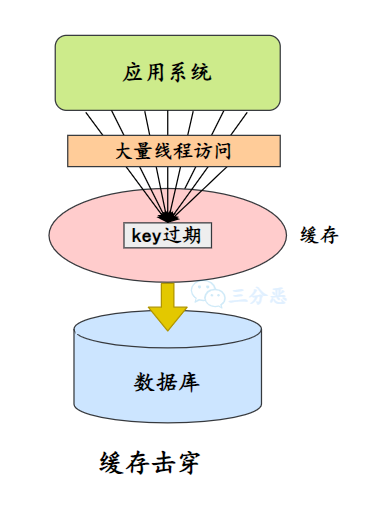

解决⽅案：
①、加锁更新，⽐如请求查询 A，发现缓存中没有，对 A 这个 key 加锁，同时去数据库查询数据，写⼊缓存，再返回给⽤户，这样后⾯的请求就可以从缓存中拿到数据了。
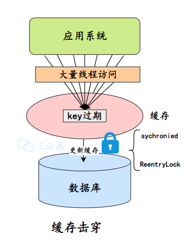

②、将过期时间组合写在 value 中，通过异步的⽅式不断的刷新过期时间，防⽌此类现象。
#### 什么是缓存穿透？
缓存穿透是指查询不存在的数据，由于缓存没有命中（因为数据根本就不存在），请求每次都会穿过缓存去查询数据库。如果这种查询非常频繁，就会给数据库造成很大的压力。
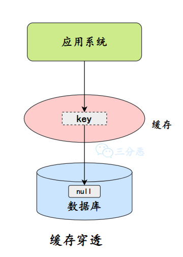

缓存穿透意味着缓存失去了减轻数据压力的意义。缓存穿透可能有两种原因：

1. 自身业务代码问题
2. 恶意攻击，爬虫造成空命中它主要有两种解决办法：
①、**缓存空值/默认值**
客户端请求某个 ID 的数据，首先检查缓存是否命中。如果缓存未命中，查询数据库。如果数据库查询结果为空，将该空结果（如 null 或 {}）缓存起来，并设置一个合理的过期时间。当后续请求再访问相同 ID 时，缓存直接返回空结果，避免每次都打到数据库。
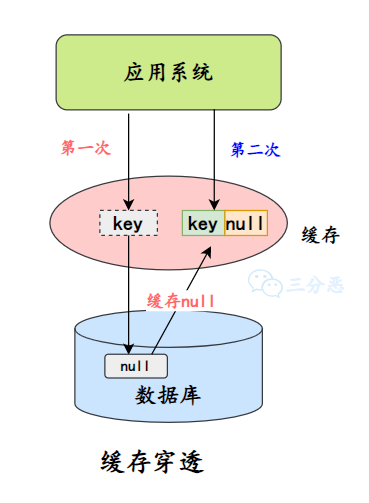

代码示例：

```java
String cacheKey = "product::" + productId;
String result = cache.get(cacheKey);

if (result == null) {
    result = database.queryProductById(productId);

    if (result == null) {
        // 缓存空值，设置较短的过期时间
        cache.set(cacheKey, "null", shortTTL);
    } else {
        // 缓存有效数据
        cache.set(cacheKey, result, longTTL);
    }
}
```
②、**布隆过滤器**
通过布隆过滤器存储所有可能存在的合法数据的键，当请求到达时，先通过布隆过滤器判断该键是否存在：

- 如果布隆过滤器认为该键不存在，直接返回空，不会查询数据库。
- 如果布隆过滤器认为该键可能存在，则查询缓存和数据库。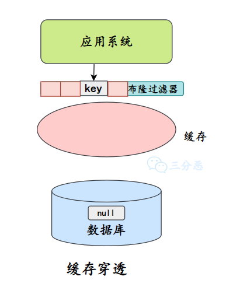

代码示例：

```java
BloomFilter<String> bloomFilter = new BloomFilter<>(expectedInsertions, fpp); // 期望插入量和误判率
bloomFilter.put("valid_key_1");
bloomFilter.put("valid_key_2");

// 判断请求的键是否存在于布隆过滤器中
if (!bloomFilter.mightContain(requestedKey)) {
    // 如果布隆过滤器认为该键不存在，则直接返回空
    return null;
} else {
    // 继续正常的缓存查询和数据库查询流程
}
```
两种解决方案的对比：
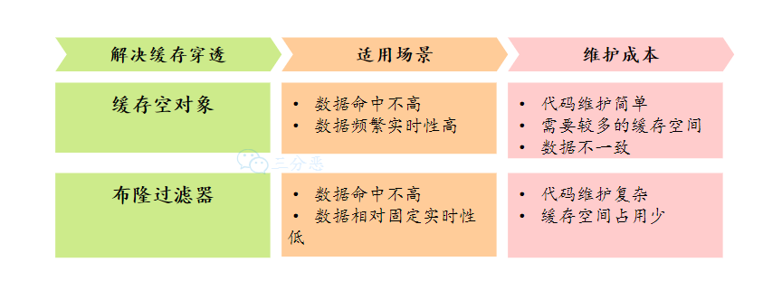

#### 什么是缓存雪崩？
缓存雪崩是指在某一个时间点，由于大量的缓存数据同时过期或缓存服务器突然宕机了，导致所有的请求都落到了数据库上（比如 MySQL），从而对数据库造成巨大压力，甚至导致数据库崩溃的现象。
总之就是，崩了，崩的非常严重，就叫雪崩了（电影电视里应该看到过，非常夸张）。
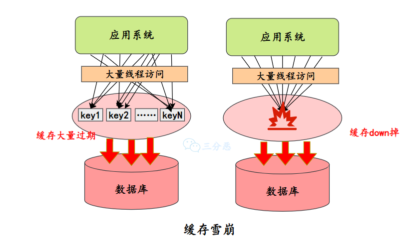

#### 如何解决缓存雪崩呢？
第一种：提高缓存可用性
**01、集群部署**：采用分布式缓存而不是单一缓存服务器，可以降低单点故障的风险。即使某个缓存节点发生故障，其他节点仍然可以提供服务，从而避免对数据库的大量直接访问。
可以利用 Redis Cluster。
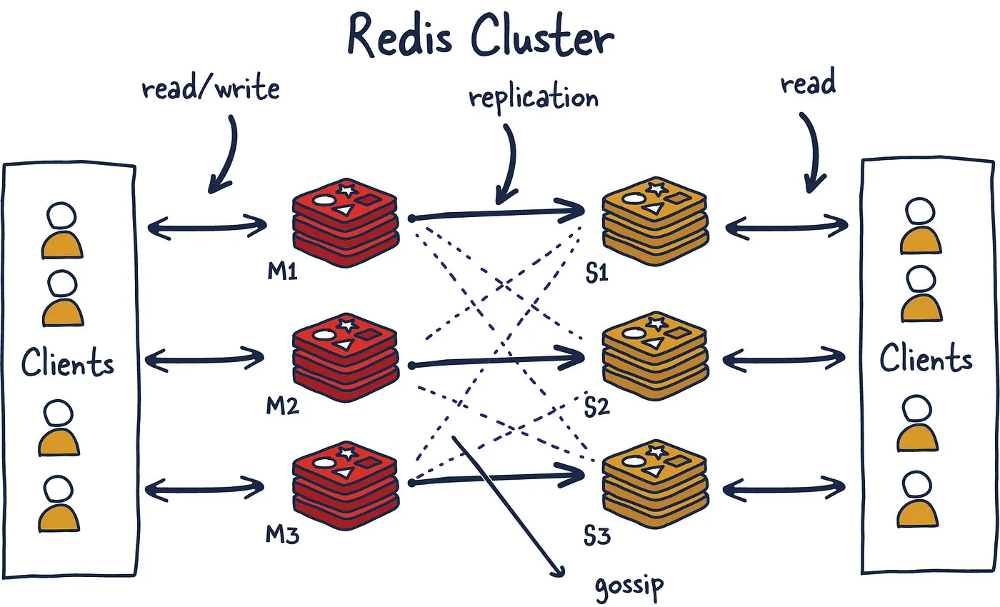

或者第三方集群方案 Codis。
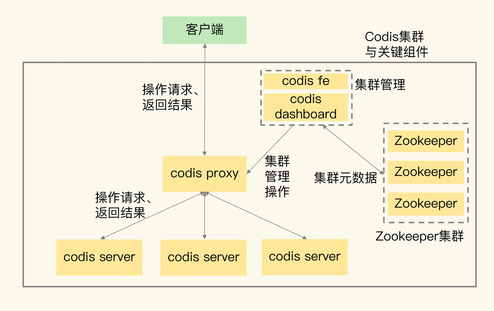

**02、备份缓存**：对于关键数据，除了在主缓存中存储，还可以在备用缓存中保存一份。当主缓存不可用时，可以快速切换到备用缓存，确保系统的稳定性和可用性。
在[技术派实战项目](https://javabetter.cn/zhishixingqiu/paicoding.html)中，我们采用了多级缓存的策略，其中就包括使用本地缓存 Guava Cache 和 Caffeine 来作为二级缓存，在 Redis 出现问题时，系统会自动切换到本地缓存。
这个过程称为“降级”，意味着系统在失去优先级高的资源时仍能继续提供服务。
当从 Redis 获取数据失败时，尝试从本地缓存读取数据。

```java
LoadingCache<String, UserPermissions> permissionsCache = Caffeine.newBuilder()
    .maximumSize(1000)
    .expireAfterWrite(10, TimeUnit.MINUTES)
    .build(this::loadPermissionsFromRedis);

public UserPermissions loadPermissionsFromRedis(String userId) {
    try {
        return redisClient.getPermissions(userId);
    } catch (Exception ex) {
        // Redis 异常处理，尝试从本地缓存获取
        return permissionsCache.getIfPresent(userId);
    }
}
```
第二种：过期时间
对于缓存数据，设置不同的过期时间，避免大量缓存数据同时过期。可以通过在原有过期时间的基础上添加一个随机值来实现，这样可以分散缓存过期时间，减少同一时间对数据库的访问压力。
第三种：限流和降级
通过设置合理的系统限流策略，如令牌桶或漏斗算法，来控制访问流量，防止在缓存失效时数据库被打垮。
此外，系统可以实现降级策略，在缓存雪崩或系统压力过大时，暂时关闭一些非核心服务，确保核心服务的正常运行。
### 30.能说说布隆过滤器吗？
布隆过滤器是一种空间效率极高的概率型数据结构，用于快速检查一个元素是否存在于一个集合中。
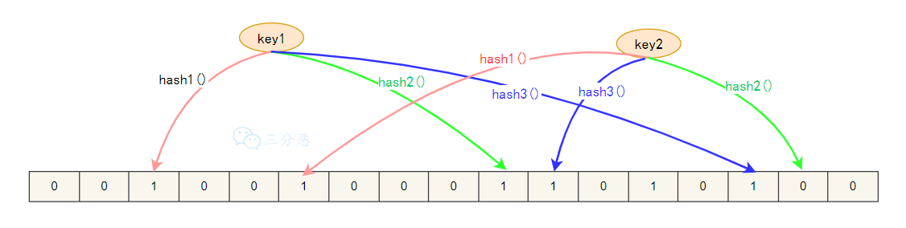

布隆过滤器由一个长度为 m 的位数组和 k 个哈希函数组成。

- 开始时，布隆过滤器的每个位都被设置为 0。
- 当一个元素被添加到过滤器中时，它会被 k 个哈希函数分别计算得到 k 个位置，然后将位数组中对应的位设置为 1。
- 当检查一个元素是否存在于过滤器中时，同样使用 k 个哈希函数计算位置，如果任一位置的位为 0，则该元素肯定不在过滤器中；如果所有位置的位都为 1，则该元素可能在过滤器中。
#### 布隆过滤器存在误判吗？
布隆过滤器的优点是空间效率和查询时间都远远超过一般的算法，缺点是存在误判和删除困难。
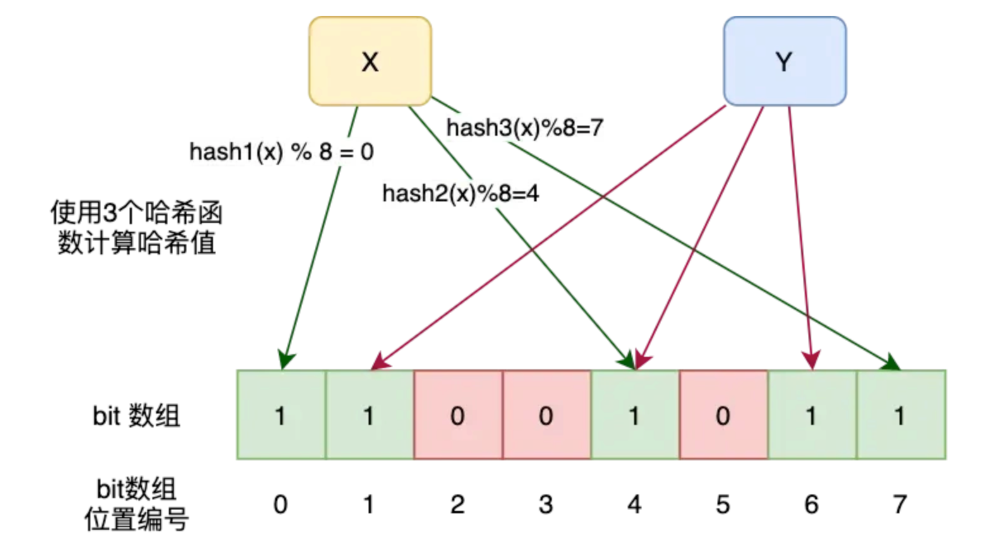

当布隆过滤器保存的元素越多，被置为 1 的 bit 位就会越多。假设元素 x 没有存储过，但其他元素的哈希函数映射到位数组的三个位刚好都为 1 且恰好覆盖了元素 x 映射的位置，那么对于布隆过滤器来讲，元素 x 这个值就是存在的，也就是说布隆过滤器存在一定的误判率。
布隆过滤器的误判率取决于以下几个因素：

1. 位数组的大小（m）：位数组的大小决定了可以存储的标志位数量。如果位数组过小，那么哈希碰撞的几率就会增加，从而导致更高的误判率。
2. 哈希函数的数量（k）：哈希函数的数量决定了每个元素在位数组中标记的位数。哈希函数越多，碰撞的概率也会相应变化。如果哈希函数太少，则过滤器很快会变得不精确；如果太多，误判率也会升高，效率下降。
3. 存入的元素数量（n）：存入的元素越多，哈希碰撞的几率越大，从而导致更高的误判率。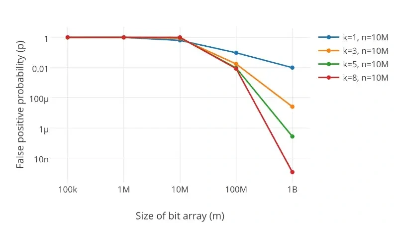

误判率公式如下：
f(k) = \left( 1 - e^{- \frac{kn}{m}} \right)^k


虽然布隆过滤器会产生误判，但在很多场景下一定的误判率是可以接受的，这是因为布隆过滤器的主要优点是其高效的查询速度和低内存占用。相比其他精确的集合数据结构（如哈希表、树等），布隆过滤器可以在空间效率和查询速度上表现更优。
#### 布隆过滤器支持删除吗？
布隆过滤器其实并不支持删除元素，因为多个元素可能哈希到一个布隆过滤器的同一个位置，如果直接删除该位置的元素，则会影响其他元素的判断。
#### 为什么不能用哈希表而是用布隆过滤器？
布隆过滤器是一种基于位数组和多个哈希函数的概率型数据结构，适合在内存资源有限、数据量大且能容忍一定误判的场景下使用。
相比哈希表，布隆过滤器的内存开销非常小，能快速判断一个元素是否存在。虽然它存在误判，但不会漏报，因此在防止缓存穿透、黑名单过滤和推荐系统去重等场景中广泛使用。
哈希表虽然可以精准判断元素存在与否，但需要存储实际数据，内存开销大，不适合大规模数据存储。
#### 布隆过滤器的优点？

1. **内存效率高**：布隆过滤器只需要存储每个元素的哈希值，而不需要存储元素本身，因此内存占用非常小。
2. **查询速度快**：布隆过滤器只需要将元素通过多个哈希函数映射到位数组，并检查位状态即可。它不需要哈希表那样的复杂键值操作，时间复杂度接近常数时间，速度非常快。### 31.如何保证缓存和数据库的数据⼀致性？
在[技术派实战项目](https://javabetter.cn/zhishixingqiu/paicoding.html)中，我们采用的是先写 MySQL，再删除 Redis 的方式来保证缓存和数据库的数据一致性。
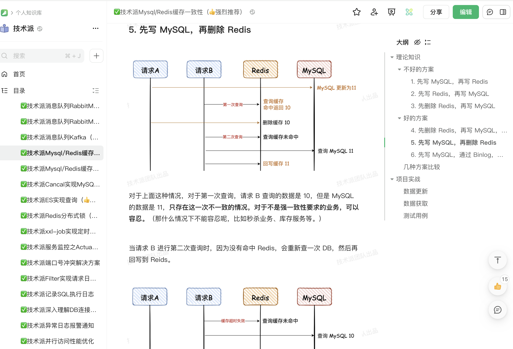

我举例说明一下。
对于第一次查询，请求 B 查询到的缓存数据是 10，但 MySQL 被请求 A 更新为了 11，此时数据库和缓存不一致。
但也只存在这一次不一致的情况，对于不是强一致性的业务，可以容忍。
当请求 B 第二次查询时，因为请求 A 更新完数据库把缓存删除了，所以请求 B 这次不会命中缓存，会重新查一次 MySQL，然后回写到 Redis。
缓存和数据库又一致了。
#### 那再来说说为什么要删除缓存而不是更新缓存
因为相对而言，删除缓存的速度比更新缓存的速度要快得多。举个例子：假设商品 product_123 的当前库存是 10，现在有一次购买操作，库存减 1，我们需要更新 Redis 中的库存信息。

```java
product_id = "product_123"
# 假设这是购买操作后的新库存值
new_stock = 9

# 更新Redis中的库存信息
redis.set(product_id, new_stock)
```
更新操作至少涉及到两个步骤：计算新的库存值和更新 Redis 中的库存值。
假如是直接删除操作，直接就一步到位了：

```java
product_id = "product_123"

# 删除Redis中的库存缓存
redis.del(product_id)
```
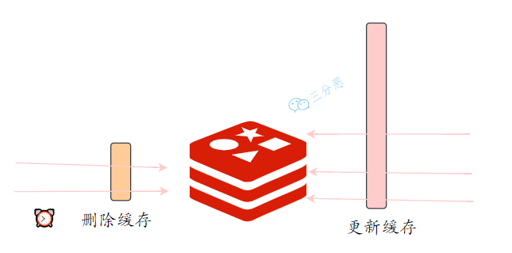

假如是更新缓存，那么可能请求 A 更新完 MySQL 后在更新 Redis 中，请求 B 已经读取到 Redis 中的旧值返回了，又一次导致了缓存和数据库不一致。
#### 那再说说为什么要先更新数据库，再删除缓存
因为更新数据库的速度比删除缓存的速度要慢得多。因为更新 MySQL 是磁盘 IO 操作，而 Redis 是内存操作。内存操作比磁盘 IO 快得多（这是硬件层面的天然差距）。
那假如是先删除缓存，再更新数据库，就会造成这样的情况：
缓存中不存在，数据库又没有完成更新，此时有请求进来读取数据，并写入到缓存，那么在更新完缓存后，缓存中这个 key 就成了一个脏数据。
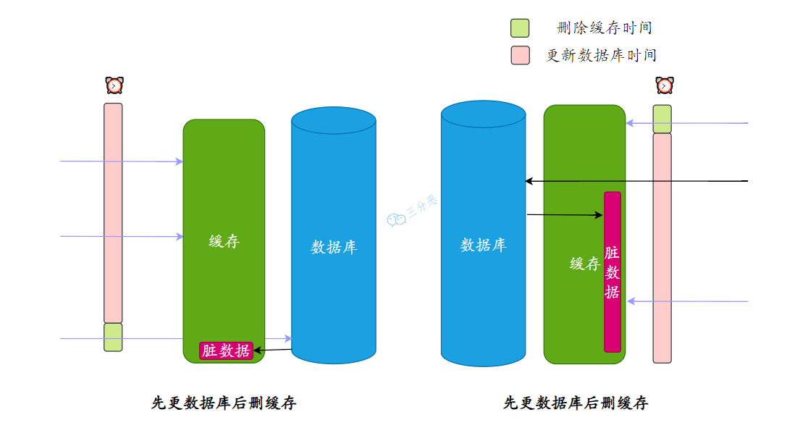

目前最流行的缓存读写策略 Cache Aside Pattern（[旁路缓存模式](https://coolshell.cn/articles/17416.html)）就是采用的先写数据库，再删缓存的方式。

- 失效：应用程序先从缓存读取数据，如果数据不存在，再从数据库中读取数据，成功后，放入缓存。
- 命中：应用程序从缓存读取数据，如果数据存在，直接返回。
- 更新：先把数据写入数据库，成功后，再让缓存失效。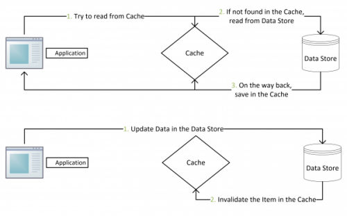

#### 那假如对一致性要求很高，该怎么办呢？
缓存和数据库数据不一致的原因，常见的有两种：

- 缓存删除失败
- 并发导致写入了脏数据那通常有四种方案可以解决。
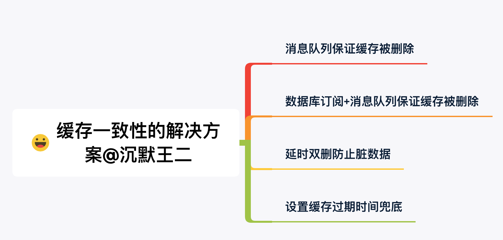

**①、引入消息队列保证缓存被删除**
使用消息队列（如 Kafka、RabbitMQ）保证数据库更新和缓存更新之间的最终一致性。当数据库更新完成后，将更新事件发送到消息队列。有专门的服务监听这些事件并负责更新或删除缓存。
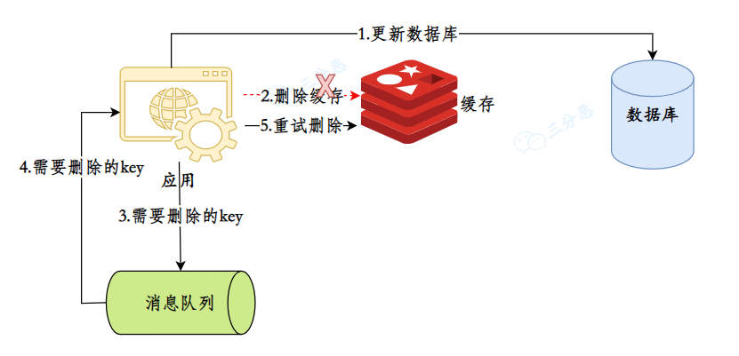

这种方案很不错，缺点是对业务代码有一定的侵入，毕竟引入了消息队列嘛。
**②、数据库订阅+消息队列保证缓存被删除**
可以专门起一个服务（比如 [Canal](https://github.com/alibaba/canal)，阿里巴巴 MySQL binlog 增量订阅&消费组件）去监听 MySQL 的 binlog，获取需要操作的数据。
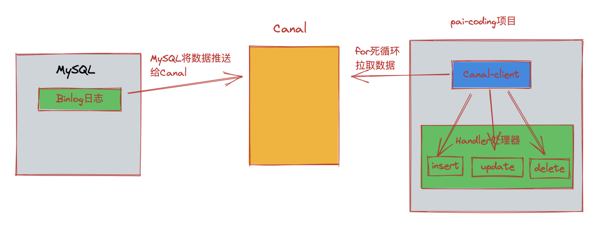

然后用一个公共的服务获取订阅程序传来的信息，进行缓存删除。
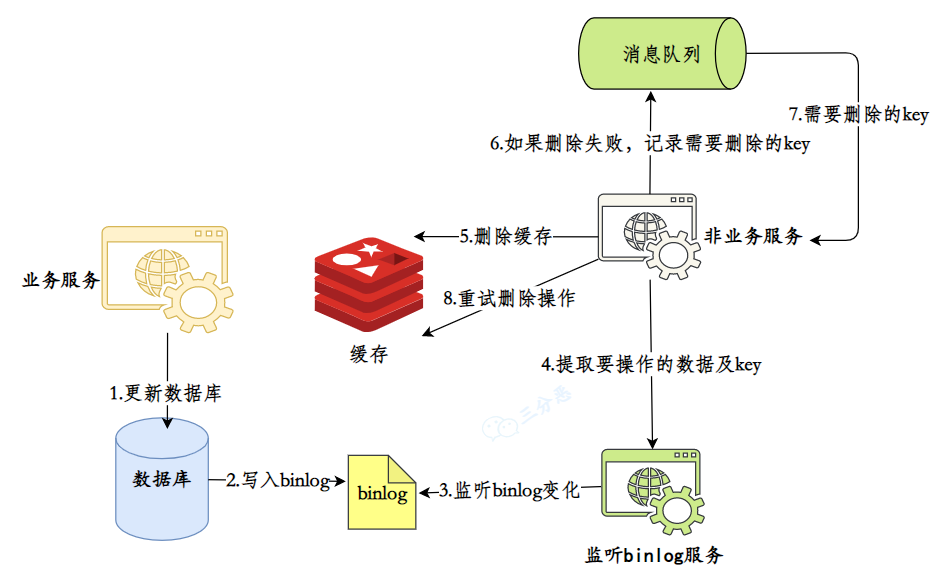

这种方式虽然降低了对业务的侵入，但增加了整个系统的复杂度，适合基建完善的大厂。
**③、延时双删防止脏数据**
简单说，就是在第一次删除缓存之后，过一段时间之后，再次删除缓存。
主要针对缓存不存在，但写入了脏数据的情况。在先删缓存，再写数据库的更新策略下发生的比较多。
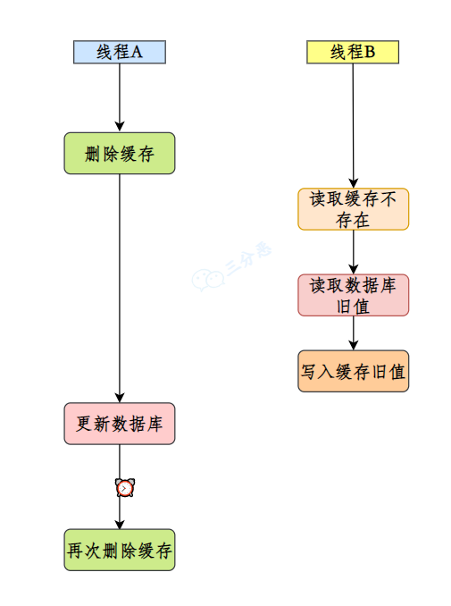

这种方式的延时时间需要仔细考量和测试。
**④：设置缓存过期时间兜底**
这是一个朴素但有用的兜底策略，给缓存设置一个合理的过期时间，即使发生了缓存和数据库的数据不一致问题，也不会永远不一致下去，缓存过期后，自然就一致了。
### 32.如何保证本地缓存和分布式缓存的一致？
在[技术派实战项目](https://javabetter.cn/zhishixingqiu/paicoding.html)中，为了减轻 Redis 的负载，我又追加了一层本地缓存 Caffeine。
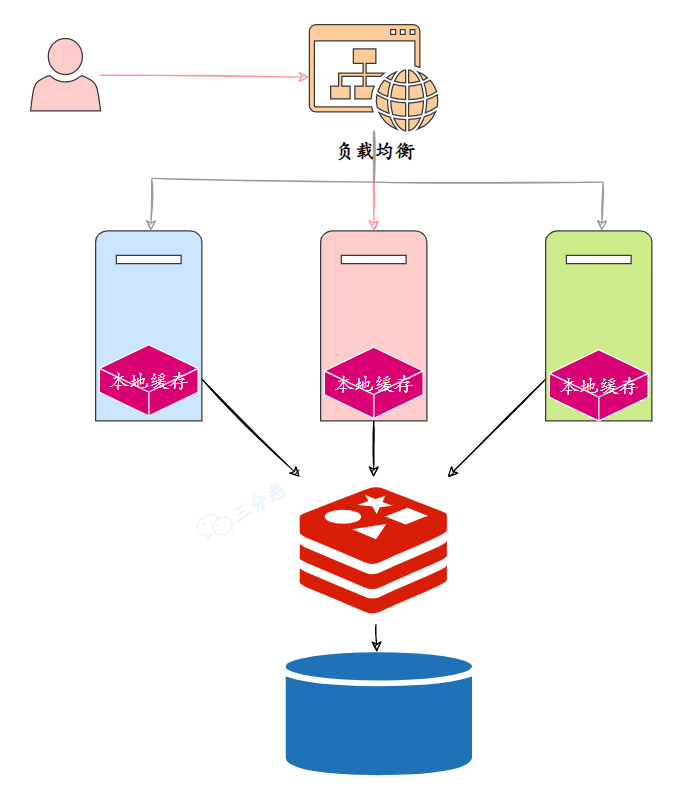

为了保证本地缓存和 Redis 缓存的一致性，通常采用的策略有：
①、设置本地缓存的过期时间，这是最简单也是最直接的方法，当本地缓存过期时，就从 Redis 缓存中去同步。
②、使用 Redis 的 Pub/Sub 机制，当 Redis 缓存发生变化时，发布一个消息，本地缓存订阅这个消息，然后删除对应的本地缓存。
③、Redis 缓存发生变化时，引入消息队列，比如 RocketMQ、RabbitMQ 去更新本地缓存。
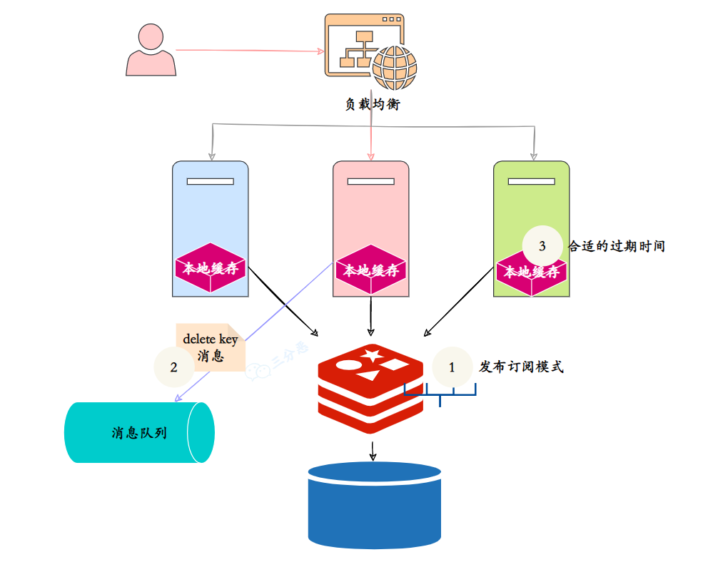

由于技术派本身对缓存的一致性要求不是特别高，所以我就采用第一种方式。
另外，在技术派实战项目中，我对缓存的使用场景做了细化。比如说，使用 CacheBuilder 来完成 Guava Cache 的构建，像一些简单的缓存场景，比如说获取菜单分类、获取登录验证码、获取用户转存图片等，都使用了 Guava Cache。
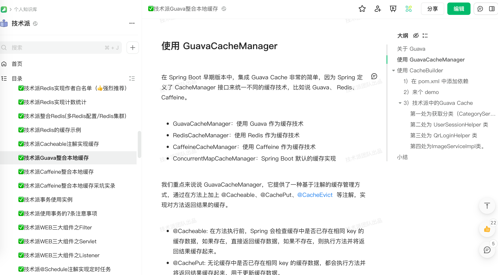

像首页侧边栏、专栏侧边栏、文章详情侧边栏等缓存场景，就使用了 Caffeine 作为本地缓存，通过 @Cacheable、@CacheEvit、@CachePut 等注解实现，非常轻巧。
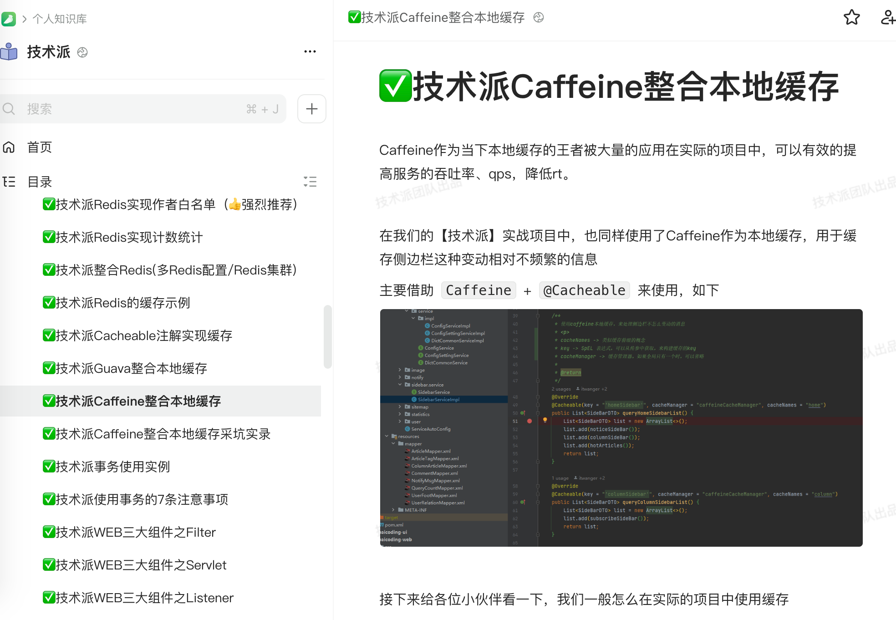

而像用户 Session 和网站地图 SiteMap 等缓存场景，就使用了 Redis 来作为缓存。
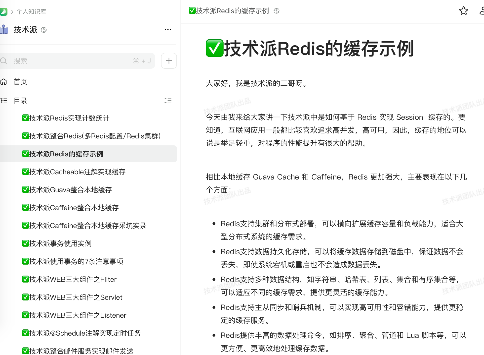

#### 如果在项目中多个地方都要使用到二级缓存的逻辑，如何设计这一块？
在设计时，应该清楚地区分何时使用一级缓存和何时使用二级缓存。通常情况下，对于频繁访问但不经常更改的数据，可以放在本地缓存中以提供最快的访问速度。而对于需要共享或者一致性要求较高的数据，应当放在一级缓存中。
#### 本地缓存和 Redis 缓存的区别和效率对比？
Redis 可以部署在多个节点上，支持数据分片，适用于跨服务器的缓存共享。而本地缓存只能在单个服务器上使用。
Redis 还可以持久化数据，支持数据备份和恢复，适用于对数据安全性要求较高的场景。并且支持发布/订阅、事务、Lua 脚本等高级功能。
效率上，Redis 和本地缓存都是存储在内存中，读写速度都非常快。
> 
1. [Java 面试指南（付费）](https://javabetter.cn/zhishixingqiu/mianshi.html)收录的字节跳动同学 7 Java 后端实习一面的原题：怎么保证二级缓存和 Redis 缓存的数据一致性？
2. [Java 面试指南（付费）](https://javabetter.cn/zhishixingqiu/mianshi.html)收录的华为面经同学 11 面试原题：使用的 guava cache 和 redis 是如何组合使用的？如果在项目中多个地方都要使用到二级缓存的逻辑，如何设计这一块？
3. [Java 面试指南（付费）](https://javabetter.cn/zhishixingqiu/mianshi.html)收录的去哪儿同学 1 技术二面的原题：redis 和本地缓存的区别，哪个效率高
4. [Java 面试指南（付费）](https://javabetter.cn/zhishixingqiu/mianshi.html)收录的拼多多面经同学 8 一面面试原题：缓存一致性如何保证
### 33.怎么处理热 key？
推荐阅读：
所谓的热 key，就是指在很短时间内被频繁访问的键。
比如，热门新闻或热门商品，这类 key 通常会有大流量的访问，对存储这类信息的 Redis 来说，是不小的压力。
> 某天某流量明星突然爆出一个大瓜，微博突然就崩了，这就是热 key 的压力。

再比如说 Redis 是集群部署，热 key 可能会造成整体流量的不均衡（网络带宽、CPU 和内存资源），个别节点出现 OPS 过大的情况，极端情况下热点 key 甚至会超过 Redis 本身能够承受的 OPS。
> OPS（Operations Per Second）是 Redis 的一个重要指标，表示 Redis 每秒钟能够处理的命令数。

通常以 Key 被请求的频率来判定，比如：

- **QPS 集中在特定的 Key**：总的 QPS（每秒查询率）为 10000，其中一个 Key 的 QPS 飙到了 8000。
- **带宽使用率集中在特定的 Key**：一个拥有上千成员且总大小为 1M 的哈希 Key，每秒发送大量的 HGETALL 请求。
- **CPU 使用率集中在特定的 Key**：一个拥有数万个成员的 ZSET Key，每秒发送大量的 ZRANGE 请求。> 
- HGETALL 命令用于返回哈希表中，所有的字段和值。
- ZRANGE 命令用于返回有序集中，指定区间内的成员。
#### 怎么处理热 key？
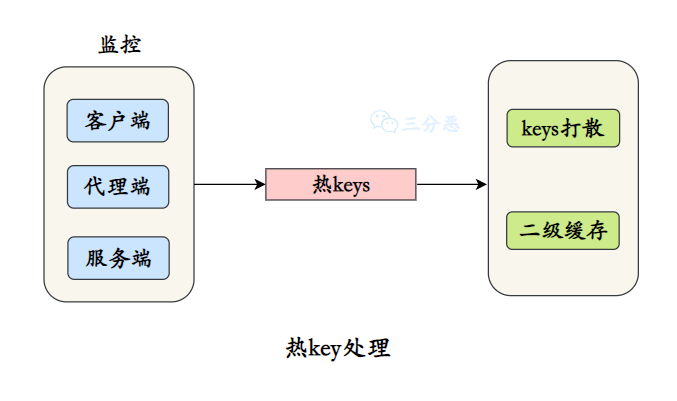

对热 key 的处理，最关键的是对热 key 的监控:
①、客户端
客户端其实是距离 key“最近”的地方，因为 Redis 命令就是从客户端发出的，例如在客户端设置全局字典（key 和调用次数），每次调用 Redis 命令时，使用这个字典进行记录。
②、代理端
像 Twemproxy、Codis 这些基于代理的 Redis 分布式架构，所有客户端的请求都是通过代理端完成的，可以在代理端进行监控。
③、Redis 服务端
使用 monitor 命令统计热点 key 是很多开发和运维人员首先想到的方案，monitor 命令可以监控到 Redis 执行的所有命令。
> monitor 命令的使用：`redis-cli monitor`

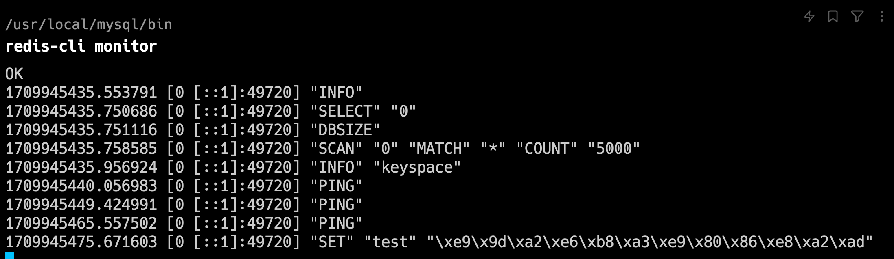

还可以通过 bigkeys 参数来分析热 Key。
> bigkeys 命令的使用：`redis-cli --bigkeys`

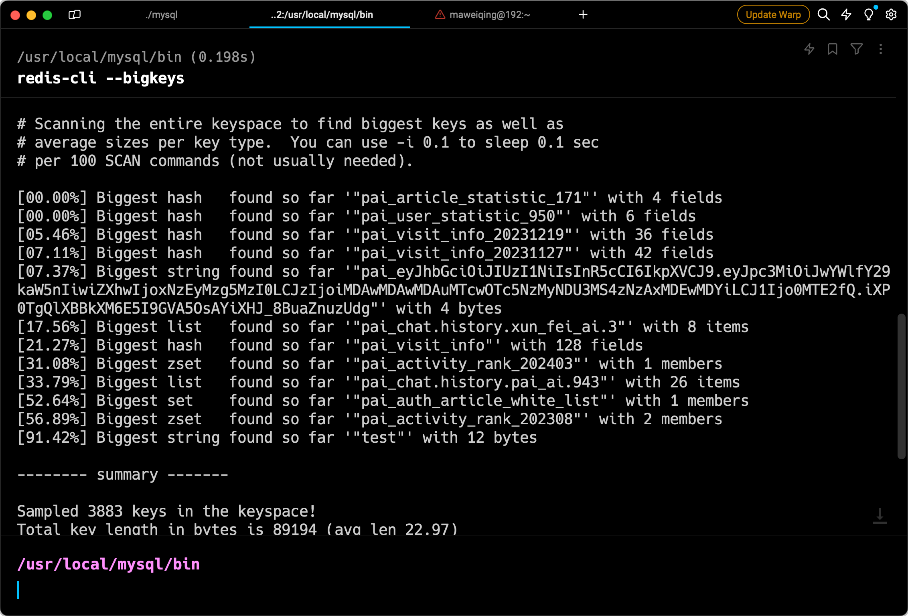

只要监控到了热 key，对热 key 的处理就简单了：
①、把热 key 打散到不同的服务器，降低压⼒。
基本思路就是给热 Key 加上前缀或者后缀，见下例：

```java
// N 为 Redis 实例个数，M 为 N 的 2倍
const M = N * 2
//生成随机数
random = GenRandom(0, M)
//构造备份新 Key
bakHotKey = hotKey + "_" + random
data = redis.GET(bakHotKey)
if data == NULL {
    data = redis.GET(hotKey)
    if data == NULL {
        data = GetFromDB()
        // 可以利用原子锁来写入数据保证数据一致性
        redis.SET(hotKey, data, expireTime)
        redis.SET(bakHotKey, data, expireTime + GenRandom(0, 5))
    } else {
        redis.SET(bakHotKey, data, expireTime + GenRandom(0, 5))
    }
}
```
②、加⼊⼆级缓存，当出现热 Key 后，把热 Key 加载到 JVM 中，后续针对这些热 Key 的请求，直接从 JVM 中读取。
这些本地的缓存工具有很多，比如 Caffeine、Guava 等，或者直接使用 HashMap 作为本地缓存都是可以的。
注意，如果对热 Key 进行本地缓存，需要防止本地缓存过大。
> 
1. [Java 面试指南（付费）](https://javabetter.cn/zhishixingqiu/mianshi.html)收录的华为 OD 的面试中出现过该题：讲一讲 Redis 的热 Key 和大 Key
### 34.缓存预热怎么做呢？
缓存预热是指在系统启动时，提前将一些预定义的数据加载到缓存中，以避免在系统运行初期由于缓存未命中（cache miss）导致的性能问题。
通过缓存预热，可以确保系统在上线后能够立即提供高效的服务，减少首次访问时的延迟。
缓存预热的方法有多种，在[技术派实战项目](https://javabetter.cn/zhishixingqiu/paicoding.html)中，我们采用了项目启动时自动加载和定时预热两种方式，比如说每天定时更新站点地图到 Redis 缓存中。

```java
/**
 * 采用定时器方案，每天5:15分刷新站点地图，确保数据的一致性
 */
@Scheduled(cron = "0 15 5 * * ?")
public void autoRefreshCache() {
    log.info("开始刷新sitemap.xml的url地址，避免出现数据不一致问题!");
    refreshSitemap();
    log.info("刷新完成！");
}

@Override
public void refreshSitemap() {
    initSiteMap();
}

private synchronized void initSiteMap() {
    long lastId = 0L;
    RedisClient.del(SITE_MAP_CACHE_KEY);
    while (true) {
        List<SimpleArticleDTO> list = articleDao.getBaseMapper().listArticlesOrderById(lastId, SCAN_SIZE);

        // 刷新站点地图信息
        Map<String, Long> map = list.stream().collect(Collectors.toMap(s -> String.valueOf(s.getId()), s -> s.getCreateTime().getTime(), (a, b) -> a));
        RedisClient.hMSet(SITE_MAP_CACHE_KEY, map);
        if (list.size() < SCAN_SIZE) {
            break;
        }
        lastId = list.get(list.size() - 1).getId();
    }
}
```
> 
1. [Java 面试指南（付费）](https://javabetter.cn/zhishixingqiu/mianshi.html)收录的字节跳动面经同学 1 技术二面面试原题：什么是缓存预热？如何解决？
### 35.热点 key 重建？问题？解决？
开发的时候一般使用“缓存+过期时间”的策略，既可以加速数据读写，又保证数据的定期更新，这种模式基本能够满足绝大部分需求。
但是有两个问题如果同时出现，可能就会出现比较大的问题：

- 当前 key 是一个热点 key（例如一个热门的娱乐新闻），并发量非常大。
- 重建缓存不能在短时间完成，可能是一个复杂计算，例如复杂的 SQL、多次 IO、多个依赖等。 在缓存失效的瞬间，有大量线程来重建缓存，造成后端负载加大，甚至可能会让应用崩溃。#### 怎么处理热key呢？
要解决这个问题也不是很复杂，解决问题的要点在于：

- 减少重建缓存的次数。
- 数据尽可能一致。
- 较少的潜在危险。所以一般采用如下方式：

1. 互斥锁（mutex key）这种方法只允许一个线程重建缓存，其他线程等待重建缓存的线程执行完，重新从缓存获取数据即可。
2. 永远不过期“永远不过期”包含两层意思：
- 从缓存层面来看，确实没有设置过期时间，所以不会出现热点 key 过期后产生的问题，也就是“物理”不过期。
- 从功能层面来看，为每个 value 设置一个逻辑过期时间，当发现超过逻辑过期时间后，会使用单独的线程去构建缓存。### 36.无底洞问题吗？如何解决？
2010 年，Facebook 的 Memcache 节点已经达到了 3000 个，承载着 TB 级别的缓存数据。但开发和运维人员发现了一个问题，为了满足业务要求添加了大量新 Memcache 节点，但是发现性能不但没有好转反而下降了，当时将这 种现象称为缓存的“**无底洞**”现象。
那么为什么会产生这种现象呢?
通常来说添加节点使得 Memcache 集群 性能应该更强了，但事实并非如此。键值数据库由于通常采用哈希函数将 key 映射到各个节点上，造成 key 的分布与业务无关，但是由于数据量和访问量的持续增长，造成需要添加大量节点做水平扩容，导致键值分布到更多的 节点上，所以无论是 Memcache 还是 Redis 的分布式，批量操作通常需要从不同节点上获取，相比于单机批量操作只涉及一次网络操作，分布式批量操作会涉及多次网络时间。
#### 无底洞问题如何优化呢？
先分析一下无底洞问题：

- 客户端一次批量操作会涉及多次网络操作，也就意味着批量操作会随着节点的增多，耗时会不断增大。
- 网络连接数变多，对节点的性能也有一定影响。常见的优化思路如下：

- 命令本身的优化，例如优化操作语句等。
- 减少网络通信次数。
- 降低接入成本，例如客户端使用长连/连接池、NIO 等。GitHub 上标星 10000+ 的开源知识库《[二哥的 Java 进阶之路](https://github.com/itwanger/toBeBetterJavaer)》第一版 PDF 终于来了！包括 Java 基础语法、数组&字符串、OOP、集合框架、Java IO、异常处理、Java 新特性、网络编程、NIO、并发编程、JVM 等等，共计 32 万余字，500+张手绘图，可以说是通俗易懂、风趣幽默……详情戳：[太赞了，GitHub 上标星 10000+ 的 Java 教程](https://javabetter.cn/overview/)
微信搜 **沉默王二** 或扫描下方二维码关注二哥的原创公众号沉默王二，回复 **222** 即可免费领取。


