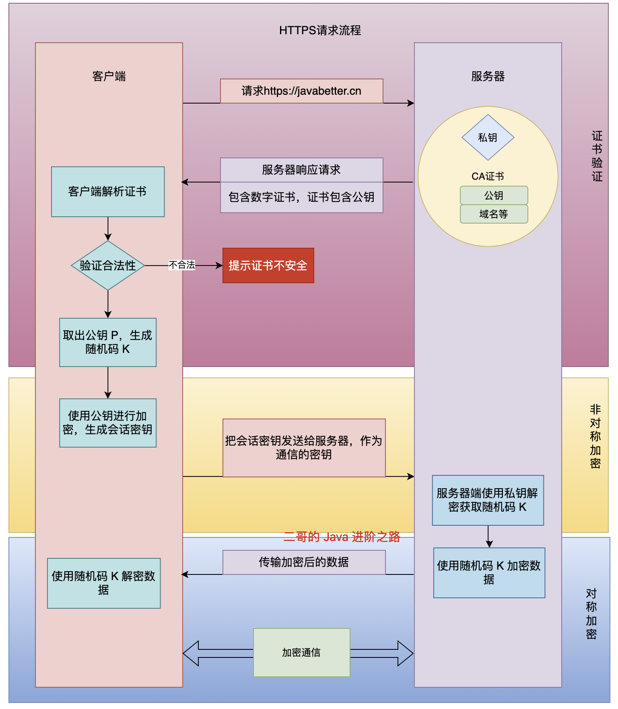
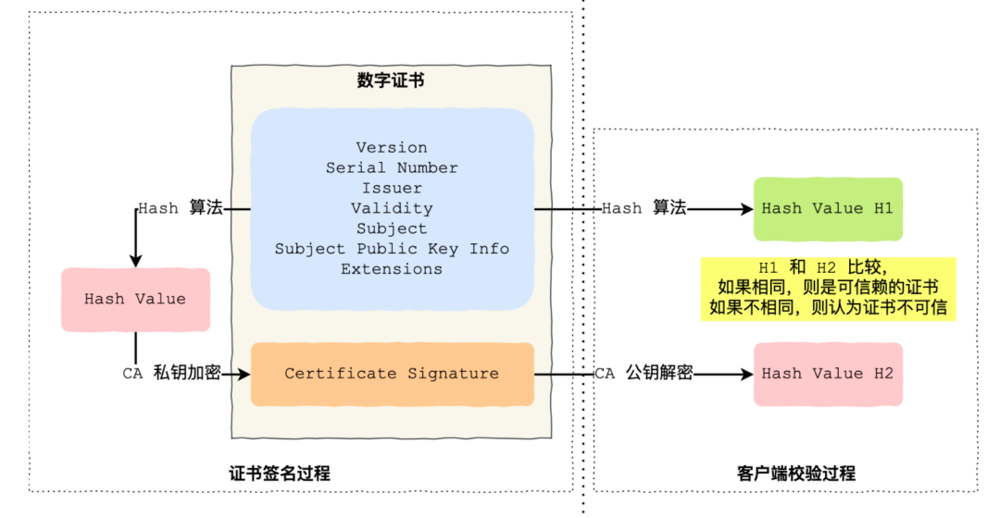

# 3-HTTPS 与加密

> 📌 **本章内容**: HTTPS 加密原理、SSL/TLS 握手流程、数字证书验证、中间人攻击防御等核心知识。面试高频必考。

---

## 📑 目录

1. [HTTP vs HTTPS](#http-vs-https)
2. [为什么需要 HTTPS](#为什么需要-https)
3. [加密机制](#加密机制)
4. [HTTPS 握手流程](#https-握手流程)
5. [数字证书验证](#数字证书验证)
6. [中间人攻击](#中间人攻击)
7. [常见问题](#常见问题)

---

## HTTP vs HTTPS

### 🔥 一句话速答（⭐⭐⭐）
HTTPS = HTTP + SSL/TLS，端口 443，数据加密传输，防止窃听、篡改和身份伪造

### 📊 详细对比

| 对比维度 | HTTP | HTTPS |
|---------|------|-------|
| **全称** | HyperText Transfer Protocol | HTTP Secure |
| **协议层** | 应用层 | 应用层 + 传输层（SSL/TLS） |
| **端口** | 80 | 443 |
| **URL** | `http://` | `https://` |
| **数据传输** | 明文传输 | 加密传输 |
| **安全性** | 不安全 | 安全（加密、认证、完整性） |
| **证书** | 不需要 | 需要 CA 签发的数字证书 |
| **速度** | 快 | 稍慢（加密解密开销） |
| **SEO** | 无优势 | 搜索引擎更青睐 HTTPS |

### 🎯 HTTPS 解决的三大问题

1. **数据窃听**: 通过加密保护数据隐私
2. **数据篡改**: 通过完整性校验防止数据被修改
3. **身份伪造**: 通过数字证书验证服务器身份

---

## 为什么需要 HTTPS

### 🔥 一句话速答（⭐⭐⭐）
HTTP 明文传输不安全，HTTPS 通过 SSL/TLS 加密解决窃听、篡改、身份伪造问题

### ⚠️ HTTP 的安全风险

#### 1. 数据窃听
**场景**: 在公共 Wi-Fi 下登录网站

```
用户 ----------> [明文数据] ----------> 服务器
         ↑
    黑客抓包（看到用户名密码）
```

#### 2. 数据篡改
**场景**: 访问银行网站，黑客修改转账金额

```
用户 ------> [转账 100 元] ------> 服务器
                  ↓
            黑客篡改为 10000 元
```

#### 3. 身份伪造
**场景**: 黑客伪装成银行网站，钓鱼攻击

```
用户 ------> [以为访问真银行] ------> 假网站（黑客）
```

### ✅ HTTPS 的解决方案

```
用户 <===[加密通道]===> 服务器
      1. 数据加密（窃听者看不懂）
      2. 完整性校验（篡改能检测）
      3. 证书认证（验证服务器身份）
```

---

## 加密机制

### 🔥 一句话速答（⭐⭐⭐）
非对称加密交换对称密钥，对称加密传输数据

### 📊 对称加密 vs 非对称加密

| 对比维度 | 对称加密 | 非对称加密 |
|---------|---------|-----------|
| **密钥** | 相同密钥加解密 | 公钥加密，私钥解密 |
| **速度** | 快（适合大量数据） | 慢（计算复杂） |
| **安全性** | 密钥泄露则全部泄露 | 私钥安全即安全 |
| **密钥分发** | 困难（需安全通道） | 容易（公钥可公开） |
| **典型算法** | AES、DES、3DES | RSA、ECC、DH |
| **应用场景** | 数据传输 | 密钥交换、数字签名 |

### 🔐 对称加密

**原理**: 加密和解密使用同一个密钥

```
明文 --[密钥K加密]--> 密文 --[密钥K解密]--> 明文
```

**常见算法**:
- **AES**（Advanced Encryption Standard）: 最常用，安全高效
- **DES**（Data Encryption Standard）: 已过时，不安全
- **3DES**: DES 的改进版

**优点**: 速度快，适合大量数据
**缺点**: 密钥如何安全传递？（密钥分发问题）

### 🔓 非对称加密

**原理**: 公钥加密，私钥解密（或私钥签名，公钥验证）

```
明文 --[公钥加密]--> 密文 --[私钥解密]--> 明文
```

**密钥对**:
- **公钥**（Public Key）: 可以公开，任何人都能用它加密
- **私钥**（Private Key）: 必须保密，只有持有者能解密

**常见算法**:
- **RSA**: 最经典，基于大数分解难题
- **ECC**（椭圆曲线加密）: 更高效，相同安全性密钥更短

**优点**: 无需安全通道传递密钥
**缺点**: 速度慢，不适合大量数据

### 🤝 HTTPS 的混合加密

**为什么不全用非对称加密？**
- 非对称加密太慢，加密 1GB 文件需要几分钟

**HTTPS 的聪明做法**:
1. **非对称加密**: 交换对称密钥（会话密钥）
2. **对称加密**: 使用会话密钥加密实际数据

```
[握手阶段 - 非对称加密]
客户端 --[服务器公钥加密会话密钥]--> 服务器
       <--[私钥解密得到会话密钥]--

[数据传输阶段 - 对称加密]
客户端 <===[会话密钥加密数据]==> 服务器
```

**比喻**: 
- 非对称加密像保险箱（慢但安全），用来传递钥匙
- 对称加密像普通锁（快但需要钥匙），用来保护实际数据

---

## HTTPS 握手流程

### 🔥 一句话速答（⭐⭐⭐）
客户端验证证书 → 非对称加密交换会话密钥 → 对称加密传输数据

### 📊 完整握手流程（TLS 1.2）



### 📝 详细步骤

#### ① ClientHello（客户端问候）

客户端发送：
- **支持的 TLS 版本**: TLS 1.2、TLS 1.3
- **支持的加密套件**: RSA、ECDHE 等
- **客户端随机数**: 用于生成会话密钥

```
ClientHello {
  version: TLS 1.2
  random: [28字节随机数]
  cipher_suites: [
    TLS_ECDHE_RSA_WITH_AES_128_GCM_SHA256,
    TLS_RSA_WITH_AES_256_CBC_SHA
  ]
}
```

#### ② ServerHello（服务器回应）

服务器返回：
- **选择的 TLS 版本**: TLS 1.2
- **选择的加密套件**: TLS_ECDHE_RSA_WITH_AES_128_GCM_SHA256
- **服务器随机数**: 用于生成会话密钥
- **数字证书**: 包含服务器公钥

```
ServerHello {
  version: TLS 1.2
  random: [28字节随机数]
  cipher_suite: TLS_ECDHE_RSA_WITH_AES_128_GCM_SHA256
  certificate: [服务器证书]
}
```

#### ③ 客户端验证证书

客户端检查：
- ✅ 证书是否由受信任的 CA 签发
- ✅ 证书是否在有效期内
- ✅ 证书中的域名是否匹配
- ✅ 证书是否被吊销（通过 CRL/OCSP）

**验证失败**: 浏览器会警告"证书不可信"

#### ④ ClientKeyExchange（交换密钥）

客户端生成：
- **pre-master-secret**（预主密钥）: 48 字节随机数

然后：
- 用**服务器公钥**（从证书中提取）加密 pre-master-secret
- 发送给服务器

```
ClientKeyExchange {
  encrypted_pre_master_secret: [用服务器公钥加密]
}
```

服务器用**私钥**解密，得到 pre-master-secret

#### ⑤ 生成会话密钥

客户端和服务器都使用相同的算法，基于：
- 客户端随机数
- 服务器随机数
- pre-master-secret

生成：
- **会话密钥**（Session Key）: 对称加密密钥

```
Session Key = PRF(
  pre-master-secret,
  "master secret",
  client_random + server_random
)
```

#### ⑥ ChangeCipherSpec（切换加密）

双方发送 `ChangeCipherSpec` 消息：
- 通知对方：后续通信使用会话密钥加密

然后发送 `Finished` 消息（已加密）：
- 证明握手成功

#### ⑦ 加密通信

使用会话密钥进行对称加密通信

---

### 🎯 高频追问

**Q1: 为什么需要客户端随机数和服务器随机数？**
- 增加会话密钥的随机性
- 防止重放攻击（每次握手生成不同的会话密钥）

**Q2: 会话密钥会一直使用吗？**
- 不会，连接关闭后销毁
- 下次建立连接会生成新的会话密钥

**Q3: TLS 1.3 有什么改进？**
- **减少握手次数**: 1-RTT（往返时间）
- **0-RTT**: 恢复连接时无需握手
- **移除不安全的加密套件**: 只保留 AEAD（如 AES-GCM）

---

## 数字证书验证

### 🔥 一句话速答（⭐⭐⭐）
CA 用私钥对证书签名，客户端用 CA 公钥验证签名，确认服务器身份

### 📜 数字证书内容

```
数字证书 {
  版本号: v3
  序列号: 1234567890
  签名算法: SHA256-RSA
  颁发者: Let's Encrypt Authority X3
  有效期: 2024-01-01 至 2025-01-01
  使用者: *.javabetter.cn
  公钥: [服务器公钥]
  扩展字段: ...
  -------
  签名: [CA 私钥签名的 Hash 值]
}
```

### 🔐 CA 签发证书流程

```
服务器                  CA（证书颁发机构）
  |                           |
  |--- ① 提交 CSR ----------->|
  |    (包含域名、公钥)        |
  |                           |
  |<-- ② 验证域名所有权 ------|
  |    (通过 DNS/HTTP 验证)   |
  |                           |
  |<-- ③ 签发证书 ------------|
  |    (CA 私钥签名)          |
```

**CA 签名过程**:
1. CA 对证书内容进行 Hash 计算 → Hash1
2. CA 用自己的私钥对 Hash1 加密 → 签名
3. 将签名附加到证书上

```
证书内容 --[SHA256]--> Hash1 --[CA私钥加密]--> 签名
```

### ✅ 客户端验证证书流程



**验证步骤**:
1. **提取证书内容**: 域名、有效期、公钥等
2. **计算 Hash2**: 对证书内容进行 Hash（SHA256）
3. **解密签名**: 用 CA 公钥解密签名，得到 Hash1
4. **比较**: 如果 Hash1 == Hash2，证书可信

**为什么可信？**
- 只有 CA 的私钥才能生成正确的签名
- 如果证书被篡改，Hash 值会改变，验证失败

### 🔗 证书链

实际上，证书验证是一个**链式验证**过程：

```
根证书（Root CA）
  ↓ 签发
中间证书（Intermediate CA）
  ↓ 签发
服务器证书（End-entity Certificate）
```

**验证过程**:
1. 客户端收到服务器证书
2. 用中间 CA 的公钥验证服务器证书
3. 用根 CA 的公钥验证中间 CA 证书
4. 根 CA 是预装在操作系统/浏览器中的（受信任）

### 🎯 高频追问

**Q1: 如果中间人伪造证书怎么办？**
- 中间人没有 CA 的私钥，无法生成正确的签名
- 客户端验证签名时会失败
- 浏览器会警告"证书不可信"

**Q2: 自签名证书安全吗？**
- 自签名证书（Self-Signed Certificate）不被浏览器信任
- 因为不是由受信任的 CA 签发
- 适用于内网测试，不适合公网

**Q3: 证书吊销怎么检查？**
- **CRL**（Certificate Revocation List）: 证书吊销列表，定期下载
- **OCSP**（Online Certificate Status Protocol）: 在线实时查询证书状态

---

## 中间人攻击

### 🔥 一句话速答（⭐⭐）
攻击者截获通信并伪装成通信双方，HTTPS 通过证书验证防御

### 🎭 什么是中间人攻击（MITM）

**攻击场景**: 公共 Wi-Fi 下访问网站

```
用户 <-------> 中间人（黑客） <-------> 服务器
  ↑              ↑                  ↑
假装是服务器   截获数据          假装是用户
```

**攻击步骤**:
1. 用户发送请求
2. 中间人截获请求，转发给服务器
3. 服务器返回响应
4. 中间人截获响应，可以查看/修改，再转发给用户

**结果**: 用户以为在和服务器通信，实际在和黑客通信

### 🛡️ HTTPS 如何防御

#### 1. 证书验证

```
用户 <---[中间人伪造的证书]--- 中间人
  ↓
验证失败！（证书不是 CA 签发）
浏览器警告：证书不可信
```

**为什么防御有效？**
- 中间人没有服务器的私钥，无法生成合法证书
- 中间人伪造的证书无法通过 CA 验证

#### 2. 加密传输

即使中间人截获数据，也无法解密：
- 数据用会话密钥加密
- 会话密钥是通过服务器公钥加密传输的
- 只有服务器私钥才能解密

### ⚠️ 中间人攻击的突破口

**如果用户点击"仍然访问"？**
- 浏览器会警告证书不可信
- 但如果用户忽略警告，仍然存在风险

**如果黑客伪造 CA？**
- 需要在用户设备上安装伪造的根证书
- 一些恶意软件会这么做（如某些抓包工具）

---

## 常见问题

### Q1: HTTPS 会加密 URL 吗？

**答案**: 部分加密

- ✅ **URL 路径和参数会加密**（在 HTTP 请求头中）
- ❌ **域名不会加密**（在 SSL 握手时暴露，通过 SNI）

**示例**:
```
https://example.com/api/users?id=123
         ↑              ↑
    明文（SNI）    加密（HTTP头）
```

**SNI（Server Name Indication）**:
- SSL 握手时，客户端需要告诉服务器访问哪个域名
- 因为一个 IP 可能有多个域名
- SNI 是明文的，所以域名会暴露

**建议**: 敏感信息永远不要放在 URL 中

### Q2: HTTPS 能被抓包吗？

**答案**: 可以，但需要特殊手段

**抓包原理**: 中间人攻击
1. 抓包工具（如 Fiddler/Charles）生成伪造证书
2. 用户安装并信任该证书
3. 工具拦截 HTTPS 流量，解密查看

**步骤**:
```
浏览器 <--[信任伪造证书]--> Fiddler <--[真实HTTPS]--> 服务器
```

**场景**: 开发调试、测试
**风险**: 如果恶意软件让用户安装证书，可以窃取数据

### Q3: HTTPS 传输速度慢吗？

**答案**: 稍慢，但影响不大

**性能开销**:
1. **握手延迟**: 增加 1-2 个 RTT（往返时间）
   - HTTP: 1 RTT（TCP 握手）
   - HTTPS: 2-3 RTT（TCP + TLS 握手）
   - TLS 1.3 优化为 1 RTT

2. **加密计算**: CPU 开销
   - 现代硬件支持 AES-NI 指令集，加密很快
   - 影响不到 1%

**优化手段**:
- **Session Resumption**: 复用之前的会话密钥
- **OCSP Stapling**: 减少证书验证查询
- **HTTP/2 + HTTPS**: 多路复用，提升性能

### Q4: Let's Encrypt 免费证书安全吗？

**答案**: 安全，和付费证书一样

**区别**:
| 维度 | 免费证书 | 付费证书 |
|------|---------|---------|
| 加密强度 | 相同 | 相同 |
| 浏览器信任 | 相同 | 相同 |
| 有效期 | 90 天（需自动续期） | 1-3 年 |
| 支持 | 社区支持 | 厂商支持 |
| 赔付 | 无 | 有（如证书被滥用） |

**建议**: 个人网站用 Let's Encrypt，企业网站可考虑付费证书

### Q5: HTTPS 能防止 XSS/CSRF 吗？

**答案**: 不能

- **HTTPS**: 保护传输层安全（防止窃听、篡改）
- **XSS**（跨站脚本攻击）: 应用层漏洞，需要在代码中防御
- **CSRF**（跨站请求伪造）: 需要 CSRF Token 或 SameSite Cookie

**HTTPS 只是安全的一部分，不是全部**

---

## 🎓 本章总结

### 必背知识点
- ✅ HTTP vs HTTPS 的区别
- ✅ 对称加密 vs 非对称加密
- ✅ HTTPS 握手流程（重点）
- ✅ 数字证书验证过程
- ✅ 中间人攻击原理及防御

### 加分项
- 📌 TLS 1.3 的改进（1-RTT、0-RTT）
- 📌 证书链验证
- 📌 OCSP Stapling
- 📌 HTTPS 性能优化

### 面试频率
- 🔥🔥🔥🔥🔥 HTTP vs HTTPS
- 🔥🔥🔥🔥🔥 HTTPS 握手流程
- 🔥🔥🔥🔥 对称/非对称加密
- 🔥🔥🔥🔥 证书验证
- 🔥🔥🔥 中间人攻击

### 面试真题
- "为什么不全用非对称加密？"（字节）
- "HTTPS 握手过程是怎样的？"（腾讯、华为）
- "客户端如何验证证书的合法性？"（得物）
- "中间人攻击是什么？"（字节）
- "HTTPS 会加密 URL 吗？"（字节）

---

**相关笔记**:
- [[0-计算机网络面试核心]] - 核心知识点清单
- [[2-HTTP协议]] - HTTP 基础知识
- [[4-TCP协议详解]] - TCP 底层机制

---

_最后更新：2026-02-11_  
_来源：整合自 JavaBetter、牛客面经、小林 coding_
