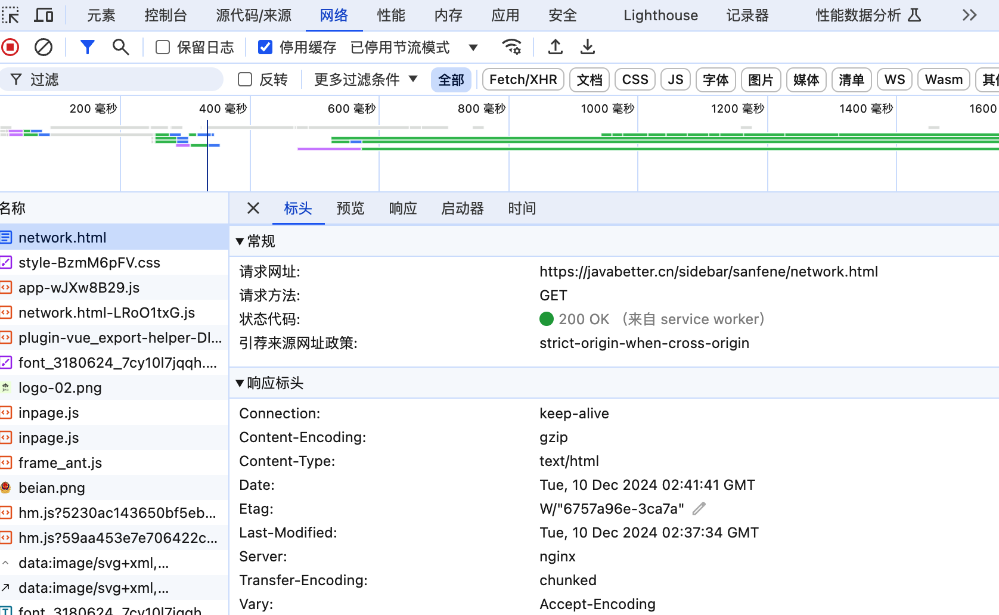
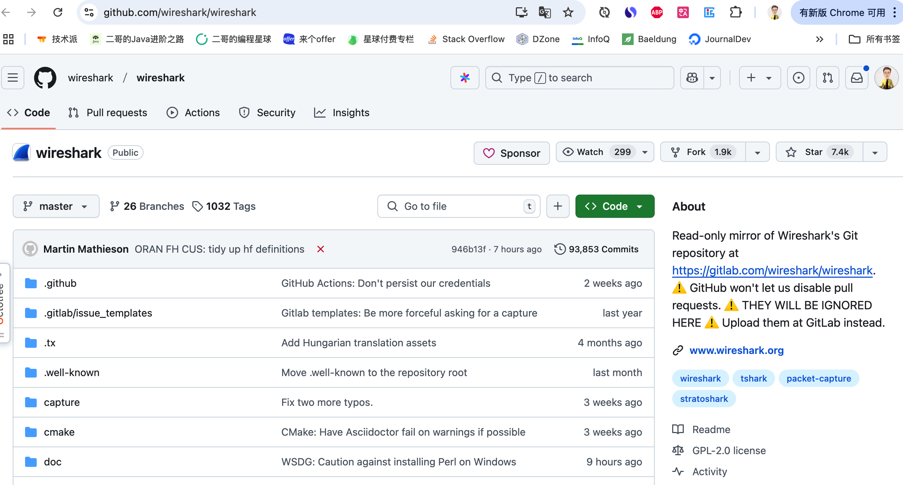

# 5-常见问题与实战

> 📌 **本章内容**: 实战案例、性能优化、故障排查、常用工具等。理论结合实践，面试加分项。

---

## 📑 目录

1. [抓包与调试](#抓包与调试)
2. [多线程下载实现](#多线程下载实现)
3. [性能优化](#性能优化)
4. [故障排查](#故障排查)
5. [常用命令](#常用命令)

---

## 抓包与调试

### 🔥 一句话速答（⭐⭐）
Chrome DevTools、Wireshark、Fiddler、Charles 是常用抓包工具

### 🛠️ Chrome DevTools Network 面板



**使用方法**:
1. 打开浏览器，按 `F12`
2. 切换到 **Network** 标签
3. 刷新页面，查看所有网络请求

**可以看到**:
- ✅ 请求/响应头部
- ✅ 请求/响应内容
- ✅ 请求耗时（Timing）
- ✅ HTTP 状态码
- ✅ 请求大小

**Timing 分析**:
```
Queueing:        排队时间
Stalled:         阻塞时间
DNS Lookup:      DNS 查询
Initial connection: TCP 连接
SSL:             SSL 握手
Request sent:    发送请求
Waiting (TTFB):  等待首字节
Content Download: 下载内容
```

**实战技巧**:
- 查看慢请求：按 Timing 排序
- 查看大文件：按 Size 排序
- 过滤请求：`domain:example.com` 或 `status-code:404`

### 🛠️ Wireshark

**简介**: 最强大的网络协议分析工具



**使用场景**:
- TCP/IP 层抓包
- 分析三次握手、四次挥手
- 诊断网络问题

**常用过滤器**:
```
tcp.port == 80          # HTTP 流量
tcp.flags.syn == 1      # SYN 包
tcp.flags.fin == 1      # FIN 包
ip.addr == 192.168.1.1  # 指定 IP
http                    # HTTP 协议
dns                     # DNS 协议
```

**追踪 TCP 流**:
1. 右键某个包 → **Follow** → **TCP Stream**
2. 查看完整的 TCP 会话

**分析三次握手**:
1. 过滤器输入 `tcp.flags.syn == 1`
2. 找到 SYN 包
3. **Follow → TCP Stream**
4. 可以看到完整的握手过程

### 🛠️ Fiddler / Charles

**简介**: HTTP(S) 抓包工具，支持中间人代理

**HTTPS 抓包原理**:
1. 安装工具的根证书到系统
2. 工具作为中间人，解密 HTTPS 流量
3. 用户信任了工具的证书，所以能解密

**使用场景**:
- 移动端 App 抓包
- 修改请求/响应内容
- 模拟慢速网络
- 断点调试

**配置步骤**（以 Charles 为例）:
1. 安装 Charles 证书
2. 设置手机代理为电脑 IP
3. 手机访问 `chls.pro/ssl` 安装证书
4. 开始抓包

---

## 多线程下载实现

### 🔥 一句话速答（⭐⭐⭐）
通过 Range 请求头实现分块下载，多线程并发，最后合并文件

### 📝 实现原理

**HTTP Range 请求**:
```http
GET /file.zip HTTP/1.1
Host: example.com
Range: bytes=0-1023      # 请求前 1024 字节
```

**服务器响应**:
```http
HTTP/1.1 206 Partial Content
Content-Range: bytes 0-1023/102400  # 总大小 102400
Content-Length: 1024

[文件内容]
```

### 💻 Java 实现

#### 步骤 1: 获取文件大小

```java
public long getFileSize(String url) throws IOException {
    HttpURLConnection conn = (HttpURLConnection) new URL(url).openConnection();
    conn.setRequestMethod("HEAD");
    long fileSize = conn.getContentLengthLong();
    conn.disconnect();
    return fileSize;
}
```

#### 步骤 2: 分块下载

```java
public void downloadChunk(String url, long start, long end, String outputPath) {
    try {
        HttpURLConnection conn = (HttpURLConnection) new URL(url).openConnection();
        
        // 设置 Range 请求头
        conn.setRequestProperty("Range", "bytes=" + start + "-" + end);
        
        // 读取数据
        try (InputStream in = conn.getInputStream();
             RandomAccessFile file = new RandomAccessFile(outputPath, "rw")) {
            
            // 定位到文件的起始位置
            file.seek(start);
            
            byte[] buffer = new byte[8192];
            int bytesRead;
            while ((bytesRead = in.read(buffer)) != -1) {
                file.write(buffer, 0, bytesRead);
            }
        }
        
        conn.disconnect();
    } catch (IOException e) {
        e.printStackTrace();
    }
}
```

#### 步骤 3: 多线程并发下载

```java
public void multiThreadDownload(String url, String outputPath, int threadCount) 
        throws IOException, InterruptedException {
    
    // 1. 获取文件大小
    long fileSize = getFileSize(url);
    
    // 2. 计算每个线程下载的字节数
    long chunkSize = fileSize / threadCount;
    
    // 3. 创建线程池
    ExecutorService executor = Executors.newFixedThreadPool(threadCount);
    CountDownLatch latch = new CountDownLatch(threadCount);
    
    // 4. 启动多线程下载
    for (int i = 0; i < threadCount; i++) {
        final long start = i * chunkSize;
        final long end = (i == threadCount - 1) ? fileSize - 1 : (start + chunkSize - 1);
        
        executor.submit(() -> {
            try {
                System.out.println("Thread-" + Thread.currentThread().getId() + 
                                   " downloading bytes " + start + "-" + end);
                downloadChunk(url, start, end, outputPath);
            } finally {
                latch.countDown();
            }
        });
    }
    
    // 5. 等待所有线程完成
    latch.await();
    executor.shutdown();
    
    System.out.println("Download completed!");
}
```

#### 使用示例

```java
public static void main(String[] args) throws Exception {
    String url = "https://example.com/large-file.zip";
    String outputPath = "/tmp/downloaded-file.zip";
    int threadCount = 4;  // 4 个线程
    
    MultiThreadDownloader downloader = new MultiThreadDownloader();
    downloader.multiThreadDownload(url, outputPath, threadCount);
}
```

### 🎯 优化要点

**1. 断点续传**:
- 记录每个线程的下载进度
- 下载失败后可以从上次的位置继续

**2. 动态调整线程数**:
- 根据网络速度动态调整
- CPU 密集型任务：线程数 = CPU 核心数 + 1
- IO 密集型任务：线程数 = CPU 核心数 × 2

**3. 限速**:
```java
// 使用 Guava RateLimiter 限速
RateLimiter limiter = RateLimiter.create(1024 * 1024);  // 1MB/s
limiter.acquire(bytesRead);  // 获取令牌
```

### 🎯 高频追问

**Q1: 如果只要下载前 10 个字节呢？**

```java
conn.setRequestProperty("Range", "bytes=0-9");
```

**Q2: 如果服务器不支持 Range 请求怎么办？**
- 服务器会返回 200 而不是 206
- 此时只能单线程下载

**Q3: 如何保证线程安全？**
- `RandomAccessFile.seek()` 定位到不同位置
- 每个线程写入不同的区域，不会冲突

---

## 性能优化

### 🔥 常见优化手段

#### 1. HTTP/2 多路复用

**问题**: HTTP/1.1 的队头阻塞
```
HTTP/1.1: 一个 TCP 连接同时只能处理一个请求
请求1 → 响应1 → 请求2 → 响应2
```

**解决**: HTTP/2 多路复用
```
HTTP/2: 一个 TCP 连接并发多个请求
请求1、请求2、请求3 → 响应1、响应2、响应3
```

#### 2. 开启 HTTP Keep-Alive

**配置**（Nginx）:
```nginx
http {
    keepalive_timeout 65;           # 超时时间 65 秒
    keepalive_requests 100;         # 最多处理 100 个请求
}
```

**效果**: 减少 TCP 连接建立/断开的开销

#### 3. 启用 Gzip 压缩

**配置**（Nginx）:
```nginx
gzip on;
gzip_types text/plain text/css application/json application/javascript;
gzip_min_length 1000;  # 大于 1KB 才压缩
```

**效果**: 减少传输数据量，加快加载速度

#### 4. 使用 CDN

**原理**: 
- 静态资源缓存到离用户最近的节点
- 减少网络延迟

**配置**:
```html
<!-- 使用 CDN 加载 jQuery -->
<script src="https://cdn.jsdelivr.net/npm/jquery@3.6.0/dist/jquery.min.js"></script>
```

#### 5. 缓存策略

**强缓存**:
```http
Cache-Control: max-age=3600  # 缓存 1 小时
Expires: Thu, 31 Dec 2026 23:59:59 GMT
```

**协商缓存**:
```http
ETag: "33a64df551425fcc55e4d42a148795d9f25f89d4"
Last-Modified: Wed, 21 Oct 2025 07:28:00 GMT
```

#### 6. DNS 预解析

```html
<!-- 提前解析域名 -->
<link rel="dns-prefetch" href="//cdn.example.com">
```

#### 7. HTTP/2 Server Push

```nginx
# Nginx 配置
location / {
    http2_push /style.css;
    http2_push /script.js;
}
```

**效果**: 服务器主动推送资源，不用等客户端请求

---

## 故障排查

### 🔍 常见问题诊断

#### 1. 大量 TIME_WAIT

**现象**:
```bash
$ netstat -n | awk '/^tcp/ {++S[$NF]} END {for(a in S) print a, S[a]}'
TIME_WAIT 10000
```

**原因**:
- HTTP 短连接频繁建立/断开
- 服务端主动关闭连接

**解决**:
```bash
# 启用 TIME_WAIT 重用
sysctl -w net.ipv4.tcp_tw_reuse=1

# 调大端口范围
sysctl -w net.ipv4.ip_local_port_range="1024 65535"
```

#### 2. 大量 CLOSE_WAIT

**现象**:
```bash
$ netstat -n | grep CLOSE_WAIT | wc -l
5000
```

**原因**: 应用程序没有调用 `close()` 关闭 socket

**解决**: 检查代码，确保所有 socket 都被关闭
```java
try (Socket socket = serverSocket.accept()) {
    // ... 处理数据
} // 自动关闭
```

#### 3. 连接超时

**现象**: `Connection timed out`

**可能原因**:
1. 防火墙阻止连接
2. 服务端未启动
3. 网络不通

**排查**:
```bash
# 1. 检查端口是否监听
netstat -tuln | grep :80

# 2. 测试连接
telnet example.com 80

# 3. 检查防火墙
iptables -L -n
```

#### 4. 请求慢

**现象**: 某个请求耗时很长

**排查步骤**:
1. **Chrome DevTools Timing**: 查看哪个阶段慢
   - DNS 慢 → DNS 服务器问题
   - 连接慢 → 网络问题
   - TTFB 慢 → 服务端处理慢
   - 下载慢 → 带宽问题

2. **服务端日志**: 查看处理时间

3. **数据库慢查询**: 检查是否有慢 SQL

---

## 常用命令

### 🔧 网络诊断命令

#### ping

**作用**: 测试网络连通性

```bash
# 基本用法
ping www.baidu.com

# 指定次数
ping -c 4 www.baidu.com

# 指定间隔
ping -i 0.5 www.baidu.com  # 每 0.5 秒一次
```

**原理**: 发送 ICMP Echo Request，等待 Echo Reply

#### traceroute / tracert

**作用**: 追踪路由路径

```bash
# Linux/Mac
traceroute www.baidu.com

# Windows
tracert www.baidu.com
```

**输出**:
```
1  192.168.1.1 (192.168.1.1)  1.234 ms
2  10.0.0.1 (10.0.0.1)  5.678 ms
3  * * *  # 超时
4  220.181.38.148 (220.181.38.148)  20.123 ms
```

#### netstat

**作用**: 查看网络连接状态

```bash
# 查看所有 TCP 连接
netstat -tan

# 查看监听端口
netstat -tuln

# 统计连接状态
netstat -n | awk '/^tcp/ {++S[$NF]} END {for(a in S) print a, S[a]}'
```

#### nslookup / dig

**作用**: DNS 查询

```bash
# nslookup
nslookup www.baidu.com

# dig（更详细）
dig www.baidu.com

# 查询特定 DNS 服务器
dig @8.8.8.8 www.baidu.com
```

#### curl

**作用**: HTTP 请求测试

```bash
# GET 请求
curl https://example.com

# POST 请求
curl -X POST -d "name=test" https://example.com/api

# 查看响应头
curl -I https://example.com

# 保存 Cookie
curl -c cookies.txt https://example.com

# 发送 Cookie
curl -b cookies.txt https://example.com

# 限速
curl --limit-rate 100K https://example.com/file.zip

# 断点续传
curl -C - -O https://example.com/file.zip
```

#### tcpdump

**作用**: 命令行抓包工具

```bash
# 抓取所有包
tcpdump

# 抓取指定端口
tcpdump port 80

# 抓取指定主机
tcpdump host 192.168.1.1

# 保存到文件
tcpdump -w capture.pcap

# 读取文件
tcpdump -r capture.pcap
```

#### ss

**作用**: socket 统计（比 netstat 更快）

```bash
# 查看所有 TCP 连接
ss -tan

# 查看监听端口
ss -tuln

# 查看连接统计
ss -s
```

---

## 🎓 本章总结

### 实战技能
- ✅ 使用 Chrome DevTools 分析网络请求
- ✅ 使用 Wireshark 抓包分析 TCP
- ✅ 实现多线程下载（Range 请求）
- ✅ 性能优化（HTTP/2、缓存、CDN）
- ✅ 故障排查（TIME_WAIT、CLOSE_WAIT）

### 常用命令
- 📌 ping: 测试连通性
- 📌 traceroute: 追踪路由
- 📌 netstat/ss: 查看连接状态
- 📌 curl: HTTP 请求测试
- 📌 tcpdump: 抓包分析

### 加分项
- 🔥 能手写多线程下载代码
- 🔥 能用 Wireshark 分析三次握手
- 🔥 能诊断 TIME_WAIT/CLOSE_WAIT 问题
- 🔥 了解 HTTP/2 性能优化

---

**相关笔记**:
- [[0-计算机网络面试核心]] - 核心知识点清单
- [[2-HTTP协议]] - HTTP 详解
- [[4-TCP协议详解]] - TCP 详解

---

_最后更新：2026-02-11_  
_来源：整合自实战经验、JavaBetter、小林 coding_
